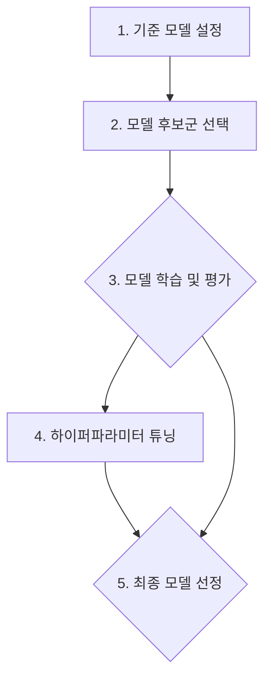

<h2>머신러닝 이론: 모델 선택 및 주요 알고리즘</h2>
작성자: Alpine_Dolce&nbsp;&nbsp;|&nbsp;&nbsp;날짜: 2025-07-04

<h2>문서 목표</h2>
<p>이 문서는 머신러닝 프로젝트의 핵심 실행 단계인 '모델 선택, 학습 및 평가' 과정을 체계적으로 안내하는 것을 목표로 합니다. 문제 유형에 맞는 적절한 모델 후보군을 선택하고, 객관적인 평가지표를 통해 기준 모델(Baseline) 대비 성능을 측정하며, 하이퍼파라미터 튜닝으로 모델의 성능을 최적화하는 구체적인 방법론과 실무적인 고려사항을 다룹니다. 다양한 알고리즘의 원리와 특징을 이해하고, 이를 바탕으로 최적의 모델을 구축하는 능력을 기여합니다.</p>

<h2>목차</h2>

- [1. 모델 선택 및 학습 개요](#1-모델-선택-및-학습-개요)
  - [1.1. 핵심 프로세스 흐름](#11-핵심-프로세스-흐름)
  - [1.2. 기준 모델 설정 (Setting a Baseline)](#12-기준-모델-설정-setting-a-baseline)
  - [1.3. 모델 후보군 선택 (Selecting Candidate Models)](#13-모델-후보군-선택-selecting-candidate-models)
    - [1.3.1. 실무적 모델 선택 가이드](#131-실무적-모델-선택-가이드)
    - [1.3.2. 모델 해석력과 설명 가능성 (Interpretability & Explainability)](#132-모델-해석력과-설명-가능성-interpretability--explainability)
- [2. 주요 분류 알고리즘 (Key Classification Algorithms)](#2-주요-분류-알고리즘-key-classification-algorithms)
  - [2.1. K-최근접 이웃 (K-Nearest Neighbors, KNN)](#21-k-최근접-이웃-k-nearest-neighbors-knn)
    - [2.1.1. 핵심 개념 (Core Concept)](#211-핵심-개념-core-concept)
    - [2.1.2. 작동 방식 (How it Works)](#212-작동-방식-how-it-works)
    - [2.1.3. 주요 하이퍼파라미터 (Key Hyperparameters)](#213-주요-하이퍼파라미터-key-hyperparameters)
    - [2.1.4. 특징 요약 (Summary)](#214-특징-요약-summary)
  - [2.2. 로지스틱 회귀 (Logistic Regression)](#22-로지스틱-회귀-logistic-regression)
    - [2.2.1. 특징 (Characteristics)](#221-특징-characteristics)
  - [2.3. 의사결정트리 (Decision Tree)](#23-의사결정트리-decision-tree)
    - [2.3.1. 특징 (Characteristics)](#231-특징-characteristics)
    - [2.3.2. 특성 중요도 시각화 (Feature Importance Visualization)](#232-특성-중요도-시각화-feature-importance-visualization)
  - [2.4. 랜덤 포레스트 (Random Forest)](#24-랜덤-포레스트-random-forest)
    - [2.4.1. 특징 (Characteristics)](#241-특징-characteristics)
  - [2.5. 그라디언트 부스팅 머신 (Gradient Boosting Machine, GBM)](#25-그라디언트-부스팅-머신-gradient-boosting-machine-gbm)
    - [2.5.1. 핵심 개념 (Core Concept)](#251-핵심-개념-core-concept)
    - [2.5.2. XGBoost와 LightGBM](#252-xgboost와-lightgbm)
  - [2.6. 서포트 벡터 머신 (Support Vector Machine, SVM)](#26-서포트-벡터-머신-support-vector-machine-svm)
    - [2.6.1. 핵심 개념 (Core Concept)](#261-핵심-개념-core-concept)
    - [2.6.2. 작동 원리 (How it Works)](#262-작동-원리-how-it-works)
    - [2.6.3. 특징 (Characteristics)](#263-특징-characteristics)
    - [2.6.4. 장단점](#264-장단점)
    - [2.6.5. 커널 트릭 상세 설명](#265-커널-트릭-상세-설명)
    - [2.6.6. 주요 하이퍼파라미터 (Key Hyperparameters)](#266-주요-하이퍼파라미터-key-hyperparameters)
    - [2.6.7. 실무적 고려사항](#267-실무적-고려사항)
- [3. 주요 회귀 알고리즘 (Key Regression Algorithms)](#3-주요-회귀-알고리즘-key-regression-algorithms)
  - [3.1. 선형 회귀 (Linear Regression)](#31-선형-회귀-linear-regression)
    - [3.1.1. 단순 선형 회귀 (Simple Linear Regression)](#311-단순-선형-회귀-simple-linear-regression)
    - [3.1.2. 다중 선형 회귀 (Multiple Linear Regression)](#312-다중-선형-회귀-multiple-linear-regression)
  - [3.2. 규제 선형 모델 (Regularized Linear Models)](#32-규제-선형-모델-regularized-linear-models)
    - [3.2.1. 규제의 목적 (Purpose of Regularization)](#321-규제의-목적-purpose-of-regularization)
    - [3.2.2. Ridge 회귀 (L2 Regularization)](#322-ridge-회귀-l2-regularization)
    - [3.2.3. Lasso 회귀 (L1 Regularization)](#323-lasso-회귀-l1-regularization)
    - [3.2.4. ElasticNet 회귀 (L1 + L2 Regularization)](#324-elasticnet-회귀-l1--l2-regularization)
  - [3.3. K-최근접 이웃 회귀 (KNN Regression)](#33-k-최근접-이웃-회귀-knn-regression)
  - [3.4. 그라디언트 부스팅 회귀 (Gradient Boosting Regression)](#34-그라디언트-부스팅-회귀-gradient-boosting-regression)
- [4. 심화 주제: 다중 레이블 분류 (Advanced Topic: Multi-Label Classification)](#4-심화-주제-다중-레이블-분류-advanced-topic-multi-label-classification)
  - [4.1. 개념 및 활용 (Concept & Applications)](#41-개념-및-활용-concept--applications)
  - [4.2. MultiOutputClassifier 활용 (Using MultiOutputClassifier)](#42-multioutputclassifier-활용-using-multioutputclassifier)
  - [4.3. 다중 레이블 평가 지표 (Multi-Label Evaluation Metrics)](#43-다중-레이블-평가-지표-multi-label-evaluation-metrics)

---

## 1. 모델 선택 및 학습 개요

머신러닝 프로젝트에서 데이터 전처리와 특성 공학이 '재료 준비' 단계였다면, **모델 선택 및 학습**은 준비된 재료로 실제 '요리'를 하는 핵심 실행 단계입니다. 이 단계의 목표는 주어진 문제와 데이터에 가장 적합한 모델을 찾아내고, 그 성능을 최대한으로 끌어올리는 것입니다.

이 과정은 단순히 코드를 실행하는 것을 넘어, 각 모델의 장단점을 이해하고, 성능을 객관적으로 평가하며, 반복적인 실험을 통해 최적의 결과를 도출하는 체계적인 접근이 필요합니다.

### 1.1. 핵심 프로세스 흐름
모델링 단계는 일반적으로 다음과 같은 4단계의 반복적인 프로세스를 통해 이루어집니다. 이 프로세스는 한 번에 끝나는 것이 아니라, 각 단계를 거치며 얻은 결과를 바탕으로 이전 단계(심지어 데이터 전처리나 특성 공학 단계)로 돌아가 개선하는 반복적인 사이클을 가집니다.



1.  **기준 모델 설정 (Baseline):** 우리가 넘어야 할 최소한의 성능 목표를 설정합니다.
2.  **모델 후보군 선택 (Candidates):** 문제의 특성에 맞는 여러 모델을 후보로 올립니다.
3.  **모델 학습 및 평가 (Train & Evaluate):** 후보 모델들을 학습시키고, 객관적인 지표로 초기 성능을 비교합니다.
4.  **하이퍼파라미터 튜닝 (Tuning):** 가장 유망한 모델의 성능을 세부 조정을 통해 극대화합니다.
5.  **최종 모델 선정 (Finalize):** 모든 과정을 거쳐 검증된 최적의 모델을 최종 선택합니다.

### 1.2. 기준 모델 설정 (Setting a Baseline)
- **목적:** 복잡하고 비싼 모델을 만들기 전에, 우리가 달성해야 할 **최소한의 성능 수준**을 정의하는 것입니다. 만약 많은 노력을 들여 개발한 모델이 이 간단한 기준 모델보다 성능이 낮다면, 모델링 접근 방식이나 데이터에 근본적인 문제가 있음을 의미합니다.
- **설정 방법:**
  - **회귀 문제:** 타겟 변수의 **평균(Mean)** 또는 **중앙값(Median)**으로 모든 샘플을 예측하는 가장 단순한 모델.
  - **분류 문제:** 타겟 변수에서 가장 빈도가 높은 클래스(**최빈 클래스, Most Frequent Class**)로 모든 샘플을 예측하는 모델.
  - **단순 모델:** `LogisticRegression`, `DecisionTree(max_depth=2)` 등 매우 간단한 규칙을 사용하는 모델을 기준점으로 삼기도 합니다. 이는 Dummy 모델보다 더 강력한 기준으로, 모델링의 실효성을 검증하는 데 도움이 됩니다.
- **중요성:** 기준 모델은 우리의 노력이 헛되지 않았음을 증명하는 첫 번째 관문이자, 성능 향상의 정도를 측정하는 객관적인 '출발선' 역할을 합니다.

```python
# Scikit-learn의 DummyClassifier와 DummyRegressor를 사용한 기준 모델 설정 예시
from sklearn.dummy import DummyClassifier, DummyRegressor
from sklearn.model_selection import train_test_split
from sklearn.datasets import load_iris, make_regression
from sklearn.metrics import accuracy_score, r2_score

# --- 분류 문제 기준 모델 ---
iris = load_iris()
X_c, y_c = iris.data, iris.target
X_train_c, X_test_c, y_train_c, y_test_c = train_test_split(X_c, y_c, random_state=42)

# 최빈 클래스로 예측하는 기준 모델
dummy_clf = DummyClassifier(strategy="most_frequent")
dummy_clf.fit(X_train_c, y_train_c)
y_pred_c = dummy_clf.predict(X_test_c)
print(f"분류 기준 모델 정확도: {accuracy_score(y_test_c, y_pred_c):.4f}")

# --- 회귀 문제 기준 모델 ---
X_r, y_r = make_regression(n_samples=100, n_features=1, noise=10, random_state=42)
X_train_r, X_test_r, y_train_r, y_test_r = train_test_split(X_r, y_r, random_state=42)

# 평균값으로 예측하는 기준 모델
dummy_reg = DummyRegressor(strategy="mean")
dummy_reg.fit(X_train_r, y_train_r)
y_pred_r = dummy_reg.predict(X_test_r)
print(f"회귀 기준 모델 R-squared: {dummy_reg.score(X_test_r, y_test_r):.4f}")
```

### 1.3. 모델 후보군 선택 (Selecting Candidate Models)
- **"No Free Lunch" Theorem:** 머신러닝에는 모든 문제에 대해 항상 최고의 성능을 내는 '만능 모델'은 존재하지 않는다는 이론입니다. 데이터의 특성, 크기, 문제의 복잡도에 따라 최적의 모델은 달라집니다. 따라서 여러 종류의 모델을 테스트하는 것이 필수적입니다.
- **문제 유형에 따른 모델 리스트업:**
  - **회귀:** Linear Regression, Ridge, Lasso, ElasticNet, Decision Tree, RandomForest, GradientBoosting, XGBoost, LightGBM, SVR
  - **분류:** Logistic Regression, Decision Tree, RandomForest, GradientBoosting, XGBoost, LightGBM, SVC, KNN
- **주요 고려사항:**
  - **성능 vs. 해석력:** XGBoost, LightGBM과 같은 부스팅 계열 모델들은 일반적으로 성능이 매우 높지만, 모델 내부가 복잡하여 "왜 이런 예측을 했는가?"를 설명하기 어렵습니다(블랙박스 모델). 반면, Logistic Regression이나 Decision Tree는 성능은 다소 낮을 수 있으나, 각 특성의 영향력(계수)이나 결정 규칙을 명확히 볼 수 있어 비즈니스 담당자에게 설명하기 용이합니다.
  - **데이터 크기 및 학습 시간:** LightGBM은 대용량 데이터에서 빠른 학습 속도를 보이는 반면, SVC(SVM)는 데이터가 커질수록 학습 시간이 기하급수적으로 늘어날 수 있습니다. 프로젝트의 시간적, 컴퓨팅 자원 제약을 고려해야 합니다.
  - **모델의 가정:** 선형 회귀 모델은 특성과 타겟 간의 선형 관계를 가정합니다. 만약 데이터가 복잡한 비선형 관계를 가지고 있다면, 트리 기반 모델(RandomForest, GradientBoosting)이 더 나은 선택일 수 있습니다.
- **초기 실험 (Bake-off):** 문제의 특성과 제약 조건을 고려하여, 서로 다른 계열의 모델(예: 선형 모델, 트리 기반 앙상블 모델, 거리 기반 모델) 2~4개를 후보로 선택합니다. 이 모델들을 기본 하이퍼파라미터로 학습시킨 후, 교차 검증을 통해 성능을 비교하여 가장 유망한 모델 군을 1~2개로 압축합니다.

#### 1.3.1. 실무적 모델 선택 가이드
어떤 모델부터 시도해야 할지 막막할 때, 아래 표는 좋은 출발점이 될 수 있습니다.

| 모델 계열 | 대표 모델 | 장점 (언제 좋은가?) | 단점 (언제 피해야 할까?) |
| :--- | :--- | :--- | :--- |
| **선형 모델** | Logistic/Linear Regression, Ridge, Lasso | **빠른 속도, 뛰어난 해석력**, 데이터가 작거나 특성이 매우 많을 때, **기준 모델**로 적합 | 복잡한 비선형 관계를 학습하지 못함, 특성 공학에 대한 의존도가 높음 |
| **트리 앙상블** | RandomForest, **LightGBM, XGBoost** | **높은 예측 성능**, 특성 스케일링 불필요, 비선형/상호작용 특성 자동 학습 | 선형 모델보다 느림, 파라미터 튜닝이 중요, 과적합 위험 존재, 해석이 상대적으로 어려움 |
| **거리/커널 기반** | KNN, SVM(SVC) | 특이한 형태의 결정 경계 학습 가능, 데이터 분포에 대한 가정이 적음 | **데이터가 클 때 매우 느림**, 특성 스케일링 필수, 차원의 저주에 취약 |
| **딥러닝** | Neural Networks (MLP) | 이미지, 텍스트 등 **비정형 데이터**에 독보적, 매우 복잡한 패턴 학습 가능 | **매우 많은 데이터 필요**, 학습 시간이 길고 컴퓨팅 자원 소모가 큼, 해석이 거의 불가능 |

**실무 추천 전략:**
1.  **1순위:** `LightGBM` 또는 `XGBoost`. 대부분의 정형 데이터 문제에서 가장 강력한 성능을 보입니다.
2.  **2순위:** `Logistic/Linear Regression`. 빠르고 해석이 필요할 때, 또는 부스팅 모델의 성능과 비교하기 위한 강력한 베이스라인으로 사용합니다.
3.  **3순위:** `RandomForest`. 부스팅 모델보다 튜닝이 덜 민감하고 안정적인 성능을 원할 때 고려합니다.

#### 1.3.2. 모델 해석력과 설명 가능성 (Interpretability & Explainability)
모델의 성능만큼이나 중요한 것이 **모델이 왜 그런 예측을 했는지 이해하고 설명할 수 있는 능력**입니다. 특히 금융, 의료, 법률 등 규제가 엄격하거나 의사결정의 투명성이 요구되는 분야에서는 모델의 해석력(Interpretability)과 설명 가능성(Explainability, XAI)이 필수적입니다.

-   **해석 가능한 모델 (Interpretable Models):**
    -   **선형 모델 (Linear Models):** 각 특성의 계수(coefficient)를 통해 해당 특성이 타겟에 미치는 영향의 방향과 크기를 직접적으로 해석할 수 있습니다.
    -   **의사결정트리 (Decision Trees):** 트리의 분기 규칙을 따라가며 예측 과정을 시각적으로 이해할 수 있습니다.
-   **설명 가능한 AI (Explainable AI, XAI):** 복잡한 블랙박스 모델(예: 앙상블 모델, 딥러닝)의 예측을 사후적으로 설명하기 위한 기법들입니다.
    -   **특성 중요도 (Feature Importance):** 모델 전체에서 각 특성이 예측에 얼마나 기여했는지 수치로 나타냅니다. (예: `RandomForest`, `XGBoost`의 `feature_importances_`)
    -   **SHAP (SHapley Additive exPlanations):** 각 특성이 특정 예측에 얼마나 기여했는지 게임 이론 기반으로 설명합니다. 개별 예측에 대한 특성 기여도를 시각적으로 보여주어 모델의 로컬 해석력을 높입니다.
    -   **LIME (Local Interpretable Model-agnostic Explanations):** 특정 예측 주변에서 간단한 해석 가능한 모델(예: 선형 모델)을 학습시켜 해당 예측을 설명합니다.

**실무 Tip:**
-   초기 모델링 단계에서는 `LightGBM`이나 `XGBoost`와 같이 성능이 좋은 모델을 우선적으로 사용하되, 최종 모델 선정 시에는 비즈니스 요구사항에 따라 해석력이 중요한 모델(예: 로지스틱 회귀)을 선택하거나, XAI 기법을 활용하여 블랙박스 모델의 예측을 설명하는 노력을 병행해야 합니다.
-   모델의 예측이 비즈니스 로직과 상충되거나, 특정 특성의 영향력이 예상과 다를 경우 XAI 도구를 활용하여 원인을 분석하고 모델을 개선하는 데 활용할 수 있습니다.

### 1.4. 데이터 분할 전략: Train, Validation, Test
모델의 성능을 객관적으로 평가하고 과적합을 방지하기 위한 데이터 분할 전략에 대한 자세한 내용은 [0702정리.md의 '1.5. 데이터셋 분할'] 섹션을 참조하십시오.

### 1.5. 교차 검증 (Cross-Validation)
교차 검증에 대한 상세 내용은 [0707정리.md의 '2. 교차 검증'] 섹션을 참조하십시오.

---

## 2. 모델 평가 지표 (Model Evaluation Metrics)
모델 평가 지표에 대한 상세 내용은 [0707정리.md의 '3. 주요 평가지표'] 섹션을 참조하십시오.

---

## 3. 모델 학습 및 하이퍼파라미터 튜닝
모델 학습 및 하이퍼파라미터 튜닝에 대한 상세 내용은 [0708정리.md의 '1. 하이퍼파라미터 튜닝'] 섹션을 참조하십시오.

---

## 4. 주요 분류 알고리즘 (Key Classification Algorithms)

### 4.1. K-최근접 이웃 (K-Nearest Neighbors, KNN)

#### 4.1.1. 핵심 개념 (Core Concept)
*   **"내 이웃이 누구인가?"**: KNN은 새로운 데이터의 클래스를 예측하기 위해, 해당 데이터와 가장 유사한(가까운) **K개**의 훈련 데이터 포인트를 찾습니다.
*   **거리 기반 알고리즘**: 데이터 포인트 간의 유사도를 측정하기 위해 거리를 사용하며, 가장 일반적으로 유클리드 거리(Euclidean Distance)가 사용됩니다.

#### 4.1.2. 작동 방식 (How it Works)
1.  **거리 계산**: 예측하려는 새로운 데이터 포인트와 훈련 세트의 모든 데이터 포인트 간의 거리를 계산합니다.
2.  **K개 이웃 선택**: 계산된 거리를 기준으로 가장 가까운 K개의 훈련 데이터 포인트를 선택합니다.
3.  **예측 (분류)**: 선택된 K개의 이웃 중에서 가장 많은 클래스(다수결 투표)를 새로운 데이터 포인트의 클래스로 예측합니다.

#### 4.1.3. 주요 하이퍼파라미터 (Key Hyperparameters)

| 파라미터 | 설명 | 기본값 | 중요성 |
|---|---|---|---|
| `n_neighbors` | 이웃의 수(K). 예측에 사용할 가장 가까운 데이터 포인트의 개수를 지정합니다. | 5 | 모델의 복잡성과 과적합/과소적합에 큰 영향. 작은 K는 노이즈에 민감하고 과적합되기 쉬우며, 큰 K는 과소적합될 수 있습니다. |
| `weights` | 이웃들의 예측 기여도를 결정하는 방식. | `'uniform'` | `'uniform'` (동일 가중치): 모든 이웃이 동일하게 기여합니다. <br> `'distance'` (거리 기반 가중치): 가까운 이웃일수록 예측에 더 큰 영향을 미칩니다. |
| `metric` | 거리 측정 방식. | `'minkowski'` | 데이터의 특성에 따라 적절한 거리 측정 방식을 선택합니다. <br> `'euclidean'` (유클리드 거리), `'manhattan'` (맨해튼 거리) 등이 있습니다. |

#### 4.1.4. 코드 예시 (분류)

```python
from sklearn.neighbors import KNeighborsClassifier
from sklearn.datasets import load_iris
from sklearn.model_selection import train_test_split
from sklearn.preprocessing import StandardScaler
from sklearn.metrics import accuracy_score

# 붓꽃 데이터셋 로드
iris = load_iris()
X, y = iris.data, iris.target

# 데이터 스케일링 (KNN은 스케일링 필수)
scaler = StandardScaler()
X_scaled = scaler.fit_transform(X)

# 훈련/테스트 데이터 분할
X_train, X_test, y_train, y_test = train_test_split(X_scaled, y, test_size=0.2, random_state=42, stratify=y)

# KNN 분류 모델 생성 및 학습
knn_clf_model = KNeighborsClassifier(n_neighbors=5)
knn_clf_model.fit(X_train, y_train)

# 예측 및 성능 평가
y_pred = knn_clf_model.predict(X_test)
accuracy = accuracy_score(y_test, y_pred)
print(f"KNN 분류 모델의 정확도: {accuracy:.4f}")
```

#### 4.1.5. 특징 요약 (Summary)

| 항목 | 내용 |
|---|---|
| **학습 방식** | **저장 기반 (Lazy Learning)**: 모델 훈련 시에는 단순히 훈련 데이터를 저장해두고, 예측 시점에 모든 계산을 수행합니다. 따라서 훈련 속도는 빠르지만, 예측 속도는 느릴 수 있습니다. |
| **분류/회귀** | 분류(Classification)와 회귀(Regression) 문제 모두에 적용 가능합니다. |
| **장점** | - 알고리즘의 개념이 매우 직관적이고 이해하기 쉽습니다.<br>- 구현이 간단합니다.<br>- 데이터 분포에 대한 가정이 없어 비선형 데이터에도 잘 작동할 수 있습니다.<br>- 하이퍼파라미터의 수가 적어 튜닝이 비교적 용이합니다. |
| **단점** | - **느린 예측 속도**: 새로운 데이터가 들어올 때마다 모든 훈련 데이터와의 거리를 계산해야 하므로, 훈련 데이터의 크기가 커질수록 예측 시간이 기하급수적으로 증가합니다.<br>- **메모리 사용량**: 모든 훈련 데이터를 메모리에 저장해야 하므로, 대규모 데이터셋에서는 메모리 문제가 발생할 수 있습니다.<br>- **특성 스케일에 민감**: 거리 기반 알고리즘이므로 특성들의 스케일이 다르면 스케일이 큰 특성이 거리에 더 큰 영향을 미쳐 성능이 저하될 수 있습니다. 따라서 데이터 스케일링(정규화/표준화)이 필수적입니다.<br>- **차원의 저주 (Curse of Dimensionality)**: 특성의 수가 많아질수록 데이터 포인트 간의 거리가 의미 없어지고, 모든 데이터 포인트가 서로 멀리 떨어져 있게 되어 KNN의 성능이 급격히 저하됩니다. |

### 4.2. 로지스틱 회귀 (Logistic Regression)

#### 4.2.1. 특징 (Characteristics)
*   **확률 기반 분류 알고리즘**: 선형 모델의 예측값(`wx + b`)을 직접 클래스로 분류하는 대신, 시그모이드(Sigmoid) 함수를 통과시켜 0과 1 사이의 확률 값으로 변환합니다. 이 확률이 특정 임계값(보통 0.5)을 넘으면 양성 클래스, 아니면 음성 클래스로 분류합니다.
*   **선형 모델**: 결정 경계(Decision Boundary)가 선형입니다. 즉, 데이터를 직선이나 평면으로 나눕니다.
*   **해석이 쉬움**: 각 특성의 계수(coefficient)는 해당 특성이 클래스 확률에 미치는 영향의 방향과 크기를 나타냅니다. (단, 특성 스케일링이 선행되어야 계수 비교가 의미있습니다.)
*   **다중 분류 확장**: One-vs-Rest (OvR) 또는 Multinomial 로지스틱 회귀를 통해 다중 클래스 분류 문제에도 적용할 수 있습니다.

```python
from sklearn.linear_model import LogisticRegression
from sklearn.datasets import load_breast_cancer
from sklearn.model_selection import train_test_split
from sklearn.preprocessing import StandardScaler
from sklearn.metrics import accuracy_score, classification_report

# 유방암 데이터셋 로드 (이진 분류 예시)
cancer = load_breast_cancer()
X, y = cancer.data, cancer.target

# 데이터 스케일링
scaler = StandardScaler()
X_scaled = scaler.fit_transform(X)

# 훈련 세트와 테스트 세트 분할
X_train, X_test, y_train, y_test = train_test_split(X_scaled, y, test_size=0.2, random_state=42, stratify=y)

# 로지스틱 회귀 모델 생성 및 학습
model = LogisticRegression(max_iter=1000, random_state=42)
model.fit(X_train, y_train)

# 예측 및 성능 평가
y_pred = model.predict(X_test)
accuracy = accuracy_score(y_test, y_pred)
print(f"로지스틱 회귀 모델의 정확도: {accuracy:.4f}")
print("Classification Report:", classification_report(y_test, y_pred, target_names=cancer.target_names))
```

#### 4.2.2. 주요 하이퍼파라미터 (Key Hyperparameters)

| 파라미터 | 설명 | 기본값 | 중요성 |
|---|---|---|---|
| `C` | **규제 강도.** `C` 값은 규제의 역수입니다. `C`가 작을수록 규제가 강해져 모델이 단순해지고 과소적합 경향이, `C`가 클수록 규제가 약해져 모델이 복잡해지고 과적합 경향이 있습니다. | 1.0 | 모델의 복잡성과 일반화 성능에 큰 영향. 과적합 방지에 중요. |
| `penalty` | **규제 유형.** `l1`, `l2`, `elasticnet`, `none` 등이 있습니다. `l2`는 기본값이며, `l1`은 특성 선택 효과를 가집니다. | `l2` | 모델의 특성 선택 및 규제 방식 결정. |
| `solver` | **최적화 알고리즘.** `liblinear`, `newton-cg`, `lbfgs`, `sag`, `saga` 등이 있습니다. 데이터 크기, `penalty` 유형에 따라 적합한 `solver`가 다릅니다. | `lbfgs` | 학습 속도와 수렴성에 영향. 대용량 데이터에는 `sag`나 `saga`가 효율적. |
| `max_iter` | **최대 반복 횟수.** `solver`가 수렴하기 위한 최대 반복 횟수입니다. | 100 | 모델이 수렴하지 않을 경우 증가시켜야 함. |

#### 4.2.3. 특징 요약 (Summary)

| 항목 | 내용 |
|---|---|
| **학습 방식** | **확률 기반 선형 분류 모델**: 선형 회귀의 결과를 시그모이드 함수를 통해 0과 1 사이의 확률로 변환하여 분류에 사용합니다. |
| **분류/회귀** | 주로 분류(Classification) 문제에 사용되지만, 확률 예측이 가능하여 이진 분류에 특히 강력합니다. |
| **장점** | - **간단하고 빠름**: 구현이 비교적 간단하고 학습 속도가 빠릅니다.<br>- **해석 용이**: 각 특성의 계수를 통해 특성 중요도와 영향 방향을 직관적으로 해석할 수 있습니다.<br>- **확률 예측**: 클래스 예측과 함께 각 클래스에 속할 확률을 제공합니다.<br>- **기준 모델**: 다른 복잡한 모델의 성능을 비교하는 좋은 기준 모델이 됩니다. |
| **단점** | - **선형 결정 경계**: 데이터가 복잡한 비선형 관계를 가질 경우 성능이 제한적입니다.<br>- **이상치 민감**: 이상치에 민감하게 반응하여 모델 성능에 영향을 줄 수 있습니다.<br>- **다중공선성 문제**: 특성 간 다중공선성이 존재할 경우 계수 해석이 어려워질 수 있습니다. |


### 4.3. 의사결정트리 (Decision Tree)

#### 4.3.1. 특징 (Characteristics)
*   **규칙 기반 분기**: 정보 이득(Information Gain)이나 지니 불순도(Gini Impurity)를 최소화하는 방향으로 데이터를 분할합니다.
*   **직관적이고 시각화 용이**: 모델의 의사결정 과정을 트리 형태로 시각화할 수 있어 해석이 용이합니다.
*   **과대적합(Overfitting) 발생 쉬움**: 트리의 성장을 제어(가지치기, Pruning)하지 않으면 훈련 데이터에 과도하게 최적화될 수 있습니다. (`max_depth`, `min_samples_split` 등 하이퍼파라미터 조절 필요)
*   **특성 중요도 제공**: 각 특성이 모델 예측에 얼마나 기여했는지 파악할 수 있습니다.

```python
from sklearn.tree import DecisionTreeClassifier, plot_tree
from sklearn.datasets import load_iris
from sklearn.model_selection import train_test_split
import matplotlib.pyplot as plt

# 붓꽃 데이터셋 로드
iris = load_iris()
X, y = iris.data, iris.target

# 훈련/테스트 데이터 분할
X_train, X_test, y_train, y_test = train_test_split(X, y, test_size=0.2, random_state=42, stratify=y)

# 의사결정트리 모델 생성 및 학습 (max_depth=3으로 과적합 제어)
model = DecisionTreeClassifier(max_depth=3, random_state=42)
model.fit(X_train, y_train)

# 의사결정트리 시각화
plt.figure(figsize=(15, 10))
plot_tree(model, filled=True, feature_names=iris.feature_names, class_names=iris.target_names, rounded=True)
plt.show()
```

#### 4.3.2. 특성 중요도 시각화 (Feature Importance Visualization)
의사결정트리 모델은 각 특성의 중요도를 `feature_importances_` 속성으로 제공합니다. 이 값을 시각화하여 어떤 특성이 모델의 예측에 가장 큰 영향을 미쳤는지 파악할 수 있습니다.

```python
import numpy as np
import matplotlib.pyplot as plt

def treeChart(model, feature_name):
    n_features = len(model.feature_importances_)
    plt.figure(figsize=(10, 6))
    # 특성 중요도를 내림차순으로 정렬하여 시각화
    sorted_idx = model.feature_importances_.argsort()
    plt.barh(np.arange(n_features), model.feature_importances_[sorted_idx], align="center")
    plt.yticks(np.arange(n_features), [feature_name[i] for i in sorted_idx])
    plt.xlabel('특성 중요도')
    plt.title('의사결정트리 특성 중요도')
    plt.show()

treeChart(model, iris.feature_names)
```

#### 4.3.3. 주요 하이퍼파라미터 (Key Hyperparameters)

| 파라미터 | 설명 | 기본값 | 중요성 |
|---|---|---|---|
| `max_depth` | 트리의 최대 깊이. 트리가 너무 깊어지면 과적합되기 쉽습니다. | `None` (제한 없음) | 과적합 제어에 가장 중요. 적절한 깊이 설정이 필요. |
| `min_samples_split` | 노드를 분할하기 위한 최소 샘플 수. 이 값보다 적은 샘플을 가진 노드는 더 이상 분할되지 않습니다. | 2 | 과적합 제어. 너무 작으면 과적합, 너무 크면 과소적합. |
| `min_samples_leaf` | 리프 노드가 되기 위한 최소 샘플 수. 리프 노드는 이 값보다 적은 샘플을 가질 수 없습니다. | 1 | 과적합 제어. `min_samples_split`과 유사하게 작동. |
| `max_features` | 최적의 분할을 찾기 위해 고려할 특성의 최대 개수. | `None` (모든 특성) | 과적합 제어 및 학습 속도 향상. 랜덤 포레스트에서 특히 중요. |
| `criterion` | 분할 품질을 측정하는 함수. 분류에서는 `gini` (지니 불순도) 또는 `entropy` (정보 이득)가 사용됩니다. | `gini` | 트리의 분할 기준 결정. |
| `splitter` | 각 노드에서 분할을 선택하는 전략. `best`는 최적의 분할을 찾고, `random`은 무작위로 최적의 분할을 찾습니다. | `best` | 모델의 다양성 증가 및 과적합 완화에 기여. |

#### 4.3.4. 실무적 고려사항 (Practical Considerations)
-   **과적합 (Overfitting) 방지:** 의사결정트리는 데이터에 완벽하게 맞춰지려는 경향이 강해 과적합되기 매우 쉽습니다. 이를 방지하기 위해 `max_depth`, `min_samples_split`, `min_samples_leaf` 등의 하이퍼파라미터를 적절히 튜닝하여 트리의 성장을 제어해야 합니다. 이를 **가지치기(Pruning)**라고 합니다.
-   **모델 불안정성:** 훈련 데이터에 작은 변화가 있어도 트리의 구조가 크게 달라질 수 있어 모델이 불안정합니다. 이러한 불안정성은 앙상블 기법(랜덤 포레스트, 부스팅)을 통해 완화될 수 있습니다.
-   **특성 스케일링 불필요:** 의사결정트리는 거리 기반 알고리즘이 아니므로, 특성 스케일링(정규화/표준화)이 필요하지 않습니다. 이는 전처리 단계에서 장점이 될 수 있습니다.
-   **결정 경계의 직관성:** 모델의 결정 과정을 트리 형태로 시각화할 수 있어 비즈니스 담당자에게 설명하기 용이합니다. 이는 모델 해석력(Interpretability) 측면에서 큰 장점입니다.


### 4.4. 랜덤 포레스트 (Random Forest)

#### 4.4.1. 특징 (Characteristics)
*   **의사결정트리의 앙상블**: 여러 개의 독립적인 의사결정트리를 병렬적으로 학습시킵니다.
*   **배깅 (Bagging)**: 각 트리를 훈련할 때 전체 훈련 데이터에서 중복을 허용하여 무작위로 샘플링된 데이터(부트스트랩 샘플)를 사용합니다. 이를 통해 각 트리의 다양성을 확보합니다.
*   **무작위 특성 선택 (Random Feature Subspace)**: 각 노드를 분할할 때 전체 특성 중에서 무작위로 일부 특성만을 선택하여 사용합니다. 이는 개별 트리의 상관관계를 줄여 앙상블의 효과를 극대화합니다.
*   **과대적합 위험 감소**: 각 트리가 무작위로 샘플링된 데이터(부트스트랩 샘플)와 무작위로 선택된 특성을 사용하여 학습되므로, 단일 트리의 과적합 경향을 상쇄하고 일반화 성능을 향상시킵니다.
*   **높은 성능과 안정성**: 일반적으로 단일 모델보다 더 높은 예측 성능과 안정성을 보입니다.
*   **OOB (Out-of-Bag) 점수**: 부트스트랩 샘플링 시 선택되지 않은 데이터들을 검증 세트처럼 사용하여 모델 성능을 평가할 수 있습니다. (`oob_score=True`로 설정)

```python
from sklearn.ensemble import RandomForestClassifier
from sklearn.datasets import load_iris
from sklearn.model_selection import train_test_split
from sklearn.metrics import accuracy_score

# 붓꽃 데이터셋 로드
iris = load_iris()
X, y = iris.data, iris.target

# 훈련/테스트 데이터 분할
X_train, X_test, y_train, y_test = train_test_split(X, y, test_size=0.2, random_state=42, stratify=y)

# 랜덤포레스트 모델 생성 및 학습
model = RandomForestClassifier(n_estimators=100, max_depth=5, random_state=42, n_jobs=-1)
model.fit(X_train, y_train)

# 예측 및 성능 평가
y_pred = model.predict(X_test)
accuracy = accuracy_score(y_test, y_pred)
print(f"랜덤포레스트 모델의 정확도: {accuracy:.4f}")
```

#### 4.4.2. 주요 하이퍼파라미터 (Key Hyperparameters)

| 파라미터 | 설명 | 기본값 | 중요성 |
|---|---|---|---|
| `n_estimators` | 포레스트 내 트리의 개수. 많을수록 성능이 좋아지지만, 학습 시간이 길어지고 메모리 사용량이 늘어납니다. | 100 | 모델의 성능과 학습 시간에 가장 큰 영향. |
| `max_features` | 각 노드에서 분할에 사용할 특성의 최대 개수. `sqrt` (특성 개수의 제곱근) 또는 `log2` (특성 개수의 로그2)가 일반적입니다. | `sqrt` | 트리의 다양성을 높여 과적합을 줄이고 일반화 성능 향상. |
| `max_depth` | 트리의 최대 깊이. 의사결정트리와 동일하게 과적합을 제어합니다. | `None` | 개별 트리의 과적합을 방지. |
| `min_samples_split` | 노드를 분할하기 위한 최소 샘플 수. | 2 | 개별 트리의 과적합을 방지. |
| `min_samples_leaf` | 리프 노드가 되기 위한 최소 샘플 수. | 1 | 개별 트리의 과적합을 방지. |
| `bootstrap` | 샘플을 중복 허용하여 추출할지 여부. `True`일 경우 OOB 샘플을 사용할 수 있습니다. | `True` | 트리의 다양성 확보. |
| `oob_score` | OOB 샘플을 사용하여 일반화 정확도를 평가할지 여부. | `False` | 별도의 검증 세트 없이 모델 성능 평가 가능. |
| `random_state` | 재현 가능한 결과를 위한 난수 시드. | `None` | 실험 재현성 확보. |
| `n_jobs` | 학습에 사용할 CPU 코어 수. `-1`은 모든 코어 사용을 의미합니다. | `None` | 학습 속도 향상. |

#### 4.4.3. 실무적 고려사항 (Practical Considerations)
-   **과적합에 강함:** 여러 개의 독립적인 트리를 학습하고 예측을 평균(분류) 또는 투표(회귀)함으로써 단일 의사결정트리의 과적합 문제를 효과적으로 완화합니다.
-   **특성 중요도:** `feature_importances_` 속성을 통해 각 특성이 모델의 예측에 얼마나 기여했는지 쉽게 파악할 수 있습니다. 이는 모델 해석에 유용합니다.
-   **데이터 스케일링 불필요:** 의사결정트리 기반 모델이므로, 특성 스케일링(정규화/표준화)이 필요하지 않습니다.
-   **대용량 데이터 처리:** `n_jobs` 파라미터를 통해 병렬 처리를 지원하여 대용량 데이터셋에서도 비교적 효율적인 학습이 가능합니다.
-   **하이퍼파라미터 튜닝:** `n_estimators`와 `max_features`는 랜덤 포레스트의 성능에 가장 큰 영향을 미치는 하이퍼파라미터이므로, 이들을 중심으로 튜닝하는 것이 중요합니다. `max_depth`, `min_samples_split`, `min_samples_leaf` 등은 개별 트리의 복잡도를 제어하여 전체 모델의 과적합을 방지하는 데 기여합니다.
-   **OOB 점수 활용:** `oob_score=True`로 설정하면 별도의 검증 세트 없이도 모델의 일반화 성능을 추정할 수 있어 편리합니다.


### 4.5. 그라디언트 부스팅 머신 (Gradient Boosting Machine, GBM)
GBM은 현재 정형 데이터 분야에서 가장 강력한 성능을 자랑하는 알고리즘 계열입니다.

#### 4.5.1. 핵심 개념 (Core Concept)
- **부스팅 (Boosting):** 여러 개의 약한 학습기(weak learner, 보통 얕은 의사결정트리)를 순차적으로 학습시켜, 이전 모델의 오차(잔차, residual)를 다음 모델이 보완해나가는 방식으로 강력한 모델 하나를 만드는 앙상블 기법입니다.
- **점진적 학습:** 랜덤 포레스트가 트리를 병렬적으로 독립적으로 만드는 것과 달리, 그라디언트 부스팅은 순차적으로 트리를 만들어가며 모델을 점차 개선시킵니다.
- **순차적 학습 (Sequential Learning):** GBM은 이전 약한 학습기가 예측한 잔차(residual) 또는 오류에 집중하여 다음 약한 학습기를 훈련합니다. 즉, 모델이 잘못 예측한 부분에 더 많은 가중치를 부여하여 점진적으로 오류를 줄여나갑니다.
- **잔차 학습 (Learning on Residuals):** 첫 번째 트리는 원본 데이터에 대해 학습합니다. 이후의 트리는 이전 트리의 예측값과 실제 값 사이의 잔차(오차)를 예측하도록 학습됩니다. 이 과정을 반복하면서 모델은 점차적으로 데이터의 복잡한 패턴을 학습하고 예측 오류를 최소화합니다.
- **경사 하강법 (Gradient Descent Analogy):** "그라디언트(Gradient)"라는 이름에서 알 수 있듯이, GBM은 손실 함수(loss function)의 음의 그라디언트(negative gradient)를 사용하여 다음 약한 학습기가 학습해야 할 방향을 결정합니다. 이는 마치 경사 하강법이 손실 함수의 최소값을 찾아가는 과정과 유사합니다. 각 단계에서 모델은 손실 함수를 최소화하는 방향으로 업데이트됩니다.
- **가법 모델 (Additive Model):** 최종 예측 모델은 모든 약한 학습기(트리)의 예측값을 합산하여 만들어집니다.
    $F_m(x) = F_{m-1}(x) + \gamma_m h_m(x)$
    여기서 $F_m(x)$는 $m$번째 단계의 모델, $F_{m-1}(x)$는 이전 단계의 모델, $h_m(x)$는 $m$번째 약한 학습기(트리), $\gamma_m$은 $h_m(x)$의 가중치(또는 학습률)입니다.

#### 4.5.2. 주요 하이퍼파라미터

GBM의 성능과 과적합(overfitting) 방지를 위해 중요한 하이퍼파라미터는 다음과 같습니다.

| 파라미터 | 설명 |
|---|---|
| `n_estimators` (또는 `num_iterations`, `num_boost_round`) | 부스팅 단계의 수, 즉 생성할 약한 학습기(트리)의 총 개수입니다. 값이 클수록 모델의 복잡도가 증가하고 과적합될 가능성이 높아지지만, 충분히 큰 값이어야 모델이 데이터의 패턴을 잘 학습할 수 있습니다. |
| `learning_rate` (또는 `eta`) | 각 약한 학습기의 기여도를 제어하는 하이퍼파라미터입니다. 새로운 트리가 이전 트리의 잔차를 얼마나 강하게 보정할지 결정합니다. 작은 `learning_rate`는 더 많은 `n_estimators`를 필요로 하지만, 일반적으로 더 견고한 모델을 만듭니다. 과적합을 줄이는 데 도움이 됩니다. |
| `max_depth` | 개별 약한 학습기(트리)의 최대 깊이입니다. 트리 깊이가 깊을수록 모델이 복잡해지고 과적합될 가능성이 높아집니다. 일반적으로 3에서 10 사이의 값을 사용합니다. |
| `subsample` | 각 트리를 훈련할 때 사용할 훈련 데이터 샘플의 비율입니다. (Stochastic Gradient Boosting) 1.0보다 작은 값을 사용하면 무작위성을 도입하여 과적합을 줄이고 일반화 성능을 향상시킬 수 있습니다. (예: 0.7~0.9) |
| `min_samples_leaf` (또는 `min_child_weight`) | 리프 노드가 되기 위해 필요한 최소 샘플 수입니다. 이 값이 클수록 트리가 덜 복잡해지고 과적합이 줄어듭니다. |
| `loss` (또는 `objective`) | 최적화할 손실 함수입니다. 회귀(regression) 문제에서는 `squared_error` (L2) 또는 `absolute_error` (L1) 등을 사용하고, 분류(classification) 문제에서는 `log_loss` (이진 분류) 또는 `multi_log_loss` (다중 분류) 등을 사용합니다. |
| `max_features` (또는 `colsample_bytree`) | 각 노드에서 분할을 찾을 때 고려할 특성(feature)의 최대 개수 또는 비율입니다. `subsample`과 유사하게 무작위성을 도입하여 과적합을 방지합니다. |

#### 4.5.3. 튜닝 팁

GBM의 하이퍼파라미터 튜닝은 모델의 성능을 극대화하고 과적합을 방지하는 데 중요합니다.

1.  **`learning_rate`와 `n_estimators`의 균형:**
    *   `learning_rate`를 작게 설정하고 `n_estimators`를 크게 설정하는 것이 일반적인 전략입니다. 작은 학습률은 모델이 더 천천히 학습하게 하여 일반화 성능을 높이지만, 더 많은 트리가 필요합니다.
    *   먼저 `learning_rate`를 0.01~0.1 정도로 설정하고, `n_estimators`를 충분히 큰 값(예: 1000~5000)으로 시작한 후, 교차 검증(cross-validation)과 조기 종료(early stopping)를 사용하여 최적의 `n_estimators`를 찾습니다.
2.  **트리 복잡도 제어 (`max_depth`, `min_samples_leaf`):**
    *   `max_depth`는 개별 트리의 복잡도를 제어합니다. 너무 깊으면 과적합되기 쉽고, 너무 얕으면 언더피팅(underfitting)될 수 있습니다. 3~8 사이의 값에서 시작하여 조정합니다.
    *   `min_samples_leaf`는 리프 노드의 최소 샘플 수를 지정하여 트리의 성장을 제한합니다. 이 값을 늘리면 과적합을 줄일 수 있습니다.
3.  **정규화(Regularization) 기법 활용 (`subsample`, `max_features`):**
    *   `subsample`을 1.0보다 작은 값(예: 0.7~0.9)으로 설정하여 각 트리를 훈련할 때 데이터의 일부만 사용하게 합니다. 이는 무작위성을 도입하여 과적합을 줄이는 데 효과적입니다.
    *   `max_features`를 설정하여 각 분할에서 고려할 특성의 수를 제한합니다. 이는 트리의 다양성을 높이고 과적합을 방지하는 데 도움이 됩니다.
4.  **교차 검증(Cross-Validation) 및 조기 종료(Early Stopping):**
    *   하이퍼파라미터 튜닝 시에는 항상 교차 검증을 사용하여 모델의 일반화 성능을 평가해야 합니다.
    *   조기 종료는 `n_estimators`를 튜닝할 때 매우 유용합니다. 검증 세트(validation set)에서의 성능이 더 이상 개선되지 않으면 학습을 중단하여 불필요한 계산을 줄이고 과적합을 방지합니다.
5.  **그리드 서치(Grid Search), 랜덤 서치(Random Search), 베이지안 최적화(Bayesian Optimization):**
    *   수동 튜닝 외에 이러한 자동화된 튜닝 기법을 사용하여 최적의 하이퍼파라미터 조합을 찾을 수 있습니다.
    *   랜덤 서치는 그리드 서치보다 효율적일 수 있으며, 베이지안 최적화는 더 복잡하지만 더 나은 결과를 제공할 수 있습니다.
6.  **데이터 스케일링 불필요:**
    *   GBM은 트리 기반 모델이므로 특성(feature)의 스케일링에 민감하지 않습니다. 따라서 데이터를 정규화하거나 표준화할 필요가 없습니다.

#### 4.5.4. XGBoost와 LightGBM
`scikit-learn`의 `GradientBoostingClassifier`도 있지만, 실무에서는 성능과 속도를 크게 개선한 아래 두 라이브러리가 압도적으로 많이 사용됩니다.

| 모델 | 특징 | 장점 | 단점 |
| :--- | :--- | :--- | :--- |
| **XGBoost** | GBM을 병렬 학습이 가능하도록 개선하여 속도를 높이고, 규제(Regularization) 기능을 추가하여 과적합 방지 성능을 강화했습니다. 캐글과 같은 데이터 경진대회에서 유행을 선도했습니다. | 높은 정확도, 과적합 방지 기능, 유연한 파라미터 | LightGBM보다 학습 속도가 느릴 수 있음, 파라미터가 많아 튜닝이 복잡할 수 있음 |
| **LightGBM** | XGBoost보다 더 빠른 학습 속도와 낮은 메모리 사용량을 목표로 개발되었습니다. **리프 중심 트리 분할(Leaf-wise)** 방식을 사용하여 더 빠르고 효율적으로 복잡한 규칙을 학습합니다. | **매우 빠른 학습 속도**, 메모리 사용량 적음, 높은 정확도, 대용량 데이터에 특히 강점 | 데이터가 적을 경우(보통 1만 건 이하) 과적합되기 쉬움 |

```python
# !pip install xgboost
# !pip install lightgbm
# 필요한 라이브러리 임포트
from lightgbm import LGBMClassifier
from xgboost import XGBClassifier
from sklearn.datasets import load_breast_cancer
from sklearn.model_selection import train_test_split
from sklearn.metrics import accuracy_score

# 유방암 데이터셋 로드
cancer = load_breast_cancer()
X, y = cancer.data, cancer.target

# 훈련/테스트 데이터 분할
X_train, X_test, y_train, y_test = train_test_split(X, y, test_size=0.2, random_state=42, stratify=y)

# 모델 학습 및 평가 함수
def train_and_evaluate(model, X_train, y_train, X_test, y_test):
    model.fit(X_train, y_train)
    y_pred = model.predict(X_test)
    accuracy = accuracy_score(y_test, y_pred)
    return accuracy

# XGBoost 모델 생성
xgb_model = XGBClassifier(n_estimators=200, learning_rate=0.05, max_depth=5, random_state=42, use_label_encoder=False, eval_metric='logloss')

# LightGBM 모델 생성
lgbm_model = LGBMClassifier(n_estimators=200, learning_rate=0.05, max_depth=5, random_state=42)

# XGBoost 모델 평가
xgb_accuracy = train_and_evaluate(xgb_model, X_train, y_train, X_test, y_test)
print(f"XGBoost 모델의 정확도: {xgb_accuracy:.4f}")

# LightGBM 모델 평가
lgbm_accuracy = train_and_evaluate(lgbm_model, X_train, y_train, X_test, y_test)
print(f"LightGBM 모델의 정확도: {lgbm_accuracy:.4f}")
```

#### 4.5.5. 앙상블 기법: 스태킹 (Stacking)과 블렌딩 (Blending)

앙상블 기법은 여러 개의 개별 모델을 조합하여 단일 모델보다 더 나은 예측 성능을 얻는 방법입니다. 랜덤 포레스트와 그라디언트 부스팅은 이미 앙상블 기법의 일종이지만, 더 나아가 다양한 종류의 모델을 결합하는 스태킹과 블렌딩 기법도 실무에서 활용됩니다.

-   **스태킹 (Stacking):**
    1.  **1단계 (Base Models):** 여러 개의 다양한 모델(예: 로지스틱 회귀, 랜덤 포레스트, XGBoost)을 훈련 세트에서 학습시킵니다.
    2.  **2단계 (Meta Model):** 1단계 모델들의 예측 결과를 새로운 특성으로 사용하여, 최종 예측을 수행할 메타 모델(Meta Model, 또는 Blending Model)을 학습시킵니다. 메타 모델은 일반적으로 간단한 선형 모델이나 로지스틱 회귀를 사용합니다.
    -   **장점:** 다양한 모델의 강점을 결합하여 성능을 극대화할 수 있습니다.
    -   **주의사항:** 과적합을 방지하기 위해 1단계 모델의 예측 결과를 생성할 때 교차 검증을 사용하거나, 별도의 홀드아웃(hold-out) 세트를 사용하는 것이 일반적입니다.

-   **블렌딩 (Blending):**
    -   스태킹과 유사하지만, 메타 모델 학습을 위해 별도의 검증 세트(Validation Set)를 사용합니다. 훈련 세트의 일부를 1단계 모델 학습에 사용하고, 나머지 부분을 1단계 모델의 예측 결과를 생성하여 메타 모델을 학습하는 데 사용합니다.
    -   **장점:** 스태킹보다 구현이 간단하고, 데이터 누수 위험이 적습니다.
    -   **단점:** 메타 모델 학습에 사용되는 데이터의 양이 적을 수 있습니다.

**실무 Tip:** 캐글(Kaggle)과 같은 데이터 경진대회에서 상위권 솔루션들은 대부분 스태킹이나 블렌딩과 같은 고급 앙상블 기법을 활용합니다. 이는 모델의 일반화 성능을 극한으로 끌어올리는 데 효과적입니다.

### 4.6. 서포트 벡터 머신 (Support Vector Machine, SVM)

#### 4.6.1. 핵심 개념 (Core Concept)
-   **초평면 (Hyperplane):** SVM의 핵심 목표는 주어진 데이터를 두 개(또는 그 이상)의 클래스로 분류하는 최적의 결정 경계(초평면)를 찾는 것입니다. 이 결정 경계는 각 클래스에 속하는 데이터 포인트들로부터 가장 멀리 떨어져 있어야 하며, 이 거리를 '마진(margin)'이라고 합니다. SVM은 이 마진을 최대화하는 초평면을 찾습니다. N차원 공간에서 N-1차원의 평면이 됩니다.
-   **마진 (Margin):** 초평면과 가장 가까운 훈련 데이터 포인트 사이의 거리를 마진이라고 합니다. SVM은 이 마진을 최대화하는 초평면을 찾습니다. 마진이 클수록 새로운 데이터에 대한 분류 안정성이 높아집니다.
-   **서포트 벡터 (Support Vectors):** 결정 경계(초평면)에 가장 가까이 있는 데이터 포인트들을 의미합니다. 이 서포트 벡터들이 초평면의 위치와 마진을 결정하는 데 중요한 역할을 합니다.

#### 4.6.2. 작동 원리 (How it Works)
SVM은 다음과 같은 절차로 작동합니다.
1.  **학습:** 주어진 데이터에서 최적의 결정 경계를 찾기 위해 서포트 벡터를 찾습니다.
2.  **결정 경계 찾기:** 초평면을 정의하고, 이를 최대한 멀리 떨어진 데이터 포인트들(서포트 벡터)과의 거리가 최대화되도록 합니다.
3.  **분류:** 새로운 데이터가 주어졌을 때, 결정 경계를 기준으로 클래스를 할당합니다.

#### 4.6.3. 특징 (Characteristics)
-   **커널 트릭 (Kernel Trick):** SVM의 가장 강력한 특징 중 하나로, 저차원 공간에서 선형적으로 분리할 수 없는 데이터를 고차원 공간으로 매핑하여 선형 분리가 가능하게 만듭니다. 실제 고차원 공간으로 데이터를 변환하지 않고, 고차원 공간에서의 내적 값을 계산하는 커널 함수를 사용합니다. (예: 선형, 다항식, RBF(방사 기저 함수) 커널)
-   **비선형 분류:** 커널 트릭을 통해 복잡한 비선형 결정 경계를 만들 수 있습니다.
-   **이상치 민감성:** 마진을 최대화하는 과정에서 이상치에 민감하게 반응할 수 있습니다. `C` 하이퍼파라미터를 통해 이를 조절할 수 있습니다.

#### 4.6.4. 장단점

**장점:**

*   **고차원 데이터에 효과적:** 저차원뿐만 아니라 고차원 데이터의 분류 문제에서도 좋은 성능을 보입니다.
*   **과적합 방지 및 일반화 능력:** 마진을 최대화하는 원리 덕분에 과적합을 피하고 일반화 성능이 좋습니다.
*   **메모리 효율성:** 결정 경계를 정의하는 데 모든 데이터 포인트가 아닌 서포트 벡터만 사용하므로 메모리 효율적입니다.
*   **다양한 커널 함수:** 다양한 커널 함수를 사용하여 선형 및 비선형 데이터를 처리할 수 있어 활용도가 높습니다.

**단점:**

*   **커널 함수의 선택:** 적절한 커널 함수를 선택하는 것이 중요하며, 이는 모델 성능에 큰 영향을 미칩니다.
*   **계산 비용:** 데이터의 특성이 많아질수록(고차원으로 갈수록) 계산량이 많아져 속도가 느려질 수 있습니다. 특히 대규모 데이터셋에서는 훈련 시간이 오래 걸릴 수 있습니다.
*   **파라미터 튜닝의 어려움:** 최적의 모델을 얻기 위해 파라미터(C값, 감마 등) 조절을 잘해야 합니다.
*   **데이터 스케일링에 민감:** 데이터 특성의 스케일링에 민감하게 반응할 수 있습니다.

#### 4.6.5. 커널 트릭 상세 설명

**필요성:**
현실의 데이터는 대부분 선형적으로 분리하기 어렵습니다. 예를 들어, 2차원 평면에서 원형으로 분포된 데이터를 직선 하나로 분류하는 것은 불가능합니다. 이러한 비선형 데이터를 분류하기 위해 데이터를 더 높은 차원의 공간으로 매핑하여 선형적으로 분리될 수 있도록 만드는 아이디어가 필요합니다.

**작동 원리:**
커널 트릭은 데이터를 고차원 특징 공간으로 명시적으로 매핑하지 않고도, 고차원 공간에서의 내적(dot product) 값을 계산할 수 있게 해주는 수학적 기법입니다. 즉, 실제 데이터를 고차원으로 변환하는 계산을 수행하는 대신, 두 데이터 포인트 간의 유사도(similarity)를 측정하는 커널 함수를 사용하여 고차원 공간에서의 내적 효과를 얻습니다. 이를 통해 계산 비용을 크게 줄이면서 비선형 분류를 가능하게 합니다.

**예시:**
1차원 데이터 `x`가 있을 때, 이를 `y = x^2`과 같은 매핑 함수를 통해 2차원 공간으로 변환하면 1차원에서는 선형 분리가 불가능했던 데이터가 2차원에서는 선형적으로 분리될 수 있습니다. 커널 트릭은 이러한 매핑 과정을 직접 수행하지 않고, 고차원 공간에서의 관계를 커널 함수를 통해 간접적으로 계산합니다.

**주요 커널 함수:**

*   **선형 커널 (Linear Kernel):** 가장 기본적인 커널로, 데이터가 선형적으로 분리 가능할 때 사용됩니다.
    *   `K(x, y) = x · y` (두 벡터의 내적)
*   **다항식 커널 (Polynomial Kernel):** 데이터를 다항식 형태로 고차원 공간에 매핑합니다.
    *   `K(x, y) = (γx · y + r)^d` (여기서 γ, r, d는 파라미터)
*   **방사형 기저 함수 (RBF) 커널 (Radial Basis Function Kernel) 또는 가우시안 커널:** 가장 일반적으로 사용되는 비선형 커널 중 하나입니다. 데이터 포인트와 특정 중심점 사이의 거리에 따라 유사도를 측정합니다.
    *   `K(x, y) = exp(-γ||x - y||^2)` (여기서 γ는 감마 파라미터)
*   **시그모이드 커널 (Sigmoid Kernel):** 신경망의 활성화 함수와 유사한 형태를 가집니다.
    *   `K(x, y) = tanh(γx · y + r)`

커널 트릭을 사용하면 복잡한 데이터도 간단하게 차원을 변경하여 학습할 수 있다는 장점이 있습니다.

#### 4.6.6. 주요 하이퍼파라미터 (Key Hyperparameters)
| 파라미터 | 설명 | 기본값 | 중요성 |
|---|---|---|---|
| `C` | **규제 파라미터.** 오분류를 얼마나 허용할지 결정합니다. `C` 값이 작으면 마진이 넓어져 오분류를 더 많이 허용하고 과소적합 경향이 강해지며, `C` 값이 크면 마진이 좁아져 오분류를 덜 허용하고 과적합 경향이 강해집니다. | 1.0 | 모델의 복잡성과 일반화 성능에 큰 영향. |
| `kernel` | **커널 타입.** 데이터를 고차원 공간으로 매핑하는 방식을 결정합니다. `linear`, `poly`, `rbf`, `sigmoid` 등이 있습니다. | `rbf` | 비선형 관계를 모델링할 때 중요. `rbf`가 가장 일반적으로 사용됩니다. |
| `gamma` | `rbf`, `poly`, `sigmoid` 커널에서 사용되는 **커널 계수.** 하나의 훈련 샘플이 미치는 영향의 범위를 결정합니다. `gamma` 값이 작으면 영향 범위가 넓어져 과소적합 경향이 강해지고, `gamma` 값이 크면 영향 범위가 좁아져 과적합 경향이 강해집니다. | `scale` (1 / (n_features * X.var())) | 모델의 복잡성과 일반화 성능에 큰 영향. `C`와 함께 튜닝해야 합니다. |

#### 4.6.7. 실무적 고려사항
-   **데이터 스케일링 필수:** SVM은 거리 기반 알고리즘이므로, 특성들의 스케일이 다르면 스케일이 큰 특성이 거리에 더 큰 영향을 미쳐 성능이 저하될 수 있습니다. 따라서 `StandardScaler`나 `MinMaxScaler`와 같은 스케일링이 필수적입니다.
-   **대용량 데이터 처리:** 훈련 데이터의 크기가 커질수록 학습 시간이 기하급수적으로 증가하는 경향이 있어, 대용량 데이터셋에는 적합하지 않을 수 있습니다. 이 경우 `LinearSVC` (선형 커널만 지원)나 다른 알고리즘을 고려해야 합니다.
-   **하이퍼파라미터 튜닝의 중요성:** `C`와 `gamma` 값에 따라 모델의 성능이 크게 달라지므로, `GridSearchCV`나 `RandomizedSearchCV`를 통한 체계적인 튜닝이 중요합니다.

```python
from sklearn.svm import SVC
from sklearn.datasets import load_breast_cancer
from sklearn.model_selection import train_test_split
from sklearn.preprocessing import StandardScaler
from sklearn.metrics import accuracy_score

# 유방암 데이터셋 로드
cancer = load_breast_cancer()
X, y = cancer.data, cancer.target

# 데이터 스케일링 (SVM은 스케일링 필수)
scaler = StandardScaler()
X_scaled = scaler.fit_transform(X)

# 훈련/테스트 데이터 분할
X_train, X_test, y_train, y_test = train_test_split(X_scaled, y, test_size=0.2, random_state=42, stratify=y)

# SVC 모델 생성 및 학습 (기본 RBF 커널)
svm_model = SVC(random_state=42)
svm_model.fit(X_train, y_train)

# 예측 및 성능 평가
y_pred = svm_model.predict(X_test)
accuracy = accuracy_score(y_test, y_pred)
print(f"SVC 모델의 정확도: {accuracy:.4f}")

# 하이퍼파라미터 튜닝 예시 (간단한 GridSearchCV)
from sklearn.model_selection import GridSearchCV

param_grid = {'C': [0.1, 1, 10],
              'gamma': [0.1, 1, 'scale'],
              'kernel': ['rbf']}

grid_search = GridSearchCV(SVC(random_state=42), param_grid, cv=3, n_jobs=-1)
grid_search.fit(X_train, y_train)

print(f"최적의 하이퍼파라미터: {grid_search.best_params_}")
print(f"최적 모델의 정확도: {grid_search.best_score_:.4f}")
```

---

## 5. 주요 회귀 알고리즘 (Key Regression Algorithms)

### 5.1. 선형 회귀 (Linear Regression)

#### 5.1.1. 단순 선형 회귀 (Simple Linear Regression)
- **핵심 개념:** **하나의** 독립 변수(특성)가 하나의 종속 변수에 미치는 선형 관계를 모델링합니다. (`y = ax + b`)
- **특징:** 가장 기본적인 회귀 모델로, 두 변수 간의 관계를 직선으로 표현합니다.

#### 5.1.2. 다중 선형 회귀 (Multiple Linear Regression)
- **핵심 개념:** **둘 이상의** 독립 변수를 사용하여 종속 변수의 값을 예측합니다. (`y = w1*x1 + ... + wn*xn + b`)
- **고려사항:** **다중공선성(Multicollinearity)** 문제에 주의해야 합니다. 이는 독립 변수들 간에 강한 상관관계가 존재할 때 발생하며, 모델의 안정성을 저해하고 각 특성의 개별적인 영향력을 해석하기 어렵게 만듭니다.

#### 5.1.3. 선형 회귀의 가정

선형 회귀 모델이 유효하고 신뢰할 수 있는 결과를 제공하기 위해서는 몇 가지 가정이 충족되어야 합니다.

1.  **선형성 (Linearity)**: 종속 변수와 독립 변수 사이에 선형 관계가 존재해야 합니다. 즉, 독립 변수의 변화에 따라 종속 변수가 일정한 비율로 변화해야 합니다.
2.  **오차의 독립성 (Independence of Errors)**: 잔차(오차항)는 서로 독립적이어야 합니다. 즉, 한 관측치의 오차가 다른 관측치의 오차에 영향을 미치지 않아야 합니다. 특히 시계열 데이터에서는 자기상관(autocorrelation)이 없어야 합니다.
3.  **등분산성 (Homoscedasticity)**: 잔차의 분산이 독립 변수의 모든 수준에서 일정해야 합니다. 잔차의 분산이 일정하지 않으면 이분산성(heteroscedasticity) 문제가 발생하며, 이는 모델의 신뢰도를 떨어뜨릴 수 있습니다.
4.  **오차의 정규성 (Normality of Errors)**: 잔차는 정규 분포를 따라야 합니다. 이는 회귀 계수의 통계적 유의성을 검정하는 데 중요합니다.
5.  **다중공선성 없음 (No Multicollinearity)**: 다중 선형 회귀의 경우, 독립 변수들 사이에 강한 상관관계가 없어야 합니다. 다중공선성이 존재하면 회귀 계수의 추정이 불안정해지고 해석이 어려워질 수 있습니다.

#### 5.1.4. 선형 회귀의 장점

선형 회귀는 다음과 같은 여러 장점을 가지고 있습니다.

1.  **간단하고 이해하기 쉬움 (Simplicity and Interpretability)**: 선형 회귀는 모델의 개념과 결과 해석이 매우 직관적이고 간단합니다. 독립 변수가 종속 변수에 미치는 영향을 회귀 계수를 통해 쉽게 파악할 수 있습니다.
2.  **계산 효율성 (Computational Efficiency)**: 복잡한 계산을 요구하지 않아 학습 속도가 빠르고, 대규모 데이터셋에서도 효율적으로 작동합니다.
3.  **빠른 예측 (Fast Prediction)**: 학습된 모델을 사용하여 새로운 데이터에 대한 예측을 빠르게 수행할 수 있습니다.
4.  **다양한 분야에서의 활용 (Wide Applicability)**: 의학, 사회학, 심리학 등 다양한 학문 분야에서 널리 사용됩니다.
5.  **기준 모델 역할 (Benchmark Model)**: 다른 복잡한 머신러닝 모델의 성능을 평가하는 기준(벤치마크)으로 활용될 수 있습니다.

#### 5.1.5. 선형 회귀의 단점

선형 회귀는 여러 장점에도 불구하고 다음과 같은 단점과 한계를 가집니다.

1.  **선형성 가정의 한계 (Limited to Linear Relationships)**: 독립 변수와 종속 변수 간의 관계가 비선형적일 경우, 선형 회귀는 좋은 성능을 내기 어렵습니다. 실제 세계의 데이터는 선형 관계가 아닌 경우가 많습니다.
2.  **이상치에 민감 (Sensitivity to Outliers)**: 이상치(outliers)는 회귀선에 큰 영향을 미쳐 모델의 정확도를 떨어뜨릴 수 있습니다.
3.  **다중공선성 문제 (Multicollinearity Issues)**: 독립 변수들 간에 강한 상관관계(다중공선성)가 있을 경우, 회귀 계수의 추정이 불안정해지고 해석이 어려워집니다.
4.  **과적합 위험 (Risk of Overfitting)**: 특히 특성(독립 변수)이 많은 데이터셋에서 복잡도를 제어할 방법이 없어 과적합(overfitting)되기 쉽습니다.
5.  **평균에 초점 (Focuses on Mean)**: 종속 변수의 평균에 주로 초점을 맞추며, 데이터의 편차나 예외적인 값에 대한 고려가 부족할 수 있습니다.

#### 5.1.6. 코드 예시

```python
from sklearn.linear_model import LinearRegression
from sklearn.model_selection import train_test_split
from sklearn.metrics import mean_squared_error, r2_score
from sklearn.datasets import make_regression

# 가상 회귀 데이터 생성
X, y = make_regression(n_samples=100, n_features=2, noise=10, random_state=42)
X_train, X_test, y_train, y_test = train_test_split(X, y, test_size=0.2, random_state=42)

# 모델 생성 및 학습
model = LinearRegression()
model.fit(X_train, y_train)

# 예측 및 성능 평가
y_pred = model.predict(X_test)
mse = mean_squared_error(y_test, y_pred)
r2 = r2_score(y_test, y_pred)

print(f"선형 회귀 모델의 MSE: {mse:.4f}")
print(f"선형 회귀 모델의 R-squared: {r2:.4f}")
```

### 5.2. 규제 선형 모델 (Regularized Linear Models)

#### 5.2.1. 규제의 목적 (Purpose of Regularization)
- **과대적합 방지:** 모델이 훈련 데이터에만 과도하게 최적화되는 것을 방지.
- **일반화 성능 향상:** 새로운 데이터에 대한 예측력을 높임.
- **다중공선성 완화:** 특성 간 상관관계가 높은 경우 모델의 안정성을 높임.

#### 5.2.2. Ridge 회귀 (L2 Regularization)

*   **개념:** 릿지 회귀는 선형 회귀 모델의 손실 함수(Loss Function)에 L2 노름(norm) 페널티 항을 추가합니다. L2 페널티는 회귀 계수(coefficient)들의 제곱합에 비례하는 값을 손실 함수에 더합니다.
*   **목적:**
    *   과적합 방지: 계수들의 크기가 너무 커지는 것을 방지하여 모델의 복잡성을 줄입니다.
    *   다중공선성(Multicollinearity) 처리: 예측 변수들 간에 강한 상관관계가 있을 때 발생하는 문제를 완화합니다.
*   **효과:** 계수들을 0에 가깝게 축소(shrinkage)시키지만, 완전히 0으로 만들지는 않습니다. 즉, 모든 특성이 모델에 남아있게 됩니다.
*   **손실 함수:**
    $ \text{Loss}(\beta) = \sum_{i=1}^{n} (y_i - \hat{y}_i)^2 + \alpha \sum_{j=1}^{p} \beta_j^2 $
    여기서 $\sum_{i=1}^{n} (y_i - \hat{y}_i)^2$는 최소제곱법(OLS)의 잔차 제곱합(RSS)이고, $\alpha \sum_{j=1}^{p} \beta_j^2$가 L2 페널티 항입니다.
*   **하이퍼파라미터:**
    *   **$\alpha$ (알파) 또는 $\lambda$ (람다):** 규제 강도를 조절하는 양의 상수입니다.
        *   $\alpha = 0$: 일반적인 최소제곱법(OLS)과 동일합니다.
        *   $\alpha$ 증가: 규제 강도가 강해져 계수들이 0에 더 가깝게 축소됩니다. 모델의 편향(bias)은 증가하지만 분산(variance)은 감소합니다.

#### 5.2.3. Lasso 회귀 (L1 Regularization)

*   **개념:** 라쏘 회귀는 선형 회귀 모델의 손실 함수에 L1 노름(norm) 페널티 항을 추가합니다. L1 페널티는 회귀 계수들의 절댓값 합에 비례하는 값을 손실 함수에 더합니다.
*   **목적:**
    *   과적합 방지: 릿지와 유사하게 계수 크기를 제한합니다.
    *   **특성 선택 (Feature Selection):** 라쏘의 가장 큰 특징으로, 중요하지 않은 특성의 계수를 완전히 0으로 만들어 해당 특성을 모델에서 제외시킵니다. 이는 모델을 더 간결하게 만들고 해석력을 높입니다.
*   **효과:** 계수들을 0에 가깝게 축소시키며, 일부 계수는 정확히 0으로 만듭니다.
*   **손실 함수:**
    $ \text{Loss}(\beta) = \sum_{i=1}^{n} (y_i - \hat{y}_i)^2 + \alpha \sum_{j=1}^{p} |\beta_j| $
    여기서 $\alpha \sum_{j=1}^{p} |\beta_j|$가 L1 페널티 항입니다.
*   **하이퍼파라미터:**
    *   **$\alpha$ (알파) 또는 $\lambda$ (람다):** 규제 강도를 조절하는 양의 상수입니다.
        *   $\alpha = 0$: 일반적인 최소제곱법(OLS)과 동일합니다.
        *   $\alpha$ 증가: 규제 강도가 강해져 더 많은 계수들이 0으로 수렴하게 됩니다.

#### 5.2.4. ElasticNet 회귀 (L1 + L2 Regularization)

*   **개념:** 엘라스틱넷은 릿지 회귀의 L2 페널티와 라쏘 회귀의 L1 페널티를 결합한 모델입니다. 두 가지 규제 방식의 장점을 모두 취합니다.
*   **목적:**
    *   릿지의 다중공선성 처리 능력과 라쏘의 특성 선택 능력을 동시에 가집니다.
    *   특히, 상관관계가 높은 특성 그룹이 있을 때 라쏘는 그 중 하나만 선택하고 나머지는 버리는 경향이 있지만, 엘라스틱넷은 릿지처럼 해당 그룹의 특성들을 함께 포함하거나 함께 제외할 수 있습니다.
*   **효과:** 계수들을 축소시키고 일부 계수를 0으로 만듭니다.
*   **손실 함수:**
    $ \text{Loss}(\beta) = \sum_{i=1}^{n} (y_i - \hat{y}_i)^2 + \alpha \left( \rho \sum_{j=1}^{p} |\beta_j| + (1-\rho) \sum_{j=1}^{p} \beta_j^2 \right) $
    여기서 $\alpha \left( \rho \sum_{j=1}^{p} |\beta_j| + (1-\rho) \sum_{j=1}^{p} \beta_j^2 \right)$가 엘라스틱넷 페널티 항입니다.
*   **하이퍼파라미터:**
    *   **$\alpha$ (알파) 또는 $\lambda$ (람다):** 전체 규제 강도를 조절하는 양의 상수입니다. 릿지/라쏘와 동일하게 $\alpha$가 커질수록 규제 강도가 강해집니다.
    *   **$\rho$ (로) 또는 `l1_ratio`:** L1 페널티와 L2 페널티의 혼합 비율을 조절하는 값입니다. 일반적으로 0과 1 사이의 값을 가집니다.
        *   $\rho = 1$: 라쏘 회귀와 동일합니다. (L1 페널티만 적용)
        *   $\rho = 0$: 릿지 회귀와 동일합니다. (L2 페널티만 적용)
        *   $0 < \rho < 1$: L1과 L2 페널티가 혼합되어 적용됩니다.

#### 5.2.5. 하이퍼파라미터 튜닝

위에서 언급된 $\alpha$ (및 엘라스틱넷의 $\rho$)와 같은 하이퍼파라미터는 모델 학습 전에 사용자가 직접 설정해야 하는 값입니다. 이 값들은 모델의 성능에 큰 영향을 미치므로, 최적의 값을 찾기 위한 튜닝 과정이 필요합니다. 일반적인 튜닝 방법으로는 다음과 같은 것들이 있습니다:

*   **그리드 서치 (Grid Search):** 여러 하이퍼파라미터 값의 조합을 미리 정의하고, 각 조합에 대해 모델을 학습시킨 후 교차 검증(Cross-validation)을 통해 가장 좋은 성능을 보이는 조합을 선택합니다.
*   **랜덤 서치 (Random Search):** 그리드 서치와 유사하지만, 하이퍼파라미터 값의 조합을 무작위로 샘플링하여 탐색합니다.
*   **베이지안 최적화 (Bayesian Optimization):** 이전 평가 결과를 바탕으로 다음 탐색할 하이퍼파라미터 조합을 결정하는 보다 효율적인 방법입니다.

#### 5.2.6. 코드 예시

```python
from sklearn.linear_model import Ridge, Lasso, ElasticNet
from sklearn.model_selection import train_test_split
from sklearn.datasets import make_regression
from sklearn.metrics import r2_score

# 가상 회귀 데이터 생성
X, y = make_regression(n_samples=100, n_features=2, noise=10, random_state=42)
X_train, X_test, y_train, y_test = train_test_split(X, y, test_size=0.2, random_state=42)

# Ridge 모델 생성 및 학습 (alpha는 규제 강도)
ridge_model = Ridge(alpha=1.0, random_state=42)
ridge_model.fit(X_train, y_train)
print(f"Ridge 모델 테스트셋 R-squared: {ridge_model.score(X_test, y_test):.4f}")

# Lasso 모델 생성 및 학습 (alpha는 규제 강도)
lasso_model = Lasso(alpha=1.0, random_state=42)
lasso_model.fit(X_train, y_train)
print(f"Lasso 모델 테스트셋 R-squared: {lasso_model.score(X_test, y_test):.4f}")

# ElasticNet 모델 생성 및 학습 (alpha: 전체 규제 강도, l1_ratio: L1 규제 비율)
elastic_net_model = ElasticNet(alpha=1.0, l1_ratio=0.5, random_state=42)
elastic_net_model.fit(X_train, y_train)
print(f"ElasticNet 모델 테스트셋 R-squared: {elastic_net_model.score(X_test, y_test):.4f}")
```

### 5.3. K-최근접 이웃 회귀 (KNN Regression)
- **핵심 개념:** 새로운 데이터 주변의 가장 가까운 K개의 이웃 데이터들의 타겟 값의 **평균**으로 예측.
- **특징:** 비선형 관계를 잘 모델링할 수 있으나, 데이터가 크면 예측이 느리고 이상치에 민감.

#### 5.3.1. 작동 원리
KNN 회귀의 작동 원리는 다음과 같습니다:
1.  **거리 계산**: 새로운 데이터 포인트(쿼리 포인트)가 주어지면, 훈련 세트에 있는 모든 데이터 포인트와의 거리를 계산합니다. 거리 측정 방법으로는 유클리드 거리(Euclidean distance), 맨해튼 거리(Manhattan distance) 등이 주로 사용됩니다.
2.  **K개의 최근접 이웃 선택**: 계산된 거리를 기준으로 쿼리 포인트와 가장 가까운 K개의 훈련 데이터 포인트를 선택합니다. 여기서 'K'는 사용자가 미리 정의하는 하이퍼파라미터입니다.
3.  **예측**: 선택된 K개의 최근접 이웃들의 타겟 변수(종속 변수) 값들의 평균을 계산하여 쿼리 포인트의 예측 값으로 사용합니다. 만약 가중 평균을 사용한다면, 가까운 이웃에게 더 큰 가중치를 부여할 수 있습니다.

#### 5.3.2. 장점

*   **단순하고 이해하기 쉬움**: 알고리즘의 개념이 직관적이고 구현하기 쉽습니다.
*   **비모수적(Non-parametric)**: 데이터의 분포에 대한 가정을 하지 않으므로, 복잡한 비선형 관계를 가진 데이터에도 잘 작동할 수 있습니다.
*   **다목적성**: 회귀뿐만 아니라 분류 문제에도 적용 가능합니다.
*   **새로운 데이터에 대한 유연성**: 훈련 데이터가 추가되거나 변경되어도 모델을 다시 훈련할 필요 없이 즉시 반영됩니다.

#### 5.3.3. 단점

*   **계산 비용**: 새로운 데이터 포인트가 들어올 때마다 모든 훈련 데이터 포인트와의 거리를 계산해야 하므로, 훈련 데이터의 크기가 커질수록 예측 시간이 오래 걸립니다. (특히 대규모 데이터셋에서 비효율적)
*   **차원의 저주(Curse of Dimensionality)**: 특성(피처)의 수가 많아질수록 데이터 포인트 간의 거리가 의미를 잃게 되어 성능이 저하될 수 있습니다. 고차원 데이터에서는 모든 데이터 포인트가 서로 멀리 떨어져 있는 것처럼 보일 수 있습니다.
*   **이상치(Outlier)에 민감**: 이상치가 존재할 경우, K개의 이웃에 포함되어 예측 값에 큰 영향을 미칠 수 있습니다.
*   **데이터 스케일에 민감**: 각 특성의 스케일이 다를 경우, 스케일이 큰 특성이 거리 계산에 더 큰 영향을 미치게 됩니다. 따라서 특성 스케일링(예: 정규화, 표준화)이 필수적입니다.
*   **최적의 K 값 찾기**: K 값에 따라 모델의 성능이 크게 달라지므로, 적절한 K 값을 찾는 것이 중요하며 이는 시행착오를 통해 이루어집니다.

#### 5.3.4. 주요 하이퍼파라미터

KNN 회귀에서 주로 조정하는 하이퍼파라미터는 다음과 같습니다:

*   **`n_neighbors` (K 값)**: 예측에 사용할 최근접 이웃의 개수를 지정합니다.
    *   작은 K 값: 모델이 훈련 데이터에 과적합(Overfitting)될 가능성이 높고, 노이즈에 민감해집니다.
    *   큰 K 값: 모델이 과소적합(Underfitting)될 가능성이 높고, 예측이 너무 일반화될 수 있습니다.
*   **`weights` (가중치)**: 이웃들의 값을 평균할 때 사용할 가중치 방식을 지정합니다.
    *   `'uniform'` (기본값): 모든 이웃에 동일한 가중치를 부여합니다 (단순 평균).
    *   `'distance'`: 거리에 반비례하여 가중치를 부여합니다. 즉, 가까운 이웃일수록 더 큰 가중치를 가집니다. 이는 이상치의 영향을 줄이고 더 정확한 예측을 제공할 수 있습니다.
    *   사용자 정의 함수: 특정 로직에 따라 가중치를 부여하는 함수를 정의할 수도 있습니다.
*   **`metric` (거리 측정 방법)**: 두 데이터 포인트 간의 거리를 계산하는 방법을 지정합니다.
    *   `'euclidean'` (유클리드 거리): 가장 일반적인 거리 측정 방법입니다.
    *   `'manhattan'` (맨해튼 거리): 각 차원에서의 절대값 차이의 합입니다.
    *   `'minkowski'` (민코프스키 거리): 유클리드 거리와 맨해튼 거리의 일반화된 형태입니다. `p` 매개변수를 통해 조절됩니다.
        *   `p=1`일 때 맨해튼 거리와 동일.
        *   `p=2`일 때 유클리드 거리와 동일.
*   **`p`**: `metric`이 `'minkowski'`일 때 사용되는 매개변수로, 민코프스키 거리의 차수를 정의합니다.

이러한 하이퍼파라미터들은 교차 검증(Cross-validation)과 같은 기법을 사용하여 최적의 조합을 찾는 것이 일반적입니다.

#### 5.3.5. 코드 예시

```python
from sklearn.neighbors import KNeighborsRegressor
from sklearn.model_selection import train_test_split
from sklearn.datasets import make_regression

# 가상 회귀 데이터 생성
X, y = make_regression(n_samples=100, n_features=2, noise=10, random_state=42)
X_train, X_test, y_train, y_test = train_test_split(X, y, test_size=0.2, random_state=42)

# KNN 회귀 모델 생성 및 학습
knn_reg_model = KNeighborsRegressor(n_neighbors=5)
knn_reg_model.fit(X_train, y_train)
print(f"KNN 회귀 모델 테스트셋 점수: {knn_reg_model.score(X_test, y_test):.4f}")
```
### 5.4. 그라디언트 부스팅 회귀 (Gradient Boosting Regression)
그라디언트 부스팅 회귀(Gradient Boosting Regression)는 앙상블 학습 방법 중 하나로, 여러 개의 약한 학습기(weak learner)를 순차적으로 결합하여 강력한 예측 모델을 만드는 기법입니다. 주로 회귀 문제에 사용되며, 높은 예측 성능을 자랑합니다.

#### 5.4.1. 작동 원리
그라디언트 부스팅 회귀의 핵심 원리는 이전 모델의 예측 오차(잔차)를 다음 모델이 학습하여 점진적으로 오차를 줄여나가는 것입니다.

1.  **초기 예측 설정**: 모든 데이터에 대해 평균값이나 임의의 상수와 같은 초기 예측값을 설정합니다.
2.  **잔차 계산**: 현재 모델의 예측값과 실제 값 사이의 차이인 잔차(residual)를 계산합니다. 이 잔차는 모델이 아직 설명하지 못한 오차를 나타냅니다.
3.  **약한 학습기 학습**: 계산된 잔차를 새로운 목표 변수로 삼아 새로운 약한 학습기(주로 결정 트리)를 학습시킵니다. 이 약한 학습기는 이전 모델의 오차 패턴을 학습하여 이를 보완하는 역할을 합니다.
4.  **모델 업데이트**: 새로운 약한 학습기가 예측한 값을 기존 모델에 더하여 최종 예측 모델을 업데이트합니다. 이때, 각 약한 학습기의 기여도를 조절하는 학습률(learning rate)을 적용하여 과적합을 방지하고 학습 속도를 제어합니다.
5.  **반복**: 위 과정을 미리 정해진 횟수(n_estimators)만큼 반복하여 여러 개의 약한 학습기를 순차적으로 추가하고, 각 단계에서 잔차를 최소화하는 방향으로 모델을 개선해 나갑니다.

이 과정에서 '그라디언트(Gradient)'라는 이름이 붙은 이유는, 손실 함수(Loss Function)의 음의 그라디언트(기울기) 방향으로 모델을 업데이트하여 손실을 최소화하기 때문입니다. 이는 경사 하강법(Gradient Descent)과 유사한 원리로, 잔차를 줄여나가는 것이 곧 손실 함수의 기울기를 줄여나가는 것과 같다고 볼 수 있습니다.

#### 5.4.2. 장단점

**장점**:

*   **높은 예측 성능**: 여러 약한 학습기를 순차적으로 결합하여 오차를 점진적으로 줄여나가므로, 복잡한 데이터 패턴을 잘 학습하여 매우 높은 예측 정확도를 제공합니다.
*   **다양한 데이터 유형 처리**: 수치형, 범주형 등 다양한 유형의 데이터를 처리할 수 있습니다.
*   **이상치에 대한 강건성**: 이상치에 덜 민감하게 반응하는 경향이 있습니다.
*   **특성 중요도 제공**: 모델 학습 후 각 특성(feature)의 중요도를 파악할 수 있어, 데이터 분석에 유용합니다.

**단점**:

*   **과적합 위험**: 모델의 복잡도가 높아지면 학습 데이터에 과적합될 위험이 있습니다. 이를 방지하기 위해 하이퍼파라미터 튜닝이 중요합니다.
*   **느린 학습 속도**: 약한 학습기들을 순차적으로 학습시키기 때문에 병렬 처리가 어렵고, 학습 시간이 오래 걸릴 수 있습니다.
*   **해석의 어려움**: 여러 개의 트리가 복합적으로 작동하므로, 개별 트리의 예측 과정을 해석하기 어렵습니다.
*   **하이퍼파라미터 튜닝의 중요성**: 최적의 성능을 얻기 위해서는 여러 하이퍼파라미터를 신중하게 튜닝해야 합니다.

#### 5.4.3. 주요 하이퍼파라미터

그라디언트 부스팅 회귀 모델의 성능에 큰 영향을 미치는 주요 하이퍼파라미터는 다음과 같습니다.

*   **`n_estimators` (또는 `epochs`)**: 모델이 사용할 약한 학습기(트리)의 개수를 지정합니다. 이 값이 클수록 모델의 복잡도가 증가하고 과적합 위험이 커질 수 있지만, 일반적으로 성능이 향상됩니다.
*   **`learning_rate` (학습률)**: 각 약한 학습기가 예측한 값을 최종 모델에 반영하는 정도를 조절합니다. 작은 학습률은 모델이 더 견고하게 학습되도록 돕지만, 더 많은 `n_estimators`가 필요하며 학습 시간이 길어질 수 있습니다.
*   **`max_depth`**: 개별 약한 학습기(결정 트리)의 최대 깊이를 지정합니다. 깊이가 깊을수록 모델의 복잡도가 증가하고 과적합될 가능성이 높아집니다. 일반적으로 얕은 트리를 사용하는 것이 좋습니다.
*   **`subsample`**: 각 약한 학습기를 학습시킬 때 사용할 데이터 샘플의 비율을 지정합니다. 1보다 작은 값을 사용하면 무작위 부분 샘플링을 통해 과적합을 줄이고 일반화 성능을 향상시킬 수 있습니다 (확률적 그라디언트 부스팅).
*   **`min_samples_leaf`**: 리프 노드가 되기 위해 필요한 최소 샘플 수를 지정합니다. 이 값이 클수록 트리가 덜 복잡해지고 과적합을 방지하는 데 도움이 됩니다.
*   **`max_features`**: 각 노드에서 분할을 찾을 때 고려할 특성(feature)의 최대 개수를 지정합니다. 특성 수가 많을 때 과적합을 줄이는 데 유용할 수 있습니다.
*   **`loss`**: 최적화할 손실 함수를 지정합니다. 회귀 문제에서는 일반적으로 'squared_error' (평균 제곱 오차)가 사용됩니다.

#### 5.4.4. 코드 예시

```python
# !pip install xgboost
from xgboost import XGBRegressor
from sklearn.metrics import r2_score
from sklearn.model_selection import train_test_split
from sklearn.datasets import make_regression

# 가상 회귀 데이터 생성
X, y = make_regression(n_samples=100, n_features=2, noise=10, random_state=42)
X_train, X_test, y_train, y_test = train_test_split(X, y, test_size=0.2, random_state=42)

# XGBoost 회귀 모델 생성 및 학습
xgb_reg_model = XGBRegressor(n_estimators=100, learning_rate=0.1, max_depth=3, random_state=42, n_jobs=-1)
xgb_reg_model.fit(X_train, y_train)

# 예측 및 성능 평가
y_pred = xgb_reg_model.predict(X_test)
r2 = r2_score(y_test, y_pred)
print(f"XGBoost 회귀 모델의 R-squared: {r2:.4f}")
```

---

## 6. 심화 주제: 다중 레이블 분류 (Advanced Topic: Multi-Label Classification)

### 6.1. 개념 및 활용 (Concept & Applications)
- **개념:** 다중 레이블 분류(Multi-Label Classification)는 하나의 데이터 샘플이 **두 개 이상의 클래스(레이블)에 동시에 속할 수 있는** 분류 문제입니다. 이는 각 레이블이 독립적인 이진 분류 문제로 간주될 수 있음을 의미합니다. 예를 들어, 한 장의 사진에 '강아지'와 '고양이'가 동시에 존재할 수 있으며, 이 경우 사진은 '강아지' 레이블과 '고양이' 레이블을 모두 가집니다.
- **다중 클래스 분류와의 차이점:**
    -   **다중 클래스 분류 (Multi-Class Classification):** 하나의 샘플이 오직 하나의 클래스에만 속합니다. (예: 붓꽃 품종은 'Setosa', 'Versicolor', 'Virginica' 중 오직 하나) 모델은 여러 클래스 중 가장 적합한 하나를 선택합니다.
    -   **다중 레이블 분류 (Multi-Label Classification):** 하나의 샘플이 여러 클래스에 동시에 속할 수 있습니다. 모델은 각 레이블의 존재 여부를 독립적으로 예측합니다.
- **활용 예시:**
    -   **영화 장르 분류:** 하나의 영화가 "액션", "코미디", "SF" 등 여러 장르에 동시에 속하는 경우.
    -   **이미지 태깅:** 한 장의 사진에 "강아지", "고양이", "잔디" 등 여러 객체 태그가 동시에 부여되는 경우.
    -   **뉴스 기사 분류:** 하나의 기사가 "정치", "경제", "사회" 등 여러 주제에 해당하는 경우.
    -   **의료 진단:** 환자가 여러 가지 질병(예: 고혈압, 당뇨)을 동시에 가지고 있는 경우.
    -   **감성 분석:** 문장이 긍정적이면서 동시에 비꼬는(sarcastic) 감성을 포함하는 경우.

### 6.2. MultiOutputClassifier 활용 (Using MultiOutputClassifier)
- `scikit-learn`에서 제공하는 유틸리티로, 각 레이블을 독립적인 이진 분류 문제로 간주하고, 각 레이블에 대한 분류기를 별도로 학습시켜 다중 레이블 문제를 해결합니다. 이를 **Binary Relevance** 접근법이라고 합니다.
- **다른 전략:**
  - **Classifier Chains (분류기 체인):**
    -   **개념:** 각 레이블을 순차적으로 예측하며, 이전 레이블의 예측 결과를 다음 레이블 예측을 위한 특성으로 활용합니다. 예를 들어, 첫 번째 분류기는 원본 특성만을 사용하여 첫 번째 레이블을 예측하고, 두 번째 분류기는 원본 특성과 첫 번째 레이블의 예측 결과를 특성으로 사용하여 두 번째 레이블을 예측하는 식입니다.
    -   **장점:** 레이블 간의 상관관계를 모델링할 수 있어 Binary Relevance보다 더 정확한 예측을 제공할 수 있습니다.
    -   **단점:** 순서에 민감하며, 잘못된 예측이 다음 분류기에 영향을 미칠 수 있습니다. 학습 시간이 길어질 수 있습니다.
  - **Label Powerset (레이블 파워셋):**
    -   **개념:** 데이터셋에 존재하는 모든 고유한 레이블 조합을 새로운 단일 클래스로 간주하여 다중 클래스 분류 문제로 변환합니다. 예를 들어, 레이블 {A, B, C}가 있을 때, {A}, {B}, {C}, {A, B}, {A, C}, {B, C}, {A, B, C}, {} (아무것도 없는 경우)를 각각 하나의 클래스로 만듭니다.
    -   **장점:** 레이블 간의 모든 상관관계를 직접적으로 모델링할 수 있습니다. 기존의 다중 클래스 분류 알고리즘을 그대로 사용할 수 있습니다.
    -   **단점:** 레이블의 수가 증가할수록 가능한 레이블 조합의 수가 기하급수적으로 늘어나 클래스 수가 매우 많아질 수 있습니다 (2^L, L은 레이블 수). 이는 희소성 문제와 계산 복잡도를 야기합니다. 학습 데이터에 없는 레이블 조합에 대해서는 예측할 수 없습니다.

```python
from sklearn.svm import SVC
from sklearn.multioutput import MultiOutputClassifier
from sklearn.datasets import make_multilabel_classification
from sklearn.model_selection import train_test_split

# 다중 레이블 데이터 생성
X, y = make_multilabel_classification(n_samples=100, n_features=20, n_classes=5, n_labels=2, random_state=42)
X_train, X_test, y_train, y_test = train_test_split(X, y, test_size=0.2, random_state=42)

# 기본 분류기(SVM)를 MultiOutputClassifier로 래핑하여 학습
base_svm = SVC(kernel='linear', probability=True, random_state=42)
multi_label_model = MultiOutputClassifier(base_svm, n_jobs=-1)
multi_label_model.fit(X_train, y_train)
```

### 6.3. 다중 레이블 평가 지표 (Multi-Label Evaluation Metrics)
다중 레이블 분류에서는 각 샘플이 여러 레이블을 가질 수 있으므로, 일반적인 단일 레이블 분류(예: 정확도, 정밀도, 재현율) 지표만으로는 모델의 성능을 충분히 평가하기 어렵습니다. 따라서 다중 레이블 특성을 고려한 전용 평가 지표를 사용해야 합니다.

-   **Hamming Loss (해밍 손실):**
    -   **개념:** 잘못 예측된 레이블의 비율을 측정합니다. 즉, 실제 레이블과 예측 레이블이 다른 경우의 수를 전체 레이블 수로 나눈 값입니다. 0에 가까울수록 좋습니다.
    -   **수식:** $ \text{Hamming Loss} = \frac{1}{|N| \cdot |L|} \sum_{i=1}^{N} \sum_{j=1}^{L} I(y_{ij} \neq \hat{y}_{ij}) $
        (여기서 $N$은 샘플 수, $L$은 레이블 수, $y_{ij}$는 실제 레이블, $\hat{y}_{ij}$는 예측 레이블, $I$는 지시 함수)
    -   **해석:** 모델이 얼마나 많은 레이블을 잘못 예측했는지를 직관적으로 보여줍니다. 값이 낮을수록 모델의 예측이 실제 레이블과 더 잘 일치함을 의미합니다.

-   **Jaccard Similarity (자카드 유사도) 또는 Jaccard Score:**
    -   **개념:** 예측 레이블 집합과 실제 레이블 집합 간의 유사도를 측정합니다. 두 집합의 교집합 크기를 합집합 크기로 나눈 값입니다. 1에 가까울수록 좋습니다.
    -   **수식:** $ \text{Jaccard Similarity} = \frac{1}{N} \sum_{i=1}^{N} \frac{|Y_i \cap \hat{Y}_i|}{|Y_i \cup \hat{Y}_i|} $
        (여기서 $Y_i$는 실제 레이블 집합, $\hat{Y}_i$는 예측 레이블 집합)
    -   **해석:** 각 샘플에 대해 실제 레이블과 예측 레이블이 얼마나 겹치는지를 나타냅니다. 다중 레이블 분류에서 정확도와 유사한 개념으로 사용될 수 있으며, 모델이 얼마나 정확하게 레이블 집합을 예측하는지 평가합니다.

-   **Micro F1-Score (마이크로 F1-점수):**
    -   **개념:** 모든 샘플과 모든 레이블에 대해 True Positives (TP), False Positives (FP), False Negatives (FN)를 합산한 후, 이를 바탕으로 F1-점수를 계산합니다. 즉, 전체 레이블 예측에 대한 성능을 평가합니다.
    -   **해석:** 레이블 불균형이 심할 때 유용합니다. 다수 레이블의 성능에 더 큰 가중치를 부여하는 경향이 있습니다. 전체 시스템의 성능을 평가할 때 적합합니다.

-   **Macro F1-Score (매크로 F1-점수):**
    -   **개념:** 각 레이블에 대해 개별적으로 F1-점수를 계산한 후, 이 값들의 평균을 취합니다. 모든 레이블에 동일한 가중치를 부여합니다.
    -   **해석:** 소수 레이블의 성능도 중요하게 고려할 때 유용합니다. 각 레이블의 성능을 균등하게 평가하므로, 모든 레이블에 걸쳐 모델이 얼마나 일관된 성능을 보이는지 평가할 때 적합합니다.

```python
from sklearn.metrics import hamming_loss, jaccard_score, f1_score
from sklearn.multioutput import MultiOutputClassifier
from sklearn.svm import SVC
from sklearn.datasets import make_multilabel_classification
from sklearn.model_selection import train_test_split

# 다중 레이블 데이터 생성
X, y = make_multilabel_classification(n_samples=100, n_features=20, n_classes=5, n_labels=2, random_state=42)
X_train, X_test, y_train, y_test = train_test_split(X, y, test_size=0.2, random_state=42)

# 기본 분류기(SVM)를 MultiOutputClassifier로 래핑하여 학습
base_svm = SVC(kernel='linear', probability=True, random_state=42)
multi_label_model = MultiOutputClassifier(base_svm, n_jobs=-1)
multi_label_model.fit(X_train, y_train)

# 예측
y_pred = multi_label_model.predict(X_test)

# 평가
h_loss = hamming_loss(y_test, y_pred)
jaccard = jaccard_score(y_test, y_pred, average='samples')
f1_micro = f1_score(y_test, y_pred, average='micro')
f1_macro = f1_score(y_test, y_pred, average='macro')

print(f"Hamming Loss: {h_loss:.4f}")
print(f"Jaccard Similarity: {jaccard:.4f}")
print(f"Micro F1-Score: {f1_micro:.4f}")
print(f"Macro F1-Score: {f1_macro:.4f}")
```

#### 6.3.1. 실무적 고려사항
다중 레이블 분류 문제에서 어떤 평가 지표를 사용할지는 문제의 특성과 비즈니스 목표에 따라 달라집니다.

*   **Hamming Loss**: 모델이 얼마나 정확하게 각 레이블을 예측하는지 전반적인 오류율을 파악할 때 유용합니다. 모든 레이블의 중요도가 동일하다고 가정할 때 적합합니다.
*   **Jaccard Similarity**: 예측된 레이블 집합과 실제 레이블 집합 간의 유사도를 직접적으로 측정하므로, 예측된 레이블의 '정확한 조합'이 중요할 때 유용합니다. 예를 들어, 영화 장르 추천 시스템에서 사용자가 선호하는 여러 장르를 동시에 정확히 추천하는 것이 중요할 때 활용될 수 있습니다.
*   **Micro F1-Score**: 전체 데이터셋에 걸쳐 모델의 성능을 평가할 때 적합합니다. 특히 레이블 불균형이 심한 경우, 다수 레이블의 성능이 전체 점수에 더 큰 영향을 미치므로, 전체 시스템의 효율성을 평가하는 데 유용합니다.
*   **Macro F1-Score**: 각 레이블의 성능을 균등하게 평가하므로, 소수 레이블의 예측 성능도 중요하게 고려해야 할 때 적합합니다. 예를 들어, 특정 희귀 질병의 진단 레이블이 전체 데이터에서 차지하는 비중은 작지만, 해당 레이블의 예측 정확도가 매우 중요할 때 Macro F1-Score를 통해 모델의 성능을 평가할 수 있습니다.

--- 