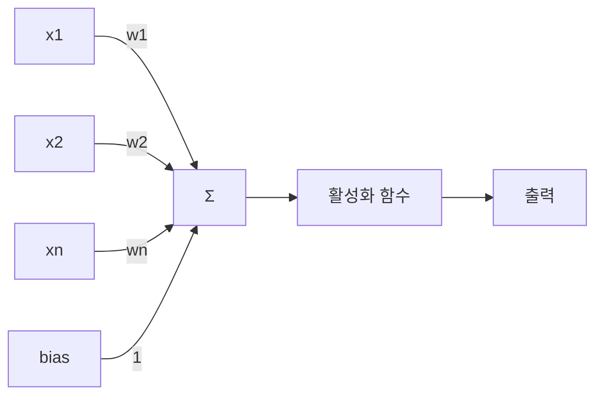
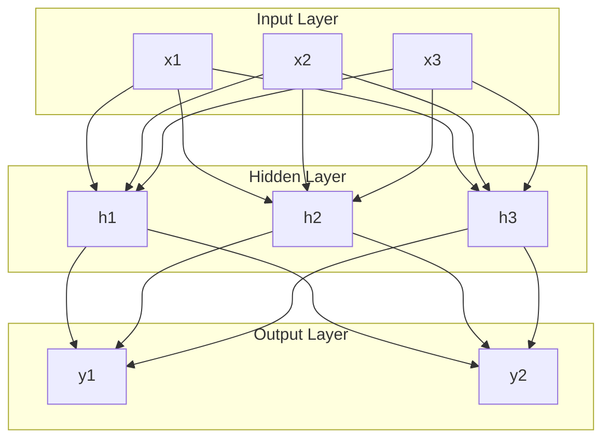

# 03_신경망_기초_퍼셉트론.md: 신경망의 기본 단위와 다층 퍼셉트론

## 문서 목표
이 문서는 신경망의 가장 기본적인 구성 요소인 퍼셉트론의 원리를 이해하고, 이를 확장한 다층 퍼셉트론(MLP)의 구조와 동작 방식을 학습하여 딥러닝 모델의 기초를 다지는 데 도움이 되기를 바랍니다.

---

## 목차

- [1. 생물학적 뉴런과 인공 뉴런](#1-생물학적-뉴런과-인공-뉴런)
  - [1.1. 생물학적 뉴런](#11-생물학적-뉴런)
  - [1.2. 인공 뉴런 (Perceptron)](#12-인공-뉴런-perceptron)
- [2. 퍼셉트론 (Perceptron)](#2-퍼셉트론-perceptron)
  - [2.1. 퍼셉트론의 구조](#21-퍼셉트론의-구조)
  - [2.2. 퍼셉트론의 동작 원리](#22-퍼셉트론의-동작-원리)
  - [2.3. 퍼셉트론의 한계 (XOR 문제)](#23-퍼셉트론의-한계-xor-문제)
- [3. 다층 퍼셉트론 (Multi-Layer Perceptron, MLP)](#3-다층-퍼셉트론-multi-layer-perceptron-mlp)
  - [3.1. MLP의 구조](#31-mlp의-구조)
  - [3.2. 활성화 함수 (Activation Function)의 역할](#32-활성화-함수-activation-function의-역할)
  - [3.3. MLP의 학습 (오차 역전파)](#33-mlp의-학습-오차-역전파)

---

## 1. 생물학적 뉴런과 인공 뉴런

딥러닝의 근간이 되는 인공 신경망은 인간의 뇌를 구성하는 신경 세포, 즉 뉴런(Neuron)의 작동 방식을 모방하여 만들어졌습니다.

### 1.1. 생물학적 뉴런

생물학적 뉴런은 다음과 같은 주요 부분으로 구성됩니다.

*   **수상돌기 (Dendrite)**: 다른 뉴런으로부터 신호를 받아들입니다.
*   **세포체 (Cell Body)**: 받아들인 신호들을 통합하고, 신호의 총합이 특정 역치(Threshold)를 넘으면 전기 신호(스파이크)를 발생시킵니다.
*   **축삭돌기 (Axon)**: 세포체에서 발생한 전기 신호를 다른 뉴런으로 전달합니다.
*   **시냅스 (Synapse)**: 뉴런과 뉴런 사이의 연결 부위로, 신호 전달의 강도(연결 강도)를 조절합니다.

### 1.2. 인공 뉴런 (Perceptron)

생물학적 뉴런의 작동 방식을 단순화하여 수학적으로 모델링한 것이 바로 **인공 뉴런** 또는 **퍼셉트론(Perceptron)** 입니다. 1957년 프랑크 로젠블랫(Frank Rosenblatt)이 제안했습니다.

## 2. 퍼셉트론 (Perceptron)

### 2.1. 퍼셉트론의 구조

퍼셉트론은 여러 개의 입력을 받아 하나의 출력을 내보내는 구조를 가집니다.

*   **입력 (Inputs, x)**: 여러 개의 입력 신호 `x1, x2, ..., xn`을 받습니다.
*   **가중치 (Weights, w)**: 각 입력 신호에는 고유한 가중치 `w1, w2, ..., wn`가 곱해집니다. 가중치는 시냅스의 연결 강도에 해당하며, 입력 신호의 중요도를 나타냅니다.
*   **총합 (Weighted Sum)**: 입력 신호와 가중치의 곱을 모두 더합니다. `z = w1x1 + w2x2 + ... + wnxn + b` (여기서 `b`는 편향(Bias)입니다.)
*   **편향 (Bias, b)**: 뉴런이 활성화되는 정도를 조절하는 값입니다. 입력 신호와는 별개로 뉴런의 활성화에 영향을 줍니다.
*   **활성화 함수 (Activation Function)**: 총합 `z`를 받아 최종 출력 `y`를 결정합니다. 초기 퍼셉트론에서는 계단 함수(Step Function)를 사용했습니다. 총합이 특정 역치(Threshold)를 넘으면 1, 아니면 0을 출력합니다.

### 2.2. 퍼셉트론의 동작 원리

퍼셉트론은 입력 신호와 가중치의 곱의 합이 특정 역치(또는 편향을 포함한 총합이 0)를 넘으면 1을 출력하고, 그렇지 않으면 0을 출력하는 이진 분류기(Binary Classifier)로 작동합니다. 이는 데이터를 선형적으로 분리하는 역할을 합니다.

### 2.3. 퍼셉트론의 한계 (XOR 문제)

단일 퍼셉트론은 **선형적으로 분리 가능한(Linearly Separable) 문제**만 해결할 수 있다는 한계가 있습니다. 대표적인 예시가 **XOR(배타적 논리합) 문제**입니다. XOR 게이트는 입력 `(0,0)`과 `(1,1)`일 때 0을, `(0,1)`과 `(1,0)`일 때 1을 출력하는데, 이를 단일 직선으로는 분류할 수 없습니다.

이러한 한계는 1969년 마빈 민스키(Marvin Minsky)와 시모어 페퍼트(Seymour Papert)의 저서 `Perceptrons`에서 지적되었고, 이로 인해 신경망 연구는 한동안 침체기에 접어들게 됩니다.

## 3. 다층 퍼셉트론 (Multi-Layer Perceptron, MLP)

퍼셉트론의 한계를 극복하기 위해 제안된 것이 바로 **다층 퍼셉트론(Multi-Layer Perceptron, MLP)** 입니다. MLP는 여러 개의 퍼셉트론 층을 쌓아 올린 구조를 가집니다.

### 3.1. MLP의 구조

MLP는 최소한 세 개의 층으로 구성됩니다.

*   **입력층 (Input Layer)**: 외부로부터 데이터를 받아들이는 층입니다.
*   **은닉층 (Hidden Layer)**: 입력층과 출력층 사이에 위치하는 층으로, 여러 개가 존재할 수 있습니다. 이 층에서 데이터의 복잡한 비선형 특징을 학습합니다. 은닉층이 많을수록 '깊은(Deep)' 신경망이 됩니다.
*   **출력층 (Output Layer)**: 최종 예측 결과를 내보내는 층입니다.

### 3.2. 활성화 함수 (Activation Function)의 역할

MLP가 단일 퍼셉트론의 한계를 넘어 비선형 문제를 해결할 수 있게 된 결정적인 이유는 **은닉층에 비선형 활성화 함수(Non-linear Activation Function)를 도입**했기 때문입니다. 만약 활성화 함수가 선형이라면, 여러 층을 쌓아도 결국 단일층과 동일한 선형 변환밖에 할 수 없습니다.

활성화 함수는 각 뉴런의 출력 값을 다음 층으로 전달하기 전에 비선형적으로 변환하여, 신경망이 복잡한 비선형 관계를 학습할 수 있도록 합니다.

### 3.3. MLP의 학습 (오차 역전파)

MLP는 **오차 역전파(Backpropagation)** 알고리즘을 통해 학습됩니다. 이는 출력층에서 발생한 오차를 역방향으로 전파시키면서 각 층의 가중치를 업데이트하여 손실을 최소화하는 과정입니다. 오차 역전파는 다음 장에서 더 자세히 다루겠습니다.

다음 장에서는 딥러닝 모델이 학습하는 핵심 원리인 **최적화 이론과 경사 하강법**에 대해 자세히 알아보겠습니다.