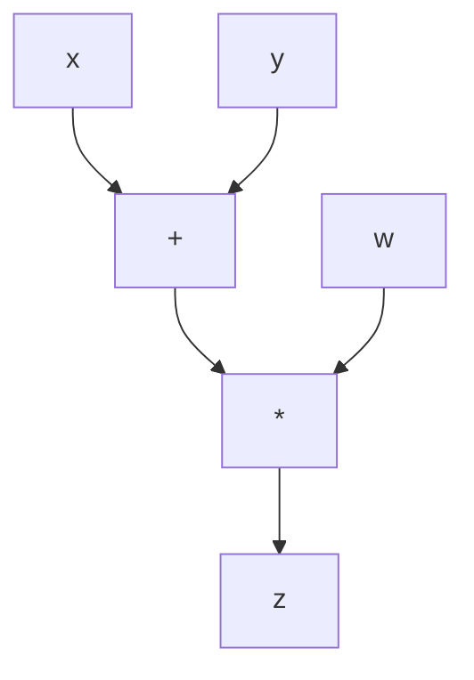

# 05_역전파_알고리즘_계산_그래프.md: 신경망 학습의 핵심 원리

## 문서 목표
이 문서는 신경망 학습의 핵심 알고리즘인 역전파(Backpropagation)의 원리를 계산 그래프(Computational Graph)를 통해 이해하고, 이를 통해 모델의 가중치가 어떻게 업데이트되는지 학습하는 데 도움이 되기를 바랍니다.

---

## 목차

- [1. 계산 그래프 (Computational Graph)](#1-계산-그래프-computational-graph)
  - [1.1. 계산 그래프의 개념](#11-계산-그래프의-개념)
  - [1.2. 계산 그래프의 장점](#12-계산-그래프의-장점)
- [2. 역전파 (Backpropagation) 알고리즘](#2-역전파-backpropagation-알고리즘)
  - [2.1. 역전파의 필요성](#21-역전파의-필요성)
  - [2.2. 역전파의 기본 원리 (연쇄 법칙 활용)](#22-역전파의-기본-원리-연쇄-법칙-활용)
  - [2.3. 역전파의 단계](#23-역전파의-단계)
- [3. 역전파의 실제 예시 (간단한 신경망)](#3-역전파의-실제-예시-간단한-신경망)
  - [3.1. 순전파 (Forward Pass)](#31-순전파-forward-pass)
  - [3.2. 역전파 (Backward Pass)](#32-역전파-backward-pass)
- [4. 역전파의 중요성](#4-역전파의-중요성)

---

## 1. 계산 그래프 (Computational Graph)

딥러닝 모델은 복잡한 수학적 연산의 연속으로 볼 수 있습니다. 이러한 연산의 흐름을 시각적으로 표현하고 효율적으로 미분 값을 계산하기 위해 **계산 그래프(Computational Graph)**가 사용됩니다.

### 1.1. 계산 그래프의 개념

계산 그래프는 노드(Node)와 엣지(Edge)로 구성된 방향성 비순환 그래프(Directed Acyclic Graph, DAG)입니다.

*   **노드**: 연산(Operation) 또는 데이터(변수, 상수)를 나타냅니다.
*   **엣지**: 데이터의 흐름(의존성)을 나타냅니다.

**예시**: `z = (x + y) * w`



### 1.2. 계산 그래프의 장점

*   **시각화**: 복잡한 연산 과정을 한눈에 파악할 수 있습니다.
*   **자동 미분**: 연쇄 법칙(Chain Rule)을 적용하여 각 노드의 미분 값을 효율적으로 계산할 수 있습니다. 이는 딥러닝 프레임워크(PyTorch의 `autograd`, TensorFlow의 `tf.GradientTape`)의 핵심 기능입니다.
*   **디버깅**: 연산 과정 중 어느 부분에서 문제가 발생하는지 쉽게 추적할 수 있습니다.

## 2. 역전파 (Backpropagation) 알고리즘

역전파는 신경망의 가중치를 학습시키는 데 사용되는 핵심 알고리즘입니다. 모델의 예측값과 실제 정답 사이의 오차(손실)를 줄이기 위해, 이 오차를 출력층에서부터 입력층 방향으로 역으로 전파시키면서 각 층의 가중치를 업데이트합니다.

### 2.1. 역전파의 필요성

신경망은 수많은 가중치와 편향으로 구성됩니다. 모델이 예측한 결과와 실제 정답 사이의 오차를 최소화하기 위해서는, 각 가중치가 오차에 얼마나 기여했는지를 알아야 합니다. 역전파는 이 '기여도'(즉, 손실 함수에 대한 각 가중치의 기울기)를 효율적으로 계산하는 방법입니다.

### 2.2. 역전파의 기본 원리 (연쇄 법칙 활용)

역전파는 미적분학의 **연쇄 법칙(Chain Rule)**을 반복적으로 적용하여 작동합니다. 연쇄 법칙은 합성 함수의 미분을 계산할 때 사용됩니다. 신경망은 여러 함수(레이어)가 연결된 합성 함수로 볼 수 있으므로, 출력층에서부터 입력층으로 거슬러 올라가며 각 층의 기울기를 계산할 수 있습니다.

### 2.3. 역전파의 단계

1.  **순전파 (Forward Pass)**: 입력 데이터가 신경망의 각 층을 통과하며 최종 예측값을 계산합니다. 이 과정에서 각 노드의 중간 계산 결과가 저장됩니다.
2.  **손실 계산**: 예측값과 실제 정답을 비교하여 손실 함수 값을 계산합니다.
3.  **역전파 (Backward Pass)**: 계산된 손실을 출력층에서부터 입력층 방향으로 역으로 전파시킵니다. 각 층의 노드에서 연쇄 법칙을 사용하여 해당 노드의 입력에 대한 출력의 기울기를 계산하고, 이를 통해 최종적으로 손실 함수에 대한 각 가중치의 기울기를 얻습니다.
4.  **가중치 업데이트**: 계산된 기울기를 사용하여 경사 하강법과 같은 최적화 알고리즘으로 모델의 가중치를 업데이트합니다.

## 3. 역전파의 실제 예시 (간단한 신경망)

간단한 신경망 `y = f(x) = sigmoid(w * x + b)`와 손실 함수 `L = (y - target)^2`를 예로 들어 역전파 과정을 살펴보겠습니다.

### 3.1. 순전파 (Forward Pass)

1.  입력 `x`와 가중치 `w`, 편향 `b`를 사용하여 `z = w * x + b` 계산.
2.  `z`를 활성화 함수 `sigmoid`에 통과시켜 `y = sigmoid(z)` 계산.
3.  `y`와 `target`을 사용하여 손실 `L = (y - target)^2` 계산.

```mermaid
graph TD
    x[x] --> mul[w * x]
    w[w] --> mul
    mul --> add[+ b]
    b[b] --> add
    add --> sigmoid[sigmoid]
    sigmoid --> y[y]
    y --> sub[y - target]
    target[target] --> sub
    sub --> square[(.)^2]
    square --> L[L]
```

### 3.2. 역전파 (Backward Pass)

목표는 `∂L/∂w`와 `∂L/∂b`를 계산하는 것입니다. 연쇄 법칙을 사용하여 `L`에서부터 `w`와 `b`로 거슬러 올라갑니다.

1.  `∂L/∂y = 2(y - target)`
2.  `∂y/∂z = y(1 - y)` (시그모이드 함수의 미분)
3.  `∂z/∂w = x`
4.  `∂z/∂b = 1`

이제 연쇄 법칙을 적용하여 각 가중치에 대한 손실의 기울기를 계산합니다.

*   `∂L/∂w = (∂L/∂y) * (∂y/∂z) * (∂z/∂w) = 2(y - target) * y(1 - y) * x`
*   `∂L/∂b = (∂L/∂y) * (∂y/∂z) * (∂z/∂b) = 2(y - target) * y(1 - y) * 1`

이렇게 계산된 기울기(`∂L/∂w`, `∂L/∂b`)를 사용하여 경사 하강법으로 `w`와 `b`를 업데이트합니다.

## 4. 역전파의 중요성

역전파 알고리즘은 현대 딥러닝의 발전을 가능하게 한 핵심 기술입니다. 이 알고리즘 덕분에 우리는 수십, 수백 개의 층을 가진 깊은 신경망을 효율적으로 학습시킬 수 있게 되었습니다. 딥러닝 프레임워크(PyTorch, TensorFlow)는 이 역전파 과정을 자동으로 처리해주므로, 개발자는 모델 구조와 순전파 로직만 정의하면 됩니다.

다음 장에서는 딥러닝 모델의 성능에 큰 영향을 미치는 **활성화 함수와 가중치 초기화**에 대해 알아보겠습니다.