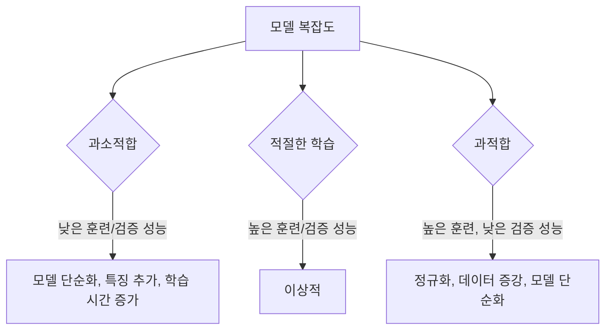

# 07_과적합_방지_및_정규화.md: 모델의 일반화 성능 향상 전략

## 문서 목표
이 문서는 딥러닝 모델 학습에서 발생하는 과적합(Overfitting)의 개념을 이해하고, 이를 방지하여 모델의 일반화 성능을 향상시키는 다양한 정규화(Regularization) 기법들을 학습하는 데 도움이 되기를 바랍니다.

---

## 목차

- [1. 과적합 (Overfitting)과 과소적합 (Underfitting)](#1-과적합-overfitting과-과소적합-underfitting)
  - [1.1. 과적합의 개념](#11-과적합의-개념)
  - [1.2. 과소적합의 개념](#12-과소적합의-개념)
  - [1.3. 과적합/과소적합의 시각화](#13-과적합과소적합의-시각화)
- [2. 정규화 (Regularization)](#2-정규화-regularization)
  - [2.1. 정규화의 필요성](#21-정규화의-필요성)
  - [2.2. L1/L2 정규화 (Weight Decay)](#22-l1l2-정규화-weight-decay)
  - [2.3. 드롭아웃 (Dropout)](#23-드롭아웃-dropout)
  - [2.4. 배치 정규화 (Batch Normalization)](#24-배치-정규화-batch-normalization)
  - [2.5. 조기 종료 (Early Stopping)](#25-조기-종료-early-stopping)
  - [2.6. 데이터 증강 (Data Augmentation)](#26-데이터-증강-data-augmentation)
- [3. 정규화 기법 선택 가이드](#3-정규화-기법-선택-가이드)

---

## 1. 과적합 (Overfitting)과 과소적합 (Underfitting)

머신러닝 모델은 주어진 훈련 데이터로부터 패턴을 학습하여 새로운, 보지 못한 데이터에 대해서도 정확하게 예측하는 **일반화(Generalization)** 능력을 갖추는 것이 중요합니다. 하지만 학습 과정에서 모델이 훈련 데이터에 너무 맞춰지거나, 반대로 충분히 학습되지 못하는 문제가 발생할 수 있습니다.

### 1.1. 과적합의 개념

**과적합(Overfitting)**은 모델이 훈련 데이터에 너무 과도하게 학습되어, 훈련 데이터에서는 높은 성능을 보이지만 실제 새로운 데이터(테스트 데이터)에서는 성능이 떨어지는 현상을 말합니다. 모델이 훈련 데이터의 노이즈나 특정 패턴까지 학습하여 일반화 능력을 잃게 됩니다.

*   **원인**: 모델의 복잡도가 너무 높을 때, 훈련 데이터의 양이 부족할 때, 훈련 데이터에 노이즈가 많을 때 발생하기 쉽습니다.
*   **특징**: 훈련 손실(Training Loss)은 낮고, 검증 손실(Validation Loss)은 높거나 증가하는 경향을 보입니다.

### 1.2. 과소적합의 개념

**과소적합(Underfitting)**은 모델이 훈련 데이터에 대해 충분히 학습되지 못하여, 훈련 데이터에서도 낮은 성능을 보이고 당연히 새로운 데이터에서도 낮은 성능을 보이는 현상을 말합니다. 모델이 데이터의 기본적인 패턴조차 제대로 파악하지 못합니다.

*   **원인**: 모델의 복잡도가 너무 낮을 때, 훈련 데이터의 특징이 부족할 때, 학습 횟수가 너무 적을 때 발생하기 쉽습니다.
*   **특징**: 훈련 손실과 검증 손실 모두 높게 나타납니다.

### 1.3. 과적합/과소적합의 시각화

## 2. 정규화 (Regularization)

**정규화(Regularization)**는 모델의 과적합을 방지하고 일반화 성능을 향상시키기 위한 기법들을 통칭합니다. 모델의 복잡도를 제어하거나, 학습 과정에 제약을 가하여 훈련 데이터에 대한 과도한 의존성을 줄입니다.

### 2.1. 정규화의 필요성

정규화는 모델이 훈련 데이터에만 너무 잘 맞추는 것을 방지하고, 보지 못한 새로운 데이터에 대해서도 좋은 성능을 낼 수 있도록 돕습니다. 이는 모델의 **일반화 능력**을 높이는 핵심적인 방법입니다.

### 2.2. L1/L2 정규화 (Weight Decay)

*   **원리**: 손실 함수에 가중치(Weight)의 크기에 비례하는 항을 추가하여, 가중치 값이 너무 커지는 것을 제약합니다. 가중치가 커지면 모델이 특정 특징에 과도하게 의존하게 되어 과적합될 가능성이 높아지기 때문입니다.
*   **L1 정규화 (Lasso Regression)**: 손실 함수에 가중치 절댓값의 합을 추가합니다. 일부 가중치를 0으로 만들어 특징 선택(Feature Selection) 효과를 가집니다.
*   **L2 정규화 (Ridge Regression / Weight Decay)**: 손실 함수에 가중치 제곱합을 추가합니다. 가중치 값을 0에 가깝게 만들지만 완전히 0으로 만들지는 않습니다. 딥러닝에서 주로 사용됩니다.

### 2.3. 드롭아웃 (Dropout)

*   **원리**: 훈련 과정에서 각 층의 뉴런 중 일부를 무작위로 비활성화(드롭아웃)시켜 학습에 참여시키지 않는 기법입니다. 마치 매번 다른 신경망을 학습시키는 것과 같은 효과를 줍니다.
*   **효과**: 특정 뉴런에 대한 과도한 의존성을 줄이고, 여러 뉴런이 다양한 특징을 학습하도록 강제하여 앙상블(Ensemble) 효과를 냅니다.
*   **주의**: 드롭아웃은 훈련 시에만 적용하며, 테스트(평가) 시에는 모든 뉴런을 사용하고 가중치에 드롭아웃 비율을 곱하여 스케일링합니다.

### 2.4. 배치 정규화 (Batch Normalization)

*   **원리**: 신경망의 각 층에 들어가는 입력(활성화 값)을 정규화하여 학습을 안정화하고 가속화하는 기법입니다. 내부 공변량 변화(Internal Covariate Shift) 문제를 완화합니다.
*   **효과**: 학습률에 덜 민감해지고, 가중치 초기화에 대한 의존성을 줄이며, 과적합을 억제하는 정규화 효과도 가집니다.

### 2.5. 조기 종료 (Early Stopping)

*   **원리**: 훈련 데이터에 대한 손실은 계속 감소하더라도, 검증 데이터에 대한 손실이 더 이상 감소하지 않고 오히려 증가하기 시작할 때 학습을 중단하는 기법입니다.
*   **효과**: 과적합이 시작되는 지점에서 학습을 멈춰 최적의 일반화 성능을 가진 모델을 얻을 수 있습니다.

### 2.6. 데이터 증강 (Data Augmentation)

*   **원리**: 이미지 회전, 확대/축소, 좌우 반전, 자르기 등 기존 데이터를 변형하여 훈련 데이터의 양을 인위적으로 늘리는 기법입니다. 특히 이미지 데이터에서 매우 효과적입니다.
*   **효과**: 모델이 다양한 형태의 데이터를 학습하게 하여 일반화 성능을 향상시키고 과적합을 줄입니다.

## 3. 정규화 기법 선택 가이드

*   **L2 정규화 (Weight Decay)**: 대부분의 딥러닝 모델에 기본적으로 적용하는 것이 좋습니다.
*   **드롭아웃**: 주로 완전 연결층(Fully Connected Layer)에 적용하며, CNN에서는 배치 정규화와 함께 사용 시 주의가 필요할 수 있습니다.
*   **배치 정규화**: 거의 모든 딥러닝 모델에서 학습 안정성과 성능 향상을 위해 사용을 권장합니다.
*   **조기 종료**: 모든 학습 과정에서 모니터링하며 적용하는 것이 좋습니다.
*   **데이터 증강**: 이미지, 음성 등 데이터의 특성을 고려하여 적절한 변형 기법을 적용합니다.

이러한 정규화 기법들을 적절히 조합하여 사용하면 딥러닝 모델의 일반화 성능을 크게 향상시킬 수 있습니다.

다음 장에서는 이미지 처리에 특화된 **합성곱 신경망(CNN)**에 대해 자세히 알아보겠습니다.