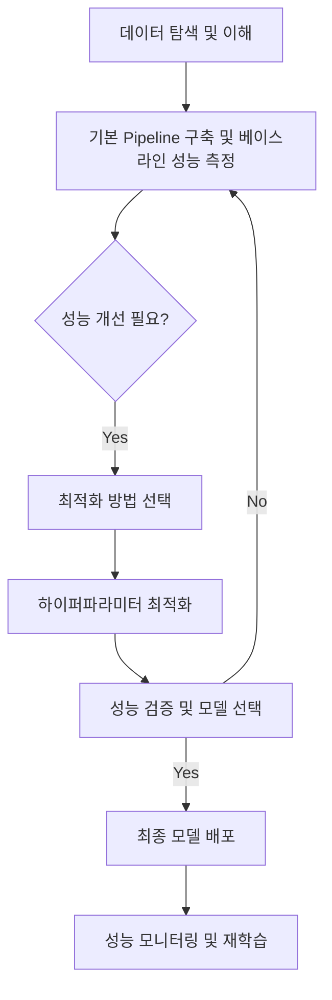

# 머신러닝 모델 최적화: 하이퍼파라미터 튜닝과 Pipeline 활용 전략

## 문서 목표
본 문서는 머신러닝 모델의 성능을 극대화하기 위한 하이퍼파라미터 최적화 기법들을 심층적으로 다룹니다. 전통적인 Grid Search부터 효율적인 Bayesian Optimization(Optuna)까지 다양한 방법론을 비교 분석하고, Scikit-learn Pipeline을 활용하여 전처리 및 모델링 과정을 통합하는 실전 전략을 제시합니다. 각 기법의 장단점, 실습 예제, 그리고 실무 적용 가이드를 통해 모델 개발의 효율성과 신뢰성을 높이는 데 기여합니다.

---

## 목차
- [머신러닝 모델 최적화: 하이퍼파라미터 튜닝과 Pipeline 활용 전략](#머신러닝-모델-최적화-하이퍼파라미터-튜닝과-pipeline-활용-전략)
  - [문서 목표](#문서-목표)
  - [목차](#목차)
  - [1. 하이퍼파라미터 최적화 개론](#1-하이퍼파라미터-최적화-개론)
    - [1.1 하이퍼파라미터란?](#11-하이퍼파라미터란)
      - [모델 파라미터 vs 하이퍼파라미터](#모델-파라미터-vs-하이퍼파라미터)
    - [1.2 하이퍼파라미터 최적화의 중요성](#12-하이퍼파라미터-최적화의-중요성)
      - [핵심 최적화 목표](#핵심-최적화-목표)
      - [주의: 최적화 실패 시 문제점](#주의-최적화-실패-시-문제점)
    - [1.3 주요 최적화 방법론](#13-주요-최적화-방법론)
      - [전통적 방법](#전통적-방법)
      - [현대적 방법](#현대적-방법)
  - [2. Optuna 베이지안 최적화](#2-optuna-베이지안-최적화)
    - [2.1 Optuna 개요](#21-optuna-개요)
      - [핵심 Optuna의 특징](#핵심-optuna의-특징)
      - [구조: Optuna의 핵심 구성요소](#구조-optuna의-핵심-구성요소)
  - [3. Scikit-learn Pipeline 활용](#3-scikit-learn-pipeline-활용)
    - [3.1 Pipeline 기초 개념](#31-pipeline-기초-개념)
      - [구조: Pipeline이란?](#구조-pipeline이란)
      - [핵심: Pipeline의 핵심 가치](#핵심-pipeline의-핵심-가치)
      - [구조: Pipeline 구성 및 `ColumnTransformer`와의 통합](#구조-pipeline-구성-및-columntransformer와의-통합)
    - [3.3 Pipeline + GridSearchCV 통합](#33-pipeline--gridsearchcv-통합)
      - [Tip: 하이퍼파라미터 명명 규칙](#tip-하이퍼파라미터-명명-규칙)
    - [3.4 Pipeline + Optuna 통합](#34-pipeline--optuna-통합)
  - [4. GridSearchCV vs Optuna 비교](#4-gridsearchcv-vs-optuna-비교)
    - [4.2 방법론별 장단점 분석](#42-방법론별-장단점-분석)
      - [비교: GridSearchCV](#비교-gridsearchcv)
      - [비교: Optuna (베이지안 최적화)](#비교-optuna-베이지안-최적화)
    - [4.3 실무 적용 가이드](#43-실무-적용-가이드)
      - [상황별 최적화 방법 선택 기준](#상황별-최적화-방법-선택-기준)
      - [의사결정 매트릭스 (Decision Matrix)](#의사결정-매트릭스-decision-matrix)
  - [5. 실무 적용 전략](#5-실무-적용-전략)
    - [5.1 프로젝트 단계별 가이드](#51-프로젝트-단계별-가이드)
      - [단계 1: 빠른 프로토타이핑 (Rapid Prototyping)](#단계-1-빠른-프로토타이핑-rapid-prototyping)
      - [단계 2: 체계적 최적화 (Systematic Optimization)](#단계-2-체계적-최적화-systematic-optimization)
      - [단계 3: 성능 검증 및 배포 준비 (Validation \& Deployment)](#단계-3-성능-검증-및-배포-준비-validation--deployment)
    - [5.2 하이퍼파라미터 선택 전략](#52-하이퍼파라미터-선택-전략)
      - [핵심: 모델별 핵심 파라미터](#핵심-모델별-핵심-파라미터)
    - [5.3 성능 평가 및 해석](#53-성능-평가-및-해석)
      - [핵심: 평가지표 선택 가이드](#핵심-평가지표-선택-가이드)
      - [해석: 결과 해석 가이드](#해석-결과-해석-가이드)
  - [6. 종합 정리 및 결론](#6-종합-정리-및-결론)
    - [6.1 핵심 학습 내용 요약](#61-핵심-학습-내용-요약)
      - [핵심: 하이퍼파라미터 최적화 핵심 원리](#핵심-하이퍼파라미터-최적화-핵심-원리)
      - [핵심: Pipeline 활용의 핵심 가치](#핵심-pipeline-활용의-핵심-가치)
      - [비교: 방법론 선택 기준](#비교-방법론-선택-기준)
    - [6.2 실무 적용 Best Practices](#62-실무-적용-best-practices)
      - [Best 프로젝트 워크플로우](#best-프로젝트-워크플로우)

---

## 1. 하이퍼파라미터 최적화 개론

### 1.1 하이퍼파라미터란?

> **하이퍼파라미터(Hyperparameter)**: 머신러닝 모델의 학습 과정 전에 사용자가 직접 설정해야 하는 매개변수입니다. 모델이 데이터로부터 자동으로 학습하는 파라미터(예: 선형 회귀의 가중치, 신경망의 가중치)와는 구별됩니다.

#### 모델 파라미터 vs 하이퍼파라미터

| 구분 | 모델 파라미터 | 하이퍼파라미터 |
|:---|:---|:---|
| **정의** | 데이터로부터 학습되는 값 (예: 선형 회귀의 계수, 신경망의 가중치 및 편향) | 모델 학습 전에 사용자가 설정하는 값 (예: 학습률, 트리의 깊이, 정규화 강도, 클러스터 개수) |
| **결정 방법** | 알고리즘이 훈련 데이터를 통해 자동 학습 | 사람이 직접 설정하거나, 하이퍼파라미터 최적화 기법을 통해 탐색하여 결정 |
| **영향** | 모델의 예측 성능에 직접적인 영향 | 학습 과정과 최종 모델의 성능 및 일반화 능력에 큰 영향 |

### 1.2 하이퍼파라미터 최적화의 중요성

하이퍼파라미터 최적화는 머신러닝 모델 개발 과정에서 매우 중요한 단계입니다. 적절한 하이퍼파라미터 설정은 모델의 성능을 극대화하고, 실제 환경에서의 적용 가능성을 높이는 데 결정적인 역할을 합니다.

#### 핵심 최적화 목표

-   **성능 향상**: 모델의 예측 정확도, 정밀도, 재현율 등 핵심 성능 지표를 개선하여 문제 해결 능력을 높입니다.
-   **과적합 방지**: 모델이 훈련 데이터에만 과도하게 맞춰지는 과적합(Overfitting)을 방지하고, 새로운 데이터에 대한 일반화 성능(Generalization Performance)을 확보합니다.
-   **효율성 증대**: 불필요한 계산 복잡도를 줄이고, 모델 학습 시간과 자원(CPU/GPU, 메모리) 사용을 최적화하여 개발 및 운영 효율성을 높입니다.

#### 주의: 최적화 실패 시 문제점

-   **과적합(Overfitting)**: 모델이 훈련 데이터의 노이즈까지 학습하여 훈련 성능은 높지만, 실제 데이터에 대한 예측 성능이 현저히 떨어집니다.
-   **과소적합(Underfitting)**: 모델이 데이터를 충분히 학습하지 못하여 훈련 데이터와 테스트 데이터 모두에서 낮은 성능을 보입니다. 이는 모델의 복잡도가 너무 낮거나, 학습이 불충분할 때 발생합니다.
-   **자원 낭비**: 비효율적인 하이퍼파라미터 탐색은 불필요한 계산 시간과 자원 소모를 야기하여 개발 비용을 증가시킵니다.

### 1.3 주요 최적화 방법론

하이퍼파라미터를 최적화하는 방법은 크게 전통적인 방법과 현대적인 방법으로 나눌 수 있습니다.

#### 전통적 방법

1.  **Manual Search (수동 탐색)**:
    -   **설명**: 데이터 과학자의 경험과 직관에 의존하여 하이퍼파라미터 값을 수동으로 변경하며 모델 성능을 확인하는 방법입니다.
    -   **장점**: 특정 도메인 지식이 풍부할 때 빠르게 좋은 결과를 얻을 수도 있습니다.
    -   **단점**: 매우 시간 소모적이고 비효율적이며, 최적의 조합을 찾기 어렵습니다. 재현성이 낮습니다.

2.  **Grid Search (격자 탐색)**:
    -   **설명**: 사용자가 지정한 하이퍼파라미터 값들의 모든 가능한 조합에 대해 모델을 학습하고 교차 검증을 통해 최적의 조합을 찾는 방법입니다.
    -   **장점**: 모든 조합을 체계적으로 탐색하므로, 주어진 탐색 공간 내에서는 최적의 조합을 확실히 찾을 수 있습니다.
    -   **단점**: 하이퍼파라미터의 개수나 각 파라미터의 후보 값 수가 증가할수록 탐색해야 할 조합의 수가 기하급수적으로 늘어나 계산 시간(시간 복잡도)이 매우 높아집니다. 이를 **조합 폭발(Combinatorial Explosion)** 문제라고 합니다.

3.  **Random Search (무작위 탐색)**:
    -   **설명**: 하이퍼파라미터 공간에서 무작위로 조합을 선택하여 탐색하는 방법입니다. `Grid Search`와 달리 모든 조합을 탐색하지 않고, 지정된 횟수(`n_iter`)만큼만 샘플링하여 평가합니다.
    -   **장점**: `Grid Search`보다 효율적으로 넓은 탐색 공간을 탐색할 수 있습니다. 특히 중요한 하이퍼파라미터가 소수일 때 효과적입니다.
    -   **단점**: 무작위 탐색이므로 `Grid Search`처럼 최적의 조합을 보장하지는 않습니다.

#### 현대적 방법

1.  **Bayesian Optimization (베이지안 최적화)**:
    -   **설명**: 이전 시도에서 얻은 하이퍼파라미터 조합과 그 성능 정보를 바탕으로, 다음으로 시도할 최적의 하이퍼파라미터 조합을 지능적으로 예측하여 탐색하는 방법입니다. `획득 함수(Acquisition Function)`를 사용하여 다음 탐색 지점을 결정합니다.
    -   **장점**: `Grid Search`나 `Random Search`보다 훨씬 효율적으로 최적의 하이퍼파라미터를 찾을 수 있습니다. 특히 모델 학습 시간이 오래 걸리는 경우에 큰 이점을 가집니다.
    -   **라이브러리**: Optuna, Hyperopt, Scikit-optimize 등

2.  **Evolutionary Algorithms (진화 알고리즘)**:
    -   **설명**: 자연 선택과 유전의 원리를 모방하여 하이퍼파라미터 조합을 최적화하는 방법입니다. 여러 세대의 하이퍼파라미터 조합을 생성하고, 성능이 좋은 조합을 선택하여 다음 세대로 전달하는 방식으로 탐색합니다.
    -   **장점**: 복잡한 탐색 공간에서도 전역 최적해(Global Optima)를 찾을 가능성이 높습니다.
    -   **라이브러리**: DEAP, TPOT 등

## 2. Optuna 베이지안 최적화

Optuna는 하이퍼파라미터 최적화를 위한 파이썬 라이브러리로, 특히 베이지안 최적화 기법을 효율적으로 구현합니다. 이전 시도 결과를 바탕으로 다음 탐색할 하이퍼파라미터 조합을 지능적으로 선택하여 최적화 과정을 가속화합니다.

### 2.1 Optuna 개요

#### 핵심 Optuna의 특징

-   **베이지안 최적화**: 이전 시도에서 얻은 목적 함수 값(모델 성능)을 바탕으로 다음 탐색할 하이퍼파라미터 조합을 지능적으로 제안합니다. 이는 무작위 탐색보다 훨씬 효율적으로 최적해를 찾아냅니다.
-   **TPE (Tree-structured Parzen Estimator) 알고리즘**: Optuna의 기본 샘플링 알고리즘으로, 비선형적이고 복잡한 하이퍼파라미터 공간에서도 효율적인 탐색을 가능하게 합니다.
-   **Pruning (조기 종료) 지원**: 학습 과정에서 성능이 좋지 않은 시도(Trial)를 조기에 중단하여 불필요한 계산 자원 낭비를 줄입니다. 이는 특히 딥러닝 모델과 같이 학습 시간이 긴 경우에 매우 유용합니다.
-   **다양한 분포 지원**: `trial.suggest_int()`, `trial.suggest_float()`, `trial.suggest_categorical()` 등을 통해 정수형, 실수형, 범주형 등 다양한 타입의 하이퍼파라미터를 유연하게 탐색할 수 있습니다.
-   **병렬 처리**: `n_jobs` 매개변수를 통해 여러 CPU 코어를 활용하여 병렬적으로 최적화를 수행할 수 있습니다.

#### 구조: Optuna의 핵심 구성요소

Optuna를 사용한 하이퍼파라미터 최적화는 주로 `Study`와 `Trial`이라는 두 가지 핵심 개념을 중심으로 이루어집니다.

-   **`Study`**: 전체 최적화 실험을 관리하는 객체입니다. 최적화 방향(최대화 또는 최소화)을 설정하고, 모든 `Trial`의 결과를 기록하며, 최종 최적의 하이퍼파라미터와 성능을 저장합니다.
    ```python
     study = optuna.create_study(direction="maximize") # 목적 함수 값을 최대화하는 방향으로 최적화
    ```
-   **`Trial`**: `Study` 내에서 수행되는 개별적인 하이퍼파라미터 조합에 대한 시도(실험)를 의미합니다. 각 `Trial`은 `trial.suggest_` 메서드를 통해 하이퍼파라미터 값을 제안받고, 이 값들로 모델을 학습 및 평가한 후 그 결과를 `Study`에 반환합니다.
    ```python
     def objective(trial):
         # 하이퍼파라미터 제안 (예시)
         param = trial.suggest_int('param', 1, 100)
         # 모델 학습 및 평가 로직
         score = ... # 모델의 성능 지표
         return score
    ```
-   **최적화 실행**: `study.optimize()` 메서드를 호출하여 지정된 횟수(`n_trials`)만큼 `Trial`을 반복 실행하며 최적의 하이퍼파라미터 조합을 찾아냅니다.
    ```python
     study.optimize(objective, n_trials=100) # objective 함수를 100번 실행하여 최적화
    ```


## 3. Scikit-learn Pipeline 활용

Scikit-learn의 `Pipeline`은 머신러닝 워크플로우에서 여러 단계의 데이터 처리(전처리, 특성 공학 등)와 모델 학습 과정을 하나의 객체로 연결해주는 강력한 도구입니다. 이를 통해 코드의 가독성, 재사용성, 그리고 데이터 누수 방지 측면에서 큰 이점을 얻을 수 있습니다.

### 3.1 Pipeline 기초 개념

#### 구조: Pipeline이란?

> **Pipeline**: 데이터 전처리(변환) 단계와 최종 모델(추정기)을 순차적으로 연결하여 하나의 통합된 머신러닝 워크플로우를 구성하는 도구입니다. 마치 공장의 생산 라인처럼, 데이터가 각 단계를 거치면서 변환되고 최종적으로 모델에 의해 처리됩니다.

#### 핵심: Pipeline의 핵심 가치

`Pipeline`을 사용함으로써 얻을 수 있는 주요 이점들은 다음과 같습니다.

1.  **일관성 (Consistency)**:
    -   훈련 데이터와 새로운 예측 데이터에 대해 **동일한 전처리 및 모델 학습/예측 순서와 파라미터**를 자동으로 보장합니다. 이는 모델의 신뢰성과 재현성을 높이는 데 필수적입니다.
    -   예를 들어, 훈련 데이터로 `StandardScaler`를 `fit_transform`한 후 모델을 학습했다면, 예측 시에는 반드시 훈련 데이터로 `fit`된 동일한 `StandardScaler`를 사용하여 `transform`해야 합니다. `Pipeline`은 이 과정을 자동으로 관리해줍니다.
    ```python
    # Pipeline을 사용하지 않을 경우 (수동 관리 필요):
     scaler = StandardScaler()
     X_train_scaled = scaler.fit_transform(X_train)
     model.fit(X_train_scaled, y_train)
     X_test_scaled = scaler.transform(X_test) # 테스트 데이터에도 동일한 스케일러 적용
     y_pred = model.predict(X_test_scaled)

    # Pipeline을 사용할 경우 (자동 관리):
     pipeline.fit(X_train, y_train)      # 내부적으로 scaler.fit_transform(X_train) 후 model.fit(X_train_scaled, y_train) 실행
     y_pred = pipeline.predict(X_test)   # 내부적으로 scaler.transform(X_test) 후 model.predict(X_test_scaled) 실행
    ```

2.  **안전성 (Safety) - 데이터 누수(Data Leakage) 방지**:
    -   `Pipeline`은 훈련 데이터에 대해서만 `fit()` 메서드를 호출하고, 테스트 데이터에 대해서는 `transform()` 또는 `predict()` 메서드만 호출하도록 강제합니다. 이는 테스트 데이터의 정보가 훈련 과정에 유출되는 **데이터 누수(Data Leakage)**를 효과적으로 방지합니다. 데이터 누수는 모델의 성능을 과대평가하게 만들어 실제 환경에서 기대 이하의 성능을 보이는 원인이 됩니다.

3.  **재사용성 (Reusability)**:
    -   한 번 정의한 `Pipeline` 객체는 다른 데이터셋이나 새로운 예측 상황에서도 동일한 전처리 및 모델링 과정을 쉽게 재사용할 수 있습니다. 이는 코드의 모듈화와 유지보수성을 크게 향상시킵니다.

4.  **유지보수성 (Maintainability)**:
    -   복잡한 머신러닝 워크플로우를 체계적으로 관리하고, 각 단계의 변경이 다른 단계에 미치는 영향을 쉽게 파악할 수 있게 합니다.

#### 구조: Pipeline 구성 및 `ColumnTransformer`와의 통합

`Pipeline`은 `(이름, 변환기/추정기)` 형태의 튜플 리스트를 `steps` 매개변수로 받습니다. 각 단계는 `Transformer` (변환기) 또는 `Estimator` (추정기) 객체여야 하며, 마지막 단계는 반드시 `Estimator`여야 합니다.

특히, 숫자형 특성과 범주형 특성이 혼합된 데이터셋에서는 `ColumnTransformer`를 `Pipeline`의 첫 번째 단계로 사용하여 각 컬럼에 다른 전처리를 적용할 수 있습니다. `ColumnTransformer`는 여러 변환기를 병렬적으로 적용하고 그 결과를 하나로 합쳐줍니다.

```python
from sklearn.pipeline import Pipeline
from sklearn.preprocessing import StandardScaler, OneHotEncoder
from sklearn.compose import ColumnTransformer # ColumnTransformer 임포트
from sklearn.ensemble import RandomForestClassifier

# 예시: 숫자형 특성과 범주형 특성이 혼합된 데이터에 대한 Pipeline

# 1. 숫자형/범주형 특성 구분 (실제 데이터셋의 컬럼명에 맞게 지정)
numeric_features = ['age', 'hours-per-week']
categorical_features = ['workclass', 'education', 'gender', 'occupation']

# 2. ColumnTransformer 정의: 각 특성 그룹에 다른 전처리 적용
preprocessor = ColumnTransformer(
    transformers=[
        ('num', StandardScaler(), numeric_features), # 숫자형 특성에는 StandardScaler 적용
        ('cat', OneHotEncoder(handle_unknown='ignore', sparse_output=False), categorical_features) # 범주형 특성에는 OneHotEncoder 적용
    ])

# 3. 완전한 머신러닝 Pipeline 구축
# 첫 번째 단계: preprocessor (ColumnTransformer)
# 두 번째 단계: classifier (RandomForestClassifier)
pipeline = Pipeline(steps=[
    ('preprocessor', preprocessor),
    ('classifier', RandomForestClassifier(random_state=42)) # 모델은 random_state를 고정하여 재현성 확보
])

print("Pipeline 객체 생성 완료:")
print(pipeline)
```

**Pipeline 방식:**

`Pipeline`을 사용하면 전처리 단계와 모델 학습 단계를 하나의 객체로 묶을 수 있습니다. `fit()` 메서드를 호출하면 파이프라인 내의 모든 변환기들이 순차적으로 `fit_transform`되고, 마지막 모델이 `fit`됩니다. `predict()` 메서드를 호출하면 변환기들이 `transform`되고 모델이 `predict`됩니다. 이는 코드를 간결하게 만들고 데이터 누수를 방지합니다.

```python
from sklearn.pipeline import Pipeline
from sklearn.preprocessing import StandardScaler
from sklearn.svm import SVC
from sklearn.datasets import load_iris
from sklearn.model_selection import train_test_split
from sklearn.metrics import accuracy_score

# 1. 데이터 로드 및 분할 (수동 처리 방식과 동일)
iris = load_iris()
X, y = iris.data, iris.target
X_train, X_test, y_train, y_test = train_test_split(X, y, test_size=0.3, random_state=42, stratify=y)

# 2. Pipeline 정의
pipeline = Pipeline([
    ('scaler', StandardScaler()), # 첫 번째 단계: StandardScaler
    ('svc', SVC(kernel='rbf', C=1.0, gamma='scale', random_state=42)) # 두 번째 단계: SVC 모델
])

# 3. Pipeline 학습 (X_train에 대해 스케일링 후 SVC 학습)
pipeline.fit(X_train, y_train)

# 4. Pipeline 예측 (X_test에 대해 스케일링 후 SVC 예측)
y_pred_pipeline = pipeline.predict(X_test)

# 5. 성능 평가
accuracy_pipeline = accuracy_score(y_test, y_pred_pipeline)
print(f"Pipeline 방식의 정확도: {accuracy_pipeline:.4f}")
```

**결과 비교:**

-   수동 처리 방식의 정확도: 0.9778
-   Pipeline 방식의 정확도: 0.9778
-   **차이**: 0.0000 (두 방식의 결과는 동일함을 확인)

이 실습을 통해 `Pipeline`이 수동으로 전처리 단계를 관리하는 것과 동일한 결과를 제공하면서도, 코드를 훨씬 간결하고 안전하게 만들어준다는 것을 알 수 있습니다.

### 3.3 Pipeline + GridSearchCV 통합

`Pipeline`의 가장 강력한 장점 중 하나는 `GridSearchCV`와 같은 하이퍼파라미터 튜닝 도구와 완벽하게 통합된다는 점입니다. 이를 통해 전처리 단계의 하이퍼파라미터(예: 스케일러 선택)와 모델의 하이퍼파라미터를 동시에 최적화할 수 있습니다.

#### Tip: 하이퍼파라미터 명명 규칙

`Pipeline` 내의 특정 단계(step)에 속한 모델이나 변환기의 하이퍼파라미터를 `GridSearchCV`의 `param_grid`에 지정할 때는 `'단계이름__파라미터명'` 형식의 이중 언더스코어(`__`) 규칙을 사용합니다.

```python
# 예시: 파이프라인 단계명__파라미터명
# pipeline = Pipeline([('scaler', StandardScaler()), ('classifier', LogisticRegression())])
param_grid = {
    'scaler': [StandardScaler(), MinMaxScaler()], # 'scaler' 단계 자체를 교체
    'classifier__C': [0.01, 0.1, 1, 10, 100], # 'classifier' 단계의 C 파라미터
    'classifier__solver': ['liblinear', 'lbfgs'] # 'classifier' 단계의 solver 파라미터
}
```

### 3.4 Pipeline + Optuna 통합

`Pipeline`은 `Optuna`와 같은 베이지안 최적화 라이브러리와도 완벽하게 통합됩니다. `Optuna`의 목적 함수 내에서 `Pipeline`을 정의하고, 파이프라인 내의 각 단계(전처리, 모델)의 하이퍼파라미터를 `trial.suggest_` 메서드를 통해 탐색할 수 있습니다. 이는 `GridSearchCV`와 유사하게 `'단계이름__파라미터명'` 규칙을 따릅니다.

## 4. GridSearchCV vs Optuna 비교

### 4.2 방법론별 장단점 분석

각 하이퍼파라미터 최적화 방법론은 고유한 장단점을 가지며, 이는 프로젝트의 특성(데이터 크기, 모델 복잡도, 시간 제약 등)에 따라 적합한 방법이 달라질 수 있음을 의미합니다.

#### 비교: GridSearchCV

**장점:**

-   ✅ **전수 탐색 (Exhaustive Search)**: 사용자가 정의한 탐색 공간 내의 모든 하이퍼파라미터 조합을 체계적으로 탐색합니다. 따라서 주어진 그리드 내에서는 **최적의 조합을 확실히 찾을 수 있습니다.**
-   ✅ **안정성 및 재현성**: 동일한 `random_state`와 데이터 분할을 사용하면 항상 동일한 결과를 얻을 수 있어 실험의 안정성과 재현성이 높습니다.
-   ✅ **작은 탐색 공간에서 효율적**: 하이퍼파라미터 후보 값의 수가 적거나 탐색 공간이 작을 때, `GridSearchCV`는 매우 효율적으로 최적해를 찾아냅니다.
-   ✅ **해석 용이**: 탐색 결과가 명확하고 직관적이어서, 어떤 파라미터 조합이 어떤 성능을 냈는지 분석하기 용이합니다.

**단점:**

-   ❌ **조합 폭발 (Combinatorial Explosion)**: 하이퍼파라미터의 개수나 각 파라미터의 후보 값 수가 증가할수록 탐색해야 할 조합의 수가 기하급수적으로 늘어납니다. 이는 계산 시간과 자원 소모를 엄청나게 증가시킵니다.
-   ❌ **연속 공간 탐색의 한계**: `GridSearchCV`는 미리 정의된 이산적인 값들만을 탐색할 수 있습니다. 실수형 하이퍼파라미터의 경우, 연속적인 최적값을 찾기 어렵고, 탐색 간격을 좁히면 조합 폭발 문제가 심화됩니다.
-   ❌ **시간 복잡도**: `O(n^k)` (n은 각 파라미터의 후보 수, k는 파라미터의 개수)로, 확장성이 부족하여 대규모 문제나 복잡한 모델에는 적용하기 어렵습니다.

#### 비교: Optuna (베이지안 최적화)

**장점:**

-   ✅ **지능적 탐색 (Intelligent Search)**: 이전 시도에서 얻은 성능 정보를 바탕으로 다음 탐색할 하이퍼파라미터 조합을 지능적으로 제안합니다. 이는 무작위 탐색보다 훨씬 효율적으로 최적해를 찾아냅니다.
-   ✅ **연속 공간 최적화**: 실수형 하이퍼파라미터에 대해 연속적인 탐색 공간을 효과적으로 탐색할 수 있어, `GridSearchCV`의 한계를 극복합니다.
-   ✅ **조기 종료 (Pruning) 지원**: 학습 과정에서 성능이 좋지 않은 시도(Trial)를 조기에 중단하여 불필요한 계산 자원 낭비를 줄입니다. 이는 특히 딥러닝 모델과 같이 학습 시간이 긴 경우에 매우 유용합니다.
-   ✅ **확장성**: `GridSearchCV`보다 훨씬 넓고 복잡한 탐색 공간에서 효율적으로 작동하며, 대규모 문제에 더 적합합니다.

**단점:**

-   ❌ **확률적 결과**: 베이지안 최적화는 확률적 모델을 기반으로 하므로, 실행할 때마다 결과가 약간씩 변동될 수 있습니다. (물론 `random_state`를 고정하면 재현 가능합니다.)
-   ❌ **복잡성**: `GridSearchCV`에 비해 베이지안 최적화의 개념과 `Optuna`의 사용법이 다소 복잡하게 느껴질 수 있습니다.
-   ❌ **초기 오버헤드**: 탐색 초기에 모델을 구축하고 평가하는 데 필요한 오버헤드가 존재하므로, 하이퍼파라미터 공간이 매우 작거나 모델 학습 시간이 짧은 문제에서는 `GridSearchCV`보다 비효율적일 수 있습니다.

### 4.3 실무 적용 가이드

하이퍼파라미터 최적화 방법론을 선택할 때는 프로젝트의 특성, 시간 제약, 재현성 요구사항 등을 종합적으로 고려해야 합니다. 다음은 다양한 상황에 따른 최적화 방법 선택 가이드라인입니다.

#### 상황별 최적화 방법 선택 기준

```python
def choose_optimization_method(search_space_size, time_constraint, reproducibility):
    """주어진 조건에 따라 적절한 하이퍼파라미터 최적화 방법을 제안합니다.

    Args:
        search_space_size (int): 탐색할 하이퍼파라미터 조합의 대략적인 크기 (예: 100, 1000).
        time_constraint (str): 시간 제약 조건 ('strict': 엄격함, 'flexible': 유연함).
        reproducibility (str): 재현성 요구 수준 ('high': 높음, 'medium': 보통, 'low': 낮음).

    Returns:
        str: 제안하는 최적화 방법.
    """
    if search_space_size < 100: # 탐색 공간이 작은 경우
        if reproducibility == "high":
            return "GridSearchCV (재현성 높음)"
        else:
            return "GridSearchCV 또는 Optuna (빠른 탐색)"
    
    elif search_space_size < 1000: # 탐색 공간이 중간 정도인 경우
        if time_constraint == "strict":
            return "Optuna + Pruning (시간 제약 엄격)"
        else:
            return "Optuna (효율적 탐색)"
    
    else:  # 탐색 공간이 매우 큰 경우
        return "Optuna + Multi-objective (대규모 탐색)"

# 사용 예시:
print(choose_optimization_method(50, "flexible", "high")) # GridSearchCV (재현성 높음)
print(choose_optimization_method(500, "strict", "medium")) # Optuna + Pruning (시간 제약 엄격)
print(choose_optimization_method(5000, "flexible", "low")) # Optuna + Multi-objective (대규모 탐색)
```

#### 의사결정 매트릭스 (Decision Matrix)

다음 표는 각 최적화 방법론의 주요 특성을 비교하여, 프로젝트 상황에 맞는 의사결정을 돕기 위한 가이드라인을 제공합니다. 점수는 1~5점 척도이며, 5점이 가장 우수함을 의미합니다.

| 조건/특성 | GridSearchCV | Optuna |
|:---|:---|:---|
| **탐색 공간 < 100개** | ⭐⭐⭐⭐⭐ (전수 탐색으로 최적 보장) | ⭐⭐⭐ (효율적이지만 전수 탐색만큼 확실하진 않음) |
| **탐색 공간 > 100개** | ⭐ (조합 폭발로 비효율적) | ⭐⭐⭐⭐⭐ (지능적 탐색으로 효율성 높음) |
| **시간 제약 있음** | ⭐ (시간 소모적) | ⭐⭐⭐⭐ (Pruning 등으로 효율적) |
| **재현성 중요** | ⭐⭐⭐⭐⭐ (동일 결과 보장) | ⭐⭐⭐ (random_state 고정 시 재현 가능하나, 확률적 특성 이해 필요) |
| **연속 파라미터** | ⭐ (이산값만 탐색 가능) | ⭐⭐⭐⭐⭐ (실수형 분포 탐색에 강점) |
| **초보자 친화성** | ⭐⭐⭐⭐ (개념 이해 및 사용법 간단) | ⭐⭐⭐ (개념 및 설정이 다소 복잡) |

## 5. 실무 적용 전략

머신러닝 프로젝트는 단순히 모델을 학습하고 평가하는 것을 넘어, 실제 문제 해결을 위한 체계적인 접근 방식이 필요합니다. 이 섹션에서는 프로젝트 단계별 가이드, 하이퍼파라미터 선택 전략, 그리고 성능 평가 및 해석에 대한 실무적인 팁을 제공합니다.

### 5.1 프로젝트 단계별 가이드

머신러닝 프로젝트는 일반적으로 다음과 같은 단계로 진행되며, 각 단계에서 효율적인 전략을 적용하는 것이 중요합니다.

#### 단계 1: 빠른 프로토타이핑 (Rapid Prototyping)

프로젝트 초기에 복잡한 모델이나 정교한 튜닝 없이 간단한 모델과 기본적인 전처리로 베이스라인 성능을 빠르게 확인하는 단계입니다. 이를 통해 문제의 난이도를 파악하고, 초기 방향성을 설정할 수 있습니다.

```python
from sklearn.pipeline import Pipeline
from sklearn.preprocessing import StandardScaler
from sklearn.ensemble import RandomForestClassifier
from sklearn.model_selection import cross_val_score
from sklearn.datasets import load_breast_cancer

# 데이터 로드 (예시)
cancer = load_breast_cancer()
X, y = cancer.data, cancer.target

# 기본 Pipeline으로 베이스라인 구축
# 전처리: StandardScaler, 모델: RandomForestClassifier (기본 하이퍼파라미터)
baseline_pipeline = Pipeline([
    ('preprocessor', StandardScaler()),
    ('model', RandomForestClassifier(random_state=42))
])

# 빠른 성능 확인 (5-fold 교차 검증)
baseline_score = cross_val_score(baseline_pipeline, X, y, cv=5, scoring='accuracy', n_jobs=-1).mean()
print(f"베이스라인 모델의 평균 교차검증 정확도: {baseline_score:.4f}")
```

#### 단계 2: 체계적 최적화 (Systematic Optimization)

베이스라인 성능을 확인한 후, 모델의 성능을 향상시키기 위해 하이퍼파라미터 튜닝을 체계적으로 수행하는 단계입니다. 탐색 공간의 크기와 시간 제약을 고려하여 적절한 최적화 방법을 선택합니다.

```python
from sklearn.model_selection import GridSearchCV
from sklearn.svm import SVC
import optuna

# 예시: 파이프라인과 함께 GridSearchCV 또는 Optuna 적용
# pipeline은 4.3에서 정의된 전처리 + 모델 파이프라인을 가정
# X_train, y_train은 훈련 데이터

# 작은 탐색 공간: GridSearchCV 활용
# param_combinations는 탐색할 하이퍼파라미터 조합의 총 개수
if len(param_combinations) < 100:
    param_grid_small = {
        'classifier__n_estimators': [50, 100],
        'classifier__max_depth': [10, 20]
    }
    grid_search = GridSearchCV(
        pipeline, param_grid_small, 
        cv=5, scoring='accuracy', n_jobs=-1
    )
    grid_search.fit(X_train, y_train)
    print(f"GridSearchCV 최적 파라미터: {grid_search.best_params_}")

# 큰 탐색 공간: Optuna 활용
 else:
     def objective_optuna(trial):
         n_estimators = trial.suggest_int('classifier__n_estimators', 50, 200)
         max_depth = trial.suggest_int('classifier__max_depth', 5, 30)
         # pipeline 내부의 classifier에 접근하여 하이퍼파라미터 설정
         pipeline.set_params(classifier__n_estimators=n_estimators, classifier__max_depth=max_depth)
         score = cross_val_score(pipeline, X_train, y_train, cv=5, scoring='accuracy', n_jobs=-1).mean()
         return score
     study = optuna.create_study(direction="maximize")
     study.optimize(objective_optuna, n_trials=100)
     print(f"Optuna 최적 파라미터: {study.best_params}")
```

#### 단계 3: 성능 검증 및 배포 준비 (Validation & Deployment)

최적화된 모델의 최종 성능을 검증하고, 실제 서비스 환경에 배포하기 위한 준비를 하는 단계입니다. 테스트 데이터셋을 사용하여 모델의 일반화 성능을 최종 확인하고, 다양한 평가 지표를 통해 모델의 강점과 약점을 파악합니다.

```python
from sklearn.metrics import classification_report, roc_auc_score

# best_model은 최적화 단계에서 얻은 최종 모델 객체 (예: grid_search.best_estimator_ 또는 Optuna study.best_trial.user_attrs['best_model'])
# X_test, y_test는 독립적인 테스트 데이터셋

# 최종 모델 학습 (전체 훈련 데이터 사용)
 best_model.fit(X_train, y_train) # 이미 최적화 과정에서 학습되었을 수 있음

# 테스트 데이터에 대한 예측
y_pred = best_model.predict(X_test)
# 분류 모델의 경우 확률 예측도 중요
 y_pred_proba = best_model.predict_proba(X_test)[:, 1] # 이진 분류의 양성 클래스 확률

# 종합 평가
print("\n--- 최종 모델 성능 보고서 ---")
print(classification_report(y_test, y_pred, target_names=cancer.target_names))

# ROC AUC 점수 (이진 분류의 경우)
 print(f"ROC AUC: {roc_auc_score(y_test, y_pred_proba):.4f}")

# 모델 저장 (배포를 위해)
 import joblib
 joblib.dump(best_model, 'best_model.pkl')
 print("최종 모델 저장 완료: best_model.pkl")
```

### 5.2 하이퍼파라미터 선택 전략

모델의 종류와 문제의 특성에 따라 중요한 하이퍼파라미터가 다릅니다. 효율적인 튜닝을 위해서는 각 모델의 핵심 하이퍼파라미터와 그 역할에 대한 이해가 필수적입니다. 다음은 주요 모델별 핵심 하이퍼파라미터와 그 선택 전략에 대한 가이드입니다.

#### 핵심: 모델별 핵심 파라미터

**RandomForest (랜덤 포레스트):**

랜덤 포레스트는 여러 개의 의사결정나무를 앙상블하여 과적합을 줄이고 안정적인 성능을 제공합니다. 주로 트리의 개수, 깊이, 노드 분할 조건 등을 조절합니다.

```python
# 핵심 파라미터 우선순위
priority_params_rf = {
    'n_estimators': [50, 100, 200, 300],      # 트리의 개수: 모델의 복잡도와 안정성에 큰 영향. 많을수록 좋지만 계산 비용 증가.
    'max_depth': [10, 20, 30, None],         # 각 트리의 최대 깊이: 과적합 제어. None은 제한 없음.
    'min_samples_split': [2, 5, 10, 20],     # 노드 분할을 위한 최소 샘플 수: 과적합 방지. 값이 클수록 모델 단순화.
    'min_samples_leaf': [1, 2, 4, 8]        # 리프 노드(Leaf Node)가 되기 위한 최소 샘플 수: 과적합 방지. 값이 클수록 모델 단순화.
}

# 사용 예시:
 rf_model = RandomForestClassifier(n_estimators=100, max_depth=20, random_state=42)
```

**LogisticRegression (로지스틱 회귀):**

로지스틱 회귀는 선형 모델이지만 분류에 사용되며, 주로 정규화(규제) 강도와 최적화 알고리즘을 조절합니다.

```python
# L1/L2 정규화와 강도
priority_params_lr = {
    'C': [0.001, 0.01, 0.1, 1, 10, 100],       # 정규화 강도: C는 규제 강도의 역수. 값이 작을수록 강한 규제.
    'penalty': ['l1', 'l2', 'elasticnet', None], # 정규화 방법: L1, L2, ElasticNet 또는 규제 없음.
    'solver': ['liblinear', 'lbfgs', 'saga']      # 최적화 알고리즘: 데이터셋 크기와 penalty 종류에 따라 적합한 solver 선택.
}

# 사용 예시:
 lr_model = LogisticRegression(C=0.1, penalty='l2', solver='liblinear', max_iter=1000, random_state=42)
```

**SVM (Support Vector Machine):**

SVM은 강력한 분류 모델이지만, 하이퍼파라미터 설정에 매우 민감합니다. 특히 `C`와 `gamma`는 성능에 결정적인 영향을 미칩니다.

```python
# 커널과 하이퍼파라미터
priority_params_svm = {
    'C': [0.1, 1, 10, 100, 1000],             # 규제 파라미터: 마진 오류에 대한 페널티 조절. 값이 클수록 훈련 데이터에 더 정확하게 맞춰지려 함.
    'gamma': ['scale', 'auto', 0.001, 0.01, 0.1, 1],  # RBF 커널의 영향 범위 조절: 값이 클수록 훈련 샘플의 영향 범위가 좁아져 과적합 위험.
    'kernel': ['rbf', 'linear', 'poly', 'sigmoid']   # 커널 함수: 데이터를 고차원 공간으로 매핑하는 방식. 선형/비선형 분류 결정.
}

# 사용 예시:
 svm_model = SVC(C=10, gamma='scale', kernel='rbf', random_state=42)
```

### 5.3 성능 평가 및 해석

모델의 예측 성능을 객관적으로 평가하고, 그 결과를 비즈니스 목표에 맞춰 해석하는 것은 머신러닝 프로젝트의 성공에 매우 중요합니다. 단순히 높은 정확도만을 추구하기보다는, 문제의 특성과 모델의 오류 유형을 이해하는 것이 필요합니다.

#### 핵심: 평가지표 선택 가이드

문제 유형과 비즈니스 목표에 따라 적절한 평가 지표를 선택하는 것이 중요합니다.

**이진 분류 (Binary Classification):**

-   **균형 데이터셋 (Balanced Dataset)**: 양성(Positive) 클래스와 음성(Negative) 클래스의 샘플 수가 비슷한 경우
    -   `primary_metric = "accuracy"`: 전체 예측 중 올바르게 예측한 비율. 직관적이고 이해하기 쉽습니다.
    -   `secondary_metrics = ["precision", "recall", "f1_score"]`: 정확도 외에 정밀도, 재현율, F1-Score를 함께 고려하여 모델의 성능을 다각도로 평가합니다.

-   **불균형 데이터셋 (Imbalanced Dataset)**: 특정 클래스(주로 양성 클래스)의 샘플 수가 현저히 적은 경우
    -   `primary_metric = "roc_auc"`: ROC 곡선 아래 면적(Area Under the Curve). 모든 가능한 임계값에 대한 모델의 성능을 나타내며, 클래스 불균형에 강건합니다.
    -   `secondary_metrics = ["precision_recall_auc", "f1_score"]`: PR 곡선 아래 면적(Precision-Recall AUC)과 F1-Score는 불균형 데이터셋에서 특히 유용한 지표입니다.

-   **의료/안전 분야 (Cost-Sensitive Applications)**: 오분류 비용이 큰 경우 (예: 암 진단에서 암 환자를 놓치는 경우)
    -   `primary_metric = "recall"` (민감도 중시): 실제 양성인 환자를 놓치지 않는 것이 가장 중요할 때 재현율을 최우선으로 고려합니다.
    -   `secondary_metrics = ["precision", "specificity"]`: 정밀도(오진율 감소)와 특이도(실제 음성을 음성으로 잘 예측하는 비율)도 함께 고려합니다.

**다중 분류 (Multi-Class Classification):**

-   **기본 평가**: 
    -   `primary_metric = "accuracy"`: 다중 분류에서도 가장 기본적인 지표입니다.
    -   `secondary_metrics = ["macro_f1", "weighted_f1"]`: 
        -   `macro_f1`: 각 클래스별 F1-Score를 계산한 후 단순 평균. 클래스 불균형이 있을 때 작은 클래스의 성능도 동등하게 반영합니다.
        -   `weighted_f1`: 각 클래스별 F1-Score를 계산한 후, 각 클래스의 샘플 수에 비례하여 가중 평균. 클래스 불균형이 있을 때 큰 클래스의 성능에 더 큰 가중치를 줍니다.

-   **클래스별 분석**: 
    -   `detailed_metrics = ["precision_macro", "recall_macro"]`: 각 클래스별 정밀도와 재현율을 매크로 평균하여 전반적인 성능을 파악합니다.

#### 해석: 결과 해석 가이드

모델의 성능 지표를 해석할 때는 단순히 숫자를 보는 것을 넘어, 통계적 유의성과 실용적 유의성을 함께 고려해야 합니다.

**통계적 유의성 검증:**

두 모델 간의 성능 차이가 우연에 의한 것인지, 아니면 통계적으로 의미 있는 차이인지를 검증합니다. `t-test`와 같은 통계적 가설 검정을 사용할 수 있습니다.

```python
def validate_improvement(baseline_scores, optimized_scores, alpha=0.05):
    """두 모델의 교차 검증 점수 간 통계적 유의성을 검증합니다.

    Args:
        baseline_scores (list or np.array): 기준 모델의 교차 검증 점수.
        optimized_scores (list or np.array): 최적화된 모델의 교차 검증 점수.
        alpha (float): 유의수준 (기본값 0.05).

    Returns:
        str: 통계적 유의성 검증 결과 메시지.
    """
    from scipy.stats import ttest_rel # 쌍체 t-검정 (paired t-test)
    
    # 두 샘플 간의 평균 차이가 통계적으로 유의미한지 검정
    t_stat, p_value = ttest_rel(optimized_scores, baseline_scores)
    
    print(f"\n--- 통계적 유의성 검증 (Paired t-test) ---")
    print(f"T-statistic: {t_stat:.4f}")
    print(f"P-value: {p_value:.4f}")

    if p_value < alpha:
        return "통계적으로 유의한 개선 (P-value < alpha)"
    else:
        return "통계적으로 유의하지 않음 (P-value >= alpha)"

# 사용 예시:
 baseline_scores = np.array([0.95, 0.94, 0.96, 0.93, 0.95])
 optimized_scores = np.array([0.96, 0.97, 0.96, 0.95, 0.97])
 print(validate_improvement(baseline_scores, optimized_scores))
```

**실용적 유의성 평가:**

통계적으로 유의미한 차이가 있더라도, 그 차이가 실제 비즈니스나 서비스에 미치는 영향이 미미할 수 있습니다. 따라서 성능 개선이 실용적으로 의미 있는 수준인지 판단해야 합니다.

```python
def assess_practical_significance(improvement, threshold=0.01):
    """모델 성능 개선이 실용적으로 의미있는 수준인지 평가합니다.

    Args:
        improvement (float): 성능 개선 폭 (예: 최적화 모델 정확도 - 기준 모델 정확도).
        threshold (float): 실용적 유의성 판단 기준 (기본값 0.01, 즉 1% 개선).

    Returns:
        str: 실용적 유의성 평가 메시지.
    """
    print(f"\n--- 실용적 유의성 평가 ---")
    print(f"성능 개선 폭: {improvement:.4f}")
    print(f"실용적 유의성 기준: {threshold:.4f}")

    if improvement > threshold:
        return "실용적으로 의미있는 개선 (개선 폭 > 기준)"
    else:
        return "미미한 개선 (과적합 위험 고려 또는 추가 개선 필요)"

# 사용 예시:
 improvement_value = 0.0088 # GridSearchCV와 Optuna 정확도 차이
 print(assess_practical_significance(improvement_value))
```

## 6. 종합 정리 및 결론

본 문서를 통해 하이퍼파라미터 최적화의 중요성, 다양한 최적화 방법론, 그리고 Scikit-learn Pipeline의 활용법을 심층적으로 학습했습니다. 이 섹션에서는 핵심 학습 내용을 요약하고, 실무 적용을 위한 베스트 프랙티스를 제시하며, 향후 학습 방향을 제안합니다.

### 6.1 핵심 학습 내용 요약

#### 핵심: 하이퍼파라미터 최적화 핵심 원리

하이퍼파라미터 최적화는 단순히 모델 성능을 높이는 것을 넘어, 모델의 일반화 능력을 확보하고 자원을 효율적으로 사용하는 데 필수적인 과정입니다.

1.  **체계적 접근**: 수동 탐색이나 무작위 탐색보다는 `GridSearchCV`, `RandomizedSearchCV`, `Bayesian Optimization`과 같이 계획적이고 지능적인 탐색 방법을 사용하여 최적의 하이퍼파라미터 조합을 찾아야 합니다.
2.  **교차검증**: 모델의 일반화 성능을 신뢰성 있게 측정하기 위해 교차 검증(Cross-Validation)을 필수적으로 사용해야 합니다. 이는 특정 데이터 분할에 대한 과적합을 방지하고, 모델 성능의 안정적인 추정치를 제공합니다.
3.  **조기 종료 (Pruning)**: 특히 `Optuna`와 같은 베이지안 최적화 도구에서 제공하는 조기 종료 기능을 활용하여, 성능이 좋지 않은 시도를 조기에 중단함으로써 불필요한 계산 자원 낭비를 줄이고 최적화 시간을 단축할 수 있습니다.
4.  **통계적 검증**: 모델 성능 개선이 우연에 의한 것인지, 아니면 통계적으로 유의미한 차이인지를 `t-test`와 같은 통계적 검증 방법을 통해 확인해야 합니다. 이는 모델 개선의 신뢰성을 높입니다.

#### 핵심: Pipeline 활용의 핵심 가치

`Scikit-learn Pipeline`은 머신러닝 워크플로우를 체계화하고 효율성을 높이는 데 핵심적인 역할을 합니다.

1.  **일관성**: 데이터 전처리부터 모델 학습 및 예측에 이르는 모든 과정을 하나의 파이프라인으로 통합하여, 훈련과 예측 시 동일한 전처리 순서와 파라미터가 적용되도록 보장합니다.
2.  **안전성**: 훈련 데이터에 대해서만 `fit()`을 수행하고 테스트 데이터에는 `transform()`만 적용하도록 강제함으로써, 테스트 데이터의 정보가 훈련 과정에 유출되는 **데이터 누수(Data Leakage)**를 효과적으로 방지합니다.
3.  **재사용성**: 한 번 정의된 파이프라인은 다른 데이터셋이나 새로운 예측 상황에서도 쉽게 재사용할 수 있어 코드의 모듈화와 유지보수성을 크게 향상시킵니다.
4.  **유지보수성**: 복잡한 머신러닝 워크플로우를 체계적으로 관리하고, 각 단계의 변경이 다른 단계에 미치는 영향을 쉽게 파악할 수 있게 합니다.

#### 비교: 방법론 선택 기준

하이퍼파라미터 최적화 방법론을 선택할 때는 문제의 복잡도, 탐색 공간의 크기, 시간 제약, 재현성 요구사항 등을 종합적으로 고려해야 합니다.

```python
# 의사결정 트리 (예시: 최적화 방법 선택 로직)
# problem_complexity, search_space, time_constraint, reproducibility는 외부에서 정의된 변수라고 가정

 if problem_complexity == "simple":
     # 간단한 문제의 경우, 기본 Pipeline으로 베이스라인 구축 후 수동 튜닝 또는 작은 GridSearchCV
     use_basic_pipeline()
 elif search_space < 100:
     # 탐색 공간이 작을 경우, GridSearchCV가 효율적이고 재현성 높음
     use_gridsearch()
 elif time_constraint == "strict":
     # 시간 제약이 엄격할 경우, Optuna의 Pruning 기능 활용
     use_optuna_with_pruning()
 else:
     # 탐색 공간이 크고 시간 제약이 유연할 경우, Optuna의 지능적 탐색 활용
     use_optuna_full()
```

### 6.2 실무 적용 Best Practices

머신러닝 프로젝트의 성공적인 수행을 위해서는 체계적인 접근 방식과 모범 사례(Best Practices)를 따르는 것이 중요합니다. 다음은 프로젝트의 각 단계에서 고려해야 할 핵심 사항들입니다.

#### Best 프로젝트 워크플로우

머신러닝 프로젝트는 선형적인 과정이 아니라 반복적인 워크플로우를 가집니다. 다음은 일반적인 프로젝트 흐름을 시각화한 것입니다.



-   **데이터 탐색 및 이해**: 문제 정의, 데이터 수집, EDA(탐색적 데이터 분석)를 통해 데이터를 깊이 이해합니다.
-   **기본 Pipeline 구축 및 베이스라인 성능 측정**: 간단한 전처리 및 모델로 베이스라인 성능을 빠르게 측정하여 문제의 난이도를 파악합니다.
-   **최적화 방법 선택**: 베이스라인 성능을 개선하기 위해 `GridSearchCV`, `Optuna` 등 적절한 하이퍼파라미터 최적화 방법을 선택합니다.
-   **하이퍼파라미터 최적화**: 선택된 방법으로 모델의 하이퍼파라미터를 튜닝하여 성능을 향상시킵니다.
-   **성능 검증 및 모델 선택**: 최적화된 모델의 성능을 독립적인 테스트셋으로 검증하고, 비즈니스 목표에 가장 적합한 모델을 선택합니다.
-   **최종 모델 배포**: 검증된 모델을 실제 서비스 환경에 배포합니다.
-   **성능 모니터링 및 재학습**: 배포된 모델의 성능을 지속적으로 모니터링하고, 성능 저하 시 재학습을 통해 모델을 업데이트합니다.


---

[⏮️ 이전 문서](./0714_ML정리.md) | [다음 문서 ⏭️](./0716_ML정리.md)