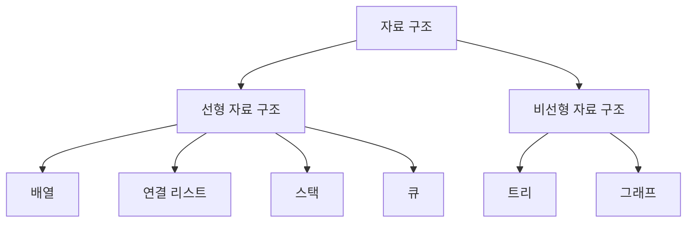
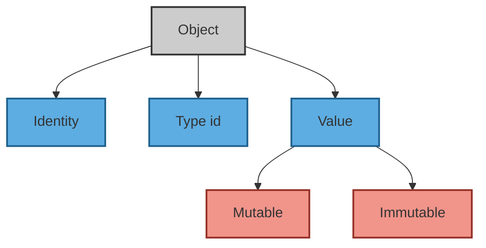

# 🧮 알고리즘 기초: 자료구조와 스택 (Day 24)

> 이 문서는 알고리즘 학습의 근간이 되는 **자료구조(Data Structure)**의 핵심 개념을 정리하고, 파이썬을 통해 이를 어떻게 구현하고 활용하는지 다루는 가이드입니다. 변수와 메모리 모델에 대한 이해부터 시작하여 리스트, 스택과 같은 기본 자료구조의 원리와 실제 문제 해결 적용 사례를 포괄적으로 설명합니다.

---

## 목차

1.  [**자료구조와 알고리즘: 기본 개념**](#1-자료구조와-알고리즘-기본-개념)
    -   [1.1. 알고리즘(Algorithm)이란?](#11-알고리즘algorithm이란)
    -   [1.2. 자료구조(Data Structure)란?](#12-자료구조data-structure란)
    -   [1.3. 추상 자료형(Abstract Data Type, ADT)](#13-추상-자료형abstract-data-type-adt)
    -   [1.4. 자료구조의 분류](#14-자료구조의-분류)
    -   [1.5. 알고리즘과 자료구조의 연결 이해](#15-알고리즘과-자료구조의-연결-이해)
2.  [**변수: C언어와 파이썬의 차이**](#2-변수-c언어와-파이썬의-차이)
    -   [2.1. C언어의 변수](#21-c언어의-변수)
    -   [2.2. 파이썬의 변수](#22-파이썬의-변수)
    -   [2.3. 파이썬의 객체 중심 데이터 표현](#23-파이썬의-객체-중심-데이터-표현)
3.  [**리스트: 파이썬의 동적 배열**](#3-리스트-파이썬의-동적-배열)
    -   [3.1. 배열의 특징](#31-배열의-특징)
    -   [3.2. 파이썬의 리스트](#32-파이썬의-리스트)
    -   [3.3. 리스트와 튜플의 차이점](#33-리스트와-튜플의-차이점)
4.  [**리스트의 연산과 문제 해결**](#4-리스트의-연산과-문제-해결)
    -   [4.1. 정수 배열에서 가장 큰 두 수를 찾기](#41-정수-배열에서-가장-큰-두-수를-찾기)
    -   [4.2. 회문(Palindromes) 찾기](#42-회문palindromes-찾기)
    -   [4.3. 0과 1로 구성된 배열을 정렬하기](#43-0과-1로-구성된-배열을-정렬하기)
    -   [4.4. 제시된 합을 가진 부분 배열 찾기](#44-제시된-합을-가진-부분-배열-찾기)
5.  [**스택 (Stack): LIFO 자료구조**](#5-스택stack-lifo-자료구조)
    -   [5.1. 스택의 주요 연산](#51-스택의-주요-연산)
    -   [5.2. 스택의 활용 예시](#52-스택의-활용-예시)
    -   [5.3. 스택의 시각적 구조](#53-스택의-시각적-구조)
    -   [5.4. 파이썬으로 구현하는 스택](#54-파이썬으로-구현하는-스택)
    -   [5.5. 스택의 장단점](#55-스택의-장단점)
    -   [5.6. 스택 사용 시 주의사항](#56-스택-사용-시-주의사항)

---

## 1. 자료구조의 정의

### 1.1. 알고리즘(Algorithm)이란?

`그 데이터로 어떤 문제를 어떻게 해결할 것인가?`

알고리즘은 **어떤 문제를 해결하기 위한 일련의 명확한 절차나 규칙의 집합**입니다. 알고리즘은 반드시 **유한한 시간 내에 종료**되어야 하며, **입력에 따라 정확한 출력을 도출**해야 합니다.

효율적인 알고리즘은 다음을 고려합니다:

-   **시간 복잡도 (Time Complexity)**: 얼마나 빠르게 실행되는가?
-   **공간 복잡도 (Space Complexity)**: 얼마나 적은 메모리를 사용하는가?

- 📌 알고리즘은 자료구조를 기반으로 동작하며, 자료구조 없이는 효율적인 알고리즘 구현이 어렵습니다.

```flowchart TD  
A[입력] --> B[절차/규칙 (연산들)] --> C[출력]  
```

---

### 1.2. 자료구조(Data Structure)란?

`데이터를 어떻게 담을 것인가?`

자료구조는 **데이터를 저장하고 조직화하는 방식**을 말합니다. 특정 연산(삽입, 삭제, 탐색 등)을 얼마나 **효율적으로 수행할 수 있는지**가 핵심입니다.

- 예: 정렬된 데이터가 필요하면 `배열`이, 삽입과 삭제가 잦으면 `연결 리스트`가, 데이터 관계를 표현하려면 `트리`나 `그래프`가 적합합니다.

자료구조는 보통 다음과 같은 연산을 지원합니다:
* 삽입 (Insert)
* 삭제 (Delete)
* 탐색 (Search)
* 순회 (Traversal)

---

### 1.3. 추상 자료형(Abstract Data Type, ADT)

ADT는 **데이터가 어떤 동작을 할 수 있는지(기능 중심)**만 정의하고, **그 구현 방법은 숨기는 개념**입니다. 즉, "무엇을 할 수 있는가"에만 집중하며 "어떻게 구현되었는가"는 감춥니다. ADT는 인터페이스, 자료구조는 그 구체적인 구현체라고 볼 수 있습니다.

| ADT 예시      | 설명                               |
| ----------- | -------------------------------- |
| 스택 (Stack)  | LIFO 방식, `push`, `pop` 연산        |
| 큐 (Queue)   | FIFO 방식, `enqueue`, `dequeue` 연산 |
| 리스트 (List)  | 순서 있는 요소의 집합                     |
| 트리 (Tree)   | 계층적 구조                           |
| 그래프 (Graph) | 노드와 간선으로 구성된 관계망                 |

이러한 ADT는 여러 가지 방법으로 구현할 수 있습니다. 예를 들어:

* 스택은 배열이나 연결 리스트로 구현 가능
* 큐는 순환 큐, 덱, 연결 리스트로 구현 가능

- ✅ ADT는 인터페이스, 자료구조는 구체적인 구현이라고 볼 수 있습니다.

---

### 1.4. 자료구조의 분류



#### 1) 선형 자료 구조 (Linear Data Structure)

* **배열(Array)**: 고정 크기의 연속된 메모리, 빠른 인덱스 접근
* **연결 리스트(Linked List)**: 노드 연결 기반, 동적 메모리 할당
* **스택(Stack)**: LIFO 구조, 함수 호출 및 실행 추적 등에 사용
* **큐(Queue)**: FIFO 구조, 작업 스케줄링 등에 사용

#### 2) 비선형 자료 구조 (Non-Linear Data Structure)

* **트리(Tree)**: 계층 구조 표현 (예: 폴더 구조, 이진 탐색 트리 등)
* **그래프(Graph)**: 객체 간의 복잡한 관계 표현 (예: 소셜 네트워크, 지도)

---

### 1.5. 알고리즘과 자료구조의 연결 이해


#### 1. 정렬 알고리즘과 자료구조의 연결

정렬 알고리즘은 데이터를 일정한 기준에 따라 순서대로 배열하는 과정이며, 사용되는 **자료구조에 따라 성능과 구현 방식이 달라집니다.**

| 정렬 알고리즘 | 특징               | 사용되는 자료구조   | 정렬 방식             | 시간 복잡도 (평균) |
| ------- | ---------------- | ----------- | ----------------- | ----------- |
| 선택 정렬   | 매번 가장 작은/큰 값을 선택 | 배열          | 제자리 정렬 (in-place) | O(n²)       |
| 삽입 정렬   | 앞에서부터 정렬된 부분에 삽입 | 배열/리스트      | 제자리               | O(n²)       |
| 버블 정렬   | 인접 요소를 반복 비교·교환  | 배열          | 제자리               | O(n²)       |
| 병합 정렬   | 반으로 나누고 정렬 후 병합  | 배열 / 연결 리스트 | 비제자리              | O(n log n)  |
| 퀵 정렬    | 피벗을 기준으로 분할      | 배열          | 제자리               | O(n log n)  |
| 힙 정렬    | 최대/최소 힙 이용       | 배열(힙)       | 제자리               | O(n log n)  |
| 기수 정렬   | 자릿수 기준으로 정렬      | 큐(버킷)       | 비제자리              | O(kn)       |

- ✅ **예시**: 연결 리스트는 병합 정렬에 적합하지만, 퀵 정렬은 랜덤 액세스가 필요한 배열에서 유리합니다.

---

#### 2. 자료구조 선택 기준

어떤 자료구조를 선택할지는 **다음의 기준**에 따라 결정됩니다:

| 기준             | 설명                     | 예시                         |
| -------------- | ---------------------- | -------------------------- |
| **데이터의 접근 방식** | 인덱스를 통해 직접 접근 vs 순차 접근 | 배열 vs 링크드 리스트              |
| **삽입/삭제 빈도**   | 자주 삽입/삭제되는가?           | 큐, 스택, 링크드 리스트             |
| **정렬 여부**      | 항상 정렬 상태를 유지해야 하는가?    | 힙, 이진 탐색 트리                |
| **탐색 속도**      | 빠른 탐색이 필요한가?           | 해시 테이블, BST                |
| **메모리 제약**     | 메모리를 얼마나 사용하는가?        | 배열은 연속 메모리 필요, 리스트는 포인터 포함 |

- 데이터 양이 많고 삽입/삭제가 자주 일어나면 `연결 리스트`,
 빠른 검색이 중요하면 `해시 테이블`이나 `BST`,
 정렬된 상태 유지가 필요하면 `힙` 또는 `트리`가 적합합니다.

---

#### 3. 시간 복잡도 & 공간 복잡도 예시

| 자료구조          | 접근       | 탐색                   | 삽입              | 삭제             | 공간 복잡도     |
| ------------- | -------- | -------------------- | --------------- | -------------- | ---------- |
| 배열            | O(1)     | O(n)                 | O(n)            | O(n)           | O(n)       |
| 연결 리스트        | O(n)     | O(n)                 | O(1) (head에 삽입) | O(1) (head 삭제) | O(n) + 포인터 |
| 스택 / 큐        | O(n)     | O(n)                 | O(1)            | O(1)           | O(n)       |
| 해시 테이블        | N/A      | O(1) (평균), O(n) (최악) | O(1)            | O(1)           | O(n)       |
| 힙             | O(log n) | O(n)                 | O(log n)        | O(log n)       | O(n)       |
| 이진 탐색 트리 (평균) | O(log n) | O(log n)             | O(log n)        | O(log n)       | O(n)       |
| 이진 탐색 트리 (최악) | O(n)     | O(n)                 | O(n)            | O(n)           | O(n)       |

- ✅ 해시 테이블은 탐색에 매우 강하지만 정렬에는 부적합
 ✅ 힙은 최대/최소값을 빠르게 얻을 수 있지만 전체 탐색은 느림

---

## 2. 변수: C언어와 파이썬의 차이 

### 2.1. C언어의 변수  
#### 변수와 메모리 주소
- C 언어에서 **변수를 선언하면**, 해당 변수는 **메모리 상의 고유한 주소**를 할당받습니다.
- 이후 **변수에 값을 할당하면**, 그 값은 할당된 메모리 주소에 저장됩니다.

#### 참조 연산자 (`&`)
- 참조 연산자 `&`는 **변수의 메모리 주소**를 반환합니다.


#### 포인터 (Pointer)
- 포인터는 다른 변수의 주소를 저장하는 변수입니다.
다시 말해, 포인터 자체도 메모리를 가지고 있으며, 그 메모리 공간에 다른 변수의 주소 값이 저장됩니다.
```c
#include <stdio.h>  
int main() {  
    int n = 300;  
    int* n_ptr = &n; // n의 메모리 주소를 n_ptr에 저장  
    int arr[] = {0, 1, 2};  
    char* s = "FA50";  
    return 0;  
}  
```

C 언어에서 자료형에 따라 값이 저장되는 영역이 다르다. 주로 다음 세 가지 영역이 있다.  

- Stack 영역 : 지역 변수를 저장하는 공간  
- Heap 영역 : 동적으로 할당된 변수를 저장하는 공간  
- Data 영역 : 전역 변수, 상수, 함수 코드 등이 저장되는 공간  

  

#### 변수의 메모리 주소와 저장 값
| 변수 이름 | 변수 타입 | 메모리 주소       | 저장 값  |
|-----------|------------|-------------------|-----------|
| `n`       | `int`      | `0xFFF000BBC`     | `300`     |
| `arr`     | `int[]`    | `0xFFF000BD4`     | 배열 시작 위치 |

#### 포인터 변수와 그 역할
| 포인터 이름 | 포인터 타입 | 가리키는 대상 | 대상 주소       | 포인터 자체 주소  |
|--------------|--------------|----------------|------------------|--------------------|
| `n_ptr`      | `int *`      | `n`            | `0xFFF000BBC`    | `0xFFF000BC0`      |
| `s`          | `char *`     | 문자열 또는 문자 배열 | `0x400594`       | `0xFFF000BC8`      |


메모리와 주소 개념은 C 언어의 강력한 기능 중 하나로, **직접적인 메모리 제어**를 가능하게 합니다.

- `n_ptr`은 변수 `n`의 주소를 저장하는 **포인터**입니다.
- `*n_ptr`를 통해 `n`의 값인 `300`을 참조할 수 있습니다.
- 포인터 변수는 **자체의 메모리 주소**도 가지며, 그 위치에 **다른 변수의 주소 값**을 저장합니다.
- `s`는 문자 배열의 시작 주소를 가리키며, 문자열 조작에 자주 사용됩니다.

---


### 2.2. 파이썬의 변수  

```python
n = 300  
n_ptr = n  
arr = [0, 1, 2]  
s = "FA50"  
```
파이썬에서는 모든 객체가 heap 공간에 저장되며, 변수는 객체를 가리킨다. 이는 C 언어와 파이썬의 큰 차이점이다. 즉, 파이썬의 변수는 객체를 참조하는 이름으로, C 언어의 포인터와는 다르게 동작한다.  

  

파이썬은 객체 지향 언어로, 모든 데이터는 객체로 취급된다. 파이썬에서 변수는 이러한 객체를 참조하는 이름일 뿐이다.  

예를 들어, `print(300)`이라는 명령은 다음과 같은 의미를 가진다.  

- 정수 객체를 만들고 300이라는 값을 부여한다.  
- 그리고 출력한다.  

```python
n = 300  
n_ptr = n  
``` 

- 값이 300인 정수 객체를 만들고 변수 `n`에 할당한다. → `n`은 값이 300인 정수 객체를 가리킨다.  
- `n`을 `n_ptr`에 할당한다. → `n_ptr`도 `n`이 가리키는 정수 객체를 가리킨다.  
- 따라서 `n`이나 `n_ptr` 모두 값 300을 참조할 수 있다.  

파이썬에서 변수를 객체에 붙이는 이름표라고 생각하는 것이 가장 쉽게 이해하는 방법이다.  

### 2.3. 파이썬의 객체 중심 데이터 표현

#### 2.3.1. 파이썬의 객체(Object)  
객체는 데이터를 추상화한 것으로 설명한다.  



모든 객체는 세 가지 속성을 가진다.  

- **아이덴티티(Identity)**: 객체를 고유하게 식별하는 값으로, 메모리 주소를 의미한다.  
- **유형(Type)**: 객체가 어떤 종류의 데이터를 가리키는지 나타내는 정보다.  
- **값(Value)**: 객체가 실제로 가지고 있는 데이터다.  

추상화는 프로그래밍에서 자료형을 정의할 때, 자료형에 사용할 수 있는 연산과 제약 조건만 보여주고 구현 세부 사항은 숨기는 것이다. 예를 들어, 스택 자료형을 정의할 때 푸시(push)와 팝(pop) 등의 연산만을 제공하고, 실제로 이 연산이 어떻게 구현되는지는 숨기는 것이다.  

#### 2.3.2. 파이썬의 자료형  

- **숫자형 객체**: 정수 · 실수 · 불(bool) 등. 한 번 만들어지면 변경되지 않는 불변형(immutable)이다.  
- **시퀀스형 객체**: 유한한 길이를 가지며 순서가 있는 집단. 인덱스를 통해 각 원소에 접근할 수 있다.  
  - 불변형: 문자열 · 튜플 등. 인덱싱은 가능하지만, 값을 변경할 수 없다.  
  - 가변형: 리스트 등. 인덱싱과 값의 변경이 가능하다.  
- **집합형 객체**: 집합(set). 중복이 없으며, 불변형 객체로 이루어진 집단이다. 순서가 없으며 크기를 변경할 수 있다.  
- **맵핑형 객체**: 사전(dict). 키(key)와 값(value) 쌍으로 구성되며, 키로 값을 조회하고 변경할 수 있다.  

위 자료형 중 문자열, 튜플, 리스트, 사전은 **이터러블(iterable)**이라 불리며, 이는 각 원소를 한 번에 하나씩 반환할 수 있는 객체를 의미한다.  

- **리스트 · 튜플 · 문자열**: 시퀀스이자 이터러블이다.  
- **사전**: 사전은 키에 대한 순서가 없으므로 이터러블이지만 시퀀스는 아니다.  

+ **인덱싱(Indexing)**  
: 자료 구조에서 특정 원소에 접근하는 방법  

+ **시퀀스(Sequence)**  
: 리스트, 튜플, 문자열처럼 각 원소의 순서가 정해진 객체  

+ **이터러블(Iterable)**  
: 반복 가능한 객체로, 한 번에 하나씩 원소를 반환할 수 있다.  

---

## 3. 리스트: 파이썬의 동적 배열
 `파이썬은 리스트가 배열(array)을 대신한다.`

 C 언어로 정수(int)형 배열을 만들고 실행한 것이다. 그림을 보면 정수가 연속된 메모리 주소에 저장되어 있다. C 언어에서 정수형은 4바이트(byte)를 차지하기 때문에, 배열의 각 원소가 저장된 메모리 주소의 간격이 4바이트다.

 

 문자형(char) 배열을 만든 경우다. 문자형은 1바이트를 차지하므로, 각 원소의 메모리 주소 간격이 1바이트로 일정하다.


#### 3.1. 배열의 특징

배열은 같은 자료형을 연속한 메모리에 저장하므로, 각 자료형이 차지하는 공간만큼의 메모리를 더하는 방식으로 임의의 원소에 빠르게 접근할 수 있다. 배열의 주요 특징은 다음과 같다.

- 임의 접근 가능: 배열의 인덱스를 통해 원하는 원소에 즉시 접근할 수 있다.
- 수정 시 비효율성: 원소를 추가하거나 삭제할 때 전체 배열 구조를 변경해야 하므로 시간이 많이 소요된다.
- 다양한 용도: 배열은 스택 · 큐 · 힙 · 해시 테이블 · 행렬 등 다양한 자료 구조의 기본으로 사용된다.
- 정렬 알고리즘의 기초: 배열은 정렬 알고리즘을 구현할 때 자주 사용된다.

배열과 관련된 용어를 그림으로 그려보면 다음과 같다.


#### 3.2. 파이썬의 리스트

파이썬에서는 리스트를 배열처럼 사용할 수 있다. 하지만 리스트는 배열과 달리 크기가 가변적이고, 다양한 자료형을 저장할 수 있는 특징이 있다.

- 리스트는 연속된 메모리에 **객체(objects)의 주소를 저장**한다. (파이썬의 모든 것은 객체다.)
- 같은 자료형뿐만 아니라, **다양한 자료(객체)를 저장**할 수 있다.
- 배열처럼 인덱스를 이용해 각 객체에 접근할 수 있으며, 슬라이싱(slicing) 기능도 제공한다.


리스트 `arr = [1, “a”, ("가", "나")]`의 구조를 보면 다양한 자료형의 객체들이 저장되어 있다. 각 객체는 메모리에 독립적으로 저장되지만, 리스트는 이러한 객체들을 참조함으로써 배열처럼 인덱스를 통해 각 원소에 접근할 수 있다.

문자, 정수, 실수와 같은 단일 자료형만 사용한다면, `array` 모듈의 `array` 클래스를 사용할 수 있다. 기본적인 사용법은 리스트와 유사하다.

#### 3.3. 리스트와 튜플의 차이점


| 구분 | 리스트 (`list`) | 튜플 (`tuple`) |
| :--- | :--- | :--- |
| **가변성** | 가변(Mutable) | 불변(Immutable) |
| **용도** | 동질적인 데이터의 시퀀스 (수정 가능) | 이질적인 데이터의 묶음 (수정 불가) |
| **성능** | 튜플보다 약간 느리고 메모리 사용량 많음 | 리스트보다 빠르고 메모리 효율적 |

---

## 4. 리스트의 연산과 문제 해결

### 4.1. 정수 배열에서 가장 큰 두 수를 찾기

>정수로 이루어진 배열이 주어질 때, 가장 큰 두 수를 찾아 [가장 큰 값, 둘째로 큰 값]을 반환하는 함수를 완성하라.
>입력: [3, -1, 5, 0, 7, 4, 9, 1], 출력: [9, 7]
>입력: [7], 출력: [7]

가장 쉽게 생각할 수 있는 방법은 배열을 내림차순으로 정렬한 후 앞에서 두 개의 값을 가져오는 것이다. 그러나 여기서는 배열을 순회하면서 직접 비교해 값을 찾는 방식으로 구현한다.

- 배열의 첫 번째와 두 번째 원소를 각각 `max1`, `max2`에 대입한다.
- 만약 `max2`가 `max1`보다 크다면 두 값을 교환한다.
- 세 번째 원소부터 마지막 원소까지 차례대로 `max1`, `max2`와 비교한다.
    - 비교하는 원소가 `max1`보다 크면 `max1`에 그 원소를 대입하고, `max1` 값을 `max2`에 대입한다.
    - 그렇지 않고, 그 원소가 `max2`보다 크면 `max2`에 대입한다.

```python
def find_max_two(arr: list[int]) -> list[int]:
    """정수 리스트에서 가장 큰 값 두 개를 찾아서 리스트로 반환한다.
    Arguments:
        arr (list): 정수 리스트
    Return:
        list: [가장 큰 값, 둘째로 큰 값]
    """
    if len(arr) < 2:
        return arr
    max1, max2 = arr[:2]
    if max2 > max1:
        max1, max2 = max2, max1
    for n in arr[2:]:
        if n > max1:
            max1, max2 = n, max1
        elif n > max2:
            max2 = n
    return [max1, max2]


# Test code
arr = [[3, -1, 5, 0, 7, 4, 9, 1], [7]]
for a in arr:
    print(f"{a}에서 가장 큰 두 값: {find_max_two(a)}")
```
실행 결과
```
[3, -1, 5, 0, 7, 4, 9, 1]에서 가장 큰 두 값: [9, 7]
[7]에서 가장 큰 두 값: [7]
```
이 코드는 배열이 길이가 1인 경우를 고려하여, 배열을 그대로 반환하는 조건문을 추가했다. 그 외의 경우에는 배열을 순회하며 가장 큰 두 값을 찾는다.

### 4.2. 회문(Palindromes) 찾기
> 주어진 문자열이 회문이면 True, 회문이 아니면 False를 반환하라.
> 입력: madam, 출력: True
> 입력: tomato, 출력: False 

"오디오, 기러기, 오레오" 같은 앞으로 읽어도, 뒤로 읽어도 같은 단어(회문)인지 검사하는 함수를 만들자.

#### 4.2.1. 문자열의 슬라이싱을 이용하기

문자열(string)은 문자의 배열로, 그 안의 개별 문자를 수정할 수는 없지만 리스트처럼 인덱싱과 슬라이싱을 할 수 있다. 문자열 슬라이싱 기능을 사용해 회문인지 간단하게 검사할 수 있다.

```python
word = "racecar"
if word == word[::-1]:
    print(True)
else:
    print(False)
```

#### 4.2.2. 두 포인터(Two Pointers)를 이용한 방법

배열이나 문자열에서 두 개의 포인터를 사용하는 방법을 많이 사용한다. 여기서도 두 개의 포인터를 활용하여 회문을 검사하는 방법을 구현해본다.

아래 그림처럼 **두 포인터**를 문자열의 양쪽 끝에서 시작하여, 가운데로 이동하면서 문자를 비교한다. 두 문자가 다르면 그 문자열은 회문이 아니다. 만약 포인터들이 서로 교차하거나 같은 위치에 도달하면 회문이다.


- 왼쪽 포인터는 문자열의 첫 번째 인덱스(`0`)에, 오른쪽 포인터는 마지막 인덱스에 위치한다.
- 왼쪽 포인터가 오른쪽 포인터보다 작을 동안, 두 포인터가 가리키는 문자를 비교한다.
  - 만약 두 문자가 다르면 `False`를 반환한다.
- 반복문을 끝까지 통과하면 `True`를 반환한다.

```python
def is_palindrome(word: str) -> bool:
    """문자열 word가 회문(palindrome)인지 검사한다.
    Arguments:
        word (str): 회문인지 검사할 문자열
    Return:
        bool: 회문이면 True, 그렇지 않으면 False를 반환
    """
    left: int = 0
    right: int = len(word)-1
    while left < right:
        if word[left] != word[right]:
            return False
        left, right = left + 1, right - 1
    return True


# Test code
words = ["racecar", "rotor", "tomato", "별똥별", "코끼리"]
for word in words:
    print(f"Is '{word}' palindrome?  {is_palindrome(word)}")
```

실행 결과
```
Is 'racecar' palindrome?  True
Is 'rotor' palindrome?  True
Is 'tomato' palindrome?  False
Is '별똥별' palindrome?  True
Is '코끼리' palindrome?  False
```

### 4.3. 0과 1로 구성된 배열을 정렬하기

> 0과 1로 이루어진 배열이 있다. 배열 자체를 오름차순으로 정렬하라.
>입력: [1, 0, 1, 1, 1, 1, 1, 0, 0, 0], 출력: [0, 0, 0, 0, 1, 1, 1, 1, 1, 1]
>입력: [1, 1], 출력: [1, 1]

#### 4.3.1. count 메서드 이용하기

- 0과 1만 있으므로, count() 메서드를 이용하여 0과 1의 개수를 센다.
- 해당 개수만큼 0과 1을 채운다.

```python
def  bin_array_sort(arr: list[int]) -> None:  
    arr[:] = [0] * arr.count(0) + [1] * arr.count(1)  


# Test code 
for arr in ([1, 0, 1, 1, 1, 1, 1, 0, 0, 0], [1, 1]):  
    bin_array_sort(arr)  
    print(arr)
```

실행 결과
```
[0, 0, 0, 0, 1, 1, 1, 1, 1, 1]
[1, 1]
```
위와 같이 코드를 짤 때 주의할 점은, 배열 자체를 정렬하라고 했기 때문에 슬라이싱을 이용하여 원래 배열의 값을 바꿔야 한다는 것이다.

> arr[:] = ...

#### 4.3.2. 포인터 두 개를 이용하기
0을 앞쪽에 놓고 1을 뒤쪽에 배치하면 되므로, 앞쪽에 있는 1과 뒤쪽에 있는 0을 찾아 서로 교환한다. 즉, 왼쪽 포인터는 오른쪽으로 이동하면서 1을 찾고, 오른쪽 포인터는 왼쪽으로 이동하면서 0을 찾는다. 각각 1과 0을 찾았고, 두 포인터가 서로 교차하지 않았다면 1과 0을 서로 교환한다.


```python
def bin_array_sort(arr: list[int]) -> None:
    """0과 1로 이루어진 배열 arr를 오름차순으로 정렬한다.
    Arguments:
        arr (list[int]): 0과 1로 이루어진 배열
    Return:
        None: 배열 arr 자체를 정렬한다.
    """
    left: int = 0
    right: int = len(arr) - 1
    while left < right:
        while left < len(arr) and arr[left] == 0:
            left += 1
        while right >= 0 and arr[right] == 1:
            right -= 1
        if left < right:
            arr[left], arr[right] = 0, 1
            left, right = left + 1, right - 1


# Test code 
for arr in ([1, 0, 1, 1, 1, 1, 1, 0, 0, 0], [1, 1]):  
    bin_array_sort(arr)  
    print(arr)
```

실행 결과
```
[0, 0, 0, 0, 1, 1, 1, 1, 1, 1]
[1, 1]
```

### 4.4. 제시된 합을 가진 부분 배열 찾기 

> 정렬되지 않은 양의 정수로 이루어진 배열 A가 있다. 연속된 원소를 더한 값이 제시된 값 S와 같은 부분 배열을 찾아라. (인덱스 기준은 1이다.)
> 입력: arr = [1, 2, 3, 7, 5], s = 12, 출력: [2, 4]
>    인덱스 2부터 4까지의 합: 2 + 3 + 7 = 12
> 입력: arr = [1, 2, 3, 4, 5, 6, 7, 8, 9, 10], s = 15, 출력: [1, 5] 

#### 4.4.1. 이중 반복문으로 풀기

- i는 인덱스 0부터 마지막 인덱스까지 반복한다.
  - 부분 배열의 합을 0으로 초기화한다.
  - j는 i부터 마지막 인덱스까지 반복한다.
    - 배열의 값을 더한다.
    - 누적한 값이 제시된 값과 같으면 인덱스를 반환한다.
- 반복문을 빠져나오면 답이 없으므로 -1을 반환한다.

```python
def find_sub_array(arr: list[int], s: int) -> list[int]:
    """배열 arr에서 연속한 원소의 합이 s인 부분 배열의 인덱스를 구한다.
    Arguments:
        arr (list[int]): 양의 정수
        s: 부분 배열의 합
    Return:
        list[int]: 부분 배열의 인덱스, 조건을 만족하는 부분 배열이 없으면 [-1]
     """
    for i in range(len(arr)):
        sub_total: int = 0
        for j in range(i, len(arr)):
            sub_total += arr[j]
            if sub_total == s:
                return [i+1, j+1]
    return [-1]


# Test code
sample1 = ([1, 2, 3, 7, 5], 12)
sample2 = ([1, 2, 3, 4, 5, 6, 7, 8, 9, 10], 15)
for arr, s in (sample1, sample2):
    print(find_sub_array(arr, s))
```

실행 결과
```
[2, 4]
[1, 5]
```

#### 4.4.2. 포인터 두 개를 이용하기

이중 반복문을 사용하지 않고 문제를 해결하려면, 두 개의 포인터를 사용하는 방법을 떠올릴 수 있다. 
두 포인터를 사용하면 배열을 한 번만 순회하면서 필요한 조건을 만족할 수 있기 때문에, 시간 복잡도가 더 효율적인 O(n)으로 줄어든다.

아래 그림은 예시로 주어진 값에서 합이 12인 부분 배열을 찾는 과정을 설명하고 있다.


  
- 왼쪽 포인터와 오른쪽 포인터를 설정한다.
- 오른쪽 포인터를 오른쪽으로 이동시키며, 해당 위치의 배열 원소를 더한다.
- 더한 값이 S보다 작으면, 오른쪽 포인터를 증가시키고 계속 값을 더한다.
- 더한 값이 S보다 크면, S와 같거나 작아질 때까지 왼쪽 포인터가 가리키는 값을 뺀다.
- 더한 값이 S와 같으면 [왼쪽 포인터 + 1, 오른쪽 포인터 + 1]을 반환한다.
- 배열의 끝까지 갔는데도 S와 같은 값이 없으면 [-1]을 반환한다.

```python
def find_sub_array(arr: list[int], s: int) -> list[int]:
    """배열 arr에서 연속한 원소의 합이 s인 부분 배열의 인덱스를 구한다.
    Arguments:
        arr (list[int]): 양의 정수
        s: 부분 배열의 합
    Return:
        list[int]: 부분 배열의 인덱스, 조건을 만족하는 부분 배열이 없으면 [-1]
     """
    left: int = 0
    sub_total: int = 0
    for right in range(len(arr)):
        sub_total += arr[right]
        while left < right and sub_total > s:
            sub_total -= arr[left]
            left += 1
        if sub_total == s:
            return [left+1, right+1]
    return [-1]


# Test code
sample1 = ([1, 2, 3, 7, 5], 12)
sample2 = ([1, 2, 3, 4, 5, 6, 7, 8, 9, 10], 15)
sample3 = ([1, 2, 3, 4], 0)
for arr, s in (sample1, sample2, sample3):
    print(find_sub_array(arr, s))
```

실행 결과
```
[2, 4]
[1, 5]
[-1]
```
---

## 5. 스택(`Stack`): LIFO 자료구조

스택은 데이터를 일시적으로 저장할 때 사용하는 선형 자료 구조로, **후입선출(Last-In, First-Out, LIFO)**의 특징을 가진다. 즉, 가장 나중에 삽입된 데이터가 가장 먼저 삭제된다. 스택은 한 쪽 끝에서만 데이터를 추가(push)하거나 삭제(pop)할 수 있다.

---

### 5.1. 스택의 주요 연산

| 연산           | 설명                              | 시간 복잡도 |
| ------------ | ------------------------------- | ------ |
| `push(item)` | 스택의 맨 위에 데이터를 추가합니다.            | O(1)   |
| `pop()`      | 스택의 맨 위에 있는 데이터를 삭제하고 반환합니다.    | O(1)   |
| `peek()`     | 스택의 맨 위에 있는 데이터를 삭제하지 않고 반환합니다. | O(1)   |
| `is_empty()` | 스택이 비어 있는지 확인합니다.               | O(1)   |
| `size()`     | 스택에 저장된 데이터의 개수를 반환합니다.         | O(1)   |

---

### 5.2. 스택의 활용 예시

| 분야       | 활용 예시                              |
| -------- | ---------------------------------- |
| 컴퓨터 시스템  | 함수 호출 시 스택 프레임에 정보 저장 (Call Stack) |
| 브라우저     | 뒤로 가기 / 앞으로 가기 기능                  |
| 알고리즘     | 괄호 짝 검사, DFS(깊이 우선 탐색)             |
| 계산기      | 후위 표기법 연산 처리(Postfix 계산)           |
| 프로그래밍 언어 | 실행 컨텍스트 관리, 인터프리터 구현               |

---

### 5.3. 스택의 시각적 구조

```
Top →   [ C ]   ← Pop (출력)
        [ B ]
        [ A ]
Bottom
```
```
Push 'A' → ['A']
Push 'B' → ['A', 'B']
Push 'C' → ['A', 'B', 'C']
Pop        → ['A', 'B']  (꺼낸 값: 'C')
Peek       → 'B' (현재 Top 값)
```

---

### 5.4. 파이썬으로 구현하는 스택

#### 1. 리스트를 이용한 스택 구현

```python
# 리스트를 이용한 스택 구현
stack = []

# 데이터 추가 (push)
stack.append(1)
stack.append(2)
stack.append(3)
print("스택 상태:", stack)  # [1, 2, 3]

# 데이터 삭제 (pop)
top = stack.pop()
print("pop된 값:", top)    # 3
print("스택 상태:", stack)  # [1, 2]
```

#### 2. 클래스 기반 스택 구현

```python
class Stack:
    def __init__(self):
        self.items = []

    def is_empty(self):
        return len(self.items) == 0

    def push(self, item):
        self.items.append(item)

    def pop(self):
        if self.is_empty():
            raise IndexError("스택이 비어 있습니다.")
        return self.items.pop()

    def peek(self):
        if self.is_empty():
            raise IndexError("스택이 비어 있습니다.")
        return self.items[-1]

    def size(self):
        return len(self.items)

# 사용 예시
s = Stack()
s.push(10)
s.push(20)
print(s.pop())   # 20
print(s.peek())  # 10
print(s.size())  # 1
```
---

### 5.5. 스택의 장단점
- **장점**
**구현이 간단**: 배열이나 연결 리스트를 이용하여 쉽게 구현할 수 있습니다.
**빠른 데이터 처리**: 데이터의 추가와 삭제가 O(1)의 시간 복잡도로 처리됩니다.
**메모리 효율성**: 불필요한 메모리 할당 없이 데이터를 처리할 수 있습니다.

- **단점**
**중간 데이터 접근 불가**: 스택은 후입선출 방식이므로 중간에 있는 데이터에 직접 접근할 수 없습니다.
**메모리 제한**: 스택의 크기가 제한되어 있어, 너무 많은 데이터를 저장하면 스택 오버플로우가 발생할 수 있습니다.

---

###  5.6. 스택 사용 시 주의사항

#### ❗ 스택 오버플로우(Stack Overflow)

* 재귀 함수가 너무 깊어지거나 스택에 데이터가 계속 쌓이면 **메모리 초과**로 오류 발생
* 파이썬에서 `RecursionError: maximum recursion depth exceeded` 가 대표적

#### ✅ 종료 조건 필요성 (재귀와 연결)

```python
def infinite():
    infinite()

infinite()  # RecursionError 발생
```

* 재귀 호출은 내부적으로 **스택**에 함수 호출 정보를 저장하므로, 스택이 넘치지 않도록 **종료 조건**을 설정해야 합니다.

---
[⏮️ Python 문서](../../01_Python/01_organize/0423_Python정리.md) | [ CleanCode 문서](../../03_Dev/03_CleanCode/01_organize/0523_CleanCode정리.md) | [다음 문서 ⏭️](./0604_Algorithm정리.md)