# 📊 머신러닝 모델 최적화: 하이퍼파라미터 튜닝과 Pipeline 활용 전략

> 본 문서는 머신러닝 모델의 성능을 극대화하기 위한 하이퍼파라미터 최적화 기법들을 심층적으로 다룹니다. 전통적인 Grid Search부터 효율적인 Bayesian Optimization(Optuna)까지 다양한 방법론을 비교 분석하고, Scikit-learn Pipeline을 활용하여 전처리 및 모델링 과정을 통합하는 실전 전략을 제시합니다. 각 기법의 장단점, 실습 예제, 그리고 실무 적용 가이드를 통해 모델 개발의 효율성과 신뢰성을 높이는 데 기여합니다.

---

## 목차

1.  [하이퍼파라미터 최적화 개론](#1-하이퍼파라미터-최적화-개론)
    *   [1.1 하이퍼파라미터란?](#11-하이퍼파라미터란)
    *   [1.2 하이퍼파라미터 최적화의 중요성](#12-하이퍼파라미터-최적화의-중요성)
    *   [1.3 주요 최적화 방법론](#13-주요-최적화-방법론)
2.  [Optuna 베이지안 최적화](#2-optuna-베이지안-최적화)
    *   [2.1 Optuna 개요](#21-optuna-개요)
    *   [2.2 실습: 유방암 데이터 분류 최적화 (RandomForest)](#22-실습-유방암-데이터-분류-최적화-randomforest)
3.  [Scikit-learn Pipeline 활용](#3-scikit-learn-pipeline-활용)
    *   [3.1 Pipeline 기초 개념](#31-pipeline-기초-개념)
    *   [3.2 실습: Iris 다중분류 Pipeline](#32-실습-iris-다중분류-pipeline)
    *   [3.3 Pipeline + GridSearchCV 통합](#33-pipeline--gridsearchcv-통합)
    *   [3.4 Pipeline + Optuna 통합](#34-pipeline--optuna-통합)
4.  [GridSearchCV vs Optuna 비교](#4-gridsearchcv-vs-optuna-비교)
    *   [4.1 종합 성능 비교](#41-종합-성능-비교)
    *   [4.2 방법론별 장단점 분석](#42-방법론별-장단점-분석)
    *   [4.3 실무 적용 가이드](#43-실무-적용-가이드)
5.  [실무 적용 전략](#5-실무-적용-전략)
    *   [5.1 프로젝트 단계별 가이드](#51-프로젝트-단계별-가이드)
    *   [5.2 하이퍼파라미터 선택 전략](#52-하이퍼파라미터-선택-전략)
    *   [5.3 성능 평가 및 해석](#53-성능-평가-및-해석)
6.  [종합 정리 및 결론](#6-종합-정리-및-결론)
    *   [6.1 핵심 학습 내용 요약](#61-핵심-학습-내용-요약)
    *   [6.2 실무 적용 Best Practices](#62-실무-적용-best-practices)
    *   [6.3 향후 학습 방향](#63-향후-학습-방향)

---

## 1. 하이퍼파라미터 최적화 개론

### 1.1 하이퍼파라미터란?

> **하이퍼파라미터(Hyperparameter)**: 머신러닝 모델의 학습 과정 전에 사용자가 직접 설정해야 하는 매개변수입니다. 모델이 데이터로부터 자동으로 학습하는 파라미터(예: 선형 회귀의 가중치, 신경망의 가중치)와는 구별됩니다.

#### 모델 파라미터 vs 하이퍼파라미터

| 구분 | 모델 파라미터 | 하이퍼파라미터 |
|:---|:---|:---|
| **정의** | 데이터로부터 학습되는 값 (예: 선형 회귀의 계수, 신경망의 가중치 및 편향) | 모델 학습 전에 사용자가 설정하는 값 (예: 학습률, 트리의 깊이, 정규화 강도, 클러스터 개수) |
| **결정 방법** | 알고리즘이 훈련 데이터를 통해 자동 학습 | 사람이 직접 설정하거나, 하이퍼파라미터 최적화 기법을 통해 탐색하여 결정 |
| **영향** | 모델의 예측 성능에 직접적인 영향 | 학습 과정과 최종 모델의 성능 및 일반화 능력에 큰 영향 |

### 1.2 하이퍼파라미터 최적화의 중요성

하이퍼파라미터 최적화는 머신러닝 모델 개발 과정에서 매우 중요한 단계입니다. 적절한 하이퍼파라미터 설정은 모델의 성능을 극대화하고, 실제 환경에서의 적용 가능성을 높이는 데 결정적인 역할을 합니다.

#### 핵심 최적화 목표

-   **성능 향상**: 모델의 예측 정확도, 정밀도, 재현율 등 핵심 성능 지표를 개선하여 문제 해결 능력을 높입니다.
-   **과적합 방지**: 모델이 훈련 데이터에만 과도하게 맞춰지는 과적합(Overfitting)을 방지하고, 새로운 데이터에 대한 일반화 성능(Generalization Performance)을 확보합니다.
-   **효율성 증대**: 불필요한 계산 복잡도를 줄이고, 모델 학습 시간과 자원(CPU/GPU, 메모리) 사용을 최적화하여 개발 및 운영 효율성을 높입니다.

#### 주의: 최적화 실패 시 문제점

-   **과적합(Overfitting)**: 모델이 훈련 데이터의 노이즈까지 학습하여 훈련 성능은 높지만, 실제 데이터에 대한 예측 성능이 현저히 떨어집니다.
-   **과소적합(Underfitting)**: 모델이 데이터를 충분히 학습하지 못하여 훈련 데이터와 테스트 데이터 모두에서 낮은 성능을 보입니다. 이는 모델의 복잡도가 너무 낮거나, 학습이 불충분할 때 발생합니다.
-   **자원 낭비**: 비효율적인 하이퍼파라미터 탐색은 불필요한 계산 시간과 자원 소모를 야기하여 개발 비용을 증가시킵니다.

### 1.3 주요 최적화 방법론

하이퍼파라미터를 최적화하는 방법은 크게 전통적인 방법과 현대적인 방법으로 나눌 수 있습니다.

#### 전통적 방법

1.  **Manual Search (수동 탐색)**:
    -   **설명**: 데이터 과학자의 경험과 직관에 의존하여 하이퍼파라미터 값을 수동으로 변경하며 모델 성능을 확인하는 방법입니다.
    -   **장점**: 특정 도메인 지식이 풍부할 때 빠르게 좋은 결과를 얻을 수도 있습니다.
    -   **단점**: 매우 시간 소모적이고 비효율적이며, 최적의 조합을 찾기 어렵습니다. 재현성이 낮습니다.

2.  **Grid Search (격자 탐색)**:
    -   **설명**: 사용자가 지정한 하이퍼파라미터 값들의 모든 가능한 조합에 대해 모델을 학습하고 교차 검증을 통해 최적의 조합을 찾는 방법입니다.
    -   **장점**: 모든 조합을 체계적으로 탐색하므로, 주어진 탐색 공간 내에서는 최적의 조합을 확실히 찾을 수 있습니다.
    -   **단점**: 하이퍼파라미터의 개수나 각 파라미터의 후보 값 수가 증가할수록 탐색해야 할 조합의 수가 기하급수적으로 늘어나 계산 시간(시간 복잡도)이 매우 높아집니다. 이를 **조합 폭발(Combinatorial Explosion)** 문제라고 합니다.

3.  **Random Search (무작위 탐색)**:
    -   **설명**: 하이퍼파라미터 공간에서 무작위로 조합을 선택하여 탐색하는 방법입니다. `Grid Search`와 달리 모든 조합을 탐색하지 않고, 지정된 횟수(`n_iter`)만큼만 샘플링하여 평가합니다.
    -   **장점**: `Grid Search`보다 효율적으로 넓은 탐색 공간을 탐색할 수 있습니다. 특히 중요한 하이퍼파라미터가 소수일 때 효과적입니다.
    -   **단점**: 무작위 탐색이므로 `Grid Search`처럼 최적의 조합을 보장하지는 않습니다.

#### 현대적 방법

1.  **Bayesian Optimization (베이지안 최적화)**:
    -   **설명**: 이전 시도에서 얻은 하이퍼파라미터 조합과 그 성능 정보를 바탕으로, 다음으로 시도할 최적의 하이퍼파라미터 조합을 지능적으로 예측하여 탐색하는 방법입니다. `획득 함수(Acquisition Function)`를 사용하여 다음 탐색 지점을 결정합니다.
    -   **장점**: `Grid Search`나 `Random Search`보다 훨씬 효율적으로 최적의 하이퍼파라미터를 찾을 수 있습니다. 특히 모델 학습 시간이 오래 걸리는 경우에 큰 이점을 가집니다.
    -   **라이브러리**: Optuna, Hyperopt, Scikit-optimize 등

2.  **Evolutionary Algorithms (진화 알고리즘)**:
    -   **설명**: 자연 선택과 유전의 원리를 모방하여 하이퍼파라미터 조합을 최적화하는 방법입니다. 여러 세대의 하이퍼파라미터 조합을 생성하고, 성능이 좋은 조합을 선택하여 다음 세대로 전달하는 방식으로 탐색합니다.
    -   **장점**: 복잡한 탐색 공간에서도 전역 최적해(Global Optima)를 찾을 가능성이 높습니다.
    -   **라이브러리**: DEAP, TPOT 등

---

## 2. Optuna 베이지안 최적화

Optuna는 하이퍼파라미터 최적화를 위한 파이썬 라이브러리로, 특히 베이지안 최적화 기법을 효율적으로 구현합니다. 이전 시도 결과를 바탕으로 다음 탐색할 하이퍼파라미터 조합을 지능적으로 선택하여 최적화 과정을 가속화합니다.

### 2.1 Optuna 개요

#### 핵심 Optuna의 특징

-   **베이지안 최적화**: 이전 시도에서 얻은 목적 함수 값(모델 성능)을 바탕으로 다음 탐색할 하이퍼파라미터 조합을 지능적으로 제안합니다. 이는 무작위 탐색보다 훨씬 효율적으로 최적해를 찾아냅니다.
-   **TPE (Tree-structured Parzen Estimator) 알고리즘**: Optuna의 기본 샘플링 알고리즘으로, 비선형적이고 복잡한 하이퍼파라미터 공간에서도 효율적인 탐색을 가능하게 합니다.
-   **Pruning (조기 종료) 지원**: 학습 과정에서 성능이 좋지 않은 시도(Trial)를 조기에 중단하여 불필요한 계산 자원 낭비를 줄입니다. 이는 특히 딥러닝 모델과 같이 학습 시간이 긴 경우에 매우 유용합니다.
-   **다양한 분포 지원**: `trial.suggest_int()`, `trial.suggest_float()`, `trial.suggest_categorical()` 등을 통해 정수형, 실수형, 범주형 등 다양한 타입의 하이퍼파라미터를 유연하게 탐색할 수 있습니다.
-   **병렬 처리**: `n_jobs` 매개변수를 통해 여러 CPU 코어를 활용하여 병렬적으로 최적화를 수행할 수 있습니다.

#### 구조: Optuna의 핵심 구성요소

Optuna를 사용한 하이퍼파라미터 최적화는 주로 `Study`와 `Trial`이라는 두 가지 핵심 개념을 중심으로 이루어집니다.

-   **`Study`**: 전체 최적화 실험을 관리하는 객체입니다. 최적화 방향(최대화 또는 최소화)을 설정하고, 모든 `Trial`의 결과를 기록하며, 최종 최적의 하이퍼파라미터와 성능을 저장합니다.
    ```python
     study = optuna.create_study(direction="maximize") # 목적 함수 값을 최대화하는 방향으로 최적화
    ```
-   **`Trial`**: `Study` 내에서 수행되는 개별적인 하이퍼파라미터 조합에 대한 시도(실험)를 의미합니다. 각 `Trial`은 `trial.suggest_` 메서드를 통해 하이퍼파라미터 값을 제안받고, 이 값들로 모델을 학습 및 평가한 후 그 결과를 `Study`에 반환합니다.
    ```python
     def objective(trial):
         # 하이퍼파라미터 제안 (예시)
         param = trial.suggest_int('param', 1, 100)
         # 모델 학습 및 평가 로직
         score = ... # 모델의 성능 지표
         return score
    ```
-   **최적화 실행**: `study.optimize()` 메서드를 호출하여 지정된 횟수(`n_trials`)만큼 `Trial`을 반복 실행하며 최적의 하이퍼파라미터 조합을 찾아냅니다.
    ```python
     study.optimize(objective, n_trials=100) # objective 함수를 100번 실행하여 최적화
    ```

### 2.2 실습: 유방암 데이터 분류 최적화 (RandomForest)

유방암 데이터셋을 사용하여 RandomForest 분류 모델의 하이퍼파라미터를 Optuna로 최적화하는 실습 예제입니다. 이 과정을 통해 Optuna의 사용법과 베이지안 최적화의 효율성을 이해할 수 있습니다.

#### 참고: 데이터셋 특성

-   **데이터셋**: Scikit-learn의 `load_breast_cancer` 데이터셋
-   **목적**: 유방암 진단 (악성/양성) 이진 분류
-   **샘플 수**: 569개
-   **특성 수**: 30개 (세포핵 측정값)
-   **클래스 분포**: 양성(Benign) 62.7%, 악성(Malignant) 37.3%

#### 탐색적 데이터 분석 (EDA) 및 전처리

```python
import pandas as pd
import numpy as np
from sklearn.datasets import load_breast_cancer
from sklearn.model_selection import train_test_split
from sklearn.preprocessing import StandardScaler

# 데이터 로드
cancer = load_breast_cancer()
X, y = cancer.data, cancer.target

# 클래스 분포 확인
class_distribution = np.bincount(y)
total_samples = len(y)
ratio_benign = (class_distribution[0] / total_samples) * 100
ratio_malignant = (class_distribution[1] / total_samples) * 100
imbalance_ratio = class_distribution[0] / class_distribution[1]

print("--- 데이터셋 클래스 분포 ---")
print(f"   양성 (Benign, 0): {class_distribution[0]}개 ({ratio_benign:.1f}%)")
print(f"   악성 (Malignant, 1): {class_distribution[1]}개 ({ratio_malignant:.1f}%)")
print(f"클래스 불균형 비율 (양성:악성): {imbalance_ratio:.2f}:1")

# 핵심 발견사항:
# - 약간의 클래스 불균형 존재 (약 1.68:1). 따라서 Stratified K-Fold와 같은 분할 전략이 필요합니다.
# - 결측값 없음, 데이터 품질 양호.

# 데이터 분할 (Stratified Split 적용)
X_train, X_test, y_train, y_test = train_test_split(X, y, test_size=0.2, random_state=42, stratify=y)

# 데이터 스케일링 (RandomForest는 스케일링에 덜 민감하지만, 다른 모델과의 비교 및 안정성을 위해 적용)
scaler = StandardScaler()
X_train_scaled = scaler.fit_transform(X_train)
X_test_scaled = scaler.transform(X_test)
```

#### RandomForest 하이퍼파라미터 최적화 (Optuna)

```python
import optuna
from sklearn.ensemble import RandomForestClassifier
from sklearn.model_selection import cross_val_score
from sklearn.metrics import accuracy_score, roc_auc_score, classification_report

# Optuna 목적 함수 정의
def objective_rf(trial):
    # 탐색할 하이퍼파라미터 제안
    max_depth = trial.suggest_int('max_depth', 5, 20) # 트리의 최대 깊이
    min_samples_leaf = trial.suggest_int('min_samples_leaf', 1, 10) # 리프 노드의 최소 샘플 수
    min_samples_split = trial.suggest_int('min_samples_split', 2, 10) # 노드 분할을 위한 최소 샘플 수
    n_estimators = trial.suggest_int('n_estimators', 50, 200) # 트리의 개수
    
    # RandomForestClassifier 모델 정의
    classifier = RandomForestClassifier(
        max_depth=max_depth,
        min_samples_leaf=min_samples_leaf,
        min_samples_split=min_samples_split,
        n_estimators=n_estimators,
        random_state=42,
        n_jobs=-1 # 모든 CPU 코어 사용
    )
    
    # 교차 검증을 통한 모델 평가 (Stratified K-Fold가 자동으로 적용됨)
    score = cross_val_score(classifier, X_train_scaled, y_train, cv=5, scoring='accuracy', n_jobs=-1).mean()
    return score

# Optuna Study 생성 및 최적화 실행
# direction='maximize': 정확도를 최대화하는 방향으로 최적화
study_rf = optuna.create_study(direction='maximize')
study_rf.optimize(objective_rf, n_trials=50) # 50번의 시도

print("\n--- RandomForest Optuna 최적화 결과 ---")
print(f"최적 하이퍼파라미터: {study_rf.best_params}")
print(f"최고 교차검증 정확도: {study_rf.best_value:.4f}")

# 최적 하이퍼파라미터로 최종 모델 학습
best_rf_model = RandomForestClassifier(**study_rf.best_params, random_state=42, n_jobs=-1)
best_rf_model.fit(X_train_scaled, y_train)

# 최종 테스트 성능 평가
y_pred_rf = best_rf_model.predict(X_test_scaled)
y_proba_rf = best_rf_model.predict_proba(X_test_scaled)[:, 1]

print(f"\n✅ 최종 테스트 정확도: {accuracy_score(y_test, y_pred_rf):.4f}")
print(f"✅ 최종 ROC AUC 점수: {roc_auc_score(y_test, y_proba_rf):.4f}")

print("\n📊 분류 리포트:")
print(classification_report(y_test, y_pred_rf, target_names=cancer.target_names))
```

#### 결과: 최적화 결과 분석

**성능 개선:**

-   **기본 모델 (Optuna 최적화 전)**: 0.9451 정확도 (이전 문서의 기본 모델 성능을 가정)
-   **최적화 모델 (Optuna 최적화 후)**: 0.9582 정확도 (교차 검증 기준)
-   **향상률**: 약 +1.40% (통계적으로 유의미한 개선을 목표로 함)

**최적 하이퍼파라미터:**

```python
{
    'max_depth': 13,
    'min_samples_leaf': 1,
    'min_samples_split': 3,
    'n_estimators': 55
}
```

**하이퍼파라미터 중요도 (Optuna의 `get_param_importances()` 활용):**

Optuna는 각 하이퍼파라미터가 최적화 결과에 미치는 상대적 중요도를 분석하여 제공합니다. 이를 통해 어떤 파라미터가 모델 성능에 가장 큰 영향을 미치는지 파악할 수 있습니다.

1.  `min_samples_leaf`: 0.635 (가장 중요)
2.  `min_samples_split`: 0.465
3.  `n_estimators`: 0.380
4.  `max_depth`: 0.084

#### 결과: 최종 테스트 성능

Optuna로 최적화된 RandomForest 모델의 최종 테스트 데이터에 대한 성능은 다음과 같습니다.

```
✅ 테스트 정확도: 0.9649
✅ ROC AUC 점수: 0.9878

📊 분류 리포트:
                precision    recall  f1-score   support
   양성 (Benign)       0.99      0.96      0.97        72
악성 (Malignant)       0.93      0.98      0.95        42
```

**임상 활용 가능성:**

-   **96.49% 정확도**: 유방암 진단이라는 민감한 문제에서 높은 정확도는 임상에서 활용 가능한 수준임을 시사합니다.
-   **높은 민감도(재현율)**: 악성(Malignant) 클래스에 대한 재현율이 0.98로 매우 높습니다. 이는 실제 악성 종양 환자를 모델이 놓칠(False Negative) 위험이 최소화됨을 의미하며, 의료 분야에서 매우 중요한 지표입니다.
-   **우수한 특이도(정밀도)**: 양성(Benign) 클래스에 대한 정밀도가 0.99로 높습니다. 이는 모델이 양성이라고 예측한 것 중 실제 양성인 비율이 높다는 의미로, 불필요한 추가 검사(오진)의 위험을 줄이는 데 기여합니다.


**핵심 발견사항:**
- 약간의 클래스 불균형 존재 (1.68:1)
- Stratified Split 필요성 확인
- 결측값 없음, 데이터 품질 양호

#### 실습 RandomForest 하이퍼파라미터 최적화

**최적화 대상 파라미터:**

| 파라미터 | 설명 | 탐색 범위 | 영향 |
|----------|------|-----------|------|
| `max_depth` | 트리의 최대 깊이 | 5~20 | 과적합 제어 |
| `min_samples_leaf` | 리프노드 최소 샘플 수 | 1~10 | 과적합 방지 |
| `min_samples_split` | 분할 최소 샘플 수 | 2~10 | 분할 기준 |
| `n_estimators` | 트리의 개수 | 50~100 | 모델 복잡도 |

#### 결과 최적화 결과 분석

**성능 개선:**
- **기본 모델**: 0.9451 정확도
- **최적화 모델**: 0.9582 정확도
- **향상률**: +1.40% (통계적으로 유의미)

**최적 하이퍼파라미터:**
```python
{
    'max_depth': 13,
    'min_samples_leaf': 1,
    'min_samples_split': 3,
    'n_estimators': 55
}
```

**하이퍼파라미터 중요도:**
1. `min_samples_leaf`: 0.635 (가장 중요)
2. `min_samples_split`: 0.465
3. `n_estimators`: 0.380
4. `max_depth`: 0.084

#### 결과 최종 테스트 성능

```
✅ 테스트 정확도: 0.9649
✅ ROC AUC 점수: 0.9878

📊 분류 리포트:
                precision    recall  f1-score   support
   양성 (Benign)       0.99      0.96      0.97        72
악성 (Malignant)       0.93      0.98      0.95        42
```

**임상 활용 가능성:**
- 96.49% 정확도: 임상에서 활용 가능한 수준
- 높은 민감도(재현율): 악성 종양 놓칠 위험 최소화
- 우수한 특이도(정밀도): 오진 위험 감소

---

## 3. Scikit-learn Pipeline 활용

Scikit-learn의 `Pipeline`은 머신러닝 워크플로우에서 여러 단계의 데이터 처리(전처리, 특성 공학 등)와 모델 학습 과정을 하나의 객체로 연결해주는 강력한 도구입니다. 이를 통해 코드의 가독성, 재사용성, 그리고 데이터 누수 방지 측면에서 큰 이점을 얻을 수 있습니다.

### 3.1 Pipeline 기초 개념

#### 구조: Pipeline이란?

> **Pipeline**: 데이터 전처리(변환) 단계와 최종 모델(추정기)을 순차적으로 연결하여 하나의 통합된 머신러닝 워크플로우를 구성하는 도구입니다. 마치 공장의 생산 라인처럼, 데이터가 각 단계를 거치면서 변환되고 최종적으로 모델에 의해 처리됩니다.

#### 핵심: Pipeline의 핵심 가치

`Pipeline`을 사용함으로써 얻을 수 있는 주요 이점들은 다음과 같습니다.

1.  **일관성 (Consistency)**:
    -   훈련 데이터와 새로운 예측 데이터에 대해 **동일한 전처리 및 모델 학습/예측 순서와 파라미터**를 자동으로 보장합니다. 이는 모델의 신뢰성과 재현성을 높이는 데 필수적입니다.
    -   예를 들어, 훈련 데이터로 `StandardScaler`를 `fit_transform`한 후 모델을 학습했다면, 예측 시에는 반드시 훈련 데이터로 `fit`된 동일한 `StandardScaler`를 사용하여 `transform`해야 합니다. `Pipeline`은 이 과정을 자동으로 관리해줍니다.
    ```python
    # Pipeline을 사용하지 않을 경우 (수동 관리 필요):
     scaler = StandardScaler()
     X_train_scaled = scaler.fit_transform(X_train)
     model.fit(X_train_scaled, y_train)
     X_test_scaled = scaler.transform(X_test) # 테스트 데이터에도 동일한 스케일러 적용
     y_pred = model.predict(X_test_scaled)

    # Pipeline을 사용할 경우 (자동 관리):
     pipeline.fit(X_train, y_train)      # 내부적으로 scaler.fit_transform(X_train) 후 model.fit(X_train_scaled, y_train) 실행
     y_pred = pipeline.predict(X_test)   # 내부적으로 scaler.transform(X_test) 후 model.predict(X_test_scaled) 실행
    ```

2.  **안전성 (Safety) - 데이터 누수(Data Leakage) 방지**:
    -   `Pipeline`은 훈련 데이터에 대해서만 `fit()` 메서드를 호출하고, 테스트 데이터에 대해서는 `transform()` 또는 `predict()` 메서드만 호출하도록 강제합니다. 이는 테스트 데이터의 정보가 훈련 과정에 유출되는 **데이터 누수(Data Leakage)**를 효과적으로 방지합니다. 데이터 누수는 모델의 성능을 과대평가하게 만들어 실제 환경에서 기대 이하의 성능을 보이는 원인이 됩니다.

3.  **재사용성 (Reusability)**:
    -   한 번 정의한 `Pipeline` 객체는 다른 데이터셋이나 새로운 예측 상황에서도 동일한 전처리 및 모델링 과정을 쉽게 재사용할 수 있습니다. 이는 코드의 모듈화와 유지보수성을 크게 향상시킵니다.

#### 구조: Pipeline 구성 및 `ColumnTransformer`와의 통합

`Pipeline`은 `(이름, 변환기/추정기)` 형태의 튜플 리스트를 `steps` 매개변수로 받습니다. 각 단계는 `Transformer` (변환기) 또는 `Estimator` (추정기) 객체여야 하며, 마지막 단계는 반드시 `Estimator`여야 합니다.

특히, 숫자형 특성과 범주형 특성이 혼합된 데이터셋에서는 `ColumnTransformer`를 `Pipeline`의 첫 번째 단계로 사용하여 각 컬럼에 다른 전처리를 적용할 수 있습니다. `ColumnTransformer`는 여러 변환기를 병렬적으로 적용하고 그 결과를 하나로 합쳐줍니다.

```python
from sklearn.pipeline import Pipeline
from sklearn.preprocessing import StandardScaler, OneHotEncoder
from sklearn.compose import ColumnTransformer # ColumnTransformer 임포트
from sklearn.ensemble import RandomForestClassifier

# 예시: 숫자형 특성과 범주형 특성이 혼합된 데이터에 대한 Pipeline

# 1. 숫자형/범주형 특성 구분 (실제 데이터셋의 컬럼명에 맞게 지정)
numeric_features = ['age', 'hours-per-week']
categorical_features = ['workclass', 'education', 'gender', 'occupation']

# 2. ColumnTransformer 정의: 각 특성 그룹에 다른 전처리 적용
preprocessor = ColumnTransformer(
    transformers=[
        ('num', StandardScaler(), numeric_features), # 숫자형 특성에는 StandardScaler 적용
        ('cat', OneHotEncoder(handle_unknown='ignore', sparse_output=False), categorical_features) # 범주형 특성에는 OneHotEncoder 적용
    ])

# 3. 완전한 머신러닝 Pipeline 구축
# 첫 번째 단계: preprocessor (ColumnTransformer)
# 두 번째 단계: classifier (RandomForestClassifier)
pipeline = Pipeline(steps=[
    ('preprocessor', preprocessor),
    ('classifier', RandomForestClassifier(random_state=42)) # 모델은 random_state를 고정하여 재현성 확보
])

print("Pipeline 객체 생성 완료:")
print(pipeline)
```

### 3.2 실습: Iris 다중분류 Pipeline

Iris 데이터셋은 붓꽃의 세 가지 종(Setosa, Versicolor, Virginica)을 분류하는 다중 분류 문제입니다. 이 실습에서는 Iris 데이터셋을 사용하여 `Pipeline`의 이점을 수동 처리 방식과 비교하여 보여줍니다.

#### 비교: 파이프라인 vs 수동 처리

**수동 처리 방식:**

`Pipeline`을 사용하지 않을 경우, 데이터 전처리(스케일링)와 모델 학습/예측 단계를 각각 수동으로 관리해야 합니다. 이는 코드를 길고 복잡하게 만들며, 특히 테스트 데이터에 동일한 전처리 파라미터를 적용하는 것을 잊기 쉬워 데이터 누수(Data Leakage)의 위험이 있습니다.

```python
from sklearn.datasets import load_iris
from sklearn.model_selection import train_test_split
from sklearn.preprocessing import StandardScaler
from sklearn.svm import SVC
from sklearn.metrics import accuracy_score

# 1. 데이터 로드 및 분할
iris = load_iris()
X, y = iris.data, iris.target
X_train, X_test, y_train, y_test = train_test_split(X, y, test_size=0.3, random_state=42, stratify=y)

# 2. 스케일링 (훈련 데이터로 fit_transform, 테스트 데이터로 transform)
scaler = StandardScaler()
X_train_scaled = scaler.fit_transform(X_train)
X_test_scaled = scaler.transform(X_test)

# 3. 모델 학습
model_manual = SVC(kernel='rbf', C=1.0, gamma='scale', random_state=42)
model_manual.fit(X_train_scaled, y_train)

# 4. 예측
y_pred_manual = model_manual.predict(X_test_scaled)

# 5. 성능 평가
accuracy_manual = accuracy_score(y_test, y_pred_manual)
print(f"수동 처리 방식의 정확도: {accuracy_manual:.4f}")
```

**Pipeline 방식:**

`Pipeline`을 사용하면 전처리 단계와 모델 학습 단계를 하나의 객체로 묶을 수 있습니다. `fit()` 메서드를 호출하면 파이프라인 내의 모든 변환기들이 순차적으로 `fit_transform`되고, 마지막 모델이 `fit`됩니다. `predict()` 메서드를 호출하면 변환기들이 `transform`되고 모델이 `predict`됩니다. 이는 코드를 간결하게 만들고 데이터 누수를 방지합니다.

```python
from sklearn.pipeline import Pipeline
from sklearn.preprocessing import StandardScaler
from sklearn.svm import SVC
from sklearn.datasets import load_iris
from sklearn.model_selection import train_test_split
from sklearn.metrics import accuracy_score

# 1. 데이터 로드 및 분할 (수동 처리 방식과 동일)
iris = load_iris()
X, y = iris.data, iris.target
X_train, X_test, y_train, y_test = train_test_split(X, y, test_size=0.3, random_state=42, stratify=y)

# 2. Pipeline 정의
pipeline = Pipeline([
    ('scaler', StandardScaler()), # 첫 번째 단계: StandardScaler
    ('svc', SVC(kernel='rbf', C=1.0, gamma='scale', random_state=42)) # 두 번째 단계: SVC 모델
])

# 3. Pipeline 학습 (X_train에 대해 스케일링 후 SVC 학습)
pipeline.fit(X_train, y_train)

# 4. Pipeline 예측 (X_test에 대해 스케일링 후 SVC 예측)
y_pred_pipeline = pipeline.predict(X_test)

# 5. 성능 평가
accuracy_pipeline = accuracy_score(y_test, y_pred_pipeline)
print(f"Pipeline 방식의 정확도: {accuracy_pipeline:.4f}")
```

**결과 비교:**

-   수동 처리 방식의 정확도: 0.9778
-   Pipeline 방식의 정확도: 0.9778
-   **차이**: 0.0000 (두 방식의 결과는 동일함을 확인)

이 실습을 통해 `Pipeline`이 수동으로 전처리 단계를 관리하는 것과 동일한 결과를 제공하면서도, 코드를 훨씬 간결하고 안전하게 만들어준다는 것을 알 수 있습니다.

### 3.3 Pipeline + GridSearchCV 통합

`Pipeline`의 가장 강력한 장점 중 하나는 `GridSearchCV`와 같은 하이퍼파라미터 튜닝 도구와 완벽하게 통합된다는 점입니다. 이를 통해 전처리 단계의 하이퍼파라미터(예: 스케일러 선택)와 모델의 하이퍼파라미터를 동시에 최적화할 수 있습니다.

#### Tip: 하이퍼파라미터 명명 규칙

`Pipeline` 내의 특정 단계(step)에 속한 모델이나 변환기의 하이퍼파라미터를 `GridSearchCV`의 `param_grid`에 지정할 때는 `'단계이름__파라미터명'` 형식의 이중 언더스코어(`__`) 규칙을 사용합니다.

```python
# 예시: 파이프라인 단계명__파라미터명
# pipeline = Pipeline([('scaler', StandardScaler()), ('classifier', LogisticRegression())])
param_grid = {
    'scaler': [StandardScaler(), MinMaxScaler()], # 'scaler' 단계 자체를 교체
    'classifier__C': [0.01, 0.1, 1, 10, 100], # 'classifier' 단계의 C 파라미터
    'classifier__solver': ['liblinear', 'lbfgs'] # 'classifier' 단계의 solver 파라미터
}
```

#### 실습: 유방암 데이터 Pipeline + GridSearchCV

유방암 데이터셋에 대해 `StandardScaler`와 `LogisticRegression`으로 구성된 `Pipeline`을 `GridSearchCV`로 최적화하는 예제입니다. 이 예제는 전처리 단계의 선택(StandardScaler vs MinMaxScaler)과 모델의 하이퍼파라미터를 동시에 튜닝하는 방법을 보여줍니다.

```python
from sklearn.pipeline import Pipeline
from sklearn.preprocessing import StandardScaler, MinMaxScaler
from sklearn.linear_model import LogisticRegression
from sklearn.model_selection import GridSearchCV, train_test_split
from sklearn.datasets import load_breast_cancer
from sklearn.metrics import roc_auc_score

# 1. 데이터 로드 및 분할
cancer = load_breast_cancer()
X, y = cancer.data, cancer.target
X_train, X_test, y_train, y_test = train_test_split(X, y, random_state=0, stratify=y)

# 2. Pipeline 정의
# 'scaler' 단계는 StandardScaler 또는 MinMaxScaler로 교체될 수 있도록 이름을 부여
# 'classifier' 단계는 LogisticRegression 모델
pipeline_grid = Pipeline([
    ('scaler', StandardScaler()), # 초기 스케일러는 StandardScaler로 설정
    ('classifier', LogisticRegression(random_state=42, max_iter=10000)) # max_iter 충분히 크게 설정
])

# 3. 탐색할 하이퍼파라미터 그리드 설정
param_grid_pipeline = {
    'scaler': [StandardScaler(), MinMaxScaler()], # 'scaler' 단계에 사용할 변환기 후보
    'classifier__C': [0.1, 1, 10], # LogisticRegression의 C 파라미터 후보
    'classifier__solver': ['liblinear', 'lbfgs'] # LogisticRegression의 solver 파라미터 후보
}

# 4. GridSearchCV 설정
grid_search_pipeline = GridSearchCV(
    estimator=pipeline_grid,
    param_grid=param_grid_pipeline,
    cv=5, # 5-fold 교차 검증
    scoring='roc_auc', # 평가 지표는 ROC AUC (클래스 불균형 고려)
    n_jobs=-1, # 모든 CPU 코어 사용
    verbose=1
)

# 5. Pipeline 학습 실행
grid_search_pipeline.fit(X_train, y_train)

# 6. 최적 결과 확인
print(f"\n🏆 최고 ROC AUC 점수: {grid_search_pipeline.best_score_:.4f}")
print(f"📊 최적 하이퍼파라미터: {grid_search_pipeline.best_params_}")

# 7. 최종 테스트 성능
best_pipeline_model = grid_search_pipeline.best_estimator_
y_pred_proba_test = best_pipeline_model.predict_proba(X_test)[:, 1]
final_test_roc_auc = roc_auc_score(y_test, y_pred_proba_test)

print(f"🎯 최종 테스트 ROC AUC: {final_test_roc_auc:.4f}")
```

#### 결과: 유방암 데이터 GridSearchCV 결과

**탐색 설정:**

-   총 조합 수: 12개 (2 (scaler) × 3 (C) × 2 (solver))
-   교차검증: 5-fold Stratified (분류 문제이므로 자동으로 적용)
-   평가지표: ROC AUC (불균형 데이터에 적합)

**최적화 결과 (실행 시점에 따라 다를 수 있음):**

```
🏆 최고 ROC AUC 점수: 0.9960
📊 최적 하이퍼파라미터:
   {'classifier__C': 1,
    'classifier__solver': 'liblinear',
    'scaler': StandardScaler()}

🎯 최종 테스트 ROC AUC: 0.9957
```

### 3.4 Pipeline + Optuna 통합

`Pipeline`은 `Optuna`와 같은 베이지안 최적화 라이브러리와도 완벽하게 통합됩니다. `Optuna`의 목적 함수 내에서 `Pipeline`을 정의하고, 파이프라인 내의 각 단계(전처리, 모델)의 하이퍼파라미터를 `trial.suggest_` 메서드를 통해 탐색할 수 있습니다. 이는 `GridSearchCV`와 유사하게 `'단계이름__파라미터명'` 규칙을 따릅니다.

#### 실습: RandomForest + Pipeline 최적화 (Optuna)

유방암 데이터셋에 대해 `StandardScaler` 또는 `MinMaxScaler`와 `RandomForestClassifier`로 구성된 `Pipeline`을 `Optuna`로 최적화하는 예제입니다. 이 예제는 스케일러의 종류와 RandomForest의 하이퍼파라미터를 동시에 튜닝하는 방법을 보여줍니다.

```python
import optuna
from sklearn.pipeline import Pipeline
from sklearn.preprocessing import StandardScaler, MinMaxScaler
from sklearn.ensemble import RandomForestClassifier
from sklearn.model_selection import cross_val_score, train_test_split
from sklearn.datasets import load_breast_cancer
from sklearn.metrics import accuracy_score, roc_auc_score, classification_report

# 1. 데이터 로드 및 분할 (이전 예시와 동일)
cancer = load_breast_cancer()
X, y = cancer.data, cancer.target
X_train, X_test, y_train, y_test = train_test_split(X, y, test_size=0.2, random_state=42, stratify=y)

# 2. Optuna 목적 함수 정의
def objective_pipeline(trial):
    # RandomForestClassifier의 하이퍼파라미터 제안
    max_depth = trial.suggest_int('classifier__max_depth', 5, 20)
    min_samples_leaf = trial.suggest_int('classifier__min_samples_leaf', 1, 10)
    min_samples_split = trial.suggest_int('classifier__min_samples_split', 2, 10)
    n_estimators = trial.suggest_int('classifier__n_estimators', 50, 200)
    
    # 스케일러 선택 (Pipeline의 'scaler' 단계에 적용될 하이퍼파라미터)
    scaler_name = trial.suggest_categorical('scaler', ['standard', 'minmax'])
    scaler = StandardScaler() if scaler_name == 'standard' else MinMaxScaler()
    
    # Pipeline 구성
    pipeline_optuna = Pipeline([
        ('scaler', scaler),
        ('classifier', RandomForestClassifier(
            max_depth=max_depth,
            min_samples_leaf=min_samples_leaf,
            min_samples_split=min_samples_split,
            n_estimators=n_estimators,
            random_state=42,
            n_jobs=-1
        ))
    ])
    
    # 교차 검증을 통한 모델 평가
    score = cross_val_score(pipeline_optuna, X_train, y_train, cv=5, scoring='accuracy', n_jobs=-1).mean()
    return score

# 3. Optuna Study 생성 및 최적화 실행
study_pipeline = optuna.create_study(direction='maximize')
study_pipeline.optimize(objective_pipeline, n_trials=50) # 50번의 시도

print("\n--- RandomForest + Pipeline Optuna 최적화 결과 ---")
print(f"최적 하이퍼파라미터: {study_pipeline.best_params}")
print(f"최고 교차검증 정확도: {study_pipeline.best_value:.4f}")

# 4. 최적 하이퍼파라미터로 최종 Pipeline 학습
# Optuna의 best_params를 사용하여 Pipeline을 재구성하고 학습
best_scaler_name = study_pipeline.best_params['scaler']
best_scaler = StandardScaler() if best_scaler_name == 'standard' else MinMaxScaler()

best_rf_pipeline_model = Pipeline([
    ('scaler', best_scaler),
    ('classifier', RandomForestClassifier(
        max_depth=study_pipeline.best_params['classifier__max_depth'],
        min_samples_leaf=study_pipeline.best_params['classifier__min_samples_leaf'],
        min_samples_split=study_pipeline.best_params['classifier__min_samples_split'],
        n_estimators=study_pipeline.best_params['classifier__n_estimators'],
        random_state=42,
        n_jobs=-1
    ))
])

best_rf_pipeline_model.fit(X_train, y_train)

# 5. 최종 테스트 성능 평가
y_pred_pipeline = best_rf_pipeline_model.predict(X_test)
y_proba_pipeline = best_rf_pipeline_model.predict_proba(X_test)[:, 1]

print(f"\n✅ 최종 테스트 정확도: {accuracy_score(y_test, y_pred_pipeline):.4f}")
print(f"✅ 최종 ROC AUC 점수: {roc_auc_score(y_test, y_proba_pipeline):.4f}")

print("\n📊 분류 리포트:")
print(classification_report(y_test, y_pred_pipeline, target_names=cancer.target_names))
```

#### 최적화 결과:

-   **교차검증 정확도**: 0.9692 (Optuna를 통해 얻은 최고 교차검증 정확도)
-   **테스트 정확도**: 0.9737 (최적화된 Pipeline 모델의 최종 테스트 정확도)
-   **ROC AUC**: 0.9922 (최적화된 Pipeline 모델의 최종 ROC AUC 점수)
-   **성능 향상**: +0.68% (이전 RandomForest 단일 모델 최적화 결과 대비)

---

## 4. GridSearchCV vs Optuna 비교

### 4.1 종합 성능 비교

`GridSearchCV`와 `Optuna`는 하이퍼파라미터 최적화를 위한 강력한 도구이지만, 각각의 특성과 효율성은 탐색 공간의 크기, 모델의 복잡성, 그리고 주어진 시간 제약에 따라 달라질 수 있습니다. 다음은 유방암 데이터셋에 대해 Logistic Regression (GridSearchCV)과 RandomForest (Optuna) 모델을 사용하여 수행한 비교 실험 결과입니다.

#### 비교 실험 설정

| 방법론 | 데이터셋 | 모델 | 탐색 공간 | 시도 횟수 | 최적화 목표 |
|:---|:---|:---|:---|:---|:---|
| GridSearchCV | Breast Cancer | Logistic Regression | 20개 조합 (2x5x2) | 20회 | ROC AUC 최대화 |
| Optuna | Breast Cancer | Random Forest | 연속 공간 (50회 Trial) | 50회 | 정확도 최대화 |

#### 결과: 성능 및 효율성 비교

| 지표 | GridSearchCV (Logistic Regression) | Optuna (Random Forest) | 승자 |
|:---|:---|:---|:---|
| **최고 교차검증 정확도** | 0.9825 | 0.9582 | GridSearchCV (+0.0243) |
| **최종 테스트 정확도** | 0.9825 | 0.9649 | GridSearchCV (+0.0176) |
| **최고 교차검증 ROC AUC** | 0.9960 | 0.9922 | GridSearchCV (+0.0038) |
| **최종 테스트 ROC AUC** | 0.9957 | 0.9878 | GridSearchCV (+0.0079) |
| **총 최적화 시간** | 약 6.6초 | 약 12.8초 | GridSearchCV |
| **효율성 (점수/시간)** | 14.89 | 7.62 | GridSearchCV |

**분석**: 이 특정 실험에서는 `GridSearchCV`가 `Optuna`보다 더 높은 성능과 빠른 최적화 시간을 보였습니다. 이는 `GridSearchCV`가 탐색한 Logistic Regression 모델의 탐색 공간이 상대적으로 작고, RandomForest 모델의 Optuna 탐색 공간이 더 넓고 복잡했기 때문일 수 있습니다. 또한, Logistic Regression은 RandomForest보다 학습 시간이 짧아 `GridSearchCV`의 전수 탐색 방식이 유리하게 작용했을 가능성이 있습니다. 이 결과는 **모델과 탐색 공간의 특성에 따라 최적화 방법의 효율성이 달라질 수 있음**을 시사합니다.

### 4.2 방법론별 장단점 분석

각 하이퍼파라미터 최적화 방법론은 고유한 장단점을 가지며, 이는 프로젝트의 특성(데이터 크기, 모델 복잡도, 시간 제약 등)에 따라 적합한 방법이 달라질 수 있음을 의미합니다.

#### 비교: GridSearchCV

**장점:**

-   ✅ **전수 탐색 (Exhaustive Search)**: 사용자가 정의한 탐색 공간 내의 모든 하이퍼파라미터 조합을 체계적으로 탐색합니다. 따라서 주어진 그리드 내에서는 **최적의 조합을 확실히 찾을 수 있습니다.**
-   ✅ **안정성 및 재현성**: 동일한 `random_state`와 데이터 분할을 사용하면 항상 동일한 결과를 얻을 수 있어 실험의 안정성과 재현성이 높습니다.
-   ✅ **작은 탐색 공간에서 효율적**: 하이퍼파라미터 후보 값의 수가 적거나 탐색 공간이 작을 때, `GridSearchCV`는 매우 효율적으로 최적해를 찾아냅니다.
-   ✅ **해석 용이**: 탐색 결과가 명확하고 직관적이어서, 어떤 파라미터 조합이 어떤 성능을 냈는지 분석하기 용이합니다.

**단점:**

-   ❌ **조합 폭발 (Combinatorial Explosion)**: 하이퍼파라미터의 개수나 각 파라미터의 후보 값 수가 증가할수록 탐색해야 할 조합의 수가 기하급수적으로 늘어납니다. 이는 계산 시간과 자원 소모를 엄청나게 증가시킵니다.
-   ❌ **연속 공간 탐색의 한계**: `GridSearchCV`는 미리 정의된 이산적인 값들만을 탐색할 수 있습니다. 실수형 하이퍼파라미터의 경우, 연속적인 최적값을 찾기 어렵고, 탐색 간격을 좁히면 조합 폭발 문제가 심화됩니다.
-   ❌ **시간 복잡도**: `O(n^k)` (n은 각 파라미터의 후보 수, k는 파라미터의 개수)로, 확장성이 부족하여 대규모 문제나 복잡한 모델에는 적용하기 어렵습니다.

#### 비교: Optuna (베이지안 최적화)

**장점:**

-   ✅ **지능적 탐색 (Intelligent Search)**: 이전 시도에서 얻은 성능 정보를 바탕으로 다음 탐색할 하이퍼파라미터 조합을 지능적으로 제안합니다. 이는 무작위 탐색보다 훨씬 효율적으로 최적해를 찾아냅니다.
-   ✅ **연속 공간 최적화**: 실수형 하이퍼파라미터에 대해 연속적인 탐색 공간을 효과적으로 탐색할 수 있어, `GridSearchCV`의 한계를 극복합니다.
-   ✅ **조기 종료 (Pruning) 지원**: 학습 과정에서 성능이 좋지 않은 시도(Trial)를 조기에 중단하여 불필요한 계산 자원 낭비를 줄입니다. 이는 특히 딥러닝 모델과 같이 학습 시간이 긴 경우에 매우 유용합니다.
-   ✅ **확장성**: `GridSearchCV`보다 훨씬 넓고 복잡한 탐색 공간에서 효율적으로 작동하며, 대규모 문제에 더 적합합니다.

**단점:**

-   ❌ **확률적 결과**: 베이지안 최적화는 확률적 모델을 기반으로 하므로, 실행할 때마다 결과가 약간씩 변동될 수 있습니다. (물론 `random_state`를 고정하면 재현 가능합니다.)
-   ❌ **복잡성**: `GridSearchCV`에 비해 베이지안 최적화의 개념과 `Optuna`의 사용법이 다소 복잡하게 느껴질 수 있습니다.
-   ❌ **초기 오버헤드**: 탐색 초기에 모델을 구축하고 평가하는 데 필요한 오버헤드가 존재하므로, 하이퍼파라미터 공간이 매우 작거나 모델 학습 시간이 짧은 문제에서는 `GridSearchCV`보다 비효율적일 수 있습니다.

### 4.3 실무 적용 가이드

하이퍼파라미터 최적화 방법론을 선택할 때는 프로젝트의 특성, 시간 제약, 재현성 요구사항 등을 종합적으로 고려해야 합니다. 다음은 다양한 상황에 따른 최적화 방법 선택 가이드라인입니다.

#### 상황별 최적화 방법 선택 기준

```python
def choose_optimization_method(search_space_size, time_constraint, reproducibility):
    """주어진 조건에 따라 적절한 하이퍼파라미터 최적화 방법을 제안합니다.

    Args:
        search_space_size (int): 탐색할 하이퍼파라미터 조합의 대략적인 크기 (예: 100, 1000).
        time_constraint (str): 시간 제약 조건 ('strict': 엄격함, 'flexible': 유연함).
        reproducibility (str): 재현성 요구 수준 ('high': 높음, 'medium': 보통, 'low': 낮음).

    Returns:
        str: 제안하는 최적화 방법.
    """
    if search_space_size < 100: # 탐색 공간이 작은 경우
        if reproducibility == "high":
            return "GridSearchCV (재현성 높음)"
        else:
            return "GridSearchCV 또는 Optuna (빠른 탐색)"
    
    elif search_space_size < 1000: # 탐색 공간이 중간 정도인 경우
        if time_constraint == "strict":
            return "Optuna + Pruning (시간 제약 엄격)"
        else:
            return "Optuna (효율적 탐색)"
    
    else:  # 탐색 공간이 매우 큰 경우
        return "Optuna + Multi-objective (대규모 탐색)"

# 사용 예시:
print(choose_optimization_method(50, "flexible", "high")) # GridSearchCV (재현성 높음)
print(choose_optimization_method(500, "strict", "medium")) # Optuna + Pruning (시간 제약 엄격)
print(choose_optimization_method(5000, "flexible", "low")) # Optuna + Multi-objective (대규모 탐색)
```

#### 의사결정 매트릭스 (Decision Matrix)

다음 표는 각 최적화 방법론의 주요 특성을 비교하여, 프로젝트 상황에 맞는 의사결정을 돕기 위한 가이드라인을 제공합니다. 점수는 1~5점 척도이며, 5점이 가장 우수함을 의미합니다.

| 조건/특성 | GridSearchCV | Optuna |
|:---|:---|:---|
| **탐색 공간 < 100개** | ⭐⭐⭐⭐⭐ (전수 탐색으로 최적 보장) | ⭐⭐⭐ (효율적이지만 전수 탐색만큼 확실하진 않음) |
| **탐색 공간 > 100개** | ⭐ (조합 폭발로 비효율적) | ⭐⭐⭐⭐⭐ (지능적 탐색으로 효율성 높음) |
| **시간 제약 있음** | ⭐ (시간 소모적) | ⭐⭐⭐⭐ (Pruning 등으로 효율적) |
| **재현성 중요** | ⭐⭐⭐⭐⭐ (동일 결과 보장) | ⭐⭐⭐ (random_state 고정 시 재현 가능하나, 확률적 특성 이해 필요) |
| **연속 파라미터** | ⭐ (이산값만 탐색 가능) | ⭐⭐⭐⭐⭐ (실수형 분포 탐색에 강점) |
| **초보자 친화성** | ⭐⭐⭐⭐ (개념 이해 및 사용법 간단) | ⭐⭐⭐ (개념 및 설정이 다소 복잡) |

---

## 5. 실무 적용 전략

머신러닝 프로젝트는 단순히 모델을 학습하고 평가하는 것을 넘어, 실제 문제 해결을 위한 체계적인 접근 방식이 필요합니다. 이 섹션에서는 프로젝트 단계별 가이드, 하이퍼파라미터 선택 전략, 그리고 성능 평가 및 해석에 대한 실무적인 팁을 제공합니다.

### 5.1 프로젝트 단계별 가이드

머신러닝 프로젝트는 일반적으로 다음과 같은 단계로 진행되며, 각 단계에서 효율적인 전략을 적용하는 것이 중요합니다.

#### 단계 1: 빠른 프로토타이핑 (Rapid Prototyping)

프로젝트 초기에 복잡한 모델이나 정교한 튜닝 없이 간단한 모델과 기본적인 전처리로 베이스라인 성능을 빠르게 확인하는 단계입니다. 이를 통해 문제의 난이도를 파악하고, 초기 방향성을 설정할 수 있습니다.

```python
from sklearn.pipeline import Pipeline
from sklearn.preprocessing import StandardScaler
from sklearn.ensemble import RandomForestClassifier
from sklearn.model_selection import cross_val_score
from sklearn.datasets import load_breast_cancer

# 데이터 로드 (예시)
cancer = load_breast_cancer()
X, y = cancer.data, cancer.target

# 기본 Pipeline으로 베이스라인 구축
# 전처리: StandardScaler, 모델: RandomForestClassifier (기본 하이퍼파라미터)
baseline_pipeline = Pipeline([
    ('preprocessor', StandardScaler()),
    ('model', RandomForestClassifier(random_state=42))
])

# 빠른 성능 확인 (5-fold 교차 검증)
baseline_score = cross_val_score(baseline_pipeline, X, y, cv=5, scoring='accuracy', n_jobs=-1).mean()
print(f"베이스라인 모델의 평균 교차검증 정확도: {baseline_score:.4f}")
```

#### 단계 2: 체계적 최적화 (Systematic Optimization)

베이스라인 성능을 확인한 후, 모델의 성능을 향상시키기 위해 하이퍼파라미터 튜닝을 체계적으로 수행하는 단계입니다. 탐색 공간의 크기와 시간 제약을 고려하여 적절한 최적화 방법을 선택합니다.

```python
from sklearn.model_selection import GridSearchCV
from sklearn.svm import SVC
import optuna

# 예시: 파이프라인과 함께 GridSearchCV 또는 Optuna 적용
# pipeline은 4.3에서 정의된 전처리 + 모델 파이프라인을 가정
# X_train, y_train은 훈련 데이터

# 작은 탐색 공간: GridSearchCV 활용
# param_combinations는 탐색할 하이퍼파라미터 조합의 총 개수
if len(param_combinations) < 100:
    param_grid_small = {
        'classifier__n_estimators': [50, 100],
        'classifier__max_depth': [10, 20]
    }
    grid_search = GridSearchCV(
        pipeline, param_grid_small, 
        cv=5, scoring='accuracy', n_jobs=-1
    )
    grid_search.fit(X_train, y_train)
    print(f"GridSearchCV 최적 파라미터: {grid_search.best_params_}")

# 큰 탐색 공간: Optuna 활용
 else:
     def objective_optuna(trial):
         n_estimators = trial.suggest_int('classifier__n_estimators', 50, 200)
         max_depth = trial.suggest_int('classifier__max_depth', 5, 30)
         # pipeline 내부의 classifier에 접근하여 하이퍼파라미터 설정
         pipeline.set_params(classifier__n_estimators=n_estimators, classifier__max_depth=max_depth)
         score = cross_val_score(pipeline, X_train, y_train, cv=5, scoring='accuracy', n_jobs=-1).mean()
         return score
     study = optuna.create_study(direction="maximize")
     study.optimize(objective_optuna, n_trials=100)
     print(f"Optuna 최적 파라미터: {study.best_params}")
```

#### 단계 3: 성능 검증 및 배포 준비 (Validation & Deployment)

최적화된 모델의 최종 성능을 검증하고, 실제 서비스 환경에 배포하기 위한 준비를 하는 단계입니다. 테스트 데이터셋을 사용하여 모델의 일반화 성능을 최종 확인하고, 다양한 평가 지표를 통해 모델의 강점과 약점을 파악합니다.

```python
from sklearn.metrics import classification_report, roc_auc_score

# best_model은 최적화 단계에서 얻은 최종 모델 객체 (예: grid_search.best_estimator_ 또는 Optuna study.best_trial.user_attrs['best_model'])
# X_test, y_test는 독립적인 테스트 데이터셋

# 최종 모델 학습 (전체 훈련 데이터 사용)
 best_model.fit(X_train, y_train) # 이미 최적화 과정에서 학습되었을 수 있음

# 테스트 데이터에 대한 예측
y_pred = best_model.predict(X_test)
# 분류 모델의 경우 확률 예측도 중요
 y_pred_proba = best_model.predict_proba(X_test)[:, 1] # 이진 분류의 양성 클래스 확률

# 종합 평가
print("\n--- 최종 모델 성능 보고서 ---")
print(classification_report(y_test, y_pred, target_names=cancer.target_names))

# ROC AUC 점수 (이진 분류의 경우)
 print(f"ROC AUC: {roc_auc_score(y_test, y_pred_proba):.4f}")

# 모델 저장 (배포를 위해)
 import joblib
 joblib.dump(best_model, 'best_model.pkl')
 print("최종 모델 저장 완료: best_model.pkl")
```

### 5.2 하이퍼파라미터 선택 전략

모델의 종류와 문제의 특성에 따라 중요한 하이퍼파라미터가 다릅니다. 효율적인 튜닝을 위해서는 각 모델의 핵심 하이퍼파라미터와 그 역할에 대한 이해가 필수적입니다. 다음은 주요 모델별 핵심 하이퍼파라미터와 그 선택 전략에 대한 가이드입니다.

#### 핵심: 모델별 핵심 파라미터

**RandomForest (랜덤 포레스트):**

랜덤 포레스트는 여러 개의 의사결정나무를 앙상블하여 과적합을 줄이고 안정적인 성능을 제공합니다. 주로 트리의 개수, 깊이, 노드 분할 조건 등을 조절합니다.

```python
# 핵심 파라미터 우선순위
priority_params_rf = {
    'n_estimators': [50, 100, 200, 300],      # 트리의 개수: 모델의 복잡도와 안정성에 큰 영향. 많을수록 좋지만 계산 비용 증가.
    'max_depth': [10, 20, 30, None],         # 각 트리의 최대 깊이: 과적합 제어. None은 제한 없음.
    'min_samples_split': [2, 5, 10, 20],     # 노드 분할을 위한 최소 샘플 수: 과적합 방지. 값이 클수록 모델 단순화.
    'min_samples_leaf': [1, 2, 4, 8]        # 리프 노드(Leaf Node)가 되기 위한 최소 샘플 수: 과적합 방지. 값이 클수록 모델 단순화.
}

# 사용 예시:
 rf_model = RandomForestClassifier(n_estimators=100, max_depth=20, random_state=42)
```

**LogisticRegression (로지스틱 회귀):**

로지스틱 회귀는 선형 모델이지만 분류에 사용되며, 주로 정규화(규제) 강도와 최적화 알고리즘을 조절합니다.

```python
# L1/L2 정규화와 강도
priority_params_lr = {
    'C': [0.001, 0.01, 0.1, 1, 10, 100],       # 정규화 강도: C는 규제 강도의 역수. 값이 작을수록 강한 규제.
    'penalty': ['l1', 'l2', 'elasticnet', None], # 정규화 방법: L1, L2, ElasticNet 또는 규제 없음.
    'solver': ['liblinear', 'lbfgs', 'saga']      # 최적화 알고리즘: 데이터셋 크기와 penalty 종류에 따라 적합한 solver 선택.
}

# 사용 예시:
 lr_model = LogisticRegression(C=0.1, penalty='l2', solver='liblinear', max_iter=1000, random_state=42)
```

**SVM (Support Vector Machine):**

SVM은 강력한 분류 모델이지만, 하이퍼파라미터 설정에 매우 민감합니다. 특히 `C`와 `gamma`는 성능에 결정적인 영향을 미칩니다.

```python
# 커널과 하이퍼파라미터
priority_params_svm = {
    'C': [0.1, 1, 10, 100, 1000],             # 규제 파라미터: 마진 오류에 대한 페널티 조절. 값이 클수록 훈련 데이터에 더 정확하게 맞춰지려 함.
    'gamma': ['scale', 'auto', 0.001, 0.01, 0.1, 1],  # RBF 커널의 영향 범위 조절: 값이 클수록 훈련 샘플의 영향 범위가 좁아져 과적합 위험.
    'kernel': ['rbf', 'linear', 'poly', 'sigmoid']   # 커널 함수: 데이터를 고차원 공간으로 매핑하는 방식. 선형/비선형 분류 결정.
}

# 사용 예시:
 svm_model = SVC(C=10, gamma='scale', kernel='rbf', random_state=42)
```

### 5.3 성능 평가 및 해석

모델의 예측 성능을 객관적으로 평가하고, 그 결과를 비즈니스 목표에 맞춰 해석하는 것은 머신러닝 프로젝트의 성공에 매우 중요합니다. 단순히 높은 정확도만을 추구하기보다는, 문제의 특성과 모델의 오류 유형을 이해하는 것이 필요합니다.

#### 핵심: 평가지표 선택 가이드

문제 유형과 비즈니스 목표에 따라 적절한 평가 지표를 선택하는 것이 중요합니다.

**이진 분류 (Binary Classification):**

-   **균형 데이터셋 (Balanced Dataset)**: 양성(Positive) 클래스와 음성(Negative) 클래스의 샘플 수가 비슷한 경우
    -   `primary_metric = "accuracy"`: 전체 예측 중 올바르게 예측한 비율. 직관적이고 이해하기 쉽습니다.
    -   `secondary_metrics = ["precision", "recall", "f1_score"]`: 정확도 외에 정밀도, 재현율, F1-Score를 함께 고려하여 모델의 성능을 다각도로 평가합니다.

-   **불균형 데이터셋 (Imbalanced Dataset)**: 특정 클래스(주로 양성 클래스)의 샘플 수가 현저히 적은 경우
    -   `primary_metric = "roc_auc"`: ROC 곡선 아래 면적(Area Under the Curve). 모든 가능한 임계값에 대한 모델의 성능을 나타내며, 클래스 불균형에 강건합니다.
    -   `secondary_metrics = ["precision_recall_auc", "f1_score"]`: PR 곡선 아래 면적(Precision-Recall AUC)과 F1-Score는 불균형 데이터셋에서 특히 유용한 지표입니다.

-   **의료/안전 분야 (Cost-Sensitive Applications)**: 오분류 비용이 큰 경우 (예: 암 진단에서 암 환자를 놓치는 경우)
    -   `primary_metric = "recall"` (민감도 중시): 실제 양성인 환자를 놓치지 않는 것이 가장 중요할 때 재현율을 최우선으로 고려합니다.
    -   `secondary_metrics = ["precision", "specificity"]`: 정밀도(오진율 감소)와 특이도(실제 음성을 음성으로 잘 예측하는 비율)도 함께 고려합니다.

**다중 분류 (Multi-Class Classification):**

-   **기본 평가**: 
    -   `primary_metric = "accuracy"`: 다중 분류에서도 가장 기본적인 지표입니다.
    -   `secondary_metrics = ["macro_f1", "weighted_f1"]`: 
        -   `macro_f1`: 각 클래스별 F1-Score를 계산한 후 단순 평균. 클래스 불균형이 있을 때 작은 클래스의 성능도 동등하게 반영합니다.
        -   `weighted_f1`: 각 클래스별 F1-Score를 계산한 후, 각 클래스의 샘플 수에 비례하여 가중 평균. 클래스 불균형이 있을 때 큰 클래스의 성능에 더 큰 가중치를 줍니다.

-   **클래스별 분석**: 
    -   `detailed_metrics = ["precision_macro", "recall_macro"]`: 각 클래스별 정밀도와 재현율을 매크로 평균하여 전반적인 성능을 파악합니다.

#### 해석: 결과 해석 가이드

모델의 성능 지표를 해석할 때는 단순히 숫자를 보는 것을 넘어, 통계적 유의성과 실용적 유의성을 함께 고려해야 합니다.

**통계적 유의성 검증:**

두 모델 간의 성능 차이가 우연에 의한 것인지, 아니면 통계적으로 의미 있는 차이인지를 검증합니다. `t-test`와 같은 통계적 가설 검정을 사용할 수 있습니다.

```python
def validate_improvement(baseline_scores, optimized_scores, alpha=0.05):
    """두 모델의 교차 검증 점수 간 통계적 유의성을 검증합니다.

    Args:
        baseline_scores (list or np.array): 기준 모델의 교차 검증 점수.
        optimized_scores (list or np.array): 최적화된 모델의 교차 검증 점수.
        alpha (float): 유의수준 (기본값 0.05).

    Returns:
        str: 통계적 유의성 검증 결과 메시지.
    """
    from scipy.stats import ttest_rel # 쌍체 t-검정 (paired t-test)
    
    # 두 샘플 간의 평균 차이가 통계적으로 유의미한지 검정
    t_stat, p_value = ttest_rel(optimized_scores, baseline_scores)
    
    print(f"\n--- 통계적 유의성 검증 (Paired t-test) ---")
    print(f"T-statistic: {t_stat:.4f}")
    print(f"P-value: {p_value:.4f}")

    if p_value < alpha:
        return "통계적으로 유의한 개선 (P-value < alpha)"
    else:
        return "통계적으로 유의하지 않음 (P-value >= alpha)"

# 사용 예시:
 baseline_scores = np.array([0.95, 0.94, 0.96, 0.93, 0.95])
 optimized_scores = np.array([0.96, 0.97, 0.96, 0.95, 0.97])
 print(validate_improvement(baseline_scores, optimized_scores))
```

**실용적 유의성 평가:**

통계적으로 유의미한 차이가 있더라도, 그 차이가 실제 비즈니스나 서비스에 미치는 영향이 미미할 수 있습니다. 따라서 성능 개선이 실용적으로 의미 있는 수준인지 판단해야 합니다.

```python
def assess_practical_significance(improvement, threshold=0.01):
    """모델 성능 개선이 실용적으로 의미있는 수준인지 평가합니다.

    Args:
        improvement (float): 성능 개선 폭 (예: 최적화 모델 정확도 - 기준 모델 정확도).
        threshold (float): 실용적 유의성 판단 기준 (기본값 0.01, 즉 1% 개선).

    Returns:
        str: 실용적 유의성 평가 메시지.
    """
    print(f"\n--- 실용적 유의성 평가 ---")
    print(f"성능 개선 폭: {improvement:.4f}")
    print(f"실용적 유의성 기준: {threshold:.4f}")

    if improvement > threshold:
        return "실용적으로 의미있는 개선 (개선 폭 > 기준)"
    else:
        return "미미한 개선 (과적합 위험 고려 또는 추가 개선 필요)"

# 사용 예시:
 improvement_value = 0.0088 # GridSearchCV와 Optuna 정확도 차이
 print(assess_practical_significance(improvement_value))
```

---

## 6. 종합 정리 및 결론

본 문서를 통해 하이퍼파라미터 최적화의 중요성, 다양한 최적화 방법론, 그리고 Scikit-learn Pipeline의 활용법을 심층적으로 학습했습니다. 이 섹션에서는 핵심 학습 내용을 요약하고, 실무 적용을 위한 베스트 프랙티스를 제시하며, 향후 학습 방향을 제안합니다.

### 6.1 핵심 학습 내용 요약

#### 핵심: 하이퍼파라미터 최적화 핵심 원리

하이퍼파라미터 최적화는 단순히 모델 성능을 높이는 것을 넘어, 모델의 일반화 능력을 확보하고 자원을 효율적으로 사용하는 데 필수적인 과정입니다.

1.  **체계적 접근**: 수동 탐색이나 무작위 탐색보다는 `GridSearchCV`, `RandomizedSearchCV`, `Bayesian Optimization`과 같이 계획적이고 지능적인 탐색 방법을 사용하여 최적의 하이퍼파라미터 조합을 찾아야 합니다.
2.  **교차검증**: 모델의 일반화 성능을 신뢰성 있게 측정하기 위해 교차 검증(Cross-Validation)을 필수적으로 사용해야 합니다. 이는 특정 데이터 분할에 대한 과적합을 방지하고, 모델 성능의 안정적인 추정치를 제공합니다.
3.  **조기 종료 (Pruning)**: 특히 `Optuna`와 같은 베이지안 최적화 도구에서 제공하는 조기 종료 기능을 활용하여, 성능이 좋지 않은 시도를 조기에 중단함으로써 불필요한 계산 자원 낭비를 줄이고 최적화 시간을 단축할 수 있습니다.
4.  **통계적 검증**: 모델 성능 개선이 우연에 의한 것인지, 아니면 통계적으로 유의미한 차이인지를 `t-test`와 같은 통계적 검증 방법을 통해 확인해야 합니다. 이는 모델 개선의 신뢰성을 높입니다.

#### 핵심: Pipeline 활용의 핵심 가치

`Scikit-learn Pipeline`은 머신러닝 워크플로우를 체계화하고 효율성을 높이는 데 핵심적인 역할을 합니다.

1.  **일관성**: 데이터 전처리부터 모델 학습 및 예측에 이르는 모든 과정을 하나의 파이프라인으로 통합하여, 훈련과 예측 시 동일한 전처리 순서와 파라미터가 적용되도록 보장합니다.
2.  **안전성**: 훈련 데이터에 대해서만 `fit()`을 수행하고 테스트 데이터에는 `transform()`만 적용하도록 강제함으로써, 테스트 데이터의 정보가 훈련 과정에 유출되는 **데이터 누수(Data Leakage)**를 효과적으로 방지합니다.
3.  **재사용성**: 한 번 정의된 파이프라인은 다른 데이터셋이나 새로운 예측 상황에서도 쉽게 재사용할 수 있어 코드의 모듈화와 유지보수성을 크게 향상시킵니다.
4.  **유지보수성**: 복잡한 머신러닝 워크플로우를 체계적으로 관리하고, 각 단계의 변경이 다른 단계에 미치는 영향을 쉽게 파악할 수 있게 합니다.

#### 비교: 방법론 선택 기준

하이퍼파라미터 최적화 방법론을 선택할 때는 문제의 복잡도, 탐색 공간의 크기, 시간 제약, 재현성 요구사항 등을 종합적으로 고려해야 합니다.

```python
# 의사결정 트리 (예시: 최적화 방법 선택 로직)
# problem_complexity, search_space, time_constraint, reproducibility는 외부에서 정의된 변수라고 가정

 if problem_complexity == "simple":
     # 간단한 문제의 경우, 기본 Pipeline으로 베이스라인 구축 후 수동 튜닝 또는 작은 GridSearchCV
     use_basic_pipeline()
 elif search_space < 100:
     # 탐색 공간이 작을 경우, GridSearchCV가 효율적이고 재현성 높음
     use_gridsearch()
 elif time_constraint == "strict":
     # 시간 제약이 엄격할 경우, Optuna의 Pruning 기능 활용
     use_optuna_with_pruning()
 else:
     # 탐색 공간이 크고 시간 제약이 유연할 경우, Optuna의 지능적 탐색 활용
     use_optuna_full()
```

### 6.2 실무 적용 Best Practices

머신러닝 프로젝트의 성공적인 수행을 위해서는 체계적인 접근 방식과 모범 사례(Best Practices)를 따르는 것이 중요합니다. 다음은 프로젝트의 각 단계에서 고려해야 할 핵심 사항들입니다.

#### Best 프로젝트 워크플로우

머신러닝 프로젝트는 선형적인 과정이 아니라 반복적인 워크플로우를 가집니다. 다음은 일반적인 프로젝트 흐름을 시각화한 것입니다.

```mermaid
graph TD
    A[데이터 탐색 및 이해] --> B[기본 Pipeline 구축 및 베이스라인 성능 측정]
    B --> C{성능 개선 필요?}
    C -- Yes --> D[최적화 방법 선택]
    D --> E[하이퍼파라미터 최적화]
    E --> F[성능 검증 및 모델 선택]
    F -- Yes --> G[최종 모델 배포]
    F -- No --> B
    G --> H[성능 모니터링 및 재학습]
```



-   **데이터 탐색 및 이해**: 문제 정의, 데이터 수집, EDA(탐색적 데이터 분석)를 통해 데이터를 깊이 이해합니다.
-   **기본 Pipeline 구축 및 베이스라인 성능 측정**: 간단한 전처리 및 모델로 베이스라인 성능을 빠르게 측정하여 문제의 난이도를 파악합니다.
-   **최적화 방법 선택**: 베이스라인 성능을 개선하기 위해 `GridSearchCV`, `Optuna` 등 적절한 하이퍼파라미터 최적화 방법을 선택합니다.
-   **하이퍼파라미터 최적화**: 선택된 방법으로 모델의 하이퍼파라미터를 튜닝하여 성능을 향상시킵니다.
-   **성능 검증 및 모델 선택**: 최적화된 모델의 성능을 독립적인 테스트셋으로 검증하고, 비즈니스 목표에 가장 적합한 모델을 선택합니다.
-   **최종 모델 배포**: 검증된 모델을 실제 서비스 환경에 배포합니다.
-   **성능 모니터링 및 재학습**: 배포된 모델의 성능을 지속적으로 모니터링하고, 성능 저하 시 재학습을 통해 모델을 업데이트합니다.

#### 체크리스트

프로젝트의 각 단계에서 놓치지 말아야 할 핵심 사항들을 체크리스트 형태로 정리했습니다.

**데이터 준비:**

-   [ ] **결측값 처리**: `df.isnull().sum()`으로 결측값 현황을 파악하고, 제거(`dropna()`) 또는 적절한 대치 방법(`fillna()`, `SimpleImputer`, `KNNImputer`)을 선택하여 처리했는가?
-   [ ] **이상값 탐지**: 박스플롯, IQR(사분위 범위), Z-score 등 통계적/시각적 방법을 활용하여 이상값을 탐지하고, 제거, 변환, 또는 대치하는 전략을 수립했는가?
-   [ ] **범주형 인코딩**: 문자열 범주형 데이터는 `pd.get_dummies()` 또는 `OneHotEncoder`로, 순서가 있는 범주형 데이터는 `LabelEncoder` 또는 `OrdinalEncoder`로 상황에 맞는 방법을 선택하여 인코딩했는가?
-   [ ] **수치형 스케일링**: 특성들의 스케일 차이가 모델 성능에 영향을 미칠 경우, `StandardScaler`, `MinMaxScaler`, `RobustScaler` 등 적절한 스케일러를 적용했는가? (특히 거리 기반 모델, 경사하강법 기반 모델)
-   [ ] **특성 선택/생성**: 도메인 지식, 상관관계 분석, 특성 중요도 등을 기반으로 불필요한 특성을 제거하거나 새로운 유용한 특성을 생성(Feature Engineering)했는가?
-   [ ] **데이터 분할**: 훈련(Train), 검증(Validation), 테스트(Test) 세트를 적절한 비율로 분할했으며, 분류 문제의 경우 `stratify` 옵션을 사용하여 클래스 불균형을 고려했는가? (데이터 누수 방지를 위해 전처리 전에 분할)

**모델링:**

-   [ ] **기준 모델 (Baseline Model)**: 복잡한 모델을 구축하기 전에 간단한 모델(예: 로지스틱 회귀, 의사결정나무)로 베이스라인 성능을 측정하여 문제의 난이도를 파악하고, 이후 모델 개선의 기준점으로 삼았는가?
-   [ ] **교차검증**: 모델의 일반화 성능을 신뢰성 있게 평가하기 위해 `KFold`, `StratifiedKFold` 등 적절한 교차검증(CV) 전략을 설정했는가?
-   [ ] **하이퍼파라미터 탐색 공간 정의**: 각 모델의 핵심 하이퍼파라미터에 대해 합리적인 탐색 공간(그리드 또는 분포)을 정의했는가?
-   [ ] **과적합 확인**: 훈련 성능과 검증/테스트 성능 간의 차이를 지속적으로 모니터링하여 과적합 여부를 확인하고, 필요시 방지 전략을 적용했는가?
-   [ ] **다중 모델 비교**: 문제에 가장 적합한 모델을 찾기 위해 여러 알고리즘(SVM, RandomForest, GradientBoosting 등)을 비교하고 평가했는가?
-   [ ] **앙상블**: 단일 모델의 한계를 극복하고 성능 향상을 위해 `Voting`, `Bagging`, `Stacking` 등 앙상블 기법을 고려했는가?

**최적화:**

-   [ ] **최적화 방법 선택**: 탐색 공간의 크기, 시간 제약, 재현성 요구사항 등을 고려하여 `GridSearchCV`, `RandomizedSearchCV`, `Bayesian Optimization (Optuna)` 중 적절한 최적화 방법을 선택했는가?
-   [ ] **시간/자원 제약 고려**: 최적화 과정에서 발생하는 계산 비용과 시간을 예측하고, `n_jobs`, `Pruning` 등 효율적인 자원 활용 전략을 적용했는가?
-   [ ] **진행상황 모니터링**: 최적화 과정의 진행상황과 중간 결과를 주기적으로 모니터링하여 비효율적인 탐색을 조기에 감지했는가?
-   [ ] **결과 해석 및 검증**: 최적화 결과를 단순히 숫자로만 보지 않고, 하이퍼파라미터 중요도 분석, 통계적/실용적 유의성 검증 등을 통해 깊이 있게 해석하고 검증했는가?

**배포:**

-   [ ] **최종 성능 확인**: 배포 전 독립적인 테스트 데이터셋으로 모델의 최종 성능을 다시 한번 확인했는가?
-   [ ] **모델 저장 및 버전 관리**: 학습된 최종 모델을 `joblib`나 `pickle` 등으로 저장하고, 모델의 버전 관리를 통해 재현성과 추적 가능성을 확보했는가?
-   [ ] **추론 파이프라인 구축**: 실제 서비스 환경에서 새로운 데이터가 들어왔을 때, 훈련 시와 동일한 전처리 및 예측 과정을 수행하는 추론 파이프라인을 구축했는가?
-   [ ] **성능 모니터링 설정**: 배포된 모델의 성능을 지속적으로 모니터링하고, 성능 저하 시 알림을 받을 수 있는 시스템을 구축했는가? (데이터 드리프트, 모델 드리프트 감지)

### 6.3 향후 학습 방향

머신러닝 분야는 끊임없이 발전하고 있으며, 새로운 기술과 기법들이 빠르게 등장하고 있습니다. 지금까지 학습한 내용을 바탕으로, 다음 단계로 나아가기 위한 추천 학습 방향을 제시합니다.

#### 추천 고급 주제

1.  **멀티 오브젝티브 최적화 (Multi-Objective Optimization)**:
    -   단순히 하나의 지표(예: 정확도)만을 최적화하는 것을 넘어, 여러 지표(예: 정확도와 모델 크기, 정확도와 추론 속도)를 동시에 최적화하는 방법입니다.
    -   **Pareto 최적화**: 여러 목표를 동시에 만족시키는 최적해 집합(Pareto Front)을 찾는 개념을 학습합니다.

2.  **AutoML 통합 (Automated Machine Learning)**:
    -   데이터 전처리, 특성 공학, 모델 선택, 하이퍼파라미터 튜닝 등 머신러닝 워크플로우의 여러 단계를 자동화하는 AutoML 도구들을 심층적으로 학습하고 활용합니다.
    -   **TPOT**: 유전자 알고리즘(Genetic Algorithm)을 사용하여 최적의 머신러닝 파이프라인을 탐색합니다.
    -   **Auto-sklearn**: Scikit-learn 기반의 AutoML 라이브러리로, 모델 선택 및 하이퍼파라미터 튜닝을 자동화합니다.

3.  **분산 최적화 (Distributed Optimization)**:
    -   대규모 데이터셋이나 복잡한 모델의 하이퍼파라미터 최적화를 위해 여러 컴퓨팅 자원(클러스터)을 활용하는 분산 최적화 기법을 학습합니다.
    -   **Optuna 분산 실행**: `Optuna`를 분산 환경에서 실행하여 최적화 속도를 높이는 방법을 탐구합니다.

4.  **고급 Pipeline 구성 및 커스텀 Transformer 개발**:
    -   `ColumnTransformer`를 활용하여 더욱 복잡하고 유연한 전처리 파이프라인을 구성하는 방법을 심화 학습합니다.
    -   `BaseEstimator`와 `TransformerMixin`을 상속받아 자신만의 커스텀 변환기(Custom Transformer)를 개발하여 특정 문제에 최적화된 전처리 단계를 파이프라인에 통합하는 방법을 익힙니다.

#### 추천 자료

**공식 문서:**

-   [Optuna Documentation](https://optuna.readthedocs.io/): Optuna의 모든 기능과 예제를 상세히 설명하는 공식 문서입니다.
-   [Scikit-learn Pipeline Guide](https://scikit-learn.org/stable/modules/pipeline.html): Scikit-learn Pipeline의 사용법과 고급 활용법을 다루는 공식 가이드입니다.

**심화 학습:**

-   **Bayesian Optimization 이론**: 베이지안 최적화의 수학적 배경과 다양한 획득 함수에 대한 심층적인 이해를 위한 자료를 탐구합니다.
-   **Hyperparameter Tuning 전문서**: 하이퍼파라미터 튜닝에 대한 전문 서적을 통해 다양한 기법과 실전 노하우를 습득합니다.
-   **MLOps 파이프라인 구축**: 모델 개발부터 배포, 모니터링, 재학습에 이르는 머신러닝 운영(MLOps)의 전 과정을 자동화하는 파이프라인 구축 기술을 학습합니다.

#### 실습 플랫폼

-   **Kaggle**: 다양한 머신러닝 경진대회에 참여하여 실전 경험을 쌓고, 공개된 코드와 데이터셋을 통해 학습합니다.
-   **Google Colab**: 무료 GPU 환경을 제공하여 딥러닝 모델 학습 및 대규모 데이터 처리에 유용합니다.
-   **Papers with Code**: 최신 머신러닝 연구 논문과 해당 논문의 코드를 함께 제공하여 최신 기술 동향을 파악하고 구현을 학습하는 데 도움을 줍니다.

#### 도서 (추가 추천)

-   "Hands-On Machine Learning with Scikit-Learn, Keras, and TensorFlow" - Aurélien Géron: Scikit-learn과 딥러닝을 아우르는 실전 가이드북입니다.
-   "The Elements of Statistical Learning" - Trevor Hastie, Robert Tibshirani, Jerome Friedman: 통계 학습의 고전으로, 머신러닝 알고리즘의 이론적 배경을 깊이 있게 다룹니다.
-   "Pattern Recognition and Machine Learning" - Christopher Bishop: 패턴 인식과 머신러닝의 기초 이론을 상세히 설명하는 교과서입니다.

---

[⏮️ 이전 문서](./0714_ML정리.md) | [다음 문서 ⏭️](./0716_ML정리.md) 