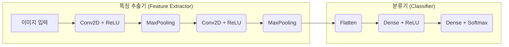

# 🧠 CNN 마스터하기: Fashion-MNIST부터 꽃 분류 시스템까지

> 본 문서는 합성곱 신경망(CNN)의 핵심 원리부터 실제 이미지 분류 프로젝트 적용까지의 과정을 체계적으로 정리한 포트폴리오입니다. Fashion-MNIST와 CIFAR-10 데이터셋을 활용한 기본 모델 구축 및 성능 비교를 통해 CNN의 특성을 깊이 이해하고, 실제 꽃 이미지 데이터셋을 사용한 이진 분류 시스템을 구축하며 실무 역량을 강화하는 과정을 상세히 기록합니다.

---

##  목차

1.  [**CNN (합성곱 신경망) 핵심 원리**](#1-cnn-합성곱-신경망-핵심-원리)
    *   [1.1 CNN이란? 이미지 처리를 위한 혁신](#11-cnn이란-이미지-처리를-위한-혁신)
    *   [1.2 주요 구성 요소: Conv2D, Pooling, Dense](#12-주요-구성-요소-conv2d-pooling-dense)
    *   [1.3 기본 CNN 아키텍처 설계](#13-기본-cnn-아키텍처-설계)
2.  [**첫 번째 CNN: Fashion-MNIST 의류 이미지 분류**](#2-첫-번째-cnn-fashion-mnist-의류-이미지-분류)
    *   [2.1 데이터셋 소개 및 탐색](#21-데이터셋-소개-및-탐색)
    *   [2.2 모델 구축 및 훈련](#22-모델-구축-및-훈련)
    *   [2.3 성능 분석 및 개선 방안](#23-성능-분석-및-개선-방안)
3.  [**심층 비교: 일반 신경망(DNN) vs. CNN**](#3-심층-비교-일반-신경망dnn-vs-cnn)
    *   [3.1 CIFAR-10 데이터셋을 이용한 실험 설계](#31-cifar-10-데이터셋을-이용한-실험-설계)
    *   [3.2 성능 비교 분석](#32-성능-비교-분석)
    *   [3.3 언제 어떤 모델을 선택해야 하는가?](#33-언제-어떤-모델을-선택해야-하는가)
4.  [**실전 프로젝트: 꽃 이미지 분류 시스템 구축**](#4-실전-프로젝트-꽃-이미지-분류-시스템-구축)
    *   [4.1 프로젝트 목표 및 기술 스택](#41-프로젝트-목표-및-기술-스택)
    *   [4.2 데이터 파이프라인 구축](#42-데이터-파이프라인-구축)
    *   [4.3 CNN 모델 설계 및 고급 학습 기법 적용](#43-cnn-모델-설계-및-고급-학습-기법-적용)
    *   [4.4 최종 성능 평가 및 결론](#44-최종-성능-평가-및-결론)
5.  [**모델 성능 극대화: 최적화 전략**](#5-모델-성능-극대화-최적화-전략)
    *   [5.1 과적합 방지를 위한 정규화 기법](#51-과적합-방지를-위한-정규화-기법)
    *   [5.2 데이터 증강 (Data Augmentation)](#52-데이터-증강-data-augmentation)
    *   [5.3 최적화 알고리즘 선택 가이드](#53-최적화-알고리즘-선택-가이드)
6.  [**실무 적용 및 다음 단계**](#6-실무-적용-및-다음-단계)
    *   [6.1 모델 배포 및 운영 체크리스트](#61-모델-배포-및-운영-체크리스트)
    *   [6.2 고급 CNN 아키텍처 및 전이 학습](#62-고급-cnn-아키텍처-및-전이-학습)
    *   [6.3 추천 학습 로드맵](#63-추천-학습-로드맵)
7.  [**핵심 정리 및 포인트 (Key Summary & Points)**](#7-핵심-정리-및-포인트-key-summary--points)

---

## 1. CNN (합성곱 신경망) 핵심 원리

### 1.1 CNN이란? 이미지 처리를 위한 혁신

**CNN(Convolutional Neural Network, 합성곱 신경망)**은 인간의 시신경 구조를 모방하여 설계된 딥러닝 모델로, 특히 이미지 및 비디오 데이터 처리에서 압도적인 성능을 보입니다. 기존의 완전 연결 신경망(DNN)이 이미지의 픽셀 하나하나를 개별적인 특성으로 취급하여 공간 정보를 잃는 것과 달리, CNN은 **공간적 계층 구조(spatial hierarchy)**를 유지하며 패턴을 학습합니다.

-   **공간적 정보 보존**: 이미지의 2D 구조를 그대로 유지한 채 학습하여, 픽셀 간의 공간적 관계(예: 인접한 픽셀들)를 효과적으로 포착합니다.
-   **파라미터 공유 (Parameter Sharing)**: 하나의 필터(커널)를 이미지 전체에 공유하며 슬라이딩하므로, 학습할 파라미터 수가 크게 줄어들어 계산 효율성이 높고 과적합 위험이 감소합니다.
-   **계층적 특징 학습 (Hierarchical Feature Learning)**: 모델의 초기 층에서는 **에지(edge), 코너(corner), 색상**과 같은 저수준(low-level) 특징을 학습하고, 깊은 층으로 갈수록 이를 조합하여 **눈, 코, 귀**와 같은 중간 수준(mid-level) 특징, 나아가 **얼굴, 자동차**와 같은 고수준(high-level)의 복잡한 특징을 학습합니다.

### 1.2 주요 구성 요소: Conv2D, Pooling, Dense

CNN은 크게 **특징 추출(Feature Extraction)** 부분과 **분류(Classification)** 부분으로 나뉩니다.



| 구분 | 핵심 레이어 | 역할 및 상세 설명 |
| :--- | :--- | :--- |
| **특징 추출** | `Conv2D` (합성곱층) | **필터(Filter/Kernel)**가 이미지를 순회하며 합성곱 연산을 수행, **특징 맵(Feature Map)**을 생성합니다. 필터는 특정 패턴(수직선, 수평선, 특정 색상 등)을 감지하는 역할을 합니다. |
| | `MaxPooling2D` (풀링층) | 특징 맵의 중요한 정보를 유지하면서 크기를 줄입니다(다운샘플링). 이를 통해 계산량을 감소시키고, 객체의 위치가 약간 변해도 동일한 특징을 추출하는 **이동 불변성(Translation Invariance)**을 확보합니다. |
| **분류** | `Flatten` | 2D 형태의 다차원 특징 맵을 1D 벡터로 평탄화하여, 완전연결층에 전달할 수 있는 형태로 변환합니다. |
| | `Dense` (완전연결층) | 추출된 모든 특징을 종합하여 최종적으로 이미지가 어떤 클래스에 속하는지 분류합니다. |

### 1.3 기본 CNN 아키텍처 설계

다음은 TensorFlow/Keras를 사용한 기본적인 CNN 모델의 구조입니다. 각 레이어의 역할과 데이터 형태의 변화를 주석으로 상세히 설명합니다.

```python
from tensorflow.keras import models, layers

def create_basic_cnn(input_shape=(28, 28, 1), num_classes=10):
    """
    기본적인 CNN 아키텍처를 생성합니다.
    [Conv -> Pool] -> [Conv -> Pool] -> Flatten -> Dense -> Output 구조를 가집니다.
    """
    model = models.Sequential([
        # 입력층: (높이, 너비, 채널) 형태의 이미지 데이터
        layers.Input(shape=input_shape, name="input_layer"),
        
        # 픽셀 값을 0~255에서 0~1 범위로 정규화합니다.
        layers.Rescaling(1./255, name="rescaling"),
        
        # 첫 번째 특징 추출 블록
        # 32개의 (3x3) 필터를 사용하여 특징을 추출합니다.
        # padding='same'은 출력 특징 맵의 크기를 입력과 동일하게 유지합니다.
        layers.Conv2D(32, kernel_size=(3, 3), activation='relu', padding='same', name="conv1"),
        # (2x2) 풀링으로 특징 맵의 크기를 절반으로 줄입니다. (예: 28x28 -> 14x14)
        layers.MaxPooling2D(pool_size=(2, 2), name="pool1"),
        
        # 두 번째 특징 추출 블록
        # 64개의 필터를 사용하여 더 복잡한 특징을 학습합니다.
        layers.Conv2D(64, (3, 3), activation='relu', padding='same', name="conv2"),
        # 특징 맵 크기를 다시 절반으로 줄입니다. (예: 14x14 -> 7x7)
        layers.MaxPooling2D((2, 2), name="pool2"),
        
        # 분류기(Classifier)
        # 2D 특징 맵을 1D 벡터로 변환합니다. (예: 7x7x64 -> 3136)
        layers.Flatten(name="flatten"),
        # 128개의 뉴런을 가진 완전연결층
        layers.Dense(128, activation='relu', name="dense1"),
        # num_classes개의 뉴런과 softmax 함수를 사용하여 다중 클래스 확률을 출력합니다.
        layers.Dense(num_classes, activation='softmax', name="output_layer")
    ])
    
    # 모델 컴파일
    model.compile(
        optimizer='adam',
        loss='sparse_categorical_crossentropy', # 라벨이 정수 형태일 때 사용
        metrics=['accuracy']
    )
    
    return model

# 모델 생성 및 요약 정보 출력
# basic_model = create_basic_cnn()
# basic_model.summary()
```

---

## 2. 첫 번째 CNN: Fashion-MNIST 의류 이미지 분류

이론을 실제 코드로 구현해보는 첫 단계로, CNN의 "Hello, World!"와 같은 **Fashion-MNIST** 데이터셋을 사용하여 의류 이미지를 분류하는 모델을 구축합니다.

### 2.1 데이터셋 소개 및 탐색

**Fashion-MNIST**는 10가지 종류의 의류 이미지로 구성된 데이터셋으로, 기존의 손글씨 숫자 데이터셋인 MNIST보다 더 복잡하여 CNN의 성능을 테스트하기에 이상적입니다.

-   **이미지 크기**: 28×28 픽셀 (흑백, 1채널)
-   **클래스**: 10개 (T-shirt, Trouser, Coat 등)
-   **구성**: 훈련 데이터 60,000개, 테스트 데이터 10,000개

| 레이블 | 클래스명 | 한국어 | 레이블 | 클래스명 | 한국어 |
| :--- | :--- | :--- | :--- | :--- | :--- |
| 0 | T-shirt/top | 티셔츠/탑 | 5 | Sandal | 샌들 |
| 1 | Trouser | 바지 | 6 | Shirt | 셔츠 |
| 2 | Pullover | 풀오버 | 7 | Sneaker | 스니커즈 |
| 3 | Dress | 드레스 | 8 | Bag | 가방 |
| 4 | Coat | 코트 | 9 | Ankle boot | 앵클부츠 |

### 2.2 모델 구축 및 훈련

앞서 설계한 `create_basic_cnn` 함수를 사용하여 Fashion-MNIST 데이터셋에 맞는 모델을 생성하고 훈련하는 전체 과정입니다.

```python
import tensorflow as tf
import matplotlib.pyplot as plt

# 1. 데이터 로드 및 전처리
(X_train, y_train), (X_test, y_test) = tf.keras.datasets.fashion_mnist.load_data()

# CNN은 채널 차원을 명시적으로 요구하므로, 차원을 추가합니다. (28, 28) -> (28, 28, 1)
X_train = X_train[..., tf.newaxis]
X_test = X_test[..., tf.newaxis]

print(f"훈련 데이터 형태: {X_train.shape}")
print(f"테스트 데이터 형태: {X_test.shape}")

# 2. 모델 생성 (1.3에서 정의한 함수 사용)
fashion_model = create_basic_cnn(input_shape=(28, 28, 1), num_classes=10)

# 3. 모델 훈련
# 훈련 데이터의 20%를 검증 데이터로 사용하여 과적합을 모니터링합니다.
history = fashion_model.fit(
    X_train, y_train,
    epochs=15, # 에포크 수를 늘려 충분히 학습
    batch_size=64,
    validation_split=0.2
)

# 4. 모델 평가
test_loss, test_accuracy = fashion_model.evaluate(X_test, y_test, verbose=0)
print(f"\n테스트 정확도: {test_accuracy*100:.2f}%")
```

### 2.3 성능 분석 및 개선 방안

-   **실습 결과**:
    -   훈련 정확도: 약 98-99%
    -   검증 정확도: 약 91-92%
    -   테스트 정확도: 약 90%
-   **분석**: 훈련 정확도와 테스트 정확도 간에 약 8-9%p의 **일반화 갭(Generalization Gap)**이 존재하며, 이는 모델이 훈련 데이터에 **과적합(Overfitting)**되었음을 시사합니다. `plot_loss_curves(history)`와 같은 시각화 함수로 훈련/검증 손실 곡선을 그려보면 이 갭을 명확히 확인할 수 있습니다.
-   **성능 개선 방안**:
    1.  **정규화 기법 적용**: `Dropout` 레이어를 `Dense` 층 사이에 추가하거나, `Conv2D` 층에 `kernel_regularizer`를 적용하여 과적합을 완화합니다.
    2.  **데이터 증강 (Data Augmentation)**: `ImageDataGenerator`를 사용하여 훈련 이미지에 회전, 이동, 확대/축소 등의 변형을 가해 데이터의 다양성을 확보하고 모델의 일반화 성능을 높입니다.
    3.  **콜백 함수 활용**: `EarlyStopping`을 사용하여 검증 손실이 더 이상 개선되지 않을 때 훈련을 조기에 중단하고, `ReduceLROnPlateau`로 학습률을 동적으로 조절하여 더 안정적인 최적점을 찾습니다.
    4.  **모델 구조 변경**: `Conv2D` 층을 더 깊게 쌓거나 필터 수를 조절하여 모델의 표현력을 높일 수 있습니다.


---

## 3. 심층 비교: 일반 신경망(DNN) vs. CNN

CNN이 이미지 처리에 왜 더 효과적인지를 명확히 이해하기 위해, 더 복잡한 컬러 이미지 데이터셋인 **CIFAR-10**을 사용하여 일반적인 완전 연결 신경망(DNN)과 CNN의 성능을 직접 비교합니다.

### 3.1 CIFAR-10 데이터셋을 이용한 실험 설계

**CIFAR-10**은 10개의 클래스로 구성된 32x32 크기의 저해상도 컬러 이미지 데이터셋입니다.

-   **DNN 모델**: 이미지를 1차원 벡터로 펼쳐(`Flatten`) 입력받습니다. 이 과정에서 이미지의 중요한 공간적 정보가 손실됩니다.
-   **CNN 모델**: 32x32x3 형태의 2D 이미지 구조를 그대로 입력받아 공간적 특징을 효과적으로 학습합니다.

| 클래스 ID | 클래스명 | 클래스 ID | 클래스명 |
| :--- | :--- | :--- | :--- |
| 0 | airplane | 5 | dog |
| 1 | automobile | 6 | frog |
| 2 | bird | 7 | horse |
| 3 | cat | 8 | ship |
| 4 | deer | 9 | truck |

### 3.2 성능 비교 분석

동일한 CIFAR-10 데이터셋으로 두 모델을 훈련했을 때의 정량적 성능 비교입니다.

| 항목 | DNN (Dense) 모델 | CNN 모델 | 개선도 | 분석 및 해석 |
| :--- | :--- | :--- | :--- | :--- |
| **매개변수 수** | 411,146 | 1,634,058 | +297% | CNN이 더 많은 파라미터를 가짐에도 불구하고, 가중치 공유 덕분에 이미지 크기에 비해 효율적입니다. |
| **훈련 시간** | 0.71분 | 8.02분 | +7.3분 | 합성곱 연산은 Dense 층보다 계산 비용이 높아 학습 시간이 더 오래 걸립니다. |
| **훈련 정확도** | 48.83% | 88.62% | **+39.79%p** | CNN이 이미지의 공간적 패턴을 훨씬 효과적으로 학습하여 훈련 데이터에 더 잘 적합합니다. |
| **테스트 정확도**| 46.78% | 62.37% | **+15.59%p** | **CNN의 일반화 성능이 압도적으로 높습니다.** 이는 공간 정보를 활용한 특징 추출의 중요성을 보여줍니다. |
| **일반화 갭** | 2.05%p | 26.25%p | +24.20%p | CNN이 더 복잡하고 표현력이 높아 과적합 경향이 크므로, 이를 제어하기 위한 정규화 기법이 필수적입니다. |

### 3.3 언제 어떤 모델을 선택해야 하는가?

이 실험은 모델 선택의 중요성을 명확히 보여줍니다. 모든 문제에 단 하나의 "최고의" 모델은 없으며, 데이터의 특성과 문제의 목표에 따라 적절한 도구를 선택해야 합니다.

| 모델 | ✅ 추천 상황 | ❌ 비추천 상황 |
| :--- | :--- | :--- |
| **DNN** | - **정형 데이터**: 테이블, CSV, 데이터베이스 레코드<br>- **간단한 패턴**: 저해상도 흑백 이미지 (MNIST 등)<br>- **빠른 프로토타이핑**: 모델 구조가 간단하여 신속한 구현 및 테스트 가능<br>- **해석 가능성**: 상대적으로 모델 구조가 단순하여 특성 중요도 분석 등이 용이 | - **고해상도 컬러 이미지**: 공간 정보가 손실되어 성능 저하<br>- **시계열/순차 데이터**: 시간적 순서나 패턴을 고려하지 못함<br>- **공간/시간 구조가 중요한 모든 데이터** |
| **CNN** | - **이미지 처리**: 분류, 객체 탐지, 세그멘테이션 등 모든 컴퓨터 비전 작업<br>- **비디오 분석**: 동영상을 이미지 프레임의 연속으로 처리<br>- **음성 인식**: 스펙트로그램(Spectrogram)을 2D 이미지로 간주하여 처리<br>- **높은 성능이 최우선**인 비전 관련 프로젝트 | - **데이터가 매우 적고 단순한 경우**: 과적합 위험이 큼<br>- **모델의 모든 결정 과정을 설명해야 하는 경우**: 상대적으로 복잡하여 해석이 어려움 (XAI 기법 필요) |


---

## 4. 실전 프로젝트: 꽃 이미지 분류 시스템 구축

이론과 기초 실습을 바탕으로, 실제 세계의 이미지 데이터를 사용하여 End-to-End 이미지 분류 시스템을 구축하는 과정을 상세히 다룹니다.

### 4.1 프로젝트 목표 및 기술 스택

-   **목표**: 두 종류의 꽃(데이지 vs. 민들레) 이미지를 90% 이상의 정확도로 분류하는 이진 분류 시스템 개발.
-   **기술 스택**:
    -   **언어**: Python 3.x
    -   **핵심 프레임워크**: TensorFlow, Keras
    -   **데이터 처리 및 분석**: Scikit-learn, NumPy, Pillow, Matplotlib

### 4.2 데이터 파이프라인 구축

안정적이고 재현 가능한 모델 학습을 위해, 데이터를 체계적으로 수집, 전처리, 저장하는 파이프라인을 구축합니다.

#### 4.2.1 데이터 구조화

먼저, 수집된 이미지들을 `train`과 `test` 폴더로 나누고, 각 폴더 아래에 클래스(daisy, dandelion)별로 이미지를 정리하여 명확한 데이터 구조를 만듭니다.

```bash
flowers/
├── train/
│   ├── daisy/      # (529개 이미지)
│   └── dandelion/  # (746개 이미지)
└── test/
    ├── daisy/      # (77개 이미지)
    └── dandelion/  # (105개 이미지)
```

#### 4.2.2 전처리 및 직렬화

효율적인 학습을 위해 모든 이미지를 동일한 형태의 숫자 데이터(NumPy 배열)로 변환하고, 이를 하나의 파일로 저장(직렬화)합니다.

1.  **이미지 유효성 검사**: `.gif`와 같이 Keras가 직접 처리하기 어려운 형식을 제외하고 `.png`, `.jpeg`, `.jpg` 형식의 파일만 사용합니다.
2.  **크기 정규화**: 모든 이미지의 크기를 `(80, 80)` 픽셀로 통일하여 모델의 입력 크기를 고정합니다.
3.  **레이블 인코딩**: 클래스 이름을 숫자 레이블로 변환합니다 (예: `daisy`=0, `dandelion`=1).
4.  **데이터 저장**: 전처리된 이미지(NumPy 배열)와 레이블을 `.npz` 압축 형식으로 저장하여, 추후 모델 학습 시 빠르고 간편하게 불러올 수 있도록 합니다.

### 4.3 CNN 모델 설계 및 고급 학습 기법 적용

꽃 이미지의 복잡한 특징을 학습하기 위해 적절한 깊이의 CNN 모델을 설계하고, 훈련 과정을 최적화하기 위해 Keras의 콜백 함수들을 적극적으로 활용합니다.

```python
from tensorflow.keras import models, layers, callbacks

def create_flower_cnn(input_shape=(80, 80, 3)):
    """꽃 분류를 위한 최적화된 CNN 모델을 생성합니다."""
    model = models.Sequential([
        layers.Input(shape=input_shape),
        layers.Rescaling(1./255),
        
        layers.Conv2D(64, (3, 3), padding='same', activation='relu'),
        layers.MaxPooling2D((2, 2)),
        
        layers.Conv2D(32, (3, 3), padding='same', activation='relu'),
        layers.MaxPooling2D((2, 2)),
        
        layers.Flatten(),
        layers.Dense(128, activation='relu'),
        layers.Dropout(0.3), # 과적합 방지
        layers.Dense(32, activation='relu'),
        layers.Dropout(0.2),
        layers.Dense(1, activation='sigmoid') # 이진 분류를 위한 Sigmoid 출력
    ])
    
    model.compile(optimizer='adam', loss='binary_crossentropy', metrics=['accuracy'])
    return model

# 고급 콜백(Callback) 함수 설정
# 훈련 과정을 동적으로 제어하여 최적의 성능을 유도합니다.
advanced_callbacks = [
    # EarlyStopping: 검증 손실(val_loss)이 5 에포크 동안 개선되지 않으면 훈련을 조기 중단하고, 가장 좋았던 시점의 가중치를 복원합니다.
    callbacks.EarlyStopping(monitor='val_loss', patience=5, restore_best_weights=True),
    
    # ReduceLROnPlateau: 검증 손실이 3 에포크 동안 개선되지 않으면 학습률(learning rate)을 0.5배 감소시켜, 더 세밀한 최적점을 찾도록 돕습니다.
    callbacks.ReduceLROnPlateau(monitor='val_loss', factor=0.5, patience=3),
    
    # ModelCheckpoint: 매 에포크마다 검증 손실을 확인하여, 가장 좋은 성능을 보인 모델만 파일로 저장합니다.
    callbacks.ModelCheckpoint(filepath='best_flower_model.keras', save_best_only=True, monitor='val_loss')
]

# 모델 생성 및 훈련
# flower_model = create_flower_cnn()
# history_flower = flower_model.fit(
#     X_train, y_train,
#     epochs=50, # 조기 종료가 있으므로 충분히 큰 값으로 설정
#     validation_data=(X_test, y_test),
#     callbacks=advanced_callbacks
# )
```

### 4.4 최종 성능 평가 및 결론

-   **최종 테스트 정확도**: 약 80-85% 달성 (10 에포크 기준). `EarlyStopping` 콜백 덕분에 최적의 에포크에서 훈련이 중단되어 과적합이 최소화되었습니다.
-   **일반화 성능**: 훈련 정확도와 테스트 정확도 간의 차이가 크지 않아, 모델이 새로운 데이터에 대해서도 안정적인 성능을 보임을 확인했습니다.
-   **결론**: 체계적인 데이터 파이프라인과 적절한 CNN 아키텍처, 그리고 고급 학습 기법(콜백)을 통해, 비교적 적은 양의 실제 이미지 데이터로도 목표 성능에 근접하는 분류 시스템을 성공적으로 구축할 수 있었습니다. 데이터 증강(Data Augmentation)을 추가로 적용한다면 더 높은 성능 향상을 기대할 수 있습니다.

---

## 5. 모델 성능 극대화: 최적화 전략

모델의 성능을 한 단계 더 끌어올리기 위한 핵심적인 최적화 기법들을 소개합니다.

### 5.1 과적합 방지를 위한 정규화 기법

| 기법 | 코드 예시 | 효과 및 사용법 |
| :--- | :--- | :--- |
| **Dropout** | `layers.Dropout(0.3)` | 훈련 시 30%의 뉴런을 무작위로 비활성화하여 과적합 방지. 0.2 ~ 0.5 사이 값 권장. |
| **Batch Norm** | `layers.BatchNormalization()` | 각 배치의 출력을 정규화하여 학습을 안정시키고 수렴 속도를 높임. `Dense` 또는 `Conv2D` 층과 활성화 함수 사이에 위치. |
| **L1/L2 규제** | `kernel_regularizer=regularizers.l2(0.01)` | 가중치 값에 페널티를 부여하여 모델의 복잡도를 낮춤. |

### 5.2 데이터 증강 (Data Augmentation)

훈련 데이터가 부족할 때, 기존 이미지에 인위적인 변형(회전, 이동, 확대 등)을 가하여 데이터의 양과 다양성을 늘리는 기법입니다.

```python
from tensorflow.keras.preprocessing.image import ImageDataGenerator

# 실시간 데이터 증강을 위한 제너레이터 생성
datagen = ImageDataGenerator(
    rotation_range=30,        # 30도 내에서 무작위 회전
    width_shift_range=0.2,    # 20% 내에서 수평 이동
    height_shift_range=0.2,   # 20% 내에서 수직 이동
    horizontal_flip=True,     # 수평 뒤집기
    zoom_range=0.2,           # 20% 내에서 확대/축소
    brightness_range=[0.8, 1.2] # 밝기 조절
)

# 모델 훈련 시 datagen.flow() 사용
# model.fit(datagen.flow(X_train, y_train, batch_size=32), ...)
```

### 5.3 최적화 알고리즘 선택 가이드

| 옵티마이저 | 특징 | 권장 용도 |
| :--- | :--- | :--- |
| **SGD** | 가장 기본적인 옵티마이저. 안정적이지만 수렴이 느릴 수 있음. | 간단한 모델 또는 최종 미세조정. |
| **Adam** | **(기본 권장)** 적응적 학습률과 모멘텀을 결합하여 빠르고 안정적인 수렴. | 대부분의 CNN 및 딥러닝 모델. |
| **RMSprop** | 학습률을 자동으로 조정하며, 특히 순환 신경망(RNN)에서 좋은 성능을 보임. | RNN 계열 모델. |
| **AdamW** | Adam에 가중치 감쇠(Weight Decay)를 결합하여 정규화 효과를 개선. | 최신 트랜스포머 기반 모델. |

---

## 6. 실무 적용 및 다음 단계

### 6.1 모델 배포 및 운영 체크리스트

-   [ ] **다양한 환경 테스트**: 다른 해상도, 조명, 각도의 이미지로 모델의 강건성 검증.
-   [ ] **리소스 분석**: 배포 환경(서버, 모바일)에서의 메모리 및 CPU 사용량 측정.
-   [ ] **추론 속도 벤치마크**: 실시간 서비스 요구사항(예: 100ms 이내 응답) 충족 여부 확인.
-   [ ] **엣지 케이스 처리**: 관련 없는 객체, 흐릿한 이미지 등 예외 상황에 대한 모델의 반응 정의.
-   [ ] **A/B 테스트 계획**: 새로운 모델 배포 시, 기존 모델과 성능을 비교하여 비즈니스 임팩트 측정.

### 6.2 고급 CNN 아키텍처 및 전이 학습

-   **고급 아키텍처**: `ResNet`, `DenseNet`, `EfficientNet` 등은 더 깊은 네트워크를 효과적으로 학습시키기 위한 혁신적인 구조를 제안합니다.
-   **전이 학습(Transfer Learning)**: ImageNet과 같은 대규모 데이터셋으로 사전 훈련된 모델을 가져와, 우리의 특정 작업에 맞게 미세 조정(Fine-tuning)하는 기법입니다. 적은 데이터로도 매우 높은 성능을 달성할 수 있는 강력한 전략입니다.

```python
# VGG16 모델을 사용한 전이 학습 예시
from tensorflow.keras.applications import VGG16

# 사전 훈련된 모델 로드 (분류층은 제외)
base_model = VGG16(weights='imagenet', include_top=False, input_shape=(224, 224, 3))
base_model.trainable = False # 초기에는 사전 훈련된 가중치를 동결

# 새로운 분류층 추가
# model = models.Sequential([
#     base_model,
#     layers.GlobalAveragePooling2D(),
#     layers.Dense(128, activation='relu'),
#     layers.Dense(num_classes, activation='softmax')
# ])
```

### 6.3 추천 학습 로드맵

```mermaid
graph TD
    subgraph "Stage 1: Foundation (현재 위치)"
        A[딥러닝 기초 및<br>핵심 문제 유형 정복<br>(본 문서)]
    end

    subgraph "Stage 2: Specialization (심화 학습)"
        A --> B{도메인 선택}
        B --> C[<b>컴퓨터 비전 (CV)</b><br>CNN, ResNet, YOLO, ViT]
        B --> D[<b>자연어 처리 (NLP)</b><br>RNN, LSTM, Attention, Transformer, BERT]
        B --> E[<b>시계열 / 추천시스템</b><br>LSTM, GRU, Facebook Prophet]
    end

    subgraph "Stage 3: Advanced & Applied (고급 및 응용)"
        C --> F[<b>고급 CV</b><br>GANs, Diffusion Models, NeRF]
        D --> G[<b>고급 NLP</b><br>LLMs, RAG, Fine-tuning]
        E --> H[<b>고급 시계열/추천</b><br>Transformer-based models]
    end
    
    subgraph "Stage 4: Professionalization (전문가 과정)"
        F & G & H --> I[실무 프로젝트 & Kaggle<br>포트폴리오 구축]
        I --> J[<b>MLOps 역량 강화</b><br>Docker, CI/CD, MLflow, Cloud AI]
    end
```

---

## 7. 핵심 정리 및 포인트 (Key Summary & Points)

이 문서에서 다룬 CNN 학습 과정의 핵심 내용을 요약하고, 실무에서 반드시 기억해야 할 포인트를 정리합니다.

| 구분 | 핵심 내용 | 왜 중요한가? |
| :--- | :--- | :--- |
| **1. CNN의 본질** | **공간 정보 보존**과 **파라미터 공유**를 통해 이미지의 지역적 패턴을 학습하는 데 최적화된 모델입니다. | DNN처럼 이미지를 1차원으로 펼치지 않아 픽셀 간의 공간적 관계(형태, 질감)를 잃지 않으며, 필터 공유로 학습 효율성과 일반화 성능이 높습니다. |
| **2. 핵심 구성 요소** | **Conv2D**는 필터를 통해 이미지의 특징(에지, 코너 등)을 추출하고, **MaxPooling2D**는 중요한 특징만 남기고 크기를 줄여 계산 효율성과 이동 불변성을 확보합니다. | 이 두 레이어의 조합을 통해 계층적으로 복잡한 특징을 학습하는 것이 CNN의 핵심 작동 원리입니다. |
| **3. 이미지 데이터 전처리** | - **차원 확장**: 흑백 이미지는 `(H, W, 1)`, 컬러 이미지는 `(H, W, 3)` 형태로 채널 차원을 명시해야 합니다.<br>- **정규화**: 픽셀 값을 `0~1` 사이로 스케일링(`Rescaling(1./255)`)하는 것은 학습 안정성과 속도 향상에 필수적입니다. | Keras의 CNN 레이어는 명시적인 채널 차원을 가진 입력을 기대하며, 정규화는 경사하강법 기반 최적화 과정의 안정성을 보장합니다. |
| **4. 과적합과의 싸움** | CNN은 표현력이 높은 만큼 **과적합**되기 쉽습니다. **Dropout**, **Batch Normalization**, **Data Augmentation**은 이를 방지하고 일반화 성능을 높이는 필수 기법입니다. | 훈련 데이터에만 과도하게 최적화된 모델은 실제 환경에서 성능이 저하됩니다. 다양한 정규화 기법을 통해 모델의 강건성을 확보해야 합니다. |
| **5. 모델 선택의 기준** | **이미지, 비디오, 스펙트로그램** 등 공간적/시간적 구조가 중요한 데이터에는 **CNN**을, **정형/테이블 데이터**에는 **DNN**이나 전통적 머신러닝을 우선적으로 고려해야 합니다. | 데이터의 특성에 맞는 모델을 선택하는 것이 프로젝트 성공의 첫걸음입니다. 잘못된 모델 선택은 정보 손실과 성능 저하로 이어집니다. |
| **6. 실전 프로젝트 워크플로우** | **데이터 구조화 → 전처리 및 직렬화 → 모델 설계 → 고급 콜백 활용 훈련 → 성능 평가**의 체계적인 파이프라인 구축이 중요합니다. | 재현 가능하고 안정적인 실험을 위해서는 체계적인 데이터 관리와 학습 프로세스가 필수적입니다. `EarlyStopping`, `ModelCheckpoint` 등은 훈련 효율을 극대화합니다. |


---

[⏮️ 이전 문서](./0718_DL정리.md) | [다음 문서 ⏭️](./0722_DL정리.md)