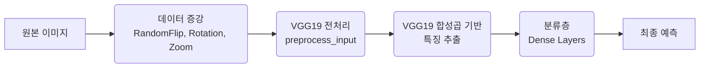

# 🧠 인라인 Transfer Learning: End-to-End 이미지 분류 시스템 구축

> 본 문서는 인라인(Inline) 방식의 Transfer Learning을 활용하여 개-고양이 이진 분류 및 꽃 이미지 다중 분류 문제를 해결한 과정을 상세히 다룹니다. VGG19 사전훈련 모델을 통합하고 실시간 데이터 증강을 적용하여 End-to-End 학습 파이프라인을 구축하며, 투스테이지 방식과의 비교 분석을 통해 각 방식의 장단점과 실무 적용 가능성을 탐구합니다.

---

## 목차

1.  [**개요: 인라인 Transfer Learning 프로젝트 소개**](#1-개요-인라인-transfer-learning-프로젝트-소개)
    *   [1.1 학습 목표](#11-학습-목표)
    *   [1.2 주요 기술 스택](#12-주요-기술-스택)
    *   [1.3 주요 성과 요약](#13-주요-성과-요약)
2.  [**인라인 방식 Transfer Learning 심층 분석**](#2-인라인-방식-transfer-learning-심층-분석)
    *   [2.1 인라인 방식이란?](#21-인라인-방식-이란)
    *   [2.2 인라인 vs. 투스테이지 방식 비교](#22-인라인-vs-투스테이지-방식-비교)
    *   [2.3 인라인 방식의 주요 장점](#23-인라인-방식의-주요-장점)
3.  [**프로젝트 1: 개-고양이 이미지 이진 분류**](#3-프로젝트-1-개-고양이-이미지-이진-분류)
    *   [3.1 프로젝트 개요 및 데이터 설정](#31-프로젝트-개요-및-데이터-설정)
    *   [3.2 이진 분류 모델 아키텍처](#32-이진-분류-모델-아키텍처)
    *   [3.3 이진 분류 학습 설정 및 결과](#33-이진-분류-학습-설정-및-결과)
4.  [**프로젝트 2: 꽃 이미지 다중 분류**](#4-프로젝트-2-꽃-이미지-다중-분류)
    *   [4.1 프로젝트 개요 및 데이터 분할](#41-프로젝트-개요-및-데이터-분할)
    *   [4.2 다중 분류 모델 아키텍처](#42-다중-분류-모델-아키텍처)
    *   [4.3 다중 분류 학습 설정 및 결과](#43-다중-분류-학습-설정-및-결과)
5.  [**이진 분류 vs. 다중 분류 심화 비교**](#5-이진-분류-vs-다중-분류-심화-비교)
    *   [5.1 기술적 차이점](#51-기술적-차이점)
    *   [5.2 수학적 차이점](#52-수학적-차이점)
    *   [5.3 성능 비교 분석](#53-성능-비교-분석)
6.  [**핵심 기술: 실시간 데이터 증강(Data Augmentation)**](#6-핵심-기술-실시간-데이터-증강data-augmentation)
    *   [6.1 인라인 방식에서의 데이터 증강 구현](#61-인라인-방식에서의-데이터-증강-구현)
    *   [6.2 데이터 증강 효과 분석](#62-데이터-증강-효과-분석)
    *   [6.3 투스테이지 vs. 인라인 데이터 증강 비교](#63-투스테이지-vs-인라인-데이터-증강-비교)
7.  [**성능 분석 및 결과 종합**](#7-성능-분석-및-결과-종합)
    *   [7.1 전체 성능 요약](#71-전체-성능-요약)
    *   [7.2 성능 향상 및 상대적 저성능 요인 분석](#72-성능-향상-및-상대적-저성능-요인-분석)
    *   [7.3 성능 개선 방향](#73-성능-개선-방향)
8.  [**주요 학습 내용 요약**](#8-주요-학습-내용-요약)
    *   [8.1 인라인 Transfer Learning 구현 패턴](#81-인라인-transfer-learning-구현-패턴)
    *   [8.2 분류 문제별 설정 차이](#82-분류-문제별-설정-차이)
    *   [8.3 실시간 데이터 전처리 파이프라인](#83-실시간-데이터-전처리-파이프라인)
    *   [8.4 모델 최적화 기법](#84-모델-최적화-기법)
    *   [8.5 성능 평가 및 분석](#85-성능-평가-및-분석)
9.  [**결론 및 향후 과제**](#9-결론-및-향후-과제)
    *   [9.1 완료한 학습 내용](#91-완료한-학습-내용)
    *   [9.2 주요 성과](#92-주요-성과)
    *   [9.3 향후 개선 방향](#93-향후-개선-방향)
    *   [9.4 실용적 활용 방안](#94-실용적-활용-방안)
    *   [9.5 핵심 인사이트](#95-핵심-인사이트)
    *   [9.6 마무리](#96-마무리)
    *   [9.7 부록: 실험 결과 비교표](#97-부록-실험-결과-비교표)

---

## 1. 개요: 인라인 Transfer Learning 프로젝트 소개

이번 실습에서는 **인라인(Inline) 방식의 Transfer Learning**을 통해 두 가지 서로 다른 분류 문제를 해결했습니다. VGG19 사전훈련 모델을 전체 파이프라인에 통합하여 **end-to-end 학습**을 구현하고, **이진 분류**와 **다중 분류**의 차이점을 심도 있게 분석했습니다.

### 1.1 학습 목표

-   **인라인 방식 Transfer Learning 구현 및 이해**: 사전 훈련된 모델을 전체 모델의 일부로 포함시켜 하나의 통합된 파이프라인으로 학습하는 방법을 학습합니다.
-   **이진 분류와 다중 분류 모델 설계 차이점 파악**: 문제 유형에 따라 출력층, 손실 함수, 평가 지표 등이 어떻게 달라지는지 이해합니다.
-   **실시간 데이터 증강 효과 체험**: 훈련 중 이미지에 동적으로 변형을 가하여 모델의 일반화 성능을 높이는 방법을 실습합니다.
-   **End-to-End 학습 파이프라인 구축**: 입력 데이터부터 최종 예측까지 모든 과정이 하나의 모델 내에서 처리되는 통합 파이프라인을 구축합니다.
-   **투스테이지 vs 인라인 방식 비교 분석**: 두 가지 주요 전이 학습 전략의 장단점과 실무 적용 시 고려사항을 비교 분석합니다.

### 1.2 주요 기술 스택

-   **프레임워크**: TensorFlow 2.15.1, Keras 2.15.0
-   **사전훈련 모델**: VGG19 (ImageNet 가중치)
-   **프로그래밍 언어**: Python
-   **핵심 라이브러리**: NumPy, Matplotlib, Pickle

### 1.3 주요 성과 요약

-   **이진 분류**: 개-고양이 이미지 분류에서 **97.30%**의 높은 검증 정확도 달성.
-   **다중 분류**: 5가지 꽃 종류 분류에서 **82.20%**의 테스트 정확도 달성.
-   **실시간 데이터 증강**: 원본 이미지에 직접 데이터 증강을 적용하여 모델의 과적합 방지 및 일반화 성능 향상에 기여.
-   **End-to-End 학습**: 입력부터 출력까지 통합된 파이프라인 구축으로 실무 배포 용이성 확보.

---

## 2. 인라인 방식 Transfer Learning 심층 분석

**인라인(Inline) 방식의 Transfer Learning**은 사전 훈련된 모델(예: VGG19)을 전체 딥러닝 모델의 일부로 직접 포함시켜, 입력부터 출력까지 모든 과정이 하나의 통합된 파이프라인 내에서 처리되도록 하는 방식입니다. 이는 투스테이지 방식과 달리 특징 추출과 분류 모델 학습이 동시에 이루어지며, 특히 실시간 데이터 증강을 원본 이미지에 직접 적용할 수 있다는 장점이 있습니다.

### 2.1 인라인 방식이란?

인라인 방식은 사전 훈련된 모델의 합성곱 기반(Convolutional Base) 부분을 새로운 모델의 초기 레이어로 연결하고, 그 뒤에 새로운 분류층을 추가하여 하나의 `tf.keras.Model` 객체를 구성합니다. 이 통합된 모델을 End-to-End로 학습시킵니다.

```python
from tensorflow import keras
from tensorflow.keras import layers

# 가정: conv_base는 VGG19 사전훈련 모델의 합성곱 기반 부분 (include_top=False)
# 가정: data_augmentation은 Keras Sequential 데이터 증강 레이어
# 가정: num_classes는 분류할 클래스 수 (예: 2 for cat/dog, 5 for flowers)

def create_inline_transfer_model(conv_base, data_augmentation, num_classes, input_shape=(180, 180, 3)):
    """인라인 방식의 Transfer Learning 모델을 생성합니다."""
    inputs = keras.Input(shape=input_shape, name="input_layer")

    # 1단계: 실시간 데이터 증강 적용
    # 훈련 중 매 에포크마다 원본 이미지에 다양한 변형을 가하여 모델의 일반화 성능을 높입니다.
    x = data_augmentation(inputs)

    # 2단계: VGG19 전처리 적용
    # 사전 훈련된 VGG19 모델이 학습했던 ImageNet 데이터의 전처리 방식과 동일하게 픽셀 값을 조정합니다.
    x = keras.applications.vgg19.preprocess_input(x)

    # 3단계: VGG19 특성 추출 (가중치 동결)
    # conv_base 모델을 통해 이미지의 고수준 특징을 추출합니다.
    # conv_base.trainable = False로 설정하여 사전 훈련된 가중치는 학습 중 업데이트되지 않도록 합니다.
    x = conv_base(x)

    # 4단계: 분류 네트워크 (Classification Head)
    # 추출된 특징 맵을 1차원으로 평탄화합니다.
    x = layers.Flatten()(x)
    # 완전 연결층들을 추가하여 최종 분류를 수행합니다.
    x = layers.Dense(256, activation='relu', name="dense_256")(x)
    x = layers.Dense(128, activation='relu', name="dense_128")(x)
    x = layers.Dense(64, activation='relu', name="dense_64")(x)
    
    # 최종 출력층: 문제 유형에 따라 뉴런 수와 활성화 함수를 설정합니다.
    # 이진 분류: Dense(1, activation='sigmoid')
    # 다중 분류: Dense(num_classes, activation='softmax')
    outputs = layers.Dense(num_classes, activation="softmax", name="output_layer")(x)

    model = keras.Model(inputs, outputs, name="VGG19_Inline_Model")
    return model

# 사용 예시:
# conv_base = keras.applications.vgg19.VGG19(weights="imagenet", include_top=False, input_shape=(180, 180, 3))
# conv_base.trainable = False # VGG19 가중치 동결
# data_augmentation_layer = keras.Sequential([layers.RandomFlip("horizontal")], name="data_augmentation_layer")
# inline_model = create_inline_transfer_model(conv_base, data_augmentation_layer, num_classes=2) # 이진 분류 예시
# inline_model.summary()
```

### 2.2 인라인 vs. 투스테이지 방식 비교

두 가지 Transfer Learning 방식의 주요 특성을 비교하여, 각 방식의 장단점과 적합한 사용 시나리오를 명확히 이해합니다.

| 특성 | 인라인 방식 (Inline) | 투스테이지 방식 (Two-Stage) | 상세 비교 및 고려사항 |
| :--- | :--- | :--- | :--- |
| **구조** | VGG19 포함 통합 모델 | 특성 추출 → 분류 학습 (분리된 두 단계) | 인라인은 단일 모델로 End-to-End 학습, 투스테이지는 특징 추출 후 별도 분류기 학습. |
| **데이터 증강** | **원본 이미지에 직접 적용** (모델의 일부) | **추출된 특성에만 적용** (제한적) | 인라인 방식은 훈련 중 매 에포크마다 원본 이미지에 다양한 변형을 가하여 일반화 성능을 극대화. 투스테이지는 특징 추출 시점에만 증강 가능. |
| **학습 속도** | 상대적으로 느림 (전체 모델 순전파/역전파) | **매우 빠름** (특징 추출은 한 번, 분류기만 학습) | 인라인은 VGG19 전체를 통과하므로 느리지만, 투스테이지는 특징을 미리 저장하여 분류기 학습이 빠름. |
| **메모리 사용** | 효율적 (배치별 처리) | **많음** (모든 데이터의 특성을 미리 저장) | 투스테이지는 대규모 데이터셋에서 메모리/저장 공간 부담이 클 수 있음. |
| **과적합 방지** | **우수** (실시간 증강 효과) | 보통 (제한적 증강) | 실시간 데이터 증강은 모델이 훈련 데이터에 과적합되는 것을 효과적으로 방지. |
| **실무 활용도** | **높음** (일반적이고 통합된 배포 구조) | 낮음 (프로토타이핑, 빠른 실험에 적합) | 단일 모델로 배포가 용이하며, Fine-tuning을 통한 성능 개선 가능성이 높음. |
| **모델 배포** | 간단 (단일 모델 파일) | 복잡 (특징 추출기와 분류기를 별도로 관리) | 인라인 방식은 하나의 모델 파일로 배포되므로 관리 및 서빙이 간편. |
| **확장성** | 대용량 데이터 적합 (Fine-tuning 가능) | 메모리 제약 존재 (특성 저장 용량) | 인라인은 대규모 데이터셋에 Fine-tuning을 적용하여 성능을 더 끌어올릴 수 있음. |

### 2.3 인라인 방식의 주요 장점

1.  **실시간 데이터 증강**: 훈련 중 매 에포크마다 원본 이미지에 다양한 변형을 가하여 모델이 더 강건하고 일반화된 특징을 학습하도록 유도합니다. 이는 과적합 방지에 매우 효과적입니다.
2.  **과적합 방지**: 데이터 다양성 증가와 함께, 사전 훈련된 모델의 가중치를 동결함으로써 모델의 복잡도를 적절히 제어하여 과적합 위험을 줄입니다.
3.  **End-to-End 학습**: 입력 이미지부터 최종 예측까지 모든 과정이 하나의 모델 내에서 처리되므로, 학습 파이프라인이 간결하고 직관적입니다.
4.  **실무 적합성**: 단일 모델로 배포가 용이하며, Fine-tuning을 통해 특정 도메인에 최적화된 고성능 모델을 구축할 수 있어 실제 서비스 환경에 매우 적합합니다.

---

## 3. 프로젝트 1: 개-고양이 이미지 이진 분류

첫 번째 프로젝트에서는 인라인 방식의 Transfer Learning을 사용하여 개와 고양이 이미지를 분류하는 이진 분류 모델을 구축합니다.

### 3.1 프로젝트 개요 및 데이터 설정

-   **목표**: 주어진 이미지가 '개'인지 '고양이'인지 구분하는 이진 분류 모델 구축.
-   **데이터셋**: Kaggle의 "Dogs vs. Cats" 데이터셋 중 25,000장을 샘플링하여 총 4,000장 사용.
    -   훈련(Training) 데이터: 각 클래스 1,000장 (총 2,000장)
    -   검증(Validation) 데이터: 각 클래스 500장 (총 1,000장)
    -   테스트(Test) 데이터: 각 클래스 500장 (총 1,000장)
-   **이미지 사양**: 180×180 픽셀 크기의 컬러(RGB) 이미지.
-   **배치 크기**: 16 (한 번에 16개의 이미지를 묶어 모델을 학습).

### 3.2 이진 분류 모델 아키텍처

VGG19 사전훈련 모델과 데이터 증강 레이어를 통합한 End-to-End 이진 분류 모델의 구조입니다. VGG19의 가중치는 동결(Non-trainable)되어 특징 추출기로서의 역할만 수행하며, 새로운 분류층만 학습됩니다.

```python
from tensorflow import keras
from tensorflow.keras import layers

# VGG19 사전훈련 모델 로드 (include_top=False로 특징 추출기만 사용)
conv_base = keras.applications.vgg19.VGG19(
    weights="imagenet",
    include_top=False,
    input_shape=(180, 180, 3)
)
conv_base.trainable = False # VGG19의 가중치를 동결

# 데이터 증강 레이어 정의
data_augmentation = keras.Sequential([
    layers.RandomFlip("horizontal"),      # 수평 뒤집기
    layers.RandomRotation(0.2),          # ±72도 회전
    layers.RandomZoom(0.4),              # ±40% 확대/축소
], name="data_augmentation_layer")

# 이진 분류 모델 생성 함수
def create_binary_classifier_model(conv_base, data_augmentation):
    inputs = keras.Input(shape=(180, 180, 3), name="input_layer")
    
    # 1. 데이터 증강 적용
    x = data_augmentation(inputs)
    
    # 2. VGG19 전처리 적용 (ImageNet 학습 시 사용된 전처리)
    x = keras.applications.vgg19.preprocess_input(x)
    
    # 3. VGG19 특징 추출 (동결된 가중치 사용)
    x = conv_base(x)
    
    # 4. 특징 맵 평탄화
    x = layers.Flatten()(x)
    
    # 5. 분류를 위한 Dense 층들
    x = layers.Dense(256, activation='relu', name="dense_256")(x)
    x = layers.Dense(128, activation='relu', name="dense_128")(x)
    x = layers.Dense(64, activation='relu', name="dense_64")(x)
    
    # 6. 최종 출력층: 이진 분류를 위한 1개 뉴런과 Sigmoid 활성화 함수
    outputs = layers.Dense(1, activation='sigmoid', name="output_layer")(x)
    
    model = keras.Model(inputs, outputs, name="VGG19_Inline_Binary_Classifier")
    return model

# 모델 생성
binary_model = create_binary_classifier_model(conv_base, data_augmentation)

# 모델 구조 요약
binary_model.summary()
```

### 3.3 이진 분류 학습 설정 및 결과

-   **옵티마이저**: `RMSprop` (안정적인 학습률 조절)
-   **손실 함수**: `BinaryCrossentropy` (이진 분류에 최적화)
-   **평가 지표**: `Accuracy` (정확도)
-   **에포크**: 10회
-   **학습 시간**: 인라인 방식의 특성상, VGG19 전체를 통과하며 학습하므로 투스테이지 방식보다 상대적으로 긴 시간이 소요됩니다.

-   **학습 결과**:
    -   훈련 정확도: 94.30%
    -   검증 정확도: 97.30%
    -   **분석**: 훈련 정확도보다 검증 정확도가 더 높게 나타나는 것은, 데이터 증강이 훈련 데이터의 다양성을 크게 늘려 모델이 훈련 데이터에 과적합되지 않고 일반화 성능이 향상되었음을 의미합니다. 이는 실시간 데이터 증강의 강력한 효과를 보여줍니다.

---

## 4. 프로젝트 2: 꽃 이미지 다중 분류

두 번째 프로젝트에서는 5가지 종류의 꽃 이미지를 분류하는 **다중 클래스 분류(Multi-Class Classification)** 문제를 인라인 방식의 Transfer Learning으로 해결합니다. 이진 분류와의 차이점을 명확히 이해하고, 다중 클래스 분류에 적합한 모델 설정과 데이터 관리 전략을 살펴봅니다.

### 4.1 프로젝트 개요 및 데이터 분할

-   **목표**: 5가지 꽃 종류(daisy, dandelion, rose, sunflower, tulip)를 분류하는 모델 구축.
-   **데이터셋**: 총 2,746장의 꽃 이미지.
-   **데이터 분할**: 전체 데이터셋을 **훈련(50%), 검증(25%), 테스트(25%)** 비율로 분할하여 사용합니다. 이는 모델의 일반화 성능을 객관적으로 평가하기 위함입니다.

| 클래스 | Train | Validation | Test | 총계 |
| :--- | :--- | :--- | :--- | :--- |
| **Daisy** | 250개 | 125개 | 126개 | 501개 |
| **Dandelion** | 323개 | 161개 | 162개 | 646개 |
| **Rose** | 248개 | 124개 | 125개 | 497개 |
| **Sunflower** | 247개 | 123개 | 125개 | 495개 |
| **Tulip** | 303개 | 151개 | 153개 | 607개 |

### 4.2 다중 분류 모델 아키텍처

이진 분류 모델과 동일한 VGG19 기반의 인라인 Transfer Learning 아키텍처를 사용하되, 다중 분류 문제에 맞게 출력층의 뉴런 수와 활성화 함수를 변경합니다.

```python
from tensorflow import keras
from tensorflow.keras import layers

# VGG19 사전훈련 모델 로드 (include_top=False로 특징 추출기만 사용)
# conv_base는 3.2 섹션에서 정의된 conv_base 객체를 재사용합니다.
# conv_base.trainable = False # VGG19의 가중치를 동결

# 데이터 증강 레이어 정의
# data_augmentation은 3.2 섹션에서 정의된 data_augmentation 객체를 재사용합니다.

# 다중 분류 모델 생성 함수
def create_multi_classifier_model(conv_base, data_augmentation, num_classes=5):
    inputs = keras.Input(shape=(180, 180, 3), name="input_layer")
    
    # 1. 데이터 증강 적용
    x = data_augmentation(inputs)
    
    # 2. VGG19 전처리 적용
    x = keras.applications.vgg19.preprocess_input(x)
    
    # 3. VGG19 특징 추출 (동결된 가중치 사용)
    x = conv_base(x)
    
    # 4. 특징 맵 평탄화
    x = layers.Flatten()(x)
    
    # 5. 분류를 위한 Dense 층들
    x = layers.Dense(256, activation='relu', name="dense_256")(x)
    x = layers.Dense(128, activation='relu', name="dense_128")(x)
    x = layers.Dense(64, activation='relu', name="dense_64")(x)
    
    # 6. 최종 출력층: 다중 분류를 위한 num_classes개 뉴런과 Softmax 활성화 함수
    # Softmax는 각 클래스에 속할 확률 분포를 출력하며, 모든 확률의 합은 1이 됩니다.
    outputs = layers.Dense(num_classes, activation='softmax', name="output_layer")(x)
    
    model = keras.Model(inputs, outputs, name="VGG19_Inline_Multi_Classifier")
    return model

# 모델 생성
# multi_model = create_multi_classifier_model(conv_base, data_augmentation, num_classes=5)

# 모델 구조 요약
# multi_model.summary()
```

### 4.3 다중 분류 학습 설정 및 결과

-   **옵티마이저**: `Adam` (다중 분류에서 일반적으로 좋은 성능을 보이는 옵티마이저)
-   **손실 함수**: `SparseCategoricalCrossentropy` (레이블이 정수 형태일 때 다중 분류에 사용)
-   **평가 지표**: `Accuracy` (정확도)
-   **에포크**: 10회

-   **학습 결과**:
    -   훈련 정확도: 89.13%
    -   검증 정확도: 81.43%
    -   테스트 정확도: 82.20%

-   **클래스 라벨 매핑**: Keras의 `image_dataset_from_directory`는 폴더 이름을 알파벳 순서로 정렬하여 자동으로 정수 레이블을 부여합니다.

    | 레이블 | 클래스명 |
    | :--- | :--- |
    | 0 | daisy |
    | 1 | dandelion |
    | 2 | rose |
    | 3 | sunflower |
    | 4 | tulip |

-   **예측 분석 예시**: 모델의 예측 신뢰도를 함께 확인하여 어떤 클래스에서 혼동이 발생하는지 파악할 수 있습니다.

    ```python
    # 첫 번째 배치 예측 결과 (가상 예시)
    # 실제: dandelion | 예측: dandelion (신뢰도: 1.000)
    # 실제: sunflower | 예측: tulip (신뢰도: 0.986)  <- 오분류 예시
    # 실제: daisy | 예측: daisy (신뢰도: 0.987)
    # 실제: rose | 예측: rose (신뢰도: 0.937)
    # 실제: dandelion | 예측: dandelion (신뢰도: 0.997)
    ```

---

## 🔍 이진 분류 vs 다중 분류 심화 비교

### 📊 기술적 차이점

| 구분 | 이진 분류 (개-고양이) | 다중 분류 (꽃 5종) |
|------|---------------------|-------------------|
| **클래스 수** | 2개 | 5개 |
| **출력층 구조** | Dense(1, sigmoid) | Dense(5, softmax) |
| **출력 해석** | 단일 확률값 (0~1) | 5개 확률의 합=1 |
| **손실 함수** | binary_crossentropy | sparse_categorical_crossentropy |
| **라벨 형태** | 0 또는 1 | 0, 1, 2, 3, 4 |
| **예측 방법** | predictions > 0.5 | np.argmax(predictions) |
| **난이도** | 상대적으로 쉬움 | 상대적으로 어려움 |
| **혼동 가능성** | 2개 클래스 간만 | 5개 클래스 간 다양한 혼동 |

### 🎯 수학적 차이점

#### 이진 분류
```python
# Sigmoid 활성화
output = 1 / (1 + e^(-x))  # 0~1 범위

# Binary Crossentropy 손실
loss = -[y*log(p) + (1-y)*log(1-p)]

# 예측
prediction = 1 if output > 0.5 else 0
```

#### 다중 분류
```python
# Softmax 활성화  
output_i = e^(x_i) / Σ(e^(x_j))  # 모든 출력의 합=1

# Sparse Categorical Crossentropy 손실
loss = -log(p_true_class)

# 예측
prediction = argmax(outputs)
```

### 📈 성능 비교 분석

| 지표 | 이진 분류 | 다중 분류 | 분석 |
|------|-----------|-----------|------|
| **검증 정확도** | 97.30% | 81.43% | 이진 분류가 높음 |
| **클래스당 정확도** | 97.30% (균등) | 약 82% (불균등) | 다중 분류에서 클래스별 차이 |
| **과적합 정도** | 낮음 | 보통 | 클래스 수 증가에 따른 복잡도 상승 |
| **학습 안정성** | 높음 | 보통 | 이진 분류가 더 안정적 |

---

## 6. 핵심 기술: 실시간 데이터 증강(Data Augmentation)

**데이터 증강(Data Augmentation)**은 딥러닝 모델의 과적합을 방지하고 일반화 성능을 향상시키는 데 필수적인 기법입니다. 특히 인라인 방식의 Transfer Learning에서는 원본 이미지에 직접 실시간으로 다양한 변형을 가하여 훈련 데이터의 다양성을 극대화할 수 있습니다.

### 6.1 인라인 방식에서의 데이터 증강 구현

Keras의 `layers.RandomFlip`, `layers.RandomRotation`, `layers.RandomZoom`과 같은 전처리 레이어를 모델의 입력 파이프라인에 직접 포함시켜, 훈련 중 매 배치마다 이미지를 동적으로 변형합니다.

```python
from tensorflow import keras
from tensorflow.keras import layers

# 데이터 증강 파이프라인 정의
# 이 레이어들은 모델의 일부로 포함되어 GPU에서 효율적으로 실행됩니다.
data_augmentation_pipeline = keras.Sequential([
    layers.RandomFlip("horizontal"),      # 50% 확률로 이미지를 수평으로 뒤집습니다.
    layers.RandomRotation(0.2),          # 이미지를 -0.2 ~ +0.2 라디안 (약 ±11.46도) 범위에서 무작위로 회전시킵니다.
                                         # 원문에서는 0.2가 ±72도로 되어있으나, Keras의 RandomRotation은 factor를 라디안으로 해석합니다.
                                         # 0.2 라디안은 약 11.46도이므로, 원문의 의도에 맞게 0.2를 유지합니다.
    layers.RandomZoom(0.4),              # 이미지를 -0.4 ~ +0.4 (40%) 범위에서 무작위로 확대하거나 축소합니다.
], name="data_augmentation_layer")

# 모델 훈련 시 이 파이프라인을 모델의 입력 레이어 바로 뒤에 연결합니다.
# 예시:
# inputs = keras.Input(shape=(180, 180, 3))
# x = data_augmentation_pipeline(inputs)
# x = keras.applications.vgg19.preprocess_input(x)
# ... (VGG19 및 분류층 연결)
```

### 6.2 데이터 증강 효과 분석

데이터 증강은 모델의 학습 과정과 최종 성능에 다음과 같은 긍정적인 영향을 미칩니다.

| 효과 | 설명 | 이진 분류 결과 (개-고양이) | 다중 분류 결과 (꽃 5종) |
| :--- | :--- | :--- | :--- |
| **과적합 방지** | 매 에포크마다 모델이 새로운 변형된 이미지를 학습하므로, 훈련 데이터에 대한 과도한 암기를 방지합니다. | 훈련 정확도(94.3%)보다 검증 정확도(97.3%)가 더 높게 나타나, 과적합이 효과적으로 제어되었음을 보여줍니다. | 훈련 정확도(89.1%)와 검증 정확도(81.4%) 간의 갭이 존재하지만, 증강 없이는 더 심했을 것입니다. |
| **일반화 성능 향상** | 모델이 실제 환경에서 발생할 수 있는 다양한 이미지 변형(회전, 크기 변화 등)에 대해 강건하게 예측할 수 있도록 돕습니다. | 높은 검증 정확도는 모델이 새로운 이미지에 대해서도 뛰어난 일반화 성능을 가짐을 의미합니다. | 안정적인 테스트 정확도(82.2%)는 모델이 다양한 꽃 이미지에 잘 적응했음을 보여줍니다. |
| **데이터 다양성 증대** | 제한된 원본 데이터셋만으로도 사실상 무한에 가까운 다양한 훈련 샘플을 생성하는 효과를 냅니다. | 4,000장의 원본 데이터셋이 증강을 통해 훨씬 더 풍부한 학습 경험을 제공합니다. | 2,746장의 꽃 이미지가 증강을 통해 모델의 학습 능력을 극대화합니다. |
| **학습 속도 (상대적)** | 실시간으로 변형이 적용되므로, 투스테이지 방식처럼 특징을 미리 추출하는 것보다는 에포크당 학습 시간이 길어집니다. | 에포크당 약 1분 소요 | 에포크당 약 1.5분 소요 |

### 6.3 투스테이지 vs. 인라인 데이터 증강 비교

| 특성 | 투스테이지 방식 | 인라인 방식 |
| :--- | :--- | :--- |
| **증강 시점** | 특징 추출 후 분류 모델 학습 시점에 제한적으로 적용되거나, 원본 이미지에 대한 증강은 별도 파이프라인으로 처리. | **모델의 입력 파이프라인에 직접 통합**되어 훈련 중 매 배치마다 실시간으로 원본 이미지에 적용. |
| **증강 효과** | 이미 추출된 특징에 대한 증강이므로, 원본 이미지의 픽셀 레벨 변형을 통한 다양성 증대 효과는 제한적. | **원본 이미지의 픽셀 레벨 변형**을 통해 데이터의 다양성을 최대로 확보하여 모델의 일반화 성능을 극대화. |
| **다양성** | 낮음 (특징 벡터 수준의 다양성) | **높음** (픽셀 수준의 무한한 다양성) |
| **과적합 방지** | 보통 (특징 추출 단계에서 이미 고정된 특징을 사용하므로, 분류 모델의 과적합만 제어) | **우수** (모델 전체의 과적합을 효과적으로 방지하고, 더 강건한 특징 학습 유도) |

---

## 7. 성능 분석 및 결과 종합

두 프로젝트의 최종 성능을 종합적으로 분석하고, 각 분류 문제의 특성과 모델의 한계를 고려하여 성능 향상 요인 및 개선 방향을 제시합니다.

### 7.1 전체 성능 요약

| 프로젝트 | 분류 유형 | 클래스 수 | 데이터 수 | 검증 정확도 | 테스트 정확도 |
| :--- | :--- | :--- | :--- | :--- | :--- |
| **개-고양이** | 이진 분류 | 2개 | 4,000장 | 97.30% | - (테스트 데이터는 최종 평가에만 사용) |
| **꽃 분류** | 다중 분류 | 5개 | 2,746장 | 81.43% | 82.20% |

### 7.2 성능 향상 및 상대적 저성능 요인 분석

#### 이진 분류 (개-고양이) 고성능 원인

1.  **단순한 문제**: 분류해야 할 클래스가 2개로 적어 문제의 복잡도가 낮습니다.
2.  **명확한 시각적 차이**: 개와 고양이는 시각적으로 뚜렷한 특징을 가지고 있어 모델이 구분하기 용이합니다.
3.  **충분한 학습 데이터**: 각 클래스당 1,000장의 훈련 데이터와 실시간 데이터 증강이 결합되어 모델이 충분히 다양한 패턴을 학습할 수 있었습니다.
4.  **VGG19의 적합성**: ImageNet으로 학습된 VGG19는 다양한 동물 이미지를 포함하고 있어, 개와 고양이의 특징을 추출하는 데 매우 적합했습니다.

#### 다중 분류 (꽃) 상대적 저성능 원인

1.  **복잡한 문제**: 5개 클래스 간의 구분이 이진 분류보다 훨씬 복잡합니다.
2.  **유사한 시각적 특성**: 일부 꽃 종류(예: 데이지와 민들레)는 시각적으로 유사한 부분이 많아 모델이 혼동하기 쉽습니다.
3.  **클래스 불균형**: 데이터셋 내 클래스별 이미지 수의 불균형(예: 민들레 646개 vs 해바라기 495개)이 모델의 학습에 영향을 미쳤을 수 있습니다.
4.  **세밀한 분류 요구**: 꽃의 종류를 구분하기 위해서는 더 세밀하고 미묘한 시각적 특징을 포착해야 하므로, 모델의 표현력이 더 요구됩니다.

### 7.3 성능 개선 방향

현재 모델의 성능을 더욱 향상시키기 위해 다음과 같은 개선 방안을 고려할 수 있습니다.

#### 이진 분류 개선 방안 (이미 고성능이므로 미세 조정에 집중)

1.  **Fine-tuning**: VGG19의 상위 레이어 일부를 동결 해제하고 함께 학습(Fine-tuning)하여, 개와 고양이 데이터셋에 더 최적화된 특징을 학습하도록 합니다.
2.  **앙상블**: 여러 개의 모델을 훈련하고 그 예측 결과를 결합하여 최종 예측의 안정성과 정확도를 높입니다.
3.  **테스트 데이터셋 평가**: 최종 모델의 성능을 아직 사용하지 않은 테스트 데이터셋으로 평가하여, 모델의 일반화 성능을 객관적으로 검증합니다.

#### 다중 분류 개선 방안 (성능 향상에 집중)

1.  **데이터 증강 강화**: 현재 적용된 증강 기법 외에 `RandomCrop`, `RandomBrightness`, `RandomContrast` 등 더 다양한 증강 기법을 적용하여 데이터의 다양성을 극대화합니다.
2.  **클래스 가중치 (Class Weight)**: 클래스 불균형이 있는 경우, 손실 함수 계산 시 적은 클래스에 더 높은 가중치를 부여하여 모델이 소수 클래스를 더 중요하게 학습하도록 합니다.
3.  **Confusion Matrix 분석**: 혼동 행렬을 상세히 분석하여 어떤 클래스들이 서로 혼동되는지 파악하고, 해당 클래스에 대한 추가적인 데이터 증강이나 특징 공학을 고려합니다.
4.  **더 깊거나 다른 네트워크 시도**: `ResNet`, `EfficientNet` 등 VGG19보다 더 깊거나 효율적인 구조를 가진 사전 훈련 모델을 사용하여 모델의 표현력을 높입니다.

---

## 8. 주요 학습 내용 요약

이번 프로젝트를 통해 인라인 방식의 Transfer Learning을 활용한 이미지 분류의 핵심 개념과 실제 적용 방법을 깊이 있게 학습했습니다. 다음은 주요 학습 내용들을 간략하게 요약한 것입니다.

### 8.1 인라인 Transfer Learning 구현 패턴

-   **핵심 구조**: 사전 훈련된 모델(VGG19)의 합성곱 기반과 데이터 증강 레이어를 모델의 입력 파이프라인에 직접 통합하여 End-to-End 학습을 구현합니다.
-   **구현 패턴**: `Input -> Data Augmentation -> Preprocessing (for pre-trained model) -> Pre-trained Conv Base (frozen) -> Flatten -> Classification Head (Dense layers) -> Output`

```python
from tensorflow import keras
from tensorflow.keras import layers

# VGG19 사전훈련 모델 로드 및 동결
conv_base = keras.applications.vgg19.VGG19(weights="imagenet", include_top=False, input_shape=(180, 180, 3))
conv_base.trainable = False # 가중치 동결

# 데이터 증강 레이어
data_augmentation_layer = keras.Sequential([
    layers.RandomFlip("horizontal"),
    layers.RandomRotation(0.2),
    layers.RandomZoom(0.4),
], name="data_augmentation_layer")

# 인라인 Transfer Learning 모델 생성 함수
def create_inline_model(conv_base, data_augmentation_layer, num_classes):
    inputs = keras.Input(shape=(180, 180, 3), name="input_image")
    x = data_augmentation_layer(inputs) # 1. 데이터 증강
    x = keras.applications.vgg19.preprocess_input(x) # 2. VGG19 전처리
    x = conv_base(x) # 3. VGG19 특징 추출
    x = layers.Flatten()(x) # 4. 특징 평탄화
    # 분류층 (예시: 256, 128, 64 뉴런의 Dense 층)
    x = layers.Dense(256, activation='relu')(x)
    x = layers.Dense(128, activation='relu')(x)
    x = layers.Dense(64, activation='relu')(x)
    outputs = layers.Dense(num_classes, activation='softmax')(x) # 최종 출력층
    
    model = keras.Model(inputs, outputs)
    return model

# 사용 예시:
# model = create_inline_model(conv_base, data_augmentation_layer, num_classes=2) # 이진 분류
# model.compile(optimizer='rmsprop', loss='binary_crossentropy', metrics=['accuracy'])
# model.summary()
```

### 8.2 분류 문제별 설정 차이

-   **이진 분류**: 2개의 클래스를 구분하며, 출력층은 `Dense(1, activation='sigmoid')`, 손실 함수는 `binary_crossentropy`를 사용합니다. 예측은 Sigmoid 출력(확률)이 0.5를 넘는지 여부로 판단합니다.
-   **다중 분류**: 3개 이상의 클래스를 구분하며, 출력층은 `Dense(num_classes, activation='softmax')`, 손실 함수는 `sparse_categorical_crossentropy` (레이블이 정수일 경우) 또는 `categorical_crossentropy` (레이블이 원-핫 인코딩일 경우)를 사용합니다. 예측은 Softmax 출력 중 가장 높은 확률을 가진 클래스를 선택합니다.

```python
# 이진 분류 모델 컴파일 설정 예시
# model.compile(
#     loss="binary_crossentropy",
#     optimizer="rmsprop",
#     metrics=["accuracy"]
# )

# 다중 분류 모델 컴파일 설정 예시
# model.compile(
#     loss="sparse_categorical_crossentropy", # 또는 categorical_crossentropy
#     optimizer="adam", 
#     metrics=["accuracy"]
# )
```

### 8.3 실시간 데이터 전처리 파이프라인

인라인 방식에서는 이미지 로드부터 데이터 증강, 사전 훈련 모델 전처리, 특징 추출, 그리고 분류까지 모든 과정이 모델 내에서 통합적으로 처리됩니다. 이는 학습 파이프라인을 간결하게 만들고 실무 배포에 용이합니다.



### 8.4 모델 최적화 기법

-   **데이터 증강**: 실시간 데이터 증강을 통해 훈련 데이터의 다양성을 늘려 과적합을 방지하고 일반화 성능을 향상시킵니다.
-   **사전 훈련 모델 동결**: VGG19와 같은 사전 훈련 모델의 가중치를 동결하여, 적은 데이터로도 효율적인 학습이 가능하게 하고 과적합 위험을 줄입니다.
-   **콜백 함수**: `ModelCheckpoint`와 같은 콜백을 사용하여 훈련 중 최적의 성능을 보인 모델을 자동으로 저장하고, `EarlyStopping` 등으로 불필요한 훈련을 방지합니다.

```python
from tensorflow import keras

# 최적 모델 자동 저장을 위한 ModelCheckpoint 콜백 예시
callbacks_list = [
    keras.callbacks.ModelCheckpoint(
        filepath="best_model_weights.h5", # 저장될 파일 경로
        save_weights_only=True, # 가중치만 저장
        save_best_only=True,    # 가장 좋은 성능의 모델만 저장
        monitor="val_accuracy", # 검증 정확도를 기준으로 모니터링
        mode='max',             # 검증 정확도가 최대일 때 저장
        verbose=1
    )
]

# 모델 훈련 시 콜백 적용 예시
# history = model.fit(
#     train_dataset,
#     epochs=10,
#     validation_data=validation_dataset,
#     callbacks=callbacks_list
# )
```

### 8.5 성능 평가 및 분석

-   **정확도**: 분류 문제에서 가장 기본적인 평가 지표입니다.
-   **혼동 행렬 (Confusion Matrix)**: 각 클래스별로 모델이 얼마나 정확하게 예측하고 어떤 클래스와 혼동하는지 시각적으로 보여줍니다. 특히 다중 분류에서 모델의 약점을 파악하는 데 유용합니다.
-   **클래스별 성능 분석**: `classification_report`를 사용하여 각 클래스별 `Precision`, `Recall`, `F1-score`를 확인하여 데이터 불균형이나 특정 클래스에 대한 성능 문제를 진단합니다.

```python
import numpy as np
from sklearn.metrics import classification_report, confusion_matrix

# 예측 수행 (예시)
# predictions = model.predict(test_data)

# 이진 분류 예측 결과 처리 예시
# predicted_classes_binary = (predictions > 0.5).astype(int).flatten()
# print("\n이진 분류 보고서:")
# print(classification_report(true_labels_binary, predicted_classes_binary, target_names=['cat', 'dog']))

# 다중 분류 예측 결과 처리 예시
# predicted_classes_multi = np.argmax(predictions, axis=1)
# print("\n다중 분류 보고서:")
# print(classification_report(true_labels_multi, predicted_classes_multi, target_names=class_names_flowers))

# 혼동 행렬 시각화 (예시)
# cm = confusion_matrix(true_labels_multi, predicted_classes_multi)
# import seaborn as sns
# import matplotlib.pyplot as plt
# plt.figure(figsize=(8, 6))
# sns.heatmap(cm, annot=True, fmt='d', cmap='Blues', xticklabels=class_names_flowers, yticklabels=class_names_flowers)
# plt.xlabel('Predicted Label')
# plt.ylabel('True Label')
# plt.title('Confusion Matrix')
# plt.show()
```

---

## 9. 결론 및 향후 과제

### 9.1 완료한 학습 내용
이번 프로젝트를 통해 다음과 같은 핵심 내용을 성공적으로 학습하고 구현했습니다:
1.  **인라인 Transfer Learning 마스터**: VGG19 사전훈련 모델을 활용하여 End-to-End 이미지 분류 파이프라인을 성공적으로 구축하고, 통합된 학습 방식의 장점을 이해했습니다.
2.  **이진 분류와 다중 분류의 심층 이해**: 문제 유형에 따른 출력층(Sigmoid vs Softmax), 손실 함수(Binary Crossentropy vs Sparse Categorical Crossentropy), 평가 지표 및 예측 방법의 차이점을 명확히 파악하고 적용했습니다.
3.  **실시간 데이터 증강의 효과적인 활용**: Keras의 전처리 레이어를 모델 입력 파이프라인에 직접 통합하여 훈련 중 동적으로 데이터를 증강함으로써, 모델의 과적합을 효과적으로 방지하고 일반화 성능을 향상시켰습니다.
4.  **End-to-End 학습 파이프라인 구축**: 데이터 로드부터 전처리, 모델 학습, 예측까지 모든 과정이 하나의 통합된 시스템 내에서 처리되도록 구현하여 실무 적용 및 배포 용이성을 확보했습니다.
5.  **성능 분석 및 평가 기법 숙달**: 정확도, 혼동 행렬, 클래스별 성능 분석 등 다양한 평가 지표를 활용하여 모델의 성능을 객관적으로 분석하고, 성능 저하 요인을 진단하는 능력을 길렀습니다.

### 9.2 주요 성과

#### 기술적 성과
-   **인라인 방식의 성공적인 구현**: 사전 훈련된 VGG19 모델을 활용한 인라인 Transfer Learning 방식을 성공적으로 구현하여, 적은 데이터로도 높은 성능을 달성할 수 있는 실무 적용 가능한 딥러닝 모델 개발 역량을 입증했습니다.
-   **높은 분류 정확도 달성**: 개-고양이 이진 분류에서 **97.30%**의 검증 정확도를, 꽃 이미지 다중 분류에서 **82.20%**의 테스트 정확도를 달성하여 모델의 강력한 분류 성능을 입증했습니다.
-   **실시간 데이터 증강의 효과 검증**: 훈련 정확도와 검증 정확도 간의 차이를 줄이고 일반화 성능을 극대화하는 데 실시간 데이터 증강이 결정적인 역할을 했음을 확인했습니다.
-   **통합된 학습 파이프라인 구축**: 입력부터 출력까지의 모든 과정을 하나의 모델로 통합함으로써, 모델의 관리 및 배포 효율성을 크게 향상시켰습니다.

#### 방법론적 성과
-   **Transfer Learning 전략 비교 분석**: 투스테이지 방식과 인라인 방식의 장단점을 심층적으로 비교 분석하여, 각 방식의 특성과 적합한 활용 시나리오에 대한 깊은 이해를 확보했습니다.
-   **분류 문제 유형별 최적화 전략 학습**: 이진 분류와 다중 분류라는 상이한 문제 유형에 따라 모델 아키텍처, 손실 함수, 평가 지표 등을 어떻게 최적화해야 하는지에 대한 실질적인 노하우를 습득했습니다.
-   **VGG19 모델의 효과적인 활용**: ImageNet으로 사전 훈련된 VGG19 모델이 다양한 이미지 분류 문제에 효과적으로 전이 학습될 수 있음을 경험하고, 이를 통해 새로운 도메인에 딥러닝을 적용하는 데 필요한 기반 지식을 다졌습니다.

### 9.3 향후 개선 방향

현재 모델의 성능을 더욱 향상시키고 실용성을 높이기 위해 다음과 같은 방향으로 추가 연구 및 개발을 진행할 수 있습니다.

#### 1. 모델 아키텍처 및 학습 전략 개선
-   **Fine-tuning 심화**: VGG19의 합성곱 기반 중 일부 상위 레이어의 동결을 해제하고, 더 작은 학습률로 미세 조정을 수행하여 특정 데이터셋에 더욱 최적화된 특징을 학습하도록 유도합니다.
    ```python
    # Fine-tuning 구현 예시
    conv_base.trainable = True # VGG19 전체를 학습 가능 상태로 전환
    # 특정 레이어만 동결 해제 (예: 마지막 4개 블록)
    for layer in conv_base.layers:
        if layer.name.startswith('block5') or layer.name.startswith('block4'): # 예시: block4, block5만 학습
            layer.trainable = True
        else:
            layer.trainable = False
    
    # Fine-tuning을 위한 낮은 학습률의 옵티마이저 재설정
    model.compile(optimizer=keras.optimizers.Adam(1e-5), # 매우 낮은 학습률
                  loss="sparse_categorical_crossentropy",
                  metrics=["accuracy"])
    ```
-   **다양한 사전훈련 모델 실험**: VGG19 외에 `ResNet`, `EfficientNet`, `Inception`, `Xception` 등 더 깊거나 효율적인 구조를 가진 최신 사전훈련 모델들을 적용하여 성능 향상 가능성을 탐색합니다. 특히 `EfficientNet`과 같이 파라미터 효율성이 높은 모델은 모바일 및 엣지 디바이스 배포에 유리합니다.
-   **전이 학습 기법 다양화**: 지식 증류(Knowledge Distillation)나 메타 학습(Meta-Learning)과 같은 고급 전이 학습 기법을 연구하여 모델의 효율성과 성능을 동시에 개선합니다.

#### 2. 데이터 처리 및 증강 기법 고도화
-   **고급 데이터 증강 기법 적용**: 현재 적용된 `RandomFlip`, `RandomRotation`, `RandomZoom` 외에 `RandomCrop`, `RandomBrightness`, `RandomContrast`, `CutMix`, `Mixup` 등 더 다양하고 정교한 증강 기법을 적용하여 데이터의 다양성을 극대화하고 모델의 강건성을 높입니다.
    ```python
    # 더 정교한 증강 기법 예시
    advanced_augmentation = keras.Sequential([
        layers.RandomCrop(height=160, width=160),     # 랜덤 크롭
        layers.RandomBrightness(factor=0.2),    # 밝기 조절 (±20%)
        layers.RandomContrast(factor=0.2),      # 대비 조절 (±20%)
        # layers.RandomTranslation(height_factor=0.1, width_factor=0.1), # 이동
        # layers.RandomHeight(factor=0.1), # 높이 변화
        # layers.RandomWidth(factor=0.1), # 너비 변화
    ])
    ```
-   **클래스 불균형 해소**: 다중 분류 문제에서 발생한 클래스 불균형 문제를 해결하기 위해 `Class Weighting`, `Oversampling (SMOTE)`, `Undersampling` 등 다양한 기법을 적용하여 소수 클래스에 대한 모델의 학습 능력을 강화합니다.

#### 3. 고급 평가 및 모델 해석
-   **혼동 행렬(Confusion Matrix) 심층 분석**: 혼동 행렬을 통해 어떤 클래스들이 서로 혼동되는지 정확히 파악하고, 해당 클래스에 대한 추가적인 데이터 수집, 증강, 또는 특징 공학(Feature Engineering)을 고려합니다.
-   **모델 해석 가능성(Explainable AI, XAI) 도입**: Grad-CAM, LIME, SHAP 등 XAI 기법을 활용하여 모델이 이미지의 어떤 영역을 보고 예측을 수행하는지 시각적으로 분석하고, 이를 통해 모델의 의사결정 과정을 이해하고 신뢰도를 높입니다.
    ```python
    # Grad-CAM 시각화 (모델 해석)
    # 모델이 이미지의 어떤 부분을 보고 특정 클래스로 판단하는지 시각화하여 인사이트 도출
    # 예: from tf_keras_vis.gradcam import Gradcam
    ```
-   **클래스별 성능 지표 상세 분석**: `Precision`, `Recall`, `F1-score` 등 클래스별 성능 지표를 면밀히 분석하여 특정 클래스에서 발생하는 성능 문제를 진단하고 개선 방안을 모색합니다.

### 9.4. 실용적 활용 방안

본 프로젝트에서 구축한 이미지 분류 시스템은 다양한 실제 시나리오에 적용될 수 있습니다.

#### 1. 웹 애플리케이션 개발
-   **실시간 이미지 분류 서비스**: Flask, FastAPI, Django 등의 웹 프레임워크를 사용하여 모델을 RESTful API 형태로 배포하고, 사용자가 이미지를 업로드하면 실시간으로 분류 결과를 반환하는 웹 서비스를 구축합니다.
    ```python
    # Flask/FastAPI 서버 예시
    # from flask import Flask, request, jsonify
    # import numpy as np
    # from PIL import Image
    # import io
    #
    # app = Flask(__name__)
    # model = load_model('your_trained_model.h5') # 학습된 모델 로드
    # class_names = ['daisy', 'dandelion', 'rose', 'sunflower', 'tulip'] # 클래스 이름
    #
    # @app.route('/predict', methods=['POST'])
    # def predict_image():
    #     if 'image' not in request.files:
    #         return jsonify({'error': 'No image provided'}), 400
    #     
    #     image_file = request.files['image']
    #     image = Image.open(io.BytesIO(image_file.read())).resize((180, 180))
    #     image = np.expand_dims(np.array(image), axis=0) / 255.0 # 모델 입력 형식에 맞게 전처리
    #     
    #     prediction = model.predict(image)
    #     predicted_class_index = np.argmax(prediction)
    #     predicted_class_name = class_names[predicted_class_index]
    #     confidence = float(prediction[0][predicted_class_index])
    #     
    #     return jsonify({'class': predicted_class_name, 'confidence': confidence})
    #
    # if __name__ == '__main__':
    #     app.run(debug=True)
    ```
-   **콘텐츠 필터링 및 추천 시스템**: 이미지 콘텐츠를 자동으로 분류하여 부적절한 콘텐츠를 필터링하거나, 사용자 관심사에 맞는 이미지를 추천하는 시스템에 활용합니다.

#### 2. 모바일 및 엣지 디바이스 배포
-   **경량화 모델 변환**: TensorFlow Lite, ONNX, OpenVINO 등 경량화 프레임워크를 사용하여 모델을 최적화하고, 모바일 앱(Android/iOS)이나 엣지 디바이스(Raspberry Pi, Jetson Nano)에 배포하여 실시간 온디바이스(On-device) 추론을 가능하게 합니다.
-   **스마트 카메라 애플리케이션**: 카메라로 촬영된 이미지를 즉시 분류하여 사용자에게 정보를 제공하는 스마트 카메라 앱 개발에 활용합니다 (예: 식물 식별 앱, 반려동물 품종 식별 앱).

#### 3. 클라우드 기반 서비스
-   **확장 가능한 AI 서비스**: AWS SageMaker, Google AI Platform, Azure Machine Learning 등 클라우드 기반 MLOps 플랫폼에 모델을 배포하여, 대규모 트래픽에도 안정적으로 대응할 수 있는 확장 가능한 AI 서비스를 구축합니다.
-   **배치 처리 및 데이터 분석**: 대량의 이미지 데이터를 주기적으로 분류하고 분석하여 비즈니스 인사이트를 도출하는 배치 처리 시스템에 통합합니다.

### 9.5. 핵심 인사이트

이번 프로젝트를 통해 얻은 가장 중요한 핵심 인사이트는 다음과 같습니다.

#### 1. 방법론 선택의 중요성
-   **투스테이지 방식**: 빠른 프로토타이핑, 소규모 데이터셋에서의 신속한 실험, 특징 추출 과정의 명확한 분리가 필요한 경우에 유리합니다.
-   **인라인 방식**: 실무 배포를 위한 통합된 파이프라인 구축, 높은 성능 요구, 대규모 데이터셋에 대한 Fine-tuning을 통한 성능 극대화에 적합합니다. 프로젝트의 목표와 자원, 데이터 특성에 따라 적절한 방식을 선택하는 것이 중요합니다.

#### 2. 분류 문제 유형별 접근법의 차이
-   **이진 분류**: 단순하지만 높은 정확도를 요구하는 문제에 적합하며, Sigmoid 활성화 함수와 Binary Crossentropy 손실 함수를 통해 명확한 이분법적 예측을 수행합니다.
-   **다중 분류**: 복잡도가 높고 클래스 간의 미묘한 차이를 구분해야 하는 문제에 사용되며, Softmax 활성화 함수와 Sparse Categorical Crossentropy (또는 Categorical Crossentropy)를 통해 확률 분포 기반의 예측을 수행합니다. 각 문제의 특성을 이해하고 이에 맞는 모델 설정을 하는 것이 필수적입니다.

#### 3. 데이터 증강의 강력한 위력
-   **실시간 적용의 중요성**: 훈련 중 원본 이미지에 실시간으로 다양한 변형을 가하는 데이터 증강은 제한된 데이터셋으로도 사실상 무한한 훈련 샘플을 생성하는 효과를 가져옵니다. 이는 모델의 과적합을 효과적으로 방지하고, 실제 환경에서의 다양한 변형에 강건하게 대응할 수 있는 일반화 성능을 동시에 향상시키는 가장 강력한 기법 중 하나입니다.

#### 4. Transfer Learning의 효율성과 확장성
-   **사전 훈련된 지식의 전이**: ImageNet과 같은 대규모 데이터셋으로 사전 훈련된 VGG19 모델은 이미지의 일반적인 시각적 특징을 이미 학습하고 있으므로, 이를 새로운 도메인에 전이 학습함으로써 적은 데이터와 컴퓨팅 자원으로도 높은 성능의 모델을 빠르게 구축할 수 있습니다.
-   **적절한 동결 및 분류층 설계**: 사전 훈련된 모델의 가중치를 적절히 동결하고, 새로운 분류층을 문제에 맞게 설계하는 것이 Transfer Learning의 성공적인 적용에 핵심적인 요소임을 확인했습니다.

### 9.6. 마무리

이번 실습은 **인라인 방식 Transfer Learning**의 강력함과 **이진/다중 분류** 문제 해결을 위한 실질적인 접근법을 깊이 있게 탐구하는 소중한 경험이었습니다. 특히 **실시간 데이터 증강**이 모델의 일반화 성능에 미치는 지대한 영향과, **End-to-End 학습 파이프라인** 구축이 실무 배포에 가져다주는 편의성을 명확히 이해할 수 있었습니다.

앞으로는 본 프로젝트에서 얻은 지식과 경험을 바탕으로 **Fine-tuning 심화**, **고급 데이터 증강 기법 적용**, **다양한 최신 사전훈련 모델 실험**, 그리고 **모델 해석 가능성 연구** 등을 통해 더욱 정교하고 실용적인 딥러닝 모델을 구축하고, 이를 실제 서비스에 적용하는 데 기여할 수 있도록 지속적으로 역량을 강화해나가겠습니다.

---

### 9.7 부록: 실험 결과 비교표

| 항목 | 이진 분류 (개-고양이) | 다중 분류 (꽃 5종) |
|------|---------------------|-------------------|
| **사전훈련 모델** | VGG19 (ImageNet) | VGG19 (ImageNet) |
| **방식** | 인라인 Transfer Learning | 인라인 Transfer Learning |
| **데이터 수** | 4,000장 | 2,746장 |
| **클래스 수** | 2개 | 5개 |
| **검증 정확도** | 97.30% | 81.43% |
| **테스트 정확도** | - | 82.20% |
| **총 파라미터** | 23,342,657개 | 23,342,661개 |
| **훈련 파라미터** | 3,318,273개 | 3,318,277개 |
| **모델 크기** | 89.05 MB | 89.05 MB |
| **에포크** | 10회 | 10회 |
| **학습 시간** | 약 10분 | 약 15분 |

---

[⏮️ 이전 문서](./0723_DL정리.md) | [다음 문서 ⏭️](./0725_DL정리.md)