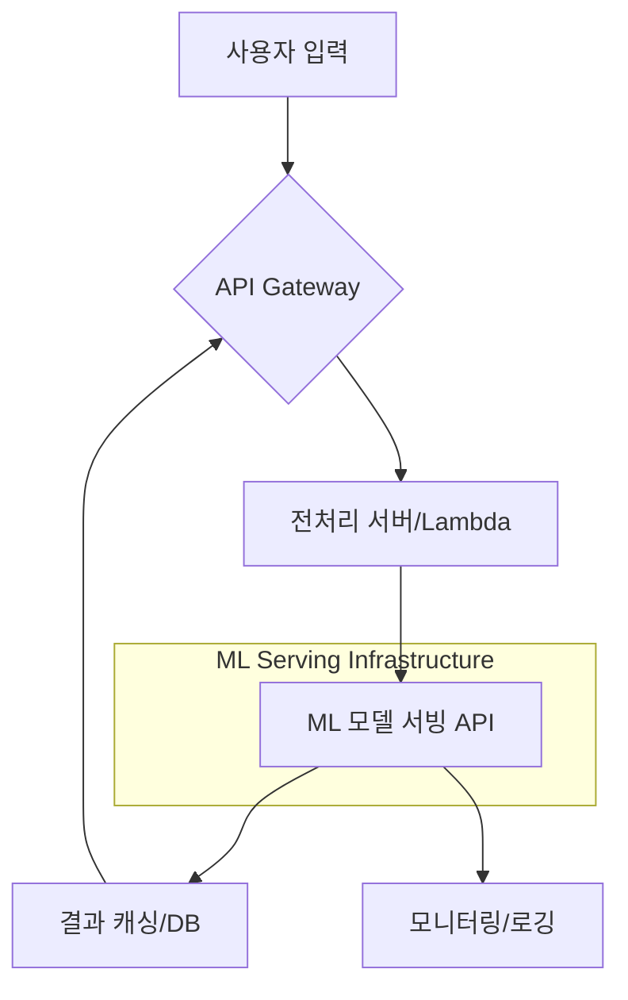

# 🧠 딥러닝 기반 자연어 처리(NLP) 완전 정복

> 본 문서는 딥러닝을 활용한 자연어 처리(Natural Language Processing, NLP)의 핵심 개념부터 실전 프로젝트까지의 전 과정을 체계적으로 정리한 기술 노트입니다. 텍스트 데이터의 전처리, 벡터화, 모델링, 그리고 실무 적용에 이르는 완전한 파이프라인을 구축하며, 컴퓨터가 인간의 언어를 어떻게 이해하고 처리하는지에 대한 깊이 있는 이해를 제공하는 것을 목표로 합니다.

---

## 목차

1. [**자연어 처리(NLP)의 기초**](#1-자연어-처리nlp의-기초)
   - [1.1. 자연어 처리란 무엇인가?](#11-자연어-처리란-무엇인가)
   - [1.2. NLP의 주요 응용 분야](#12-nlp의-주요-응용-분야)
   - [1.3. 텍스트 전처리 파이프라인](#13-텍스트-전처리-파이프라인)

2. [**텍스트 벡터화: 텍스트를 숫자로 변환하는 기술**](#2-텍스트-벡터화-텍스트를-숫자로-변환하는-기술)
   - [2.1. 벡터화의 필요성](#21-벡터화의-필요성)
   - [2.2. 원리 이해를 위한 직접 구현: `MyVectorize`](#22-원리-이해를-위한-직접-구현-myvectorize)
   - [2.3. 성능과 편의성을 위한 Keras `TextVectorization`](#23-성능과-편의성을-위한-keras-textvectorization)

3. [**실전 프로젝트: IMDB 영화 리뷰 감성 분석**](#3-실전-프로젝트-imdb-영화-리뷰-감성-분석)
   - [3.1. 프로젝트 개요 및 목표](#31-프로젝트-개요-및-목표)
   - [3.2. 데이터 구조 및 파이프라인 구축](#32-데이터-구조-및-파이프라인-구축)
   - [3.3. 딥러닝 모델 설계 및 훈련](#33-딥러닝-모델-설계-및-훈련)
   - [3.4. 성능 분석 및 결과](#34-성능-분석-및-결과)

4. [**핵심 개념 심화**](#4-핵심-개념-심화)
   - [4.1. 주요 벡터화 기법 비교](#41-주요-벡터화-기법-비교)
   - [4.2. 모델 성능 최적화 기법](#42-모델-성능-최적화-기법)
   - [4.3. 성능 평가 지표](#43-성능-평가-지표)

5. [**실무 적용 및 확장 로드맵**](#5-실무-적용-및-확장-로드맵)
   - [5.1. 산업별 활용 사례](#51-산업별-활용-사례)
   - [5.2. 확장 가능한 아키텍처 설계](#52-확장-가능한-아키텍처-설계)
   - [5.3. 성능 개선 로드맵](#53-성능-개선-로드맵)

6. [**참고 자료**](#6-참고-자료)
   - [6.1. 핵심 논문 및 가이드](#61-핵심-논문-및-가이드)
   - [6.2. 유용한 라이브러리 및 플랫폼](#62-유용한-라이브러리-및-플랫폼)
   - [6.3. 한국어 NLP 자료](#63-한국어-nlp-자료)

---

## 1. 자연어 처리(NLP)의 기초

### 1.1. 자연어 처리란 무엇인가?

**자연어 처리(Natural Language Processing, NLP)**는 인간이 일상적으로 사용하는 언어(자연어)를 컴퓨터가 이해하고, 해석하며, 생성할 수 있도록 만드는 인공지능의 한 분야입니다. 궁극적인 목표는 인간과 컴퓨터가 언어를 통해 원활하게 소통하게 하는 것입니다.

-   **자연어 이해 (NLU, Natural Language Understanding)**: 컴퓨터가 텍스트의 의미와 의도를 파악하는 데 중점을 둡니다. (예: 문장의 감성 분석, 핵심 개체명 인식)
-   **자연어 생성 (NLG, Natural Language Generation)**: 컴퓨터가 데이터나 정보를 바탕으로 인간이 이해할 수 있는 자연어 문장을 만들어내는 데 중점을 둡니다. (예: 챗봇의 답변 생성, 날씨 예보 기사 작성)

### 1.2. NLP의 주요 응용 분야

NLP 기술은 우리 생활과 산업 전반에 깊숙이 자리 잡고 있습니다.

| 분야 | 설명 | 주요 기술 및 예시 |
| :--- | :--- | :--- |
| **감성 분석** | 텍스트에 담긴 긍정, 부정, 중립과 같은 감정이나 의견을 분석합니다. | 영화 리뷰, 제품 후기, 소셜 미디어 여론 분석 |
| **기계 번역** | 하나의 언어를 다른 언어로 자동으로 번역합니다. | 구글 번역, 파파고, 실시간 통역 서비스 |
| **질의 응답** | 사용자의 자연어 질문에 대해 정확한 답변을 찾아내거나 생성합니다. | AI 비서(Siri, Alexa), 검색 엔진, 챗봇 |
| **텍스트 요약** | 긴 문서(뉴스 기사, 논문 등)의 핵심 내용을 간결하게 추출하거나 생성합니다. | 뉴스 클러스터링, 보고서 자동 요약 |
| **개체명 인식** | 텍스트에서 인명, 지명, 기관명, 날짜 등 고유한 개체를 식별하고 분류합니다. | 정보 추출, 이력서 분석, 지식 그래프 구축 |

### 1.3. 텍스트 전처리 파이프라인

모델이 텍스트를 학습하기 전에, 비정형의 원시 텍스트를 정제되고 구조화된 형태로 만드는 과정이 필수적입니다. 이를 **텍스트 전처리(Text Preprocessing)**라고 하며, 일반적으로 다음과 같은 단계로 구성됩니다.

**1. 표준화 (Standardization)**
   - **목적**: 텍스트를 일관된 형식으로 통일하여 모델이 동일한 단어를 다르게 인식하는 것을 방지합니다.
   - **작업 예시**:
     - **대소문자 통일**: `Apple`과 `apple`을 동일한 단어로 처리하기 위해 모두 소문자 또는 대문자로 변환합니다.
     - **구두점 및 특수문자 제거**: 문장의 의미에 큰 영향을 주지 않는 `.` `,` `!` `?` 등을 제거합니다.
     - **불필요한 공백 제거**: 연속된 공백이나 문장 앞뒤의 공백을 제거합니다.

**2. 토큰화 (Tokenization)**
   - **목적**: 정제된 텍스트를 모델이 처리할 수 있는 최소 단위인 **토큰(Token)**으로 분할합니다.
   - **작업 예시**:
     - **단어 토큰화**: `"I love NLP"` → `['I', 'love', 'NLP']`
     - **문장 토큰화**: `"Hello world. Have a nice day."` → `['Hello world.', 'Have a nice day.']`

**3. 어휘 사전 구축 (Vocabulary Building)**
   - **목적**: 전체 데이터셋에 등장하는 모든 고유한 토큰의 집합(어휘 사전)을 만듭니다. 각 토큰에는 고유한 정수 인덱스가 부여됩니다.
   - **특수 토큰 추가**:
     - **패딩 토큰 `[PAD]` 또는 `""`**: 문장의 길이를 동일하게 맞추기 위해 사용되는 토큰. 보통 인덱스 `0`을 할당합니다.
     - **미등록 단어 토큰 `[UNK]` (Unknown)**: 어휘 사전에 없는 단어를 처리하기 위한 토큰. 보통 인덱스 `1`을 할당합니다.
   - **예시**: `['I', 'love', 'NLP']` → `Vocabulary: {"": 0, "[UNK]": 1, "i": 2, "love": 3, "nlp": 4}`

**4. 수치화 (Numerization / Vectorization)**
   - **목적**: 구축된 어휘 사전을 바탕으로, 각 텍스트 문서를 숫자 시퀀스(벡터)로 변환합니다. 이 숫자 벡터가 최종적으로 모델의 입력이 됩니다.
   - **예시**: `"I love NLP"` → `[2, 3, 4]`

---

## 2. 텍스트 벡터화: 텍스트를 숫자로 변환하는 기술

### 2.1. 벡터화의 필요성

머신러닝 및 딥러닝 모델은 수학적 연산을 기반으로 동작하기 때문에, 원시 텍스트(raw text)를 직접 처리할 수 없습니다. 따라서 모델이 이해하고 학습할 수 있도록 텍스트 데이터를 **숫자로 이루어진 벡터(Vector)로 변환**하는 과정이 반드시 필요합니다. 이를 **텍스트 벡터화(Text Vectorization)** 또는 **수치화(Numerization)**라고 합니다.

### 2.2. 원리 이해를 위한 직접 구현: `MyVectorize`

텍스트 벡터화의 내부 동작 원리를 이해하기 위해, 전처리 파이프라인을 직접 클래스로 구현해볼 수 있습니다. 이는 외부 라이브러리의 편리함 뒤에 숨겨진 핵심 로직을 파악하는 데 도움을 줍니다.

#### `MyVectorize` 클래스 구현

```python
import string

class MyVectorize:
    """텍스트 벡터화의 기본 원리를 담은 클래스"""
    def standardize(self, text):
        """텍스트 표준화: 소문자 변환, 구두점 제거"""
        text = text.lower()
        return "".join(c for c in text if c not in string.punctuation)
    
    def tokenize(self, text):
        """토큰화: 공백 기준으로 단어 분할"""
        return text.split()
    
    def make_vocabulary(self, dataset):
        """데이터셋으로부터 어휘 사전을 구축"""
        self.vocabulary = {"" : 0, "[UNK]": 1} # 특수 토큰 초기화
        for text in dataset:
            text = self.standardize(text)
            tokens = self.tokenize(text)
            for token in tokens:
                if token not in self.vocabulary:
                    self.vocabulary[token] = len(self.vocabulary)
        self.inverse_vocabulary = {v: k for k, v in self.vocabulary.items()}

    def encode(self, text):
        """텍스트를 숫자 시퀀스로 인코딩"""
        text = self.standardize(text)
        tokens = self.tokenize(text)
        return [self.vocabulary.get(token, 1) for token in tokens]
    
    def decode(self, int_sequence):
        """숫자 시퀀스를 텍스트로 디코딩"""
        return " ".join(self.inverse_vocabulary.get(i, "[UNK]") for i in int_sequence)
```

#### 구현의 장단점

-   **장점**:
    -   **원리 이해**: 벡터화의 각 단계(표준화, 토큰화, 사전 구축, 인코딩)를 명확히 이해할 수 있습니다.
    -   **완전한 제어**: 모든 처리 과정을 직접 제어하므로, 특정 요구사항에 맞게 커스터마이징이 자유롭습니다.
    -   **외부 의존성 최소화**: TensorFlow나 Scikit-learn 같은 무거운 라이브러리 없이 구현 가능합니다.
-   **단점**:
    -   **성능 한계**: 순수 Python으로 구현되어 대용량 데이터 처리 시 속도가 느립니다.
    -   **기능 부족**: N-gram, TF-IDF 등 고급 벡터화 기법을 직접 구현해야 합니다.
    -   **메모리 비효율**: 어휘 사전을 메모리에 모두 올려두어야 하므로, 단어 수가 매우 많은 경우 비효율적일 수 있습니다.

### 2.3. 성능과 편의성을 위한 Keras `TextVectorization`

`tf.keras.layers.TextVectorization`은 TensorFlow 생태계에 최적화된 텍스트 전처리 레이어입니다. 모델의 일부로 동작하여 전체 파이프라인을 단순화하고 성능을 극대화합니다.

#### `TextVectorization`의 장점

-   **TensorFlow 최적화**: C++ 기반의 백엔드에서 동작하며, GPU 가속을 지원하여 매우 빠릅니다.
-   **모델 통합**: Keras 모델의 첫 번째 레이어로 포함될 수 있어, 원시 텍스트를 바로 모델에 입력할 수 있습니다. (End-to-End 모델)
-   **다양한 출력 모드**: 정수 인코딩(`int`), 단어 존재 여부(`binary`), 단어 빈도수(`count`), 단어 중요도(`tf_idf`) 등 다양한 벡터화 방식을 지원합니다.
-   **배치 처리**: 대용량 데이터셋을 효율적으로 처리할 수 있습니다.

#### 커스텀 함수와 출력 모드

`TextVectorization`은 표준화 및 토큰화 과정을 직접 정의한 함수로 대체할 수 있어 유연성이 높습니다.

```python
import tensorflow as tf
from tensorflow.keras.layers import TextVectorization

# TextVectorization 레이어 생성
vectorizer = TextVectorization(
    max_tokens=20000, # 어휘 사전에 포함할 최대 단어 수
    output_sequence_length=500, # 출력 시퀀스의 길이 (패딩 또는 잘라내기)
    output_mode='int' # 출력 모드 선택
)
```

#### 주요 출력 모드 비교

| `output_mode` | 설명 | 출력 예시 (`I love love NLP`) |
| :--- | :--- | :--- |
| **`int`** | 각 토큰을 고유 정수로 변환한 시퀀스. (기본값) | `[2, 3, 3, 4, 0, 0, ...]` |
| **`binary`** | 각 토큰의 존재 여부를 0 또는 1로 표현. (Bag-of-Words) | `[0, 1, 1, 1, 1, 0, ...]` |
| **`count`** | 각 토큰의 등장 횟수를 카운트. | `[0, 1, 1, 2, 1, 0, ...]` |
| **`tf_idf`** | 단어 빈도(TF)와 역문서 빈도(IDF)를 곱하여 가중치를 계산. | `[0.0, 0.3, 0.4, 0.8, 0.5, ...]` |

#### 모델 통합 예제

`TextVectorization` 레이어를 모델에 직접 포함시키면, 훈련 시점과 추론 시점의 전처리 방식이 동일하게 유지되어 일관성을 보장합니다.

```python
from tensorflow.keras.models import Sequential
from tensorflow.keras.layers import Embedding, LSTM, Dense

# 모델 정의
model = Sequential([
    vectorizer,  # 모델의 첫 번째 레이어로 전처리 포함
    Embedding(input_dim=vectorizer.vocabulary_size(), output_dim=128),
    LSTM(64),
    Dense(1, activation='sigmoid')
])

# 모델 컴파일 및 훈련
model.compile(optimizer='adam', loss='binary_crossentropy', metrics=['accuracy'])
# model.fit(raw_text_dataset, ...)
```

---

## 3. 실전 프로젝트: IMDB 영화 리뷰 감성 분석

이론을 실제 문제에 적용하여, 딥러닝 기반의 텍스트 분류 모델을 처음부터 끝까지 구축하는 과정을 학습합니다.

### 3.1. 프로젝트 개요 및 목표

-   **데이터셋**: Stanford AI Lab에서 제공하는 **IMDB 영화 리뷰 데이터셋**을 사용합니다. 총 50,000개의 영어 영화 리뷰로 구성되어 있으며, 긍정(positive) 또는 부정(negative) 라벨이 붙어 있습니다.
-   **문제 유형**: **이진 분류(Binary Classification)**. 주어진 영화 리뷰 텍스트가 긍정적인지 부정적인지를 예측합니다.
-   **기술 스택**: TensorFlow/Keras, `TextVectorization` 레이어, Dense Neural Network.
-   **벡터화 방식**: **Multi-hot Encoding** (Bag-of-Words 방식의 일종)을 사용하여 텍스트를 벡터로 변환합니다.

### 3.2. 데이터 구조 및 파이프라인 구축

#### 데이터 구조도

모델을 훈련시키기 전, 데이터가 어떤 디렉터리 구조로 구성되어 있는지 파악하는 것이 중요합니다. `text_dataset_from_directory` 함수는 이러한 구조를 기반으로 자동으로 라벨을 생성합니다.

```
aclImdb/
├── train/              # 훈련용 데이터
│   ├── pos/          # 긍정 리뷰 텍스트 파일 (12,500개)
│   └── neg/          # 부정 리뷰 텍스트 파일 (12,500개)
└── test/               # 테스트용 데이터
    ├── pos/          # 긍정 리뷰 텍스트 파일 (12,500개)
    └── neg/          # 부정 리뷰 텍스트 파일 (12,500개)
```

#### 데이터 파이프라인 단계

대용량 데이터를 효율적으로 처리하고 모델에 공급하기 위한 데이터 파이프라인을 설계합니다.

1.  **데이터 다운로드 및 압축 해제**: `tf.keras.utils.get_file`을 사용하여 데이터를 다운로드하고, `tarfile` 모듈로 `.tar.gz` 압축을 안전하게 해제합니다.
2.  **데이터 로드 및 분할**: `tf.keras.utils.text_dataset_from_directory`를 사용하여 디렉터리 구조로부터 직접 `tf.data.Dataset`을 생성합니다. 이 함수는 자동으로 텍스트와 라벨(폴더 이름 `pos`/`neg` 기준)을 매핑해줍니다. 훈련 데이터를 다시 80:20 비율로 훈련/검증 데이터로 분할합니다.
3.  **벡터화 레이어 설정**: 훈련 데이터셋에 `TextVectorization` 레이어의 `adapt()` 메서드를 적용하여 어휘 사전을 구축합니다. 이 과정은 훈련 데이터에만 수행하여 데이터 유출(Data Leakage)을 방지합니다.
4.  **데이터 전처리 및 최적화**: `map()` 함수를 사용하여 벡터화 레이어를 전체 데이터셋에 적용하고, `cache()`와 `prefetch()`를 통해 훈련 성능을 최적화합니다.

### 3.3. 딥러닝 모델 설계 및 훈련

간단하면서도 효과적인 완전 연결 신경망(Dense Neural Network)을 설계합니다.

#### 모델 아키텍처

```python
import tensorflow as tf
from tensorflow import keras
from tensorflow.keras import layers

def get_model(max_tokens=20000, hidden_dim=16):
    """Multi-hot 인코딩된 입력을 위한 Dense 모델을 생성합니다."""
    # 입력층: 어휘 사전의 크기(max_tokens)와 동일한 차원의 벡터를 받음
    inputs = keras.Input(shape=(max_tokens,))
    
    # 은닉층 1: relu 활성화 함수를 사용하는 16개의 뉴런
    x = layers.Dense(hidden_dim, activation="relu")(inputs)
    
    # 드롭아웃: 훈련 시 50%의 뉴런을 무작위로 비활성화하여 과적합 방지
    x = layers.Dropout(0.5)(x)
    
    # 출력층: sigmoid 활성화 함수를 사용하여 0과 1 사이의 확률 값을 출력
    # (0: 부정, 1: 긍정)
    outputs = layers.Dense(1, activation="sigmoid")(x)
    
    model = keras.Model(inputs, outputs)
    
    # 모델 컴파일
    model.compile(
        optimizer="rmsprop", # 옵티마이저
        loss="binary_crossentropy", # 이진 분류를 위한 손실 함수
        metrics=["accuracy"] # 평가 지표
    )
    return model
```

#### 모델 훈련

- `model.fit()`을 사용하여 준비된 데이터셋으로 모델을 훈련합니다.
- `validation_data` 인자를 통해 매 에포크마다 검증 데이터셋에 대한 성능(손실 및 정확도)을 측정하여 과적합 여부를 확인합니다.
- `callbacks`를 활용하여 `EarlyStopping`(검증 성능이 더 이상 개선되지 않으면 조기 종료) 등의 고급 훈련 기법을 적용할 수 있습니다.

### 3.4. 성능 분석 및 결과

-   **테스트 정확도**: 훈련이 완료된 모델을 한 번도 보지 않은 테스트 데이터셋으로 평가한 최종 성능입니다. 약 **87.4%**의 정확도를 달성했습니다.
-   **훈련 시간**: 약 30초 (10 에포크 기준). `tf.data` 파이프라인의 최적화 덕분에 빠른 훈련이 가능합니다.
-   **모델 크기**: 약 1.22MB (320,033개의 파라미터). 비교적 가벼운 모델로, 배포에 용이합니다.
-   **과적합 분석**: 훈련 손실과 검증 손실의 추이를 시각화하여, 모델이 훈련 데이터에만 과도하게 최적화되었는지 평가합니다. 드롭아웃(Dropout)이 과적합을 효과적으로 억제하는 것을 확인할 수 있습니다.

---

## 4. 핵심 개념 심화

모델의 성능을 한 단계 더 끌어올리기 위해, 다양한 텍스트 벡터화 기법의 원리를 이해하고 모델 훈련 과정을 최적화하며, 결과를 올바르게 평가하는 방법을 학습합니다.

### 4.1. 주요 벡터화 기법 비교

| 기법 | 개념 | 장점 | 단점 |
| :--- | :--- | :--- | :--- |
| **Bag of Words (BoW)** | 문장에 포함된 단어들의 출현 빈도나 존재 여부만을 사용하여 텍스트를 벡터화합니다. (예: Multi-hot Encoding) | - 구현이 간단하고 직관적.<br>- 해석이 용이함. | - **단어의 순서를 완전히 무시**하여 문맥 정보를 잃음.<br>- 어휘 사전이 커지면 벡터가 매우 길고 희소(sparse)해짐. |
| **TF-IDF** | **단어 빈도(TF)**와 **역문서 빈도(IDF)**를 곱하여, 특정 문서 내에서는 자주 나타나지만 다른 문서에서는 드물게 나타나는 단어에 높은 가중치를 부여합니다. | - BoW의 단점을 보완하여 **단어의 중요도**를 반영할 수 있음.<br>- 불용어(stopword)와 같이 너무 흔한 단어의 영향을 줄여줌. | - 여전히 단어의 순서와 문맥 정보는 반영하지 못함.<br>- 의미적으로 유사한 단어를 다르게 처리함. |
| **Word Embeddings** | 각 단어를 저차원의 **밀집 벡터(dense vector)**로 표현합니다. 이 벡터 공간에서 단어 간의 의미적, 문법적 관계가 기하학적 거리로 표현됩니다. (예: `king - man + woman ≈ queen`) | - **단어의 의미론적 관계**를 학습하고 표현할 수 있음.<br>- 모델 성능을 크게 향상시킴.<br>- 차원 축소 효과가 있음. | - 대규모 말뭉치(corpus)를 사용한 사전 훈련이 필요함.<br>- 문맥에 따라 의미가 변하는 다의어 처리에 한계가 있음. |

### 4.2. 모델 성능 최적화 기법

-   **데이터 파이프라인 최적화**:
    -   `dataset.cache()`: 전처리된 데이터를 메모리나 디스크에 캐싱하여 I/O 병목 현상을 줄입니다.
    -   `dataset.prefetch()`: GPU가 훈련하는 동안 CPU가 다음 데이터를 미리 준비하여, 장치 유휴 시간을 최소화합니다.
    -   `num_parallel_calls`: 데이터 전처리(`map`)를 병렬로 수행하여 CPU를 효율적으로 사용합니다.

-   **과적합(Overfitting) 방지**:
    -   **Dropout**: 훈련 과정에서 무작위로 일부 뉴런을 비활성화하여, 모델이 특정 뉴런에 과도하게 의존하는 것을 방지합니다.
    -   **Early Stopping (조기 종료)**: 검증 데이터셋의 성능(예: `val_loss`)이 일정 에포크 동안 개선되지 않으면, 과적합이 발생하기 전에 훈련을 중단합니다.
    -   **L1/L2 정규화**: 모델의 가중치(weight)가 너무 커지지 않도록 손실 함수에 페널티 항을 추가합니다.

-   **하이퍼파라미터 튜닝**: 모델의 성능에 영향을 미치는 하이퍼파라미터(예: 학습률, 은닉층의 뉴런 수, 드롭아웃 비율 등)를 체계적으로 조정하여 최적의 조합을 찾습니다.

### 4.3. 성능 평가 지표

모델의 성능을 객관적으로 평가하기 위해 사용하는 지표들입니다.

-   **정확도 (Accuracy)**: `(TP + TN) / (TP + TN + FP + FN)`
    -   가장 직관적인 지표이지만, 데이터 클래스가 불균형할 경우(예: 긍정 90%, 부정 10%) 성능을 왜곡할 수 있습니다.

-   **정밀도 (Precision)**: `TP / (TP + FP)`
    -   모델이 '긍정'으로 예측한 것들 중, 실제로 '긍정'인 샘플의 비율. (예: 스팸 메일 분류기에서 중요)

-   **재현율 (Recall)**: `TP / (TP + FN)`
    -   실제 '긍정'인 것들 중, 모델이 '긍정'으로 올바르게 예측한 샘플의 비율. (예: 암 진단 모델에서 중요)

-   **F1-Score**: `2 * (Precision * Recall) / (Precision + Recall)`
    -   정밀도와 재현율의 조화 평균. 두 지표가 모두 중요할 때 사용됩니다.

-   **손실 (Loss)**: 이진 분류에서는 **이진 교차 엔트로피(Binary Cross-Entropy)**를 주로 사용합니다. 모델의 예측이 실제 값과 얼마나 다른지를 측정하며, 훈련 과정에서 최소화해야 할 대상입니다.

---

## 5. 실무 적용 및 확장 로드맵

모델을 훈련시키는 것을 넘어, 실제 비즈니스 문제에 적용하고 지속적으로 개선하기 위한 전략을 수립합니다.

### 5.1. 산업별 활용 사례

감성 분석 모델은 다양한 산업에서 고객의 소리(VoC)를 분석하고 비즈니스 가치를 창출하는 데 활용될 수 있습니다.

-   **전자상거래**: 제품 리뷰, Q&A 게시판의 텍스트를 분석하여 긍정/부정 여론을 파악하고, 부정적인 피드백에 신속하게 대응하여 고객 만족도를 높입니다.
    ```python
    # 제품 리뷰 자동 분석 및 태깅
    review_sentiment = model.predict("This product is amazing! The quality is top-notch.")
    if review_sentiment > 0.8:
        add_tag_to_review(review_id, "Best Review")
    ```
-   **소셜 미디어 모니터링**: 트위터, 페이스북 등에서 특정 브랜드나 캠페인에 대한 대중의 반응을 실시간으로 추적하고, 위기 상황을 조기에 감지합니다.
    ```python
    # 브랜드 관련 포스트의 감성 분석
    brand_mentions = collect_social_posts("MyBrand")
    sentiment_scores = model.predict(brand_mentions)
    generate_weekly_sentiment_report(sentiment_scores)
    ```
-   **고객 서비스**: 고객 문의 내용을 분석하여 긴급하거나 매우 부정적인 감정의 문의를 자동으로 분류하고, 우선적으로 처리하도록 라우팅하여 CS 효율을 높입니다.
    ```python
    # 문의 내용의 긴급도 분류
    inquiry_sentiment = model.predict(customer_message)
    if inquiry_sentiment < 0.2:  # 매우 부정적인 경우
        escalate_to_urgent_queue(inquiry_id)
    ```

### 5.2. 확장 가능한 아키텍처 설계

프로토타입을 넘어 실제 서비스로 확장하기 위해서는 안정적이고 확장 가능한 시스템 아키텍처가 필요합니다.


-   **API Gateway**: 모든 요청의 진입점으로, 인증, 속도 제한 등의 공통 기능을 처리합니다.
-   **전처리 서버**: 텍스트 정제, 토큰화 등 모델 입력에 맞게 데이터를 가공합니다.
-   **ML 모델 서빙**: TensorFlow Serving, TorchServe 또는 FastAPI/Flask 기반의 커스텀 API를 사용하여 모델 추론 요청을 처리합니다.
-   **결과 캐싱**: 동일한 입력에 대한 반복적인 요청을 빠르게 처리하기 위해 결과를 Redis 같은 인메모리 DB에 캐싱합니다.

### 5.3. 성능 개선 로드맵

단순한 모델에서 시작하여 점진적으로 성능을 개선해나가는 로드맵입니다.

-   **Phase 1: 기본 성능 향상**
    -   **벡터화 개선**: `TextVectorization`의 `output_mode`를 `tf_idf`로 변경하여 단어의 중요도를 반영합니다.
    -   **N-gram 활용**: `ngrams=(1, 2)` 옵션을 사용하여 `(단어)` 뿐만 아니라 `(단어, 단어)` 조합(bigram)도 학습에 포함시켜 문맥 정보를 보강합니다.
    -   **하이퍼파라미터 튜닝**: KerasTuner와 같은 도구를 사용하여 최적의 학습률, 은닉층 크기, 드롭아웃 비율을 탐색합니다.

-   **Phase 2: 고급 모델 도입**
    -   **Word Embeddings**: `Embedding` 레이어를 사용하여 단어의 의미론적 관계를 학습합니다. 이는 BoW 방식보다 훨씬 풍부한 정보를 모델에 제공합니다.
    -   **순환 신경망 (RNN/LSTM/GRU)**: 단어의 순서 정보를 학습할 수 있는 RNN 계열 모델을 도입하여 문맥을 더 잘 이해하도록 합니다.
    -   **1D 합성곱 신경망 (1D CNN)**: 텍스트에서 지역적인 패턴(N-gram과 유사)을 추출하는 데 효과적이며, RNN보다 훈련 속도가 빠를 수 있습니다.

-   **Phase 3: 최신 기법 적용 (SOTA)**
    -   **사전 훈련 모델 활용 (Transfer Learning)**: BERT, RoBERTa, GPT 등 대규모 데이터로 미리 훈련된 언어 모델을 가져와, 우리의 특정 데이터셋에 맞게 미세 조정(Fine-tuning)합니다. 이는 적은 데이터로도 매우 높은 성능을 달성할 수 있는 가장 효과적인 방법입니다.
    -   **어텐션 메커니즘**: 문장에서 어떤 단어가 예측에 더 중요한지 가중치를 부여하는 어텐션 메커니즘을 도입하여 모델의 해석 가능성과 성능을 높입니다.

---

## 6. 참고 자료

### 6.1. 핵심 논문 및 가이드

-   **IMDB 데이터셋 원 논문**: Maas et al. (2011), *"Learning Word Vectors for Sentiment Analysis"*
-   **Word2Vec**: Mikolov et al. (2013), *"Efficient Estimation of Word Representations in Vector Space"*
-   **Transformer (Attention)**: Vaswani et al. (2017), *"Attention Is All You Need"*
-   **BERT**: Devlin et al. (2018), *"BERT: Pre-training of Deep Bidirectional Transformers for Language Understanding"*
-   **Official TensorFlow Text Guide**: [Link](https://www.tensorflow.org/text)

### 6.2. 유용한 라이브러리 및 플랫폼

-   **Hugging Face Transformers**: 사전 훈련된 최신 NLP 모델을 쉽게 다운로드하고 사용할 수 있는 필수 라이브러리. [Link](https://huggingface.co/transformers)
-   **Papers With Code**: 최신 NLP 연구 논문과 코드를 함께 볼 수 있는 플랫폼. [Link](https://paperswithcode.com/area/natural-language-processing)

### 6.3. 한국어 NLP 자료

-   **사전 훈련 모델**: KoBERT, KoELECTRA, KLUE-BERT 등 한국어 특화 모델
-   **형태소 분석기**: 문장을 의미있는 최소 단위로 분해. `KoNLPy` (Mecab, Kkma 등 포함), `soynlp`
-   **데이터셋**: Naver Sentiment Movie Corpus (NSMC), KLUE 등 공개된 한국어 벤치마크 데이터셋

---

[⏮️ 이전 문서](./0725_DL정리.md) | [다음 문서 ⏭️](./0801_DL정리.md)